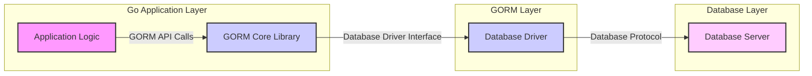
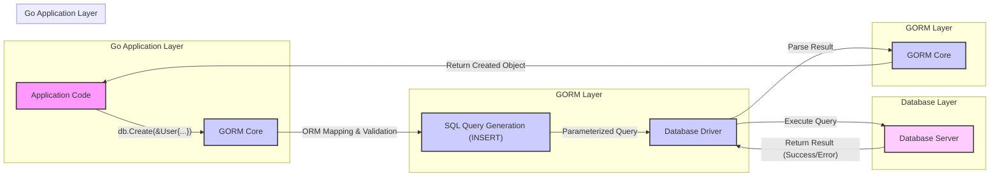

# Project Design Document: Go-GORM ORM (Improved)

**Project Name:** Go-GORM Object-Relational Mapper (ORM)

**Project Repository:** [https://github.com/go-gorm/gorm](https://github.com/go-gorm/gorm)

**Document Version:** 1.1
**Date:** 2023-10-27
**Author:** AI Software Architect

## 1. Introduction

This document provides a detailed design overview of the Go-GORM ORM library, intended for use in threat modeling and security analysis of applications leveraging GORM. It elaborates on the architecture, core components, data flow, and crucial security considerations inherent in GORM-based systems. This document serves as a foundation for identifying potential vulnerabilities and implementing appropriate security measures.

## 2. Project Overview

GORM is a widely adopted Object-Relational Mapper (ORM) for the Go programming language. It abstracts away the complexities of direct SQL database interaction, enabling developers to work with databases using Go's native syntax and data structures. GORM simplifies common database tasks, including:

*   **Database Connection Management:**  Handles connection pooling and efficient resource utilization.
*   **Schema Management:** Facilitates database schema creation, migration, and updates based on Go data models.
*   **CRUD Operations:** Provides intuitive methods for Create, Read, Update, and Delete operations on database records.
*   **Querying:** Offers a flexible and type-safe query builder, reducing the need for raw SQL in most scenarios.
*   **Transactions:** Supports ACID transactions for data integrity and consistency.
*   **Relationships (Associations):** Manages complex relationships between data models (e.g., one-to-one, one-to-many, many-to-many).
*   **Extensibility:** Offers a plugin system to extend functionality and customize behavior.

GORM's versatility extends to supporting a broad spectrum of database systems, including but not limited to PostgreSQL, MySQL, SQLite, and SQL Server, through interchangeable database drivers. This database agnosticism is a key feature for application portability.

## 3. System Architecture

The following diagram illustrates the layered architecture of a system utilizing GORM to interact with a database:

**Component Descriptions:**

*   **"Application Logic"**: This represents the application-specific Go code. It encompasses business logic, user interface interactions, and data processing. This layer directly interacts with GORM to persist and retrieve data.
*   **"GORM Core Library"**: This is the heart of the GORM ORM. It provides the core ORM functionalities:
    *   **Object-Relational Mapping (ORM Engine):**  Handles the mapping between Go structs and database schema, including data type conversions and relationship management.
    *   **Query Builder:** Constructs database-specific SQL queries programmatically, offering a safer and more maintainable alternative to raw SQL.
    *   **Connection Pool Manager:** Manages database connections efficiently, optimizing performance and resource utilization.
    *   **Transaction Manager:** Provides APIs for managing database transactions, ensuring data consistency.
    *   **Schema Migrator:** Automates database schema migrations based on changes in Go data models.
    *   **Plugin Infrastructure:** Enables extending GORM's capabilities through plugins for features like auditing, soft deletes, and more.
*   **"Database Driver"**: This is a database-specific library that implements GORM's driver interface. It acts as a translator, converting GORM's database-agnostic operations into SQL dialects understood by the target database. It also handles the low-level communication with the database server. Examples include:
    *   `github.com/lib/pq` for PostgreSQL
    *   `github.com/go-sql-driver/mysql` for MySQL
    *   `github.com/mattn/go-sqlite3` for SQLite
    *   `github.com/microsoft/go-mssqldb` for SQL Server
*   **"Database Server"**: This is the actual database management system (DBMS) responsible for persistent data storage, retrieval, and management. It could be a relational database like PostgreSQL, MySQL, SQL Server, or SQLite.

## 4. Data Flow - CRUD Operation Example (Create)

Let's illustrate the data flow for a typical "Create" operation using GORM:

**Detailed Data Flow Steps (Create Operation):**

1.  **Application initiates Create operation:** The application code calls `db.Create(&User{...})`, passing a Go struct representing the data to be created.
2.  **GORM Core receives request:** GORM Core receives the `Create` request and begins processing.
3.  **ORM Mapping & Validation:** GORM maps the Go struct fields to database columns based on model definitions. It also performs data validation if validation rules are defined in the model (e.g., using struct tags).
4.  **SQL Query Generation (INSERT):** GORM's Query Builder generates a parameterized `INSERT` SQL query appropriate for the target database dialect. Parameterization is crucial for SQL injection prevention.
5.  **Parameterized Query to Driver:** The generated parameterized SQL query and the data values are passed to the Database Driver.
6.  **Execute Query on Database Server:** The Database Driver executes the SQL query against the Database Server.
7.  **Database Server returns Result:** The Database Server executes the `INSERT` operation and returns a result indicating success or failure, potentially including generated values (e.g., auto-incremented IDs).
8.  **Parse Result in Driver:** The Database Driver parses the raw database response.
9.  **GORM Core processes Result:** GORM Core receives the parsed result from the driver. It updates the Go object (e.g., populating auto-incremented IDs) and handles any errors.
10. **Return Created Object to Application:** GORM returns the created Go object (now with potentially updated fields) back to the application code.

## 5. Security Considerations and Threat Landscape

Applications using GORM inherit security considerations from both the ORM itself and the underlying database system. Here's a breakdown of key security areas and potential threats:

**5.1. SQL Injection Vulnerabilities:**

*   **Threat:**  Malicious SQL code injected through application inputs can be executed by the database, potentially leading to data breaches, data manipulation, or denial of service.
*   **GORM's Mitigation:** GORM primarily uses parameterized queries, which effectively prevent SQL injection in most standard ORM operations.
*   **Developer Responsibility:**
    *   **Avoid Raw SQL:** Minimize the use of `db.Exec`, `db.Raw`, and manual SQL string construction, as these can bypass GORM's parameterization. If raw SQL is necessary, meticulously sanitize and parameterize inputs.
    *   **Be cautious with `clause.Expr` and similar:**  Dynamically constructed clauses require careful input validation to prevent injection.
    *   **Review Plugins:**  Ensure any GORM plugins used are from trusted sources and are regularly updated, as plugin vulnerabilities can also introduce SQL injection risks.

**5.2. Data Validation and Input Sanitization:**

*   **Threat:**  Invalid or malicious data can be persisted in the database, leading to application errors, data corruption, or exploitation of vulnerabilities in other parts of the system.
*   **GORM's Features:** GORM supports data validation through struct tags (e.g., `binding:"required"`, `gorm:"size:255"`), custom validators, and hooks.
*   **Developer Responsibility:**
    *   **Implement Comprehensive Validation:** Define and enforce validation rules for all data models, covering data types, formats, ranges, and business logic constraints.
    *   **Sanitize Inputs:** Sanitize user inputs before database operations to remove or escape potentially harmful characters, even if validation is in place. This is especially important for text fields that might be displayed in web interfaces.
    *   **Server-Side Validation:** Always perform validation on the server-side, even if client-side validation is implemented, as client-side validation can be bypassed.

**5.3. Authentication and Authorization:**

*   **Threat:** Unauthorized access to data or database operations can lead to data breaches, data manipulation, and privilege escalation.
*   **GORM's Role:** GORM itself does not handle authentication or authorization. These are application-level concerns.
*   **Developer Responsibility:**
    *   **Implement Robust Authentication:** Use secure authentication mechanisms to verify user identities (e.g., OAuth 2.0, JWT).
    *   **Enforce Authorization:** Implement granular authorization controls to restrict access to data and operations based on user roles and permissions. Integrate authorization checks into application logic and GORM queries where appropriate (e.g., using scopes or conditions in queries).
    *   **Database-Level Security:** Leverage database-level access control mechanisms (roles, permissions) to further restrict access based on database users used by the application.

**5.4. Mass Assignment Vulnerabilities:**

*   **Threat:**  Uncontrolled mass assignment can allow attackers to modify unintended database fields by manipulating request parameters, potentially leading to privilege escalation or data corruption.
*   **GORM's Behavior:** GORM's `Updates` and `Assign` methods can be susceptible to mass assignment if not used carefully.
*   **Developer Responsibility:**
    *   **Use `Select` and `Omit`:** Explicitly specify which fields are allowed to be updated using `Select` or `Omit` methods when handling user input.
    *   **DTOs (Data Transfer Objects):** Use DTOs to receive user input and map only allowed fields to the GORM model for updates, preventing unintended field modifications.
    *   **Avoid Binding Directly to Models:**  Do not directly bind user input to GORM models for update operations without careful field selection.

**5.5. Database Connection Security:**

*   **Threat:**  Unencrypted database connections can expose sensitive data in transit to eavesdropping and interception.
*   **GORM's Dependency:** GORM relies on the underlying database driver for connection security.
*   **Developer Responsibility:**
    *   **Enable TLS/SSL:** Configure database drivers to use encrypted connections (TLS/SSL) for all database communication, especially in production environments and when connecting to remote databases.
    *   **Secure Connection Strings:** Protect database connection strings and credentials. Avoid hardcoding them in application code. Use environment variables or secure configuration management.
    *   **Network Segmentation:** Isolate database servers in secure network segments and restrict access to only authorized application servers.

**5.6. Dependency Vulnerabilities:**

*   **Threat:**  Vulnerabilities in GORM itself or its database drivers can be exploited to compromise the application and database.
*   **GORM Ecosystem:** GORM and its drivers are dependencies of the application.
*   **Developer Responsibility:**
    *   **Regularly Update Dependencies:** Keep GORM and database drivers updated to the latest versions to patch known vulnerabilities.
    *   **Dependency Scanning:** Use dependency scanning tools to identify and monitor vulnerabilities in project dependencies.
    *   **Vulnerability Monitoring:** Subscribe to security advisories for GORM and relevant database drivers to stay informed about potential vulnerabilities.

**5.7. Error Handling and Information Disclosure:**

*   **Threat:**  Verbose error messages or logs can inadvertently expose sensitive information about the application's internal workings, database schema, or configuration, aiding attackers in reconnaissance.
*   **GORM's Behavior:** GORM can generate detailed error messages, especially in development mode.
*   **Developer Responsibility:**
    *   **Production Error Handling:** Implement robust error handling that prevents the display of detailed error messages to end-users in production environments. Log errors securely for debugging and monitoring.
    *   **Sanitize Logs:** Ensure that logs do not contain sensitive information like database credentials, API keys, or personally identifiable information (PII).
    *   **Custom Error Pages:**  Use custom error pages to provide user-friendly error messages without revealing technical details.

**5.8. Logging and Auditing:**

*   **Threat:** Lack of sufficient logging and auditing can hinder incident detection, security monitoring, and forensic analysis.
*   **GORM's Role:** GORM itself doesn't provide built-in auditing, but plugins or application-level logging can be implemented.
*   **Developer Responsibility:**
    *   **Implement Audit Logging:** Implement logging of critical database operations (e.g., create, update, delete, login attempts, permission changes) including timestamps, user identities, and affected data.
    *   **Secure Log Storage:** Store logs securely and protect them from unauthorized access and tampering.
    *   **Log Monitoring and Alerting:** Implement log monitoring and alerting systems to detect suspicious activities and security incidents.

## 6. Technology Stack

*   **Programming Language:** Go (Golang)
*   **ORM Library:** GORM ([https://github.com/go-gorm/gorm](https://github.com/go-gorm/gorm))
*   **Database Support (via Drivers):**
    *   **Relational Databases:** PostgreSQL, MySQL, SQLite, SQL Server, Oracle, MariaDB, TiDB, CockroachDB, etc.
    *   **Other Databases:** ClickHouse, Firebird, DM (Da Meng), KingBase, SAP HANA, etc. (refer to GORM documentation for a comprehensive list and community drivers).

## 7. Deployment Model

Applications using GORM can be deployed in various environments, mirroring typical Go application deployment patterns:

*   **Cloud Platforms (AWS, Azure, GCP):** Containerized deployments (Docker, Kubernetes), serverless functions, PaaS offerings, connecting to managed database services (RDS, Azure SQL, Cloud SQL).
*   **On-Premise Infrastructure:** Traditional server deployments (physical or virtual machines) connecting to locally hosted database servers.
*   **Container Orchestration (Kubernetes, Docker Swarm):** Scalable and resilient deployments using container orchestration platforms for both application and database components.
*   **Edge Computing:** Deployments in edge environments where data processing and storage are closer to the data source.

## 8. Assumptions and Limitations

*   **Secure Development Practices:** This document assumes developers using GORM adhere to secure coding practices and understand common web application security principles.
*   **Database Security Posture:** The security of the underlying database system (DBMS configuration, patching, hardening) is outside the scope of this document but is a critical dependency for overall application security.
*   **Focus on GORM-Specific Security:** This document primarily focuses on security considerations directly related to GORM usage. Broader application security aspects (network security, API security, frontend security, etc.) are not exhaustively covered.
*   **Driver Security Trust:**  It is assumed that chosen database drivers are reputable, actively maintained, and do not contain known vulnerabilities. Using drivers from trusted sources is crucial.

## 9. Future Considerations and Security Enhancements

*   **Built-in Security Features in GORM:** Explore potential enhancements to GORM to further improve security, such as:
    *   **Automated Input Sanitization:**  Optional built-in input sanitization mechanisms.
    *   **Enhanced Validation Framework:** More declarative and extensible validation capabilities.
    *   **Security-Focused Plugins:**  Official or community-maintained plugins for security features like auditing, rate limiting, and input validation.
*   **Regular Security Audits and Penetration Testing:**  Conduct periodic security audits and penetration testing of applications using GORM to proactively identify and remediate vulnerabilities.
*   **Community Security Guidelines and Best Practices:**  Develop and promote comprehensive security guidelines and best practices for secure GORM usage within the Go community.
*   **Static Analysis and Security Linters:**  Explore the development or integration of static analysis tools and security linters specifically tailored for GORM applications to automatically detect potential security flaws.

This improved design document provides a more comprehensive and actionable foundation for threat modeling and securing applications built with Go-GORM. It emphasizes developer responsibilities and highlights key security considerations to mitigate potential risks. Remember that security is a continuous process, and ongoing vigilance and adaptation are essential.