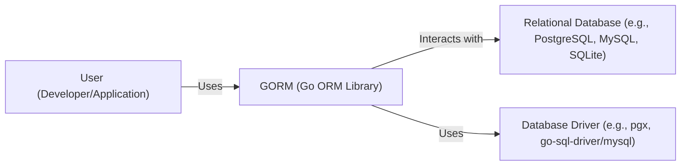
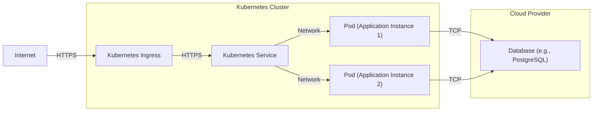
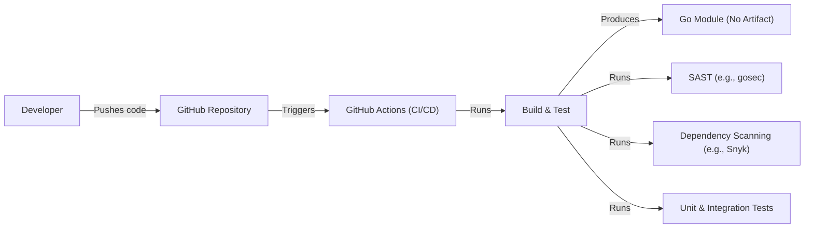

Okay, let's create a design document for the GORM project, focusing on aspects relevant for threat modeling.

# BUSINESS POSTURE

GORMs primary business goal is to provide a developer-friendly and efficient Object-Relational Mapping (ORM) library for Go developers.  It aims to simplify database interactions, reduce boilerplate code, and improve developer productivity when building Go applications that interact with relational databases.  Success is measured by adoption (number of users/projects using GORM), community engagement (contributions, issue reports, discussions), and positive user feedback (ease of use, performance, features).

Business Priorities:

*   Developer Productivity:  Reduce the time and effort required for developers to interact with databases.
*   Maintainability:  Provide a clean and well-documented API that is easy to understand and maintain.
*   Performance:  Ensure efficient database interactions and minimize performance overhead.
*   Extensibility:  Allow developers to extend and customize GORM's functionality to meet their specific needs.
*   Compatibility: Support a wide range of SQL databases.
*   Community Growth: Foster a vibrant and active community around the project.

Most Important Business Risks:

*   Data Breaches:  Vulnerabilities in GORM could be exploited to gain unauthorized access to sensitive data stored in databases. This is the most critical risk.
*   Data Corruption:  Bugs or vulnerabilities could lead to data corruption or loss.
*   Performance Degradation:  Inefficient queries or resource leaks could negatively impact the performance of applications using GORM.
*   Loss of Developer Trust:  Security vulnerabilities or major bugs could erode developer trust and lead to a decline in adoption.
*   Dependency Issues: Vulnerabilities in upstream dependencies could impact GORM's security.

# SECURITY POSTURE

Existing Security Controls:

*   security control: Code Reviews: The project uses GitHub's pull request system, which inherently includes code review before merging changes. (Described in GitHub repository's contribution guidelines).
*   security control: Community Reporting:  Vulnerabilities can be reported by the community, allowing for crowd-sourced security auditing. (Implicit in open-source nature).
*   security control: Go's Built-in Security Features: GORM benefits from Go's built-in memory safety features, which help prevent common vulnerabilities like buffer overflows. (Implicit in using the Go language).
*   security control: Testing: The project includes a test suite to verify functionality and potentially catch some security-related issues. (Visible in the GitHub repository).
*   security control: Use of Prepared Statements (Parameterized Queries): GORM encourages the use of parameterized queries, which are a primary defense against SQL injection. (Described in GORM documentation).

Accepted Risks:

*   accepted risk: Third-Party Database Driver Vulnerabilities: GORM relies on third-party database drivers.  Vulnerabilities in these drivers are outside of GORM's direct control, although GORM's design should mitigate some risks (e.g., through parameterized queries).
*   accepted risk: Misuse by Developers:  Developers can still write insecure code even when using GORM (e.g., by disabling prepared statements or using raw SQL unsafely).  GORM provides tools for secure usage, but cannot guarantee secure usage.
*   accepted risk: Zero-Day Vulnerabilities:  Like all software, GORM may contain unknown vulnerabilities that could be exploited before they are discovered and patched.

Recommended Security Controls:

*   security control: Static Analysis Security Testing (SAST): Integrate SAST tools into the build process to automatically scan for potential vulnerabilities.
*   security control: Dependency Scanning: Regularly scan dependencies for known vulnerabilities and update them promptly.
*   security control: Fuzz Testing: Implement fuzz testing to discover edge cases and potential vulnerabilities that might be missed by traditional testing.
*   security control: Security Documentation: Create dedicated security documentation that provides guidance on secure usage and best practices.
*   security control: Vulnerability Disclosure Program: Establish a formal vulnerability disclosure program to encourage responsible reporting of security issues.

Security Requirements:

*   Authentication: GORM itself does not handle authentication. Authentication is the responsibility of the database and the application using GORM.
*   Authorization: GORM does not implement authorization mechanisms. Authorization is typically handled by the application logic or the database itself (e.g., using database roles and permissions).
*   Input Validation:
    *   GORM provides mechanisms for parameterized queries, which inherently validate input types to prevent SQL injection.
    *   Applications using GORM should still perform their own input validation to ensure data conforms to expected formats and constraints *before* passing it to GORM. This is a defense-in-depth measure.
*   Cryptography:
    *   GORM does not directly handle encryption of data at rest or in transit. This is the responsibility of the database and the application.
    *   GORM should support connecting to databases over secure connections (e.g., TLS/SSL).
    *   If GORM is used to handle sensitive data (e.g., passwords), the application should use appropriate cryptographic hashing algorithms (e.g., bcrypt, scrypt) *before* storing the data.

# DESIGN

## C4 CONTEXT

Element Descriptions:

*   Element:
    *   Name: User (Developer/Application)
    *   Type: Person/Software System
    *   Description: A developer writing a Go application or the application itself that utilizes GORM to interact with a database.
    *   Responsibilities:
        *   Writes application logic.
        *   Uses GORM's API to perform database operations.
        *   Handles application-level security (authentication, authorization, input validation).
    *   Security controls:
        *   Implements application-level security controls.
        *   Uses GORM securely (e.g., parameterized queries).

*   Element:
    *   Name: GORM (Go ORM Library)
    *   Type: Software System
    *   Description: The GORM library itself, providing an abstraction layer for database interactions.
    *   Responsibilities:
        *   Provides an API for database operations (CRUD, migrations, etc.).
        *   Translates Go code into SQL queries.
        *   Manages database connections.
        *   Handles data mapping between Go structs and database tables.
    *   Security controls:
        *   Encourages use of parameterized queries.
        *   Relies on Go's memory safety.
        *   Subject to code reviews and testing.

*   Element:
    *   Name: Relational Database (e.g., PostgreSQL, MySQL, SQLite)
    *   Type: Software System
    *   Description: The underlying relational database system that stores the data.
    *   Responsibilities:
        *   Stores and manages data.
        *   Executes SQL queries.
        *   Enforces database-level security (authentication, authorization, access control).
    *   Security controls:
        *   Database-level security features (user accounts, roles, permissions).
        *   Encryption at rest and in transit (if configured).

*   Element:
    *   Name: Database Driver (e.g., pgx, go-sql-driver/mysql)
    *   Type: Software Library
    *   Description: The Go library that provides a low-level interface for interacting with a specific database system.
    *   Responsibilities:
        *   Establishes connections to the database.
        *   Sends SQL queries to the database.
        *   Receives results from the database.
    *   Security controls:
        *   Handles secure communication with the database (e.g., TLS/SSL).
        *   Implements database-specific security protocols.

## C4 CONTAINER

Since GORM is a library, the container diagram is essentially the same as the context diagram. A library doesn't have internal "containers" in the same way a distributed application does.

Element Descriptions:

*   Same as C4 Context diagram.

## DEPLOYMENT

GORM, as a library, is not "deployed" in the traditional sense. It is *included* as a dependency in a Go application. The deployment of the *application* using GORM is what matters.

Possible Deployment Solutions:

1.  Virtual Machines (e.g., AWS EC2, Google Compute Engine, Azure VMs)
2.  Containers (e.g., Docker, Kubernetes)
3.  Serverless Functions (e.g., AWS Lambda, Google Cloud Functions, Azure Functions)
4.  Platform as a Service (PaaS) (e.g., Heroku, Google App Engine)

Chosen Solution (for detailed description): Containers (Kubernetes)

Element Descriptions:

*   Element:
    *   Name: Internet
    *   Type: External Entity
    *   Description: The public internet.
    *   Responsibilities:  Routes traffic to the application.
    *   Security controls:  None (from the application's perspective).

*   Element:
    *   Name: Kubernetes Ingress
    *   Type: Software System
    *   Description:  A Kubernetes resource that manages external access to services in the cluster.
    *   Responsibilities:
        *   Routes incoming traffic to the appropriate service.
        *   Handles TLS termination.
    *   Security controls:
        *   TLS encryption.
        *   Network policies.

*   Element:
    *   Name: Kubernetes Service
    *   Type: Software System
    *   Description:  A Kubernetes resource that provides a stable endpoint for accessing a set of pods.
    *   Responsibilities:
        *   Load balances traffic across pods.
        *   Provides service discovery.
    *   Security controls:
        *   Network policies.

*   Element:
    *   Name: Pod (Application Instance 1/2)
    *   Type: Container
    *   Description:  A Kubernetes pod running an instance of the Go application that uses GORM.
    *   Responsibilities:
        *   Executes the application logic.
        *   Uses GORM to interact with the database.
    *   Security controls:
        *   Application-level security controls.
        *   Secure coding practices.
        *   Container security best practices (e.g., minimal base image, non-root user).

*   Element:
    *   Name: Database (e.g., PostgreSQL)
    *   Type: Software System
    *   Description: The database instance, running outside the Kubernetes cluster (managed service).
    *   Responsibilities:
        *   Stores and manages data.
    *   Security controls:
        *   Database-level security features.
        *   Network access control.
        *   Encryption at rest and in transit.

## BUILD

GORM's build process leverages Go's built-in tooling and GitHub Actions for automation.

Build Process Description:

1.  Developer pushes code changes to the GitHub repository.
2.  GitHub Actions workflow is triggered.
3.  The workflow performs the following steps:
    *   Checks out the code.
    *   Sets up the Go environment.
    *   Runs static analysis security testing (SAST) using tools like `gosec`.
    *   Runs dependency scanning to identify known vulnerabilities in dependencies.
    *   Runs unit and integration tests.
    *   Builds the Go module (although GORM doesn't produce a standalone executable, the build process verifies compilation).
4.  If any of the steps fail, the build fails, and the developer is notified.
5.  GORM is a library, so the "artifact" is the Go module itself, which is managed by Go's module system. There isn't a separate deployable artifact.

Security Controls in Build Process:

*   security control: SAST (Static Analysis Security Testing):  Tools like `gosec` are used to scan the code for potential security vulnerabilities.
*   security control: Dependency Scanning:  Tools are used to identify known vulnerabilities in project dependencies.
*   security control: Automated Testing:  Unit and integration tests help ensure code quality and can catch some security-related issues.
*   security control: Code Review:  All code changes are reviewed before being merged into the main branch.
*   security control: Build Automation: GitHub Actions provides a consistent and reproducible build environment.

# RISK ASSESSMENT

Critical Business Processes to Protect:

*   Database Interaction:  The core functionality of GORM is to interact with databases. Protecting this process is critical to prevent data breaches, corruption, and performance issues.
*   Application Development: GORM is a tool used by developers.  Protecting the integrity and security of GORM helps ensure the security of applications built using it.

Data to Protect and Sensitivity:

*   Data stored in databases accessed by GORM: The sensitivity of this data depends entirely on the application using GORM. It can range from non-sensitive data to highly sensitive data (e.g., PII, financial data, health information). GORM itself does not know the sensitivity of the data. This is a crucial point for threat modeling: the *application* using GORM is responsible for understanding and protecting the data sensitivity.
*   GORM's source code:  While not "data" in the traditional sense, the integrity of GORM's source code is critical.  Malicious modifications to the code could introduce vulnerabilities.

# QUESTIONS & ASSUMPTIONS

Questions:

*   What specific database systems are most commonly used with GORM? This will help prioritize security testing and recommendations for those databases.
*   Are there any specific security concerns or requirements from GORM users that should be addressed?
*   What is the current process for handling security vulnerability reports?
*   What level of security expertise is assumed for developers using GORM?

Assumptions:

*   BUSINESS POSTURE:  The primary business goal is to provide a secure and reliable ORM library.
*   SECURITY POSTURE:  Developers using GORM have a basic understanding of security best practices.
*   DESIGN:  GORM is used correctly, with parameterized queries and appropriate input validation in the application layer. The database is configured securely. The deployment environment (e.g., Kubernetes) is configured securely.