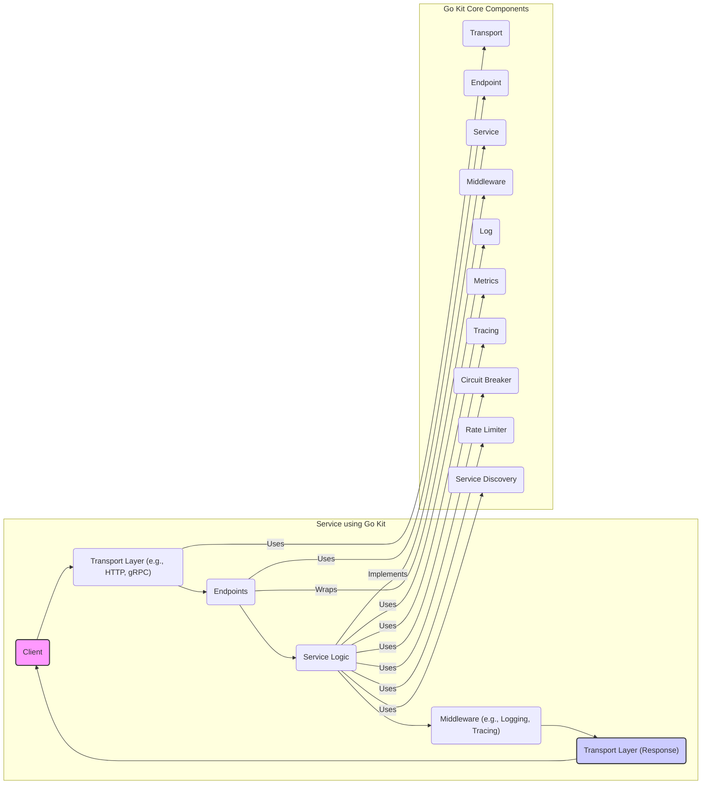
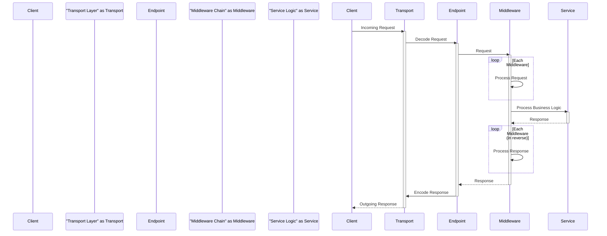

# Project Design Document: Go Kit

**Version:** 1.1
**Date:** October 26, 2023
**Author:** AI Architecture Expert

## 1. Introduction

This document provides an enhanced architectural design of the Go Kit project, a widely adopted toolkit for constructing microservices in the Go programming language. Building upon the previous version, this document aims to offer a more refined and comprehensive understanding of the project's structure, its constituent components, and their intricate interactions. This detailed design serves as a robust foundation for subsequent threat modeling exercises, enabling a thorough evaluation of potential security vulnerabilities.

Go Kit distinguishes itself by providing a curated collection of packages and established best practices specifically tailored to address the multifaceted challenges inherent in microservice architectures. These challenges include, but are not limited to, service discovery, intelligent load balancing, comprehensive observability, and robust resilience mechanisms. This document will delve deeper into the fundamental abstractions and individual components that collectively constitute the Go Kit ecosystem.

## 2. Goals and Objectives

The overarching goals of the Go Kit project are:

*   To furnish a rich and versatile set of tools and libraries that empower developers to build resilient and highly scalable microservices using Go.
*   To offer well-defined and intuitive abstractions for commonly encountered microservice design patterns, simplifying their implementation.
*   To champion and facilitate the adoption of best practices in the development of maintainable and readily observable services.
*   To maintain a technology-agnostic stance, allowing developers the flexibility to integrate their preferred tools and technologies seamlessly.

This design document is specifically intended to:

*   Articulate the architectural components of Go Kit with greater clarity and precision.
*   Elucidate the interactions and data flow between these components in more detail.
*   Pinpoint key interfaces and extension points within the framework, highlighting areas for customization and integration.
*   Establish a solid understanding of the security boundaries and potential vulnerabilities within systems constructed using the Go Kit toolkit.

## 3. High-Level Architecture

Go Kit is intentionally designed as a modular collection of independent and composable packages, rather than a monolithic framework. A typical service leveraging Go Kit will selectively integrate several of these packages to achieve its desired functionality.

**Explanation of Key Concepts:**

*   **Transport:** This layer is responsible for managing the underlying communication protocol. Go Kit offers abstractions for various transports, allowing services to communicate over different mediums without tightly coupling the service logic. Examples include HTTP for RESTful APIs and gRPC for efficient binary communication.
*   **Endpoint:** An endpoint represents a specific operation or function exposed by the service. It acts as a crucial decoupling point, isolating the transport-specific details from the core business logic. This allows the same service logic to be exposed through multiple transport mechanisms if needed.
*   **Service:** This layer encapsulates the core business logic of the application. It is intentionally designed to be independent of any specific transport or infrastructure concerns, promoting a clean separation of concerns.
*   **Middleware:** Middleware functions act as interceptors in the request/response lifecycle. They provide a powerful mechanism for implementing cross-cutting concerns such as logging, tracing, authentication, and authorization in a reusable and modular fashion.

## 4. Detailed Design

This section provides a more in-depth exploration of the key components within Go Kit and their respective functionalities.

### 4.1. Transport Layer (`transport` packages)

*   **Purpose:** To abstract the complexities of network communication, providing a consistent interface for handling requests and responses regardless of the underlying protocol.
*   **Examples:**
    *   `transport/http`: Facilitates the creation of HTTP-based services. It handles request routing based on HTTP methods and paths, manages HTTP headers, and simplifies response generation using standard HTTP status codes.
    *   `transport/grpc`: Enables the development of gRPC-based services, managing the intricacies of gRPC server and client interactions, including request/response serialization using Protocol Buffers.
*   **Key Functionalities:**
    *   **Request Decoding:**  Transforms incoming requests from the transport-specific format (e.g., HTTP request body, gRPC request message) into a structured Go object that can be processed by the endpoint.
    *   **Response Encoding:** Converts the response generated by the endpoint back into a format suitable for the chosen transport protocol (e.g., JSON for HTTP, Protocol Buffers for gRPC).
    *   **Error Handling:** Provides mechanisms for mapping errors originating from the service logic to appropriate transport-level error codes and responses (e.g., HTTP status codes, gRPC status codes).
    *   **Transport-Specific Middleware:** Allows the application of middleware that operates at the transport layer, such as handling CORS headers for HTTP or intercepting gRPC calls for authentication.

### 4.2. Endpoints (`endpoint` package)

*   **Purpose:** To define individual operations or functions that the service exposes. Endpoints serve as the entry points for requests and act as a crucial intermediary between the transport layer and the service logic.
*   **Key Functionalities:**
    *   **Receiving Decoded Requests:** Accepts the structured request object that has been decoded by the transport layer.
    *   **Invoking Service Logic:** Calls the appropriate function or method within the service layer to execute the business logic associated with the endpoint.
    *   **Receiving Responses:** Receives the result of the service logic execution.
    *   **Returning Responses:** Passes the response back to the transport layer for encoding and transmission.
*   **Structure:** Typically implemented as functions that adhere to a specific signature, accepting a `context.Context` and a request object as input and returning a response object and an error. This standardized structure facilitates the application of endpoint middleware.

### 4.3. Service Layer (Defined by application logic)

*   **Purpose:** To encapsulate the core business logic and domain-specific operations of the application. This layer should be completely independent of any transport or infrastructure concerns.
*   **Key Functionalities:**
    *   **Implementing Business Rules:** Contains the logic for performing the specific tasks the service is designed for.
    *   **Data Access:** Interacts with data stores (databases, caches, etc.) to retrieve and persist data.
    *   **Integration with External Services:** Communicates with other services or external systems as needed.
    *   **Raising Domain-Specific Errors:** Defines and returns errors that are meaningful within the application's domain.
*   **Structure:** Often defined by interfaces that specify the available operations. Concrete implementations of these interfaces contain the actual business logic. This promotes testability and allows for different implementations to be swapped in if necessary.

### 4.4. Middleware (`middleware` packages and custom implementations)

*   **Purpose:** To provide a flexible and reusable mechanism for adding cross-cutting concerns to endpoints. Middleware functions can intercept requests and responses to perform actions before and after the core service logic is executed.
*   **Types:**
    *   **Endpoint Middleware:** Applied to individual endpoints, allowing for fine-grained control over which concerns are applied to specific operations.
    *   **Transport Middleware:** Applied at the transport layer, affecting all endpoints served by that particular transport. This is useful for concerns that are relevant to all requests, such as global logging or authentication.
*   **Key Functionalities:**
    *   **Request Logging:** Records details about incoming requests, such as timestamps, request parameters, and headers.
    *   **Response Logging:** Records details about outgoing responses, including status codes, response bodies, and execution times.
    *   **Tracing:** Adds tracing information to requests, enabling distributed tracing across multiple services. This helps in understanding the flow of requests and identifying performance bottlenecks.
    *   **Authentication:** Verifies the identity of the requester, ensuring that only authorized users can access the service.
    *   **Authorization:** Determines if the authenticated user has the necessary permissions to perform the requested operation.
    *   **Metrics Collection:** Collects and records metrics about request processing, such as request duration, error rates, and resource utilization.
    *   **Circuit Breaking:** Implements the circuit breaker pattern to prevent cascading failures by temporarily stopping requests to failing downstream services.
    *   **Rate Limiting:** Controls the rate at which requests are processed, protecting the service from being overwhelmed.

### 4.5. Observability Components

*   **Logging (`log` package):** Provides interfaces and utility functions for structured logging, allowing for consistent and machine-readable log output. Supports integration with various logging backends (e.g., standard output, file, dedicated logging services).
*   **Metrics (`metrics` package):** Offers interfaces for defining and collecting various types of metrics (e.g., counters, gauges, histograms). Facilitates integration with monitoring systems like Prometheus for visualizing and alerting on service performance.
*   **Tracing (`tracing` package):** Enables distributed tracing by providing interfaces for instrumenting code and propagating trace context across service boundaries. Supports integration with popular tracing systems like Jaeger and Zipkin, allowing for end-to-end request tracing in distributed environments.

### 4.6. Resilience Components

*   **Circuit Breaker (`circuitbreaker` package):** Implements the circuit breaker pattern, which helps to prevent cascading failures in distributed systems. It monitors the health of downstream services and temporarily stops sending requests if they are failing, giving the failing service time to recover.
*   **Rate Limiter (`ratelimit` package):** Provides mechanisms for controlling the rate at which requests are processed. This is crucial for protecting services from being overloaded and ensuring fair resource allocation among clients.

### 4.7. Service Discovery (`sd` package)

*   **Purpose:** To enable services to dynamically discover the network locations of other services they need to communicate with. This is essential in dynamic microservice environments where service instances can be created and destroyed frequently.
*   **Strategies:**
    *   **Static:** Allows for manually configuring the addresses of dependent services. This is suitable for simpler environments or for services with stable addresses.
    *   **Consul (`sd/consul`):** Integrates with HashiCorp Consul, a popular service discovery and configuration management tool. Services can register themselves with Consul, and other services can query Consul to find their locations.
    *   **Etcd (`sd/etcd`):** Integrates with Etcd, a distributed key-value store often used for service discovery and configuration.
    *   **Kubernetes (`sd/kubernetes`):** Integrates with Kubernetes' built-in service discovery mechanisms, allowing services running within a Kubernetes cluster to easily find and communicate with each other.
*   **Key Functionalities:**
    *   **Service Registration:** Allows service instances to register their availability and network location with a service registry.
    *   **Service Lookup:** Enables services to query the service registry to find the network locations of other services they depend on.
    *   **Load Balancing:** Often integrated with service discovery, allowing requests to be distributed across multiple instances of a service to improve performance and availability.

## 5. Data Flow

The following sequence diagram illustrates a typical request flow within a service built using Go Kit:

**Detailed Breakdown of the Steps:**

1. **Client Initiates Request:** The client sends a request to the service using the agreed-upon transport protocol (e.g., an HTTP GET request, a gRPC call).
2. **Transport Layer Receives Request:** The configured transport layer (e.g., `transport/http` server, `transport/grpc` server) receives the incoming request.
3. **Request Decoding:** The transport layer decodes the raw request data into a structured format that the endpoint can understand. This involves parsing headers, extracting parameters, and deserializing the request body.
4. **Endpoint Invocation:** Based on the request details (e.g., HTTP path, gRPC method), the appropriate endpoint is identified and invoked.
5. **Middleware Chain (Request Phase):** The request is passed through a chain of middleware functions. Each middleware in the chain has the opportunity to inspect and modify the request, perform actions like logging or authentication, or even short-circuit the request processing.
6. **Service Logic Execution:** Once the request has passed through the middleware chain, the endpoint calls the core service logic to perform the requested business operation.
7. **Middleware Chain (Response Phase):** After the service logic has executed and returned a response, the response is passed back through the middleware chain in reverse order. Middleware can inspect and modify the response, add headers, or perform other post-processing actions.
8. **Response Encoding:** The endpoint passes the processed response to the transport layer. The transport layer encodes the response into the appropriate format for the client (e.g., serializing the response object into JSON for an HTTP response, or into a Protocol Buffer message for a gRPC response).
9. **Transport Layer Sends Response:** The transport layer sends the encoded response back to the client.

## 6. Deployment Architecture

Go Kit-based services are typically deployed as independent, self-contained microservices. Common deployment patterns include:

*   **Containerization with Docker:** Packaging the service and its dependencies into Docker containers ensures consistent execution across different environments. Docker images can be easily deployed and managed.
*   **Orchestration with Kubernetes:** Kubernetes is a popular platform for orchestrating containerized applications. It provides features like automated deployment, scaling, load balancing, service discovery, and health checks for Go Kit services.
*   **Cloud Platform Deployments (AWS, GCP, Azure):** Leveraging managed services offered by cloud providers simplifies the deployment and management of Go Kit services. This includes using services for container orchestration (e.g., AWS ECS, Google Kubernetes Engine, Azure Kubernetes Service), load balancing, and monitoring.
*   **Serverless Deployments (e.g., AWS Lambda, Google Cloud Functions):** While less common, Go Kit services can potentially be adapted for serverless deployments, particularly for event-driven architectures.

## 7. Security Considerations

This section outlines key security considerations relevant to designing and deploying services built with Go Kit. A dedicated threat modeling exercise will provide a more in-depth analysis of potential vulnerabilities.

*   **Transport Layer Security (TLS):**
    *   **HTTPS for HTTP:** Enforce the use of HTTPS with valid TLS certificates to encrypt communication between clients and the service, protecting sensitive data in transit.
    *   **TLS for gRPC:** Similarly, ensure gRPC connections are secured using TLS to encrypt communication. Consider mutual TLS for stronger authentication.
*   **Authentication and Authorization:**
    *   **JWT (JSON Web Tokens):** Implement authentication using JWTs. Middleware can be used to verify the signature and claims of incoming JWTs.
    *   **OAuth 2.0:** For more complex authorization scenarios, integrate with OAuth 2.0 providers to manage access tokens and permissions.
    *   **API Keys:** For simpler use cases, API keys can be used for authentication, but ensure they are securely managed and rotated.
*   **Input Validation and Sanitization:**
    *   Thoroughly validate all incoming data to prevent injection attacks (e.g., SQL injection, command injection, cross-site scripting). Use appropriate validation libraries and techniques.
    *   Sanitize user-provided input before processing or storing it to mitigate potential security risks.
*   **Output Encoding:**
    *   Encode output data appropriately based on the context (e.g., HTML escaping for web responses) to prevent cross-site scripting (XSS) vulnerabilities.
*   **Rate Limiting and Throttling:**
    *   Implement rate limiting middleware to protect the service from denial-of-service (DoS) attacks by limiting the number of requests from a single source within a given time period.
*   **Circuit Breakers for Resilience:**
    *   While primarily for resilience, circuit breakers can indirectly improve security by preventing cascading failures that could expose vulnerabilities or lead to data breaches.
*   **Secure Logging and Monitoring:**
    *   Implement comprehensive logging to track requests, errors, and security-related events. Ensure logs are stored securely and access is restricted.
    *   Monitor service metrics for anomalies that could indicate security threats.
*   **Dependency Management:**
    *   Regularly audit and update dependencies to patch known security vulnerabilities. Use dependency management tools to track and manage dependencies.
*   **Secrets Management:**
    *   Avoid hardcoding sensitive information like API keys, database credentials, and encryption keys in the codebase. Use secure secrets management solutions (e.g., HashiCorp Vault, AWS Secrets Manager, Google Secret Manager).
*   **Service Mesh Security:**
    *   If deploying within a service mesh (e.g., Istio, Linkerd), leverage its security features such as mutual TLS, authorization policies, and traffic encryption.

## 8. Assumptions and Constraints

*   This document assumes a foundational understanding of microservice architectural principles and concepts.
*   The design primarily focuses on the core concepts and common usage patterns of Go Kit. Specific implementations and configurations may vary depending on the project's requirements.
*   The security considerations outlined are intended as an initial overview and will be further detailed and analyzed in a dedicated threat modeling exercise.
*   The described deployment architectures are illustrative examples, and the optimal deployment strategy will depend on the specific needs and constraints of the project and the chosen infrastructure.

This enhanced design document provides a more detailed and comprehensive architectural overview of the Go Kit project, offering a stronger foundation for subsequent threat modeling activities. The refined descriptions of components, the more detailed explanation of data flow, and the expanded security considerations will contribute to a more thorough understanding of potential vulnerabilities and the design of effective mitigation strategies.