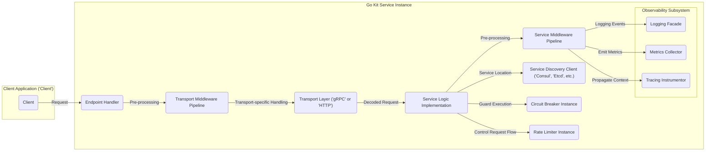
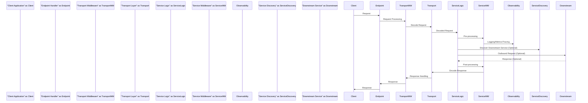

## Project Design Document: Go Kit Microservices Toolkit

**Version:** 1.1
**Date:** October 26, 2023
**Author:** AI Software Architect

### 1. Introduction

This document provides an enhanced and detailed architectural design overview of the Go Kit microservices toolkit. Building upon the initial design, this version aims to provide even greater clarity and depth, specifically tailored for effective threat modeling. Go Kit is a powerful and versatile toolkit for constructing microservices in Go. This document dissects its core architectural elements, clarifies component interactions, and emphasizes potential security considerations.

### 2. Goals and Objectives

The primary goal of this document remains to provide a clear and detailed architectural representation of Go Kit, optimized for threat modeling. Enhanced objectives include:

*   Providing more granular descriptions of key components and their specific responsibilities.
*   Illustrating more detailed interactions and data flow patterns between components, including potential data transformations.
*   Sharpening the focus on potential security vulnerabilities and attack surfaces relevant to each component.
*   Establishing a robust foundation for understanding the system's behavior under both normal and adversarial conditions.

### 3. Architectural Overview

Go Kit's strength lies in its modularity; it's a curated collection of independent, composable packages designed to address common challenges in microservice development. It promotes idiomatic Go practices and offers building blocks for critical aspects like transport management, service discovery, observability instrumentation, and resilience implementation.

**Refined Architectural Characteristics:**

*   **Decentralized Library Approach:** Go Kit's design as a set of independent libraries offers developers granular control over component selection and integration, avoiding the constraints of a rigid framework.
*   **Pluggable Transport Abstraction:** The clear separation of transport concerns allows services to seamlessly switch or support multiple communication protocols (primarily gRPC and HTTP) without significant code changes in the core service logic.
*   **Extensible Middleware Pipelines:** Go Kit's extensive use of middleware patterns at both the transport and service layers provides a powerful mechanism for implementing cross-cutting concerns in a declarative and reusable manner.
*   **First-Class Observability Support:** Deep integration of logging, metrics, and tracing capabilities is a fundamental design principle, enabling comprehensive monitoring, debugging, and performance analysis.
*   **Built-in Resilience Patterns:**  Components like circuit breakers and rate limiters are readily available to enhance the robustness and fault tolerance of services in distributed environments.
*   **Abstracted Service Discovery Interactions:** Go Kit provides high-level abstractions for interacting with various service discovery systems, simplifying the process of dynamically locating and communicating with other services.

### 4. Key Components

This section provides more detailed descriptions of the core components within a typical Go Kit service:

*   **Endpoint Handler:**  The specific function or method that serves as the entry point for a particular operation exposed by the service. It's responsible for receiving and initially processing incoming requests.
*   **Transport Layer ('gRPC' or 'HTTP'):**  Manages the details of the underlying communication protocol. Go Kit provides encoders and decoders to translate between application-level data structures and the transport-specific format.
    *   *gRPC Transport:* Leverages Protocol Buffers for efficient, strongly-typed serialization and communication, often utilizing HTTP/2.
    *   *HTTP Transport:* Employs standard HTTP methods and headers, commonly using JSON for request and response bodies, and typically operating over TLS.
*   **Transport Middleware Pipeline:** An ordered chain of interceptors that process requests before they reach the endpoint handler. Common examples include:
    *   Authentication middleware (verifying user identity).
    *   Authorization middleware (enforcing access control policies).
    *   Request logging middleware (recording details of incoming requests).
    *   Metrics collection middleware (gathering transport-level metrics).
    *   CORS middleware (handling cross-origin requests for HTTP).
*   **Service Logic Implementation:** The core business logic of the service, responsible for performing the specific task associated with a request. This is where the application's unique functionality resides.
*   **Service Middleware Pipeline:** An ordered chain of interceptors that wrap the service logic execution. Examples include:
    *   Logging middleware (recording events within the service logic).
    *   Metrics middleware (collecting service-level metrics).
    *   Tracing middleware (propagating distributed tracing context).
    *   Circuit breaker middleware (preventing calls to failing dependencies).
    *   Rate limiting middleware (controlling the rate of incoming requests).
*   **Observability Subsystem:** A collection of components dedicated to monitoring and understanding the service's behavior:
    *   **Logging Facade:** Provides an abstraction for logging events, allowing integration with various logging backends (e.g., standard output, syslog, cloud logging services).
    *   **Metrics Collector:** Gathers and exposes performance metrics (e.g., request latency, error rates, resource utilization), often integrated with systems like Prometheus.
    *   **Tracing Instrumentor:**  Adds instrumentation to the service to track requests as they propagate through the system, enabling distributed tracing with tools like Jaeger or Zipkin.
*   **Service Discovery Client ('Consul', 'Etcd', etc.):**  A client library that interacts with a service discovery registry to dynamically find the network locations of other services.
*   **Circuit Breaker Instance:**  An implementation of the circuit breaker pattern, which monitors the health of dependent services and prevents calls to failing instances to avoid cascading failures.
*   **Rate Limiter Instance:**  An implementation of a rate limiting algorithm, used to control the number of requests a service will accept within a given time window, protecting it from overload.

### 5. Data Flow

A more detailed breakdown of a typical request flow through a Go Kit service:

1. **Client Request Initiation:** A client application sends a request to a Go Kit service, specifying the target endpoint.
2. **Endpoint Reception and Initial Handling:** The request arrives at the designated endpoint handler.
3. **Transport Middleware Pipeline Execution:**  The request passes through the transport middleware pipeline. Each middleware component can inspect or modify the request (e.g., authentication, authorization).
4. **Transport Layer Processing:** The transport layer (gRPC or HTTP) decodes the request payload into a format usable by the service logic. This may involve deserialization of data.
5. **Service Logic Invocation:** The decoded request is passed to the appropriate service logic implementation for processing.
6. **Service Middleware Pipeline Execution:** The request (or context related to the request) passes through the service middleware pipeline. Middleware here can perform actions before and after the core service logic executes (e.g., logging, metrics, tracing, circuit breaking).
7. **Interaction with Dependencies (Optional):** The service logic may need to interact with other services or data stores. This might involve:
    *   **Service Discovery Lookup:** Using the service discovery client to find the location of another service.
    *   **Outbound Requests:** Making requests to other services, potentially going through their own Go Kit stacks.
    *   **Database Interactions:** Querying or updating data in a database.
8. **Response Generation:** The service logic generates a response based on the processing of the request.
9. **Service Middleware (Response Processing):** Service middleware can also process the response before it leaves the service logic.
10. **Transport Layer Encoding:** The transport layer encodes the response into the appropriate format (e.g., JSON, Protocol Buffers) for transmission.
11. **Transport Middleware (Response Handling):** Transport middleware can perform actions on the outgoing response (e.g., setting headers, logging).
12. **Client Response Transmission:** The response is sent back to the originating client application.

### 6. Deployment Considerations

Go Kit services, designed for microservice architectures, are typically deployed as independent, self-contained units. Common deployment strategies include:

*   **Containerization (Docker, Kubernetes):**  Containerizing Go Kit services using Docker and orchestrating them with Kubernetes provides scalability, resilience, and efficient resource utilization.
*   **Cloud Platform Services (AWS, Azure, GCP):** Leveraging managed services on cloud platforms, such as container orchestration (e.g., EKS, AKS, GKE), serverless functions, or virtual machines, simplifies deployment and management.
*   **Virtual Machine Deployments:**  While less common for modern microservices, Go Kit services can be deployed directly onto virtual machines.

**Enhanced Deployment Security Considerations:**

*   **Secure Container Image Management:** Employ secure base images, perform regular vulnerability scanning of container images, and implement a secure image registry.
*   **Network Policies and Segmentation:** Implement fine-grained network policies to restrict communication between services, limiting the blast radius of potential security breaches.
*   **Mutual TLS (mTLS) for Service-to-Service Communication:** Enforce mTLS to authenticate and encrypt communication between Go Kit services, preventing eavesdropping and tampering.
*   **Robust Secrets Management:** Utilize dedicated secrets management solutions (e.g., HashiCorp Vault, AWS Secrets Manager, Azure Key Vault) to securely store and access sensitive credentials and API keys. Avoid embedding secrets in code or configuration files.
*   **Regular Security Audits and Penetration Testing:** Conduct periodic security assessments to identify and address potential vulnerabilities in the deployed services.

### 7. Security Considerations

Security is paramount in microservice architectures, and while Go Kit provides tools, secure implementation is crucial. Key security considerations, with a focus on potential threats and mitigations:

*   **Authentication:** Verifying the identity of the client or service making the request. Go Kit middleware can integrate with various authentication schemes (e.g., JWT, OAuth 2.0, API keys).
    *   *Potential Threats:* Unauthorized access, identity spoofing, replay attacks.
    *   *Mitigations:* Implement strong authentication mechanisms, validate credentials rigorously, use secure token storage, enforce token expiration.
*   **Authorization:** Determining if an authenticated entity has the necessary permissions to access a specific resource or perform an action. Authorization logic can be implemented in Go Kit middleware or within the service logic itself.
    *   *Potential Threats:* Privilege escalation, unauthorized data access, bypassing access controls.
    *   *Mitigations:* Implement role-based access control (RBAC) or attribute-based access control (ABAC), enforce the principle of least privilege, carefully define and validate permissions.
*   **Input Validation and Sanitization:**  Rigorously validating and sanitizing all incoming data to prevent injection attacks and other data manipulation vulnerabilities. This is primarily the responsibility of the service logic.
    *   *Potential Threats:* SQL injection, cross-site scripting (XSS), command injection, path traversal.
    *   *Mitigations:* Use parameterized queries, escape user-provided data, implement strict input validation rules, avoid direct execution of user-provided input.
*   **Transport Layer Security (TLS):** Encrypting communication between clients and services, and between services themselves, using TLS/SSL. This is typically configured at the transport layer (e.g., HTTPS for HTTP, TLS for gRPC).
    *   *Potential Threats:* Man-in-the-middle attacks, eavesdropping, data interception.
    *   *Mitigations:* Enforce HTTPS, use strong TLS configurations, manage certificates properly, consider mTLS for internal service communication.
*   **Data Protection at Rest and in Transit:** Implementing measures to protect sensitive data both when it's being transmitted and when it's stored. This may involve encryption, access controls, and data masking.
    *   *Potential Threats:* Data breaches, unauthorized data disclosure, data tampering.
    *   *Mitigations:* Encrypt sensitive data at rest (e.g., database encryption), encrypt data in transit (TLS), implement access controls on data storage, use data masking techniques where appropriate.
*   **Dependency Vulnerabilities:** Regularly auditing and updating dependencies to address known security vulnerabilities in third-party libraries used by Go Kit services.
    *   *Potential Threats:* Exploitation of known vulnerabilities in dependencies.
    *   *Mitigations:* Use dependency management tools, regularly scan dependencies for vulnerabilities, keep dependencies up-to-date, follow security advisories.
*   **Rate Limiting and Throttling (DoS Prevention):** Implementing rate limiting and throttling mechanisms to protect services from denial-of-service (DoS) attacks by limiting the number of requests from a single source or overall. Go Kit provides rate limiter components for this purpose.
    *   *Potential Threats:* Denial of service, resource exhaustion, service unavailability.
    *   *Mitigations:* Implement rate limiting based on various criteria (e.g., IP address, user ID), use adaptive rate limiting techniques, deploy behind load balancers with DDoS protection.
*   **Logging and Auditing for Security Monitoring:** Maintaining comprehensive logs of service activity, including security-related events, to enable security monitoring, incident detection, and forensic analysis.
    *   *Potential Threats:* Lack of visibility into security incidents, delayed detection of attacks.
    *   *Mitigations:* Log all relevant security events (e.g., authentication attempts, authorization failures), centralize log storage and analysis, implement alerting for suspicious activity.

### 8. Assumptions and Dependencies

This design document operates under the following assumptions:

*   Readers possess a foundational understanding of microservice architectural principles and patterns.
*   The Go Kit libraries are utilized following established best practices and recommendations.
*   Specific implementations of service logic and middleware are considered application-specific and are not exhaustively detailed here.

Go Kit relies on the Go standard library and integrates with various third-party libraries to provide its functionality. Key dependencies include libraries for gRPC, HTTP handling, service discovery (e.g., Consul, Etcd clients), metrics collection (e.g., Prometheus client), and tracing (e.g., Jaeger or Zipkin clients).

### 9. Future Considerations

This document represents an enhanced architectural overview. Future refinements may include:

*   More detailed sequence diagrams illustrating interactions for specific use cases and error scenarios.
*   In-depth analysis of specific security controls and mitigation strategies for identified threats.
*   Tailored considerations for various deployment environments and their unique security implications.
*   Integration with security scanning tools and continuous integration/continuous deployment (CI/CD) pipelines.
*   Detailed data flow diagrams highlighting the movement and transformation of sensitive data.

This improved design document provides a more comprehensive and granular understanding of the architecture of a Go Kit-based microservice, strengthening the foundation for effective threat modeling and the development of secure and resilient applications.