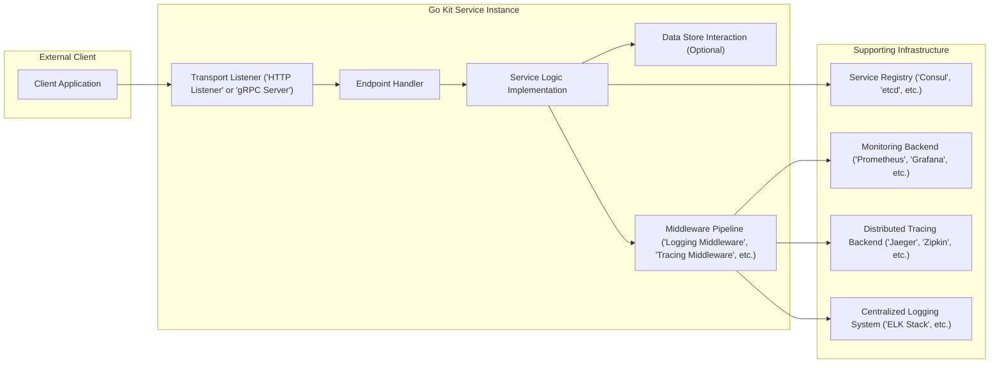
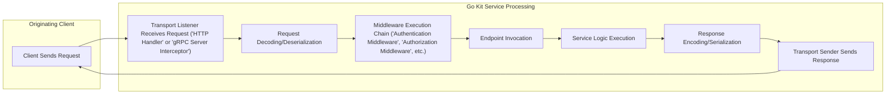

# Project Design Document: Go Kit (Improved)

## 1. Introduction

This document provides an enhanced architectural design of the Go Kit project, a widely adopted toolkit for constructing microservices in Go. The primary purpose of this document is to offer a clear and detailed understanding of the project's structure, core components, and data flow, specifically tailored to facilitate comprehensive threat modeling activities. This improved version aims to provide greater clarity and detail, highlighting potential areas of security concern.

## 2. Goals and Objectives

Go Kit's central goal is to empower developers to build resilient and scalable microservices in Go by providing a curated set of idiomatic and composable packages. Key objectives include:

* **Abstracting Common Microservice Concerns:** Offering pre-built solutions for essential cross-cutting concerns such as logging, distributed tracing, metrics collection, service discovery, and various transport mechanisms.
* **Ensuring Interoperability:**  Supporting a range of transport protocols (e.g., HTTP via `net/http`, gRPC) and data encoding formats (e.g., JSON, Protocol Buffers) to enable seamless communication between services.
* **Enhancing Observability:**  Providing the necessary instrumentation points and tools to effectively monitor and understand the runtime behavior of services.
* **Promoting Resilience and Fault Tolerance:**  Offering patterns and libraries (e.g., circuit breakers, rate limiters) to build services that can gracefully handle failures and unexpected load.
* **Boosting Developer Productivity:**  Providing a consistent, well-documented, and easy-to-use API, reducing boilerplate code and accelerating development cycles.

## 3. System Architecture

### 3.1. High-Level Architecture

This diagram illustrates the interaction between an external client and a single instance of a Go Kit-based service. It emphasizes the distinct layers within the service and its dependencies on external infrastructure components. This view is crucial for understanding potential points of interaction and thus, potential attack vectors.

### 3.2. Detailed Architecture

Go Kit's architecture is characterized by its modularity, with functionality distributed across independent packages. This allows developers to selectively integrate the components they need. The key architectural elements are:

* **Transport Layer:**
    * **Purpose:** Handles the underlying communication protocol used to expose and consume the service.
    * **Implementations:** Supports various transports, including HTTP (using the standard `net/http` library), gRPC, and potentially others.
    * **Responsibilities:**  Manages the reception of incoming requests, decoding of request data, encoding of responses, and dispatching requests to the appropriate endpoint. This layer is a primary entry point and a critical area for security considerations.
* **Endpoint Layer:**
    * **Purpose:** Represents a specific, self-contained operation or function offered by the service.
    * **Abstraction:** Decouples the transport-specific details from the core business logic.
    * **Definition:** Defines the input and output schemas for each operation, often as simple Go functions adhering to a specific signature.
    * **Security Relevance:** Endpoints are the targets of client requests and must implement proper authorization and input validation.
* **Service Layer:**
    * **Purpose:** Encapsulates the core business logic and domain-specific operations of the application.
    * **Implementation:** Implements the functionalities defined by the endpoints.
    * **Dependencies:** May interact with data stores, external APIs, or other internal services.
    * **Security Relevance:**  This layer handles sensitive data and business rules, making it a critical area for security controls.
* **Middleware Layer:**
    * **Purpose:** Provides a mechanism to intercept and augment requests and responses as they flow through the service.
    * **Functionality:** Used for implementing cross-cutting concerns without modifying the core service or endpoint logic.
    * **Examples:** Common middleware includes logging, tracing, metrics collection, authentication, authorization, rate limiting, and request validation.
    * **Security Relevance:** Middleware plays a crucial role in enforcing security policies and protecting the service. Improperly implemented middleware can introduce vulnerabilities.
* **Logging:**
    * **Purpose:** Provides a structured and consistent way to record events and activities within the service.
    * **Features:** Supports various logging levels, output formats, and integration with different logging backends.
    * **Security Relevance:** Logs are essential for auditing, incident response, and detecting malicious activity. Secure logging practices are crucial.
* **Metrics:**
    * **Purpose:** Enables the collection and exposure of performance and operational metrics.
    * **Types:** Supports different metric types like counters, gauges, and histograms.
    * **Integration:** Integrates with popular monitoring systems like Prometheus.
    * **Security Relevance:** Monitoring metrics can help detect anomalies and potential security breaches.
* **Tracing:**
    * **Purpose:** Facilitates distributed tracing of requests as they propagate through multiple services.
    * **Mechanism:** Provides interfaces for creating and propagating trace spans, allowing for end-to-end request tracking.
    * **Integration:** Integrates with tracing systems like Jaeger and Zipkin.
    * **Security Relevance:** Tracing can help identify performance bottlenecks and understand the flow of requests, which can be useful in security investigations.
* **Circuit Breaker:**
    * **Purpose:** Implements the circuit breaker pattern to enhance fault tolerance and prevent cascading failures.
    * **Mechanism:** Monitors the health of downstream services and temporarily stops sending requests to failing services.
    * **Security Relevance:** While primarily for resilience, circuit breakers can indirectly improve security by preventing resource exhaustion due to repeated failed requests.
* **Rate Limiting:**
    * **Purpose:** Provides mechanisms to control the rate of incoming requests to protect services from being overwhelmed or abused.
    * **Strategies:** Supports various rate-limiting strategies based on factors like IP address or user ID.
    * **Security Relevance:** Essential for preventing denial-of-service attacks and protecting resources.
* **Service Discovery:**
    * **Purpose:** Enables services to dynamically locate and communicate with each other without hardcoded addresses.
    * **Integrations:** Offers integrations with popular service discovery systems like Consul, etcd, and Kubernetes DNS.
    * **Security Relevance:** Secure service discovery is crucial to prevent malicious actors from registering rogue services or intercepting communication.

## 4. Key Components

This section highlights some of the most critical components within the Go Kit ecosystem from a design and security perspective:

* **`transport/http` Package:** Provides the building blocks for creating HTTP servers and clients. This includes request routing, handling different HTTP methods, and encoding/decoding of data (typically JSON). **Security Consideration:** This is a primary attack surface, requiring careful attention to TLS configuration, input validation, and handling of HTTP headers.
* **`transport/grpc` Package:** Offers support for building gRPC services and clients, leveraging Protocol Buffers for efficient communication. **Security Consideration:**  Similar to HTTP, securing gRPC involves TLS, authentication mechanisms (e.g., API keys, tokens), and proper handling of gRPC metadata.
* **`endpoint` Package:** Defines the core `Endpoint` interface, representing an invokable business function. It provides helper functions for creating and composing endpoints, including applying middleware. **Security Consideration:** Endpoints are where authorization checks and input sanitization should be enforced.
* **`log` Package:** The foundational logging package, offering a structured logging interface and various logger implementations. **Security Consideration:**  Care must be taken to avoid logging sensitive information and to secure access to log data.
* **`metrics` Package:** Provides interfaces and implementations for collecting and exposing application metrics in various formats (e.g., Prometheus). **Security Consideration:**  While not directly a security risk, exposing excessive or sensitive metrics could reveal information about the system's internal workings.
* **`tracing/opentracing` Package:** Facilitates integration with the OpenTracing standard for distributed tracing. **Security Consideration:** Trace data can reveal information about request flow and processing time, which might be of interest to attackers. Secure storage and access control for trace data are important.
* **`circuitbreaker` Package (often using `github.com/sony/gobreaker`):** Implements the circuit breaker pattern. **Security Consideration:**  Improperly configured circuit breakers could inadvertently block legitimate traffic.
* **`ratelimit` Package:** Offers middleware for implementing rate limiting using various strategies. **Security Consideration:**  Rate limiting configurations need to be carefully tuned to prevent both denial of service and the blocking of legitimate users.
* **`sd` (Service Discovery) Packages (e.g., `sd/consul`, `sd/etcd`):** Provide integrations with service discovery systems. **Security Consideration:**  Securing access to the service registry is paramount to prevent unauthorized service registration or discovery.

## 5. Data Flow

A typical request flow within a Go Kit service involves several stages:

Detailed steps in the data flow, highlighting security-relevant aspects:

* **Client Sends Request:** An external client initiates a request to the service. **Security Consideration:** This is the initial point of contact and requires secure transport (HTTPS/TLS).
* **Transport Listener Receives Request:** The transport layer (e.g., HTTP server, gRPC server) receives the incoming request. **Security Consideration:** This component must be configured to handle potentially malicious requests and enforce basic security measures.
* **Request Decoding/Deserialization:** The request data is decoded from its transport-specific format (e.g., JSON, Protocol Buffers) into Go data structures. **Security Consideration:**  Vulnerabilities can arise from improper handling of malformed or malicious input during decoding. Input validation should ideally start here.
* **Middleware Execution Chain:** The request passes through a series of middleware components. **Security Consideration:** This is where critical security checks like authentication, authorization, logging, and tracing are typically performed. The order and configuration of middleware are crucial.
* **Endpoint Invocation:** The appropriate endpoint handler is identified and invoked based on the request. **Security Consideration:**  Ensure that only authorized requests reach the endpoint.
* **Service Logic Execution:** The core business logic of the service is executed. **Security Consideration:** This layer must handle sensitive data securely and implement business logic correctly to prevent vulnerabilities.
* **Response Encoding/Serialization:** The result of the service logic is encoded into the transport-specific response format. **Security Consideration:**  Ensure that sensitive data is not inadvertently included in responses and that the encoding process is secure.
* **Transport Sender Sends Response:** The transport layer sends the response back to the client. **Security Consideration:** The response should be transmitted securely (HTTPS/TLS).

## 6. Security Considerations

This section expands on the security considerations introduced earlier, providing a more structured overview:

* **Transport Layer Security:**
    * **HTTPS/TLS Enforcement:**  Mandatory use of HTTPS with strong TLS configurations (e.g., disabling weak ciphers) for all HTTP-based communication.
    * **gRPC TLS Configuration:**  Enforcing TLS for gRPC connections, including certificate management and rotation.
    * **Mutual TLS (mTLS):**  Considering mTLS for service-to-service communication to provide strong authentication and authorization.
* **Authentication and Authorization:**
    * **Robust Authentication Middleware:** Implementing secure authentication mechanisms (e.g., JWT, OAuth 2.0) and validating credentials rigorously.
    * **Granular Authorization:** Implementing fine-grained authorization policies to control access to specific endpoints and resources.
    * **Secure Token Handling:**  Storing and handling authentication tokens securely, avoiding storage in insecure locations.
* **Input Validation and Sanitization:**
    * **Comprehensive Validation:**  Validating all input data at the endpoint and service layers to prevent injection attacks (e.g., SQL injection, command injection).
    * **Data Sanitization:**  Sanitizing user-provided input to remove potentially harmful characters or code.
* **Data Security:**
    * **Encryption at Rest:**  Encrypting sensitive data stored in databases or other persistent storage.
    * **Encryption in Transit:**  Ensuring data is encrypted during transmission between services and to external systems.
* **Logging and Monitoring Security:**
    * **Sensitive Data Exclusion:**  Avoiding logging sensitive information (e.g., passwords, API keys).
    * **Secure Access Control:**  Implementing strong access controls for logging and monitoring systems.
* **Dependency Management:**
    * **Vulnerability Scanning:**  Regularly scanning dependencies for known vulnerabilities and updating them promptly.
    * **Supply Chain Security:**  Being aware of the security posture of third-party libraries and dependencies.
* **Service Discovery Security:**
    * **Access Control to Registry:**  Securing access to the service discovery registry to prevent unauthorized registration or modification of service information.
    * **Secure Communication with Registry:**  Ensuring secure communication between services and the service discovery registry.
* **Rate Limiting and DoS Prevention:**
    * **Appropriate Rate Limiting Configuration:**  Configuring rate limits to protect services from denial-of-service attacks without impacting legitimate users.
    * **Throttling Mechanisms:**  Implementing throttling mechanisms to handle sudden spikes in traffic.

## 7. Deployment Considerations

The security of Go Kit services is also influenced by deployment practices:

* **Container Security:**  Using secure base images, minimizing image layers, and regularly scanning container images for vulnerabilities.
* **Orchestration Security (e.g., Kubernetes):**  Implementing strong RBAC policies, network segmentation, and secure secrets management within the orchestration platform.
* **Secrets Management:**  Utilizing secure secrets management solutions (e.g., HashiCorp Vault, Kubernetes Secrets with encryption at rest) to manage sensitive credentials.
* **Network Segmentation:**  Segmenting the network to isolate services and limit the blast radius of potential security breaches.
* **Regular Security Audits:**  Conducting regular security audits and penetration testing of deployed services.

## 8. Future Considerations

Potential future improvements and considerations for Go Kit projects include:

* **Standardized Security Middleware:**  Developing and promoting standardized security middleware components for common tasks like authentication and authorization.
* **Improved Error Handling for Security:**  Establishing consistent and secure error handling patterns to avoid leaking sensitive information in error messages.
* **Integration with Security Scanning Tools:**  Facilitating easier integration with static and dynamic application security testing (SAST/DAST) tools within the development pipeline.
* **Security Best Practices Documentation:**  Providing more comprehensive documentation and guidance on security best practices for building Go Kit services.

This improved design document provides a more detailed and security-focused overview of the Go Kit project architecture. It serves as a valuable resource for understanding the system's components, data flow, and potential security considerations, making it well-suited for subsequent threat modeling exercises.