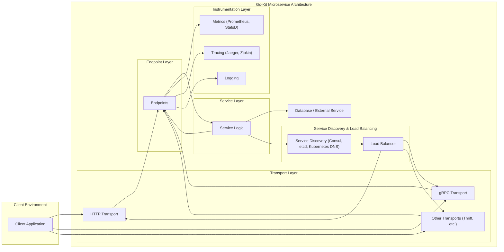
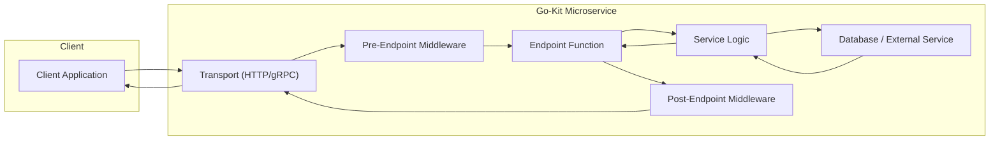

# Project Design Document: Go-Kit Microservice Framework

**Project Name:** Go-Kit Microservice Framework

**Project Repository:** [https://github.com/go-kit/kit](https://github.com/go-kit/kit)

**Document Version:** 1.1
**Date:** 2023-10-27
**Author:** AI Expert

**Changes from Version 1.0:**

*   Improved clarity and conciseness throughout the document.
*   Enhanced descriptions of each layer and component.
*   Expanded on security considerations with more specific examples and best practices.
*   Strengthened the threat modeling section with more concrete threats and mitigation strategies.
*   Refined Mermaid diagrams for better readability and accuracy.
*   Added a section on Deployment Considerations.

## 1. Introduction

This document provides a comprehensive design overview of the Go-Kit microservice framework. It serves as a foundation for threat modeling, security assessments, and architectural understanding of systems built using Go-Kit. This document details the core architectural layers, data flow patterns, key components, and crucial security considerations inherent in a typical Go-Kit based microservice application.

Go-Kit is a powerful toolkit for building robust microservices in Go (Golang). It is designed to be idiomatic, composable, and comprehensive, guiding developers towards creating maintainable and observable microservices.  Go-Kit distinguishes itself from traditional frameworks by offering a curated set of packages and proven patterns rather than a rigid, all-encompassing structure. It strongly advocates for explicit dependency injection, interface-driven design, and a layered architecture to promote modularity and testability.

## 2. Architectural Overview

Go-Kit promotes a distinct layered architecture for microservices, emphasizing separation of concerns, enhanced maintainability, and improved testability. A standard Go-Kit service is conceptually structured into the following layers, each with a specific responsibility:

*   **Transport Layer:**  Manages communication protocols for external interaction. This layer is responsible for receiving requests from clients and dispatching responses back, supporting protocols like HTTP, gRPC, and Thrift.
*   **Endpoint Layer:** Acts as an intermediary, bridging the Transport Layer and the Service Layer. It defines the service's publicly exposed operations (endpoints), handles request and response transformations (encoding/decoding), and applies cross-cutting concerns through middleware.
*   **Service Layer (Business Logic):** Encapsulates the core business logic of the microservice. Defined by interfaces, this layer ensures a clear separation of concerns, facilitating independent development, testing, and evolution of business functionalities.
*   **Instrumentation Layer (Observability):** Provides essential observability features, including logging, metrics collection, and distributed tracing. This layer is critical for monitoring service health, performance analysis, and debugging in distributed environments.
*   **Service Discovery & Load Balancing Layer:** Enables seamless integration with service discovery systems (e.g., Consul, etcd, Kubernetes DNS) and load balancing mechanisms. This layer facilitates dynamic service registration, discovery of service instances, and resilient communication within a microservice ecosystem.

The following diagram visually represents the layered architecture of a Go-Kit based microservice:

## 3. Key Components and Data Flow

### 3.1. Transport Layer (Detailed)

*   **Purpose:**  Acts as the entry and exit point for external communication. It handles protocol-specific details of receiving requests and sending responses. Go-Kit's flexibility allows support for various transports, including HTTP (using `net/http`), gRPC, Thrift, and more.
*   **Data Flow:**
    1.  **Request Reception:** Listens for and receives incoming requests from clients over the configured protocol (e.g., an HTTP request on a specific port).
    2.  **Request Decoding:** Decodes the raw request payload into a structured format that the Endpoint Layer can understand. This involves parsing request headers, body, and query parameters based on the protocol and content type (e.g., JSON, Protocol Buffers, XML).
    3.  **Endpoint Invocation:**  Routes the decoded request to the appropriate Endpoint in the Endpoint Layer based on the request path, method, or other protocol-specific routing mechanisms.
    4.  **Response Reception:** Receives the processed response from the Endpoint Layer.
    5.  **Response Encoding:** Encodes the response object into a format suitable for the chosen protocol and client expectations. This includes serializing the response body and setting appropriate response headers.
    6.  **Response Transmission:** Sends the encoded response back to the client over the network.

### 3.2. Endpoint Layer (Detailed)

*   **Purpose:**  Defines the service's operations as individual endpoints. Each endpoint is a function that encapsulates a specific business operation, acting as a well-defined entry point into the Service Layer. Endpoints are responsible for request/response transformation and applying middleware for cross-cutting concerns.
*   **Data Flow:**
    1.  **Request Reception (from Transport):** Receives the decoded and protocol-agnostic request from the Transport Layer.
    2.  **Request Middleware Application:** Applies pre-endpoint middleware. Middleware functions can handle tasks like:
        *   **Authentication and Authorization:** Verifying user identity and permissions.
        *   **Request Logging:** Logging incoming requests for auditing and debugging.
        *   **Tracing Context Propagation:**  Starting or continuing distributed traces.
        *   **Input Validation:**  Validating the request data before it reaches the Service Layer.
    3.  **Service Layer Invocation:** Invokes the corresponding function in the Service Layer, passing the processed request data.
    4.  **Response Reception (from Service):** Receives the response from the Service Layer.
    5.  **Response Middleware Application:** Applies post-endpoint middleware. Middleware functions can handle tasks like:
        *   **Response Logging:** Logging outgoing responses.
        *   **Error Handling:**  Transforming service errors into appropriate protocol-specific error responses.
        *   **Metrics Collection:**  Recording endpoint execution time and success/failure rates.
    6.  **Response Transmission (to Transport):** Returns the processed response to the Transport Layer for encoding and transmission back to the client.

### 3.3. Service Layer (Detailed)

*   **Purpose:**  Contains the core business logic and domain-specific functionalities of the microservice. It is typically defined by interfaces, promoting loose coupling and enabling independent evolution of the service implementation.
*   **Data Flow:**
    1.  **Request Reception (from Endpoint):** Receives requests from the Endpoint Layer, representing specific business operations.
    2.  **Business Logic Execution:** Executes the core business logic to fulfill the request. This may involve:
        *   **Data Access:** Interacting with databases (SQL, NoSQL) to retrieve or persist data.
        *   **External Service Calls:** Communicating with other microservices or external APIs.
        *   **Domain Logic Processing:** Performing calculations, data transformations, and business rule validations.
    3.  **Response Generation:**  Constructs a response object representing the result of the business operation.
    4.  **Response Transmission (to Endpoint):** Returns the response object to the Endpoint Layer.

### 3.4. Instrumentation Layer (Detailed)

*   **Purpose:**  Provides comprehensive observability into the microservice's behavior and performance. This layer is crucial for monitoring, debugging, and performance optimization in production environments.
*   **Components:**
    *   **Metrics:** Collects numerical measurements about service performance and resource utilization. Common metrics include request latency, error rates, CPU usage, memory consumption, and queue lengths. Go-Kit integrates well with metrics systems like Prometheus and StatsD.
    *   **Tracing:** Tracks requests as they propagate through the microservice and across distributed systems. Distributed tracing helps visualize request flows, identify performance bottlenecks, and understand dependencies between services. Go-Kit supports tracing systems like Jaeger and Zipkin.
    *   **Logging:** Records structured events and messages generated by the service. Logs are essential for debugging, auditing, and security analysis. Go-Kit encourages structured logging for easier parsing and analysis.

### 3.5. Service Discovery & Load Balancing Layer (Detailed)

*   **Purpose:**  Enables microservices to dynamically locate and communicate with each other in a distributed environment. Load balancing ensures requests are distributed evenly across available service instances, improving resilience and performance.
*   **Components:**
    *   **Service Discovery:**  Provides a registry of available service instances and their network locations. Go-Kit integrates with various service discovery systems like Consul, etcd, and Kubernetes DNS. Services register themselves upon startup and query the registry to discover other services.
    *   **Load Balancing:** Distributes incoming requests across multiple instances of a service. Go-Kit typically employs client-side load balancing, where the client (microservice) is responsible for selecting an instance to send a request to. Libraries like `lbkit` or integrations with service discovery systems provide load balancing capabilities.

The following diagram illustrates the detailed data flow for a typical request within a Go-Kit microservice, including middleware:

## 4. Security Considerations (Expanded)

Securing Go-Kit microservices requires a multi-layered approach, addressing security at each architectural level. Here are expanded security considerations:

*   **Transport Layer Security (TLS/mTLS):**
    *   **Best Practice:** Enforce TLS/HTTPS for all external communication (client to service) and strongly consider Mutual TLS (mTLS) for service-to-service communication.
    *   **Rationale:** TLS encrypts data in transit, protecting confidentiality and integrity. mTLS adds mutual authentication, ensuring both the client and server verify each other's identities, crucial in zero-trust environments.
    *   **Go-Kit Implementation:** Go-Kit's HTTP transport readily supports TLS configuration using standard Go `crypto/tls` package. gRPC also has built-in TLS support.

*   **Authentication (Detailed Mechanisms):**
    *   **API Keys:**
        *   **Use Case:** Simple authentication for trusted clients or internal services.
        *   **Security:** API keys should be treated as secrets, securely generated, stored, and transmitted (ideally in headers, not URLs). Implement key rotation and revocation mechanisms.
    *   **JWT (JSON Web Tokens):**
        *   **Use Case:** Stateless authentication for web and mobile clients.
        *   **Security:**  Use strong signing algorithms (e.g., RS256). Validate JWT signatures and claims (expiration, issuer, audience) in middleware. Protect the secret key used for signing.
    *   **OAuth 2.0:**
        *   **Use Case:** Delegated authorization for third-party applications.
        *   **Security:** Implement proper OAuth 2.0 flows (Authorization Code Grant, Client Credentials Grant). Validate access tokens and refresh tokens. Securely manage client secrets.
    *   **Mutual TLS (mTLS):**
        *   **Use Case:** Strong service-to-service authentication.
        *   **Security:**  Manage certificates securely. Implement certificate rotation and revocation. Ensure proper certificate validation on both client and server sides.

*   **Authorization (Granular Access Control):**
    *   **Role-Based Access Control (RBAC):** Assign roles to users or services and define permissions for each role. Enforce authorization based on the authenticated identity and their assigned roles.
    *   **Attribute-Based Access Control (ABAC):**  Define authorization policies based on attributes of the user, resource, and environment. ABAC provides finer-grained control compared to RBAC.
    *   **Policy Enforcement Point (PEP):** Implement authorization checks in Endpoint Middleware (PEP) before invoking Service Layer logic.

*   **Input Validation and Sanitization:**
    *   **Best Practice:** Validate all inputs at the Transport and Endpoint layers. Sanitize data before processing in the Service Layer to prevent injection attacks.
    *   **Examples:**
        *   **HTTP Transport:** Validate request headers, query parameters, and request body against expected schemas and data types.
        *   **Endpoint Layer:** Use validation libraries to enforce data constraints and formats.
        *   **Sanitization:**  Escape user-provided data before using it in database queries or rendering in web pages.

*   **Rate Limiting and Throttling (DoS Protection):**
    *   **Implementation:** Implement rate limiting middleware in the Endpoint Layer to restrict the number of requests from a single client or source within a given time window.
    *   **Configuration:** Configure rate limits based on service capacity and expected traffic patterns. Use different rate limits for different endpoints or client types.

*   **Circuit Breakers (Resilience):**
    *   **Go-Kit Middleware:** Utilize Go-Kit's built-in circuit breaker middleware to prevent cascading failures when downstream services become unavailable or slow.
    *   **Configuration:** Configure circuit breaker thresholds (error rate, latency) and recovery mechanisms.

*   **Dependency Management and Vulnerability Scanning:**
    *   **Tools:** Use dependency management tools (e.g., Go modules) and vulnerability scanning tools (e.g., `govulncheck`, Snyk) to identify and address known vulnerabilities in dependencies.
    *   **Regular Updates:** Regularly update dependencies to the latest secure versions.

*   **Secrets Management (Secure Storage):**
    *   **Solutions:** Use dedicated secrets management solutions like HashiCorp Vault, Kubernetes Secrets, AWS Secrets Manager, or Azure Key Vault to store and manage sensitive information.
    *   **Avoid Hardcoding:** Never hardcode secrets in code or configuration files.

*   **Logging and Monitoring (Security Event Detection):**
    *   **Security Logs:** Log security-relevant events, including authentication attempts (successes and failures), authorization decisions (allow/deny), input validation errors, and security exceptions.
    *   **Monitoring Alerts:** Set up alerts for suspicious activity or security anomalies detected in logs or metrics.

*   **Error Handling (Information Leakage Prevention):**
    *   **Generic Error Responses:** Avoid exposing detailed error messages to clients, as they might reveal sensitive information or internal implementation details. Return generic error responses to clients.
    *   **Detailed Error Logging:** Log detailed error information internally for debugging and security analysis.

*   **CORS (Cross-Origin Resource Sharing) (Web Security):**
    *   **Configuration:** If the microservice serves web clients from different origins, configure CORS policies carefully to allow only authorized origins.
    *   **Go-Kit Middleware:** Use CORS middleware to handle CORS preflight requests and set appropriate CORS headers.

*   **Security Audits and Penetration Testing (Proactive Security):**
    *   **Regular Audits:** Conduct regular security audits and code reviews to identify potential vulnerabilities.
    *   **Penetration Testing:** Perform penetration testing to simulate real-world attacks and assess the effectiveness of security controls.

## 5. Threat Modeling Considerations (Enhanced)

Threat modeling is a crucial step in building secure Go-Kit microservices.  Here's an enhanced approach to threat modeling:

*   **STRIDE Model:** Use the STRIDE model (Spoofing, Tampering, Repudiation, Information Disclosure, Denial of Service, Elevation of Privilege) to systematically identify threats at each layer and component.

    *   **Example Threats per Layer (using STRIDE):**

        | Layer                     | Threat Category | Threat Example                                                                 | Mitigation Strategy                                                                 |
        | ------------------------- | --------------- | ------------------------------------------------------------------------------ | ----------------------------------------------------------------------------------- |
        | **Transport Layer (HTTP)** | Spoofing        | Client impersonation (e.g., lack of client authentication)                     | Implement TLS with client authentication (mTLS), API Keys, or JWT.                 |
        | **Transport Layer (HTTP)** | Tampering       | Man-in-the-middle attack altering request/response data                       | Enforce HTTPS for all communication.                                                |
        | **Endpoint Layer**        | Information Disclosure | Exposing sensitive data in error messages                                    | Implement generic error responses, log detailed errors internally.                  |
        | **Endpoint Layer**        | Elevation of Privilege | Authorization bypass due to flawed access control logic                      | Implement robust authorization checks in middleware (RBAC/ABAC).                     |
        | **Service Layer**         | Injection       | SQL injection vulnerability in database queries                               | Use parameterized queries or ORM, input sanitization.                               |
        | **Service Layer**         | Denial of Service | Resource exhaustion due to inefficient business logic or lack of rate limiting | Optimize code, implement rate limiting and throttling.                             |
        | **Instrumentation Layer** | Information Disclosure | Exposing sensitive data in logs or metrics                                   | Sanitize logs, restrict access to metrics endpoints.                               |
        | **Service Discovery**     | Spoofing        | Service registration hijacking, attacker registering malicious service instance | Secure service discovery system with authentication and authorization.             |
        | **Load Balancing**        | Denial of Service | Load balancer overload                                                        | Implement load balancer scaling and monitoring, DDoS protection at infrastructure level. |

*   **Data Flow Diagram (DFD) based Threat Modeling:** Create detailed DFDs for specific use cases or critical paths within the microservice. Analyze threats at each data flow step and component.

*   **Attack Tree Analysis:**  Construct attack trees to visualize potential attack paths and identify weaknesses in security controls.

*   **Prioritize Threats:**  Assess the risk of each identified threat based on likelihood and impact. Focus on mitigating high-risk threats first.

*   **Regular Threat Modeling:**  Make threat modeling an ongoing process, especially when making significant changes to the microservice architecture or functionality.

## 6. Deployment Considerations

Beyond architecture and security, deployment aspects are crucial for Go-Kit microservices:

*   **Containerization (Docker):** Package Go-Kit services as Docker containers for consistent deployment across environments.
*   **Orchestration (Kubernetes):** Utilize Kubernetes or similar orchestration platforms for managing, scaling, and deploying Go-Kit microservices. Kubernetes provides features like service discovery, load balancing, health checks, and automated deployments.
*   **Infrastructure as Code (IaC):** Use IaC tools (e.g., Terraform, CloudFormation) to automate infrastructure provisioning and configuration for consistent and repeatable deployments.
*   **CI/CD Pipelines:** Implement CI/CD pipelines for automated building, testing, and deployment of Go-Kit microservices.
*   **Monitoring and Alerting:** Set up comprehensive monitoring and alerting systems to track service health, performance, and security events in production. Integrate with instrumentation layer outputs (metrics, logs, traces).
*   **Configuration Management:** Externalize configuration using environment variables, configuration files, or configuration management systems to avoid hardcoding configuration in the application.

## 7. Conclusion

This enhanced design document provides a detailed and improved overview of the Go-Kit microservice framework. It emphasizes architectural layers, data flow, security best practices, and threat modeling considerations. By leveraging this document, development and security teams can gain a deeper understanding of Go-Kit and build more secure, resilient, and observable microservices.  Continuous attention to security throughout the development lifecycle, informed by threat modeling and best practices, is essential for successful Go-Kit microservice deployments.