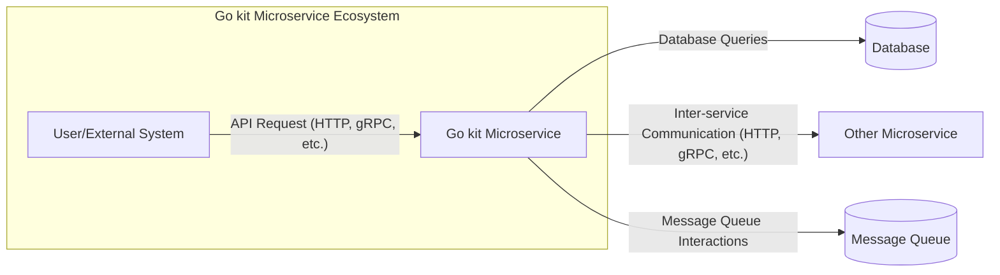
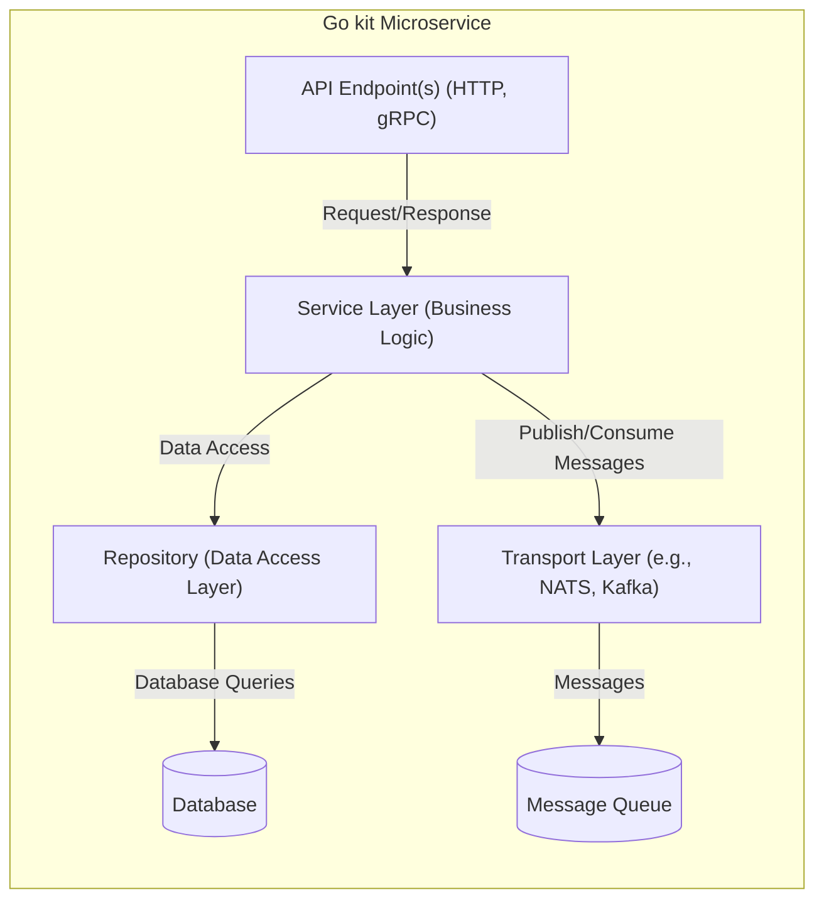
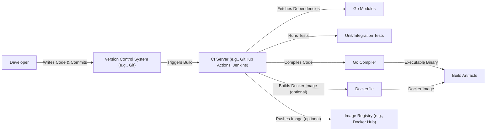

Okay, let's create a design document for the Go kit project, focusing on aspects relevant to threat modeling.

# BUSINESS POSTURE

Go kit is a toolkit for building microservices.  It's not a complete application itself, but rather a set of libraries and tools that developers use to build *their* applications. Therefore, the business posture is indirect, derived from the applications built *using* Go kit.  However, we can define a general posture based on the project's goals.

Priorities and Goals:

*   Provide a robust and reliable foundation for building microservices in Go.
*   Promote best practices in microservice design, including separation of concerns, explicit dependencies, and clear interfaces.
*   Enable developers to focus on business logic rather than infrastructure boilerplate.
*   Facilitate the creation of testable and maintainable microservices.
*   Support a variety of transport protocols (HTTP, gRPC, etc.) and data formats.
*   Offer flexibility and extensibility to accommodate different architectural choices.

Business Risks:

*   Vulnerabilities in Go kit could be exploited in applications built using it, leading to widespread security issues. This is the most significant risk.
*   Incorrect usage of Go kit by developers could introduce vulnerabilities or performance problems in their applications.
*   Lack of adoption due to complexity or perceived limitations could hinder the project's success.
*   Inadequate documentation or support could lead to developer frustration and abandonment.
*   Compatibility issues with evolving Go versions or third-party libraries could create maintenance challenges.

# SECURITY POSTURE

Go kit itself, as a toolkit, has a security posture that focuses on providing secure defaults and mechanisms, but the ultimate security of a Go kit-based application depends heavily on how it's implemented by the developers using the toolkit.

Existing Security Controls:

*   security control: Emphasis on explicit dependencies: Go kit encourages developers to explicitly define dependencies, reducing the risk of unintended or malicious code inclusion. (Described in Go kit documentation and design philosophy).
*   security control: Interface-based design: The use of interfaces promotes loose coupling and allows for easier testing and mocking, reducing the attack surface. (Described in Go kit documentation and examples).
*   security control: Support for standard security protocols: Go kit provides built-in support for common transport protocols like HTTPS and gRPC, which offer encryption and authentication capabilities. (Described in Go kit transport documentation).
*   security control: Middleware pattern: The middleware pattern allows for the easy addition of security-related functionality like authentication, authorization, and logging. (Described in Go kit documentation and examples).
*   security control: Code reviews and testing: The Go kit project itself undergoes code reviews and testing to identify and address potential vulnerabilities. (Visible in the GitHub repository).

Accepted Risks:

*   accepted risk: Go kit does not enforce a specific authentication or authorization mechanism. It provides the tools, but developers must choose and implement appropriate solutions.
*   accepted risk: Go kit does not automatically sanitize all inputs. Developers are responsible for validating and sanitizing data to prevent injection attacks.
*   accepted risk: Go kit does not provide built-in protection against all types of attacks (e.g., DDoS). Developers must implement appropriate mitigation strategies at the application or infrastructure level.
*   accepted risk: Go kit's reliance on third-party libraries introduces a potential supply chain risk. While Go kit strives to use reputable libraries, vulnerabilities in those libraries could impact Go kit-based applications.

Recommended Security Controls:

*   security control: Provide more comprehensive security examples and documentation, demonstrating best practices for authentication, authorization, input validation, and error handling.
*   security control: Integrate with security scanning tools (e.g., static analysis, vulnerability scanners) to automatically identify potential security issues in Go kit itself.
*   security control: Develop a security guide or checklist specifically for Go kit developers, highlighting common security pitfalls and recommended solutions.
*   security control: Consider adding built-in support for common security patterns, such as API keys, JWT authentication, or OAuth 2.0, while maintaining flexibility.

Security Requirements:

*   Authentication: Go kit-based applications *should* implement robust authentication mechanisms to verify the identity of users and services. This might involve API keys, JWT, OAuth 2.0, or other suitable methods.
*   Authorization: Go kit-based applications *should* implement authorization controls to restrict access to resources based on user roles and permissions. This could involve role-based access control (RBAC), attribute-based access control (ABAC), or other approaches.
*   Input Validation: Go kit-based applications *must* validate all inputs from external sources (e.g., user requests, API calls) to prevent injection attacks (e.g., SQL injection, XSS, command injection). This includes validating data types, lengths, formats, and allowed values.
*   Cryptography: Go kit-based applications *should* use appropriate cryptographic techniques to protect sensitive data at rest and in transit. This includes using strong encryption algorithms, secure key management, and proper handling of certificates.
*   Error Handling: Go kit-based applications *must* handle errors gracefully and avoid leaking sensitive information in error messages.
*   Logging and Auditing: Go kit-based applications *should* implement comprehensive logging and auditing to track security-relevant events and facilitate incident response.

# DESIGN

## C4 CONTEXT



Element Descriptions:

*   Element 1:
    *   Name: User/External System
    *   Type: External Entity
    *   Description: Represents a user or another system interacting with the Go kit microservice.
    *   Responsibilities: Initiates requests to the microservice.
    *   Security controls: Authentication and authorization at the application level (implemented by the developer using Go kit).

*   Element 2:
    *   Name: Go kit Microservice
    *   Type: System
    *   Description: The microservice built using the Go kit toolkit.
    *   Responsibilities: Handles requests, processes data, interacts with other systems and resources.
    *   Security controls: Input validation, secure transport (HTTPS/gRPC), middleware for authentication/authorization (implemented by the developer using Go kit).

*   Element 3:
    *   Name: Database
    *   Type: External System
    *   Description: A database used by the microservice to store and retrieve data.
    *   Responsibilities: Stores and manages data.
    *   Security controls: Database access controls, encryption at rest and in transit (managed by the database system and configured by the developer).

*   Element 4:
    *   Name: Other Microservice
    *   Type: External System
    *   Description: Another microservice that the Go kit microservice interacts with.
    *   Responsibilities: Provides specific services or data.
    *   Security controls: Secure inter-service communication (e.g., mutual TLS), authentication and authorization between services (implemented by the developers of both services).

*   Element 5:
    *   Name: Message Queue
    *   Type: External System
    *   Description: A message queue used for asynchronous communication between services.
    *   Responsibilities: Facilitates asynchronous message passing.
    *   Security controls: Access controls, message encryption (managed by the message queue system and configured by the developer).

## C4 CONTAINER



Element Descriptions:

*   Element 1:
    *   Name: API Endpoint(s) (HTTP, gRPC)
    *   Type: Container
    *   Description: Handles incoming requests from clients or other services.
    *   Responsibilities: Receives requests, performs initial validation, routes requests to the service layer.
    *   Security controls: Input validation, TLS encryption, potentially API gateway integration for authentication/authorization.

*   Element 2:
    *   Name: Service Layer (Business Logic)
    *   Type: Container
    *   Description: Contains the core business logic of the microservice.
    *   Responsibilities: Implements business rules, orchestrates data access, interacts with other services.
    *   Security controls: Authorization checks, business rule validation.

*   Element 3:
    *   Name: Repository (Data Access Layer)
    *   Type: Container
    *   Description: Abstracts data access to the database.
    *   Responsibilities: Provides an interface for interacting with the database, hides database-specific details.
    *   Security controls: Parameterized queries (to prevent SQL injection), secure connection to the database.

*   Element 4:
    *   Name: Database
    *   Type: External Container
    *   Description: The database system.
    *   Responsibilities: Stores and manages data.
    *   Security controls: Database access controls, encryption at rest and in transit.

*   Element 5:
    *   Name: Transport Layer (e.g., NATS, Kafka)
    *   Type: Container
    *   Description: Handles asynchronous communication with other services via a message queue.
    *   Responsibilities: Publishes and consumes messages.
    *   Security controls: Secure connection to the message queue, message encryption.

*   Element 6:
    *   Name: Message Queue
    *   Type: External Container
    *   Description: The message queue system.
    *   Responsibilities: Facilitates asynchronous message passing.
    *   Security controls: Access controls, message encryption.

## DEPLOYMENT

Go kit applications can be deployed in various ways, including:

1.  **Virtual Machines:** Traditional deployment on VMs.
2.  **Containers (Docker):** Packaging the application and its dependencies into a Docker container.
3.  **Container Orchestration (Kubernetes):** Deploying and managing containers using Kubernetes.
4.  **Serverless (AWS Lambda, Google Cloud Functions, Azure Functions):** Deploying individual functions as serverless components.

We'll describe the Kubernetes deployment in detail, as it's a common and recommended approach for microservices.

```mermaid
graph LR
    subgraph "Kubernetes Cluster"
        subgraph "Namespace (e.g., 'go-kit-app')"
            Pod1["Pod (Go kit Microservice Instance 1)"]
            Pod2["Pod (Go kit Microservice Instance 2)"]
            Service["Kubernetes Service (Load Balancer)"]
            Ingress["Ingress (External Access)"]
        end
    end
    Database[(Database (e.g., PostgreSQL, MySQL))]
    MessageQueue[(Message Queue (e.g., Kafka, RabbitMQ))]

    Ingress -- "HTTPS Traffic" --> Service
    Service -- "Internal Traffic" --> Pod1
    Service -- "Internal Traffic" --> Pod2
    Pod1 -- "Database Connection" --> Database
    Pod2 -- "Database Connection" --> Database
    Pod1 -- "Message Queue Connection" --> MessageQueue
    Pod2 -- "Message Queue Connection" --> MessageQueue

```

Element Descriptions:

*   Element 1:
    *   Name: Pod (Go kit Microservice Instance 1/2)
    *   Type: Deployment Unit
    *   Description: A Kubernetes Pod running a containerized instance of the Go kit microservice.
    *   Responsibilities: Executes the microservice code.
    *   Security controls: Container security (e.g., minimal base image, non-root user), network policies, resource limits.

*   Element 2:
    *   Name: Kubernetes Service (Load Balancer)
    *   Type: Service Discovery and Load Balancing
    *   Description: A Kubernetes Service that provides a stable endpoint for accessing the microservice Pods.
    *   Responsibilities: Load balances traffic across multiple Pods.
    *   Security controls: Network policies.

*   Element 3:
    *   Name: Ingress (External Access)
    *   Type: External Access Point
    *   Description: A Kubernetes Ingress that exposes the Service to external traffic.
    *   Responsibilities: Routes external requests to the appropriate Service.
    *   Security controls: TLS termination, potentially integration with a Web Application Firewall (WAF).

*   Element 4:
    *   Name: Database
    *   Type: External System
    *   Description: The database system (e.g., PostgreSQL, MySQL). Could be managed within Kubernetes or externally.
    *   Responsibilities: Stores and manages data.
    *   Security controls: Database access controls, encryption at rest and in transit, network policies (if within Kubernetes).

*   Element 5:
    *   Name: Message Queue
    *   Type: External System
    *   Description: The message queue system (e.g., Kafka, RabbitMQ). Could be managed within Kubernetes or externally.
    *   Responsibilities: Facilitates asynchronous message passing.
    *   Security controls: Access controls, message encryption, network policies (if within Kubernetes).

*   Element 6:
    *   Name: Namespace (e.g., 'go-kit-app')
    *   Type: Logical Isolation
    *   Description: Kubernetes Namespace to logically isolate different applications.
    *   Responsibilities: Provides logical separation between different deployments.
    *   Security controls: Resource quotas, network policies.

## BUILD

The build process for a Go kit application typically involves the following steps:

1.  **Developer writes code:** The developer writes the Go code for the microservice, using the Go kit libraries.
2.  **Dependency management:** Dependencies are managed using Go modules (go.mod and go.sum).
3.  **Testing:** Unit tests, integration tests, and potentially end-to-end tests are written and executed.
4.  **Compilation:** The Go compiler builds the application into an executable binary.
5.  **Containerization (optional):** If deploying to containers, a Dockerfile is used to create a Docker image containing the executable and its dependencies.
6.  **Image registry (optional):** The Docker image is pushed to a container image registry (e.g., Docker Hub, Google Container Registry, Amazon ECR).
7.  **Continuous Integration/Continuous Deployment (CI/CD):** A CI/CD pipeline (e.g., GitHub Actions, Jenkins, GitLab CI) automates the build, test, and deployment process.


Security Controls in the Build Process:

*   security control: Dependency management with Go modules: Ensures that only explicitly declared dependencies are included, reducing the risk of supply chain attacks.  go.sum provides checksums for verification.
*   security control: Static analysis (SAST): Integrate static analysis tools (e.g., gosec, SonarQube) into the CI pipeline to automatically scan the code for vulnerabilities.
*   security control: Dependency scanning: Use tools like `go list -m all` combined with vulnerability databases to identify known vulnerabilities in dependencies.
*   security control: Container image scanning (if using containers): Scan Docker images for vulnerabilities before pushing them to the registry. Tools like Trivy, Clair, or Anchore can be used.
*   security control: Code signing (optional): Sign the executable binary or Docker image to ensure its integrity and authenticity.
*   security control: Least privilege for CI/CD: Configure the CI/CD pipeline with the minimum necessary permissions to perform its tasks.

# RISK ASSESSMENT

Critical Business Processes:

*   The critical business processes depend on the specific applications built using Go kit. Go kit itself is a toolkit, not a business process. However, we can generalize:
    *   Reliable service operation: Ensuring that microservices built with Go kit are available, performant, and resilient.
    *   Data integrity: Protecting the integrity and consistency of data processed and stored by Go kit-based applications.
    *   Secure communication: Ensuring secure communication between microservices and with external systems.

Data Sensitivity:

*   Again, this depends on the specific applications. Go kit itself doesn't handle specific data. However, applications built with Go kit might handle:
    *   Personally Identifiable Information (PII): User data, contact information, etc. (High sensitivity)
    *   Financial data: Transaction details, payment information, etc. (High sensitivity)
    *   Authentication credentials: Usernames, passwords, API keys, etc. (High sensitivity)
    *   Business-specific data: Data specific to the application's domain (Variable sensitivity)
    *   Configuration data: API keys, database credentials, etc. (High sensitivity)

# QUESTIONS & ASSUMPTIONS

Questions:

*   What specific types of applications are most commonly built using Go kit? (This would help refine the risk assessment.)
*   Are there any specific compliance requirements (e.g., PCI DSS, HIPAA) that Go kit users typically need to meet?
*   What is the typical level of security expertise among Go kit users? (This informs the need for security guidance.)
*   What level of automated security testing is currently performed on the Go kit project itself?

Assumptions:

*   BUSINESS POSTURE: We assume that Go kit users are building microservices that require a reasonable level of security.
*   SECURITY POSTURE: We assume that Go kit users have some basic understanding of security principles but may not be security experts.
*   DESIGN: We assume a Kubernetes-based deployment is the most common and relevant scenario for threat modeling. We assume that developers are using Go modules for dependency management. We assume a CI/CD pipeline is used for building and deploying applications.