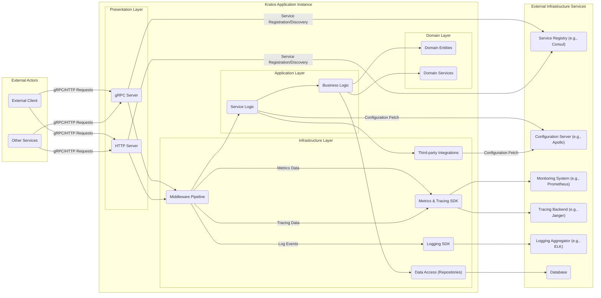
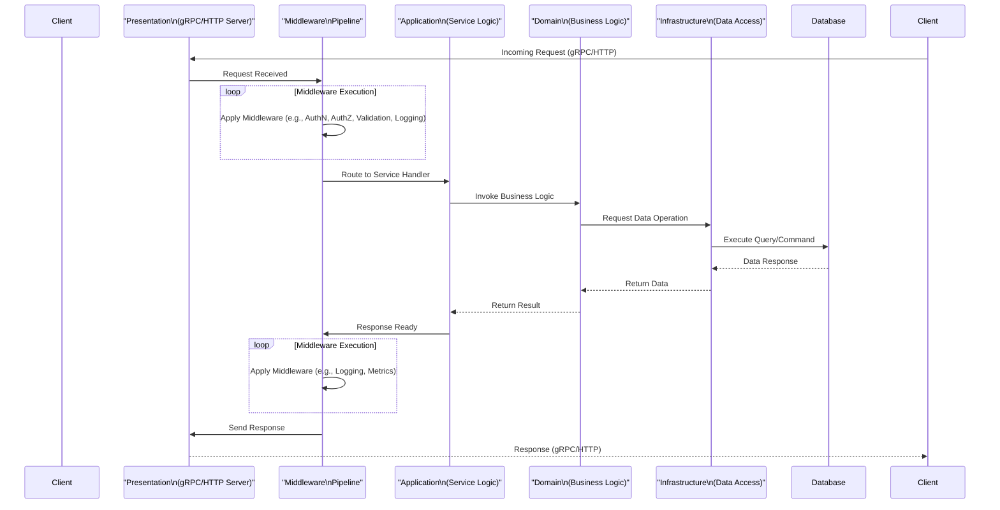

# Project Design Document: Kratos Microservices Framework - Enhanced

**Version:** 1.1
**Date:** October 26, 2023
**Author:** AI Software Architect

## 1. Introduction

This document provides an enhanced and more detailed architectural design of the Kratos microservices framework (as found at [https://github.com/go-kratos/kratos](https://github.com/go-kratos/kratos)). This revised document aims to provide a more robust foundation for subsequent threat modeling activities, offering a deeper understanding of the system's components, their interactions, data flow, and potential security vulnerabilities.

## 2. Goals and Objectives

The primary goal of Kratos is to provide a lightweight, yet comprehensive, framework for building cloud-native microservices in Go. Key objectives include:

* **Simplicity:** Offer an intuitive and easy-to-use API for developers.
* **Scalability:** Enable the development of highly scalable and resilient microservices that can handle varying loads.
* **Extensibility:** Provide a flexible and modular architecture that allows developers to integrate with various tools, libraries, and technologies.
* **Observability:** Facilitate comprehensive monitoring, distributed tracing, and structured logging of microservices for better insights and debugging.
* **Standardization:** Promote and enforce best practices for building robust and maintainable microservices in the Go ecosystem.
* **Cloud-Native Focus:** Provide features and abstractions that align with cloud-native principles and deployments.

## 3. High-Level Architecture

The Kratos framework employs a layered and modular architecture, promoting a clear separation of concerns and facilitating maintainability. The core components and their interactions can be visualized as follows:

* **External Actors:** Represent entities interacting with the Kratos application, including external clients and other microservices.
* **Presentation Layer:** Handles incoming requests via gRPC and HTTP, responsible for serialization, deserialization, and protocol-specific concerns.
* **Application Layer:** Contains the application's core logic, orchestrating business processes and interacting with the domain and infrastructure layers.
* **Domain Layer:** Represents the core business concepts and rules, independent of any specific framework or technology.
* **Infrastructure Layer:** Provides abstractions for interacting with external systems, databases, and cross-cutting concerns like middleware, metrics, tracing, and logging.
* **External Infrastructure Services:** External dependencies required by the Kratos application for service discovery, configuration, monitoring, tracing, logging, and data persistence.

## 4. Detailed Component Design

This section provides a more granular description of the key components within a typical Kratos application instance, highlighting their responsibilities and potential security considerations:

* **gRPC Server:**
    - **Responsibility:**  Handles incoming gRPC requests, manages request lifecycle, and dispatches requests to service implementations.
    - **Security Considerations:** Vulnerable to gRPC-specific attacks if not configured correctly (e.g., denial-of-service through resource exhaustion, insecure metadata handling). Requires secure TLS configuration.
* **HTTP Server:**
    - **Responsibility:** Handles incoming HTTP requests, supports various HTTP methods, and routes requests to appropriate handlers.
    - **Security Considerations:** Subject to standard web application vulnerabilities (e.g., cross-site scripting (XSS), cross-site request forgery (CSRF), injection attacks). Requires careful handling of headers and request parameters.
* **Middleware Pipeline:**
    - **Responsibility:** Executes a chain of interceptors for requests and responses, handling cross-cutting concerns like authentication, authorization, logging, tracing, metrics collection, request validation, and error handling.
    - **Security Considerations:** The order of middleware execution is crucial. Misconfigured middleware can introduce vulnerabilities or bypass security checks. Vulnerable middleware components can be exploited.
* **Service Logic:**
    - **Responsibility:** Implements the specific business logic for each defined service endpoint, orchestrating interactions between the business logic and data access layers.
    - **Security Considerations:**  Potential for business logic flaws that could be exploited. Requires careful input validation and secure data handling.
* **Business Logic:**
    - **Responsibility:** Contains the core application logic and business rules, independent of the presentation or infrastructure layers.
    - **Security Considerations:**  Vulnerable to design flaws that could lead to unauthorized data access or manipulation.
* **Domain Entities:**
    - **Responsibility:** Represent the core data structures and concepts of the application domain.
    - **Security Considerations:**  Properly defining and protecting domain entities is crucial for data integrity and confidentiality.
* **Domain Services:**
    - **Responsibility:** Encapsulate business logic that operates on domain entities, often involving multiple entities or complex operations.
    - **Security Considerations:**  Requires careful authorization checks to ensure only authorized operations are performed on domain entities.
* **Data Access (Repositories):**
    - **Responsibility:** Provides an abstraction layer for interacting with data sources (databases, caches, etc.), encapsulating data access logic and preventing direct database access from other layers.
    - **Security Considerations:**  Vulnerable to injection attacks if not implemented securely (e.g., SQL injection). Requires secure connection management and proper handling of database credentials.
* **Third-party Integrations:**
    - **Responsibility:** Handles interactions with external services and APIs.
    - **Security Considerations:**  Requires secure authentication and authorization mechanisms for external services. Sensitive data exchanged with third-party services must be protected. Vulnerabilities in third-party libraries can be a risk.
* **Metrics & Tracing SDK:**
    - **Responsibility:** Instruments the application to collect performance metrics and distributed tracing information.
    - **Security Considerations:**  Ensure sensitive data is not inadvertently included in metrics or traces. Secure communication with monitoring and tracing backends is essential.
* **Logging SDK:**
    - **Responsibility:**  Provides a mechanism for logging application events and errors.
    - **Security Considerations:**  Avoid logging sensitive information. Secure storage and access control for log data are crucial.
* **Service Discovery Client:**
    - **Responsibility:** Interacts with the service registry to register the application instance and discover other available services.
    - **Security Considerations:**  Secure communication with the service registry is vital to prevent man-in-the-middle attacks and unauthorized service registration.
* **Configuration Client:**
    - **Responsibility:** Fetches configuration parameters from the configuration server.
    - **Security Considerations:**  Secure retrieval and storage of configuration data, especially sensitive information like API keys and database credentials.
* **Database:**
    - **Responsibility:**  Persists application data.
    - **Security Considerations:**  Requires strong authentication and authorization, encryption at rest and in transit, and regular security patching.

## 5. Data Flow

A more detailed request flow within a Kratos application instance can be described as follows, highlighting the data transformations and potential security checkpoints:

* **Client initiates a request:** An external actor sends a request to the Kratos application via gRPC or HTTP.
* **Presentation Layer receives the request:** The gRPC or HTTP server receives the incoming request and handles protocol-specific aspects.
* **Middleware Pipeline processing:** The request passes through the configured middleware pipeline, where various security checks and transformations can occur (e.g., authentication, authorization, input validation, logging).
* **Request routing:** The appropriate service handler in the Application Layer is determined based on the request.
* **Application Layer logic:** The Service Logic orchestrates the execution of the Business Logic in the Domain Layer.
* **Domain Layer processing:** The Business Logic performs the core application logic, potentially interacting with Domain Entities and Services.
* **Infrastructure Layer interaction:** The Domain Layer interacts with the Infrastructure Layer (specifically Repositories) to perform data access operations.
* **Database interaction:** The Data Access Layer executes queries or commands against the database.
* **Response flow:** The data flows back through the layers, with middleware potentially processing the response before it's sent back to the client.

## 6. Security Considerations (For Threat Modeling) - Enhanced

This section provides a more detailed breakdown of security considerations, categorized for clarity during threat modeling:

* **Authentication and Authorization:**
    - **Threats:** Brute-force attacks, credential stuffing, session hijacking, privilege escalation, insecure API keys.
    - **Mitigations:** Strong password policies, multi-factor authentication (MFA), secure session management, role-based access control (RBAC), OAuth 2.0 implementation, regular key rotation, secure storage of API keys.
* **Input Validation:**
    - **Threats:** Injection attacks (SQL, OS command, LDAP), cross-site scripting (XSS), XML External Entity (XXE) attacks.
    - **Mitigations:**  Strict input validation on all data entry points (client-side and server-side), parameterized queries, output encoding, using secure parsing libraries, implementing allow-lists for acceptable input.
* **Data Protection:**
    - **Threats:** Data breaches, data leaks, unauthorized access to sensitive data, insecure data storage.
    - **Mitigations:** Encryption at rest (database encryption, file system encryption), encryption in transit (TLS/HTTPS), data masking and anonymization, access control lists (ACLs), regular security audits.
* **API Security:**
    - **Threats:** API abuse, denial-of-service (DoS) attacks, man-in-the-middle (MITM) attacks, insecure API design.
    - **Mitigations:** Rate limiting, API authentication and authorization, input validation, secure coding practices, using HTTPS, implementing API gateways with security features, following secure API design principles (e.g., OWASP API Security Top 10).
* **Dependency Management:**
    - **Threats:** Exploitation of known vulnerabilities in third-party libraries and dependencies.
    - **Mitigations:** Regularly scanning dependencies for vulnerabilities using tools like OWASP Dependency-Check or Snyk, keeping dependencies up-to-date with security patches, using software composition analysis (SCA) tools.
* **Logging and Monitoring:**
    - **Threats:** Exposure of sensitive information in logs, insufficient logging for security incident analysis, unauthorized access to logs.
    - **Mitigations:**  Avoiding logging sensitive data, implementing secure logging practices, using structured logging, centralizing logs, implementing access controls for log data, setting up alerts for suspicious activity.
* **Service Discovery Security:**
    - **Threats:** Rogue service registration, eavesdropping on service discovery communication, manipulation of service discovery data.
    - **Mitigations:**  Mutual TLS (mTLS) for communication with the service registry, authentication and authorization for service registration, secure access control to the service registry.
* **Configuration Management Security:**
    - **Threats:** Exposure of sensitive configuration data (e.g., credentials), unauthorized modification of configuration.
    - **Mitigations:** Encrypting sensitive configuration data at rest and in transit, implementing access controls for configuration management systems, versioning configuration changes.
* **Secrets Management:**
    - **Threats:** Hardcoded secrets, secrets stored in version control, unauthorized access to secrets.
    - **Mitigations:** Using dedicated secrets management tools (e.g., HashiCorp Vault, AWS Secrets Manager), avoiding hardcoding secrets, encrypting secrets at rest and in transit, implementing access controls for secrets.
* **Communication Security:**
    - **Threats:** Man-in-the-middle (MITM) attacks, eavesdropping on inter-service communication.
    - **Mitigations:** Mutual TLS (mTLS) for inter-service communication, using secure communication protocols (e.g., gRPC over TLS).
* **Error Handling:**
    - **Threats:** Information leakage through verbose error messages, denial-of-service through excessive error generation.
    - **Mitigations:**  Returning generic error messages to clients, logging detailed error information securely, implementing circuit breakers to prevent cascading failures.

## 7. Deployment Considerations - Enhanced

Deploying Kratos applications securely in a cloud-native environment like Kubernetes requires careful consideration of the following:

* **Container Security:**
    - **Practices:** Using minimal and hardened base images, scanning container images for vulnerabilities before deployment, implementing resource limits and quotas, defining security contexts (e.g., non-root users, read-only file systems).
* **Orchestration Security (Kubernetes):**
    - **Practices:** Enabling RBAC for cluster access control, using network policies to restrict inter-pod communication, securely configuring the Kubernetes API server, encrypting secrets at rest in etcd, regularly rotating Kubernetes certificates.
* **Network Security:**
    - **Practices:** Implementing network segmentation using namespaces and network policies, using ingress controllers with security features (e.g., Web Application Firewall (WAF), TLS termination), securing service mesh components (if used).
* **Infrastructure Security:**
    - **Practices:** Following cloud provider security best practices, securely managing access to cloud resources, implementing infrastructure-as-code (IaC) for consistent and secure deployments, regularly patching underlying infrastructure.
* **Secrets Management in Kubernetes:**
    - **Practices:** Using Kubernetes Secrets (encrypted at rest), integrating with external secrets management providers (e.g., HashiCorp Vault), using tools like Sealed Secrets for GitOps workflows.

## 8. Future Considerations

Potential future enhancements and considerations for Kratos include:

* **Enhanced Security Features:**  Deeper integration with security scanning tools, built-in support for more authentication and authorization mechanisms, improved protection against common web application vulnerabilities.
* **Improved Observability:** More granular metrics and tracing capabilities, integration with more observability platforms, standardized dashboards and alerts.
* **Advanced Traffic Management:**  Seamless integration with service mesh technologies like Istio or Linkerd for advanced routing, traffic shaping, and security policies.
* **Support for More Protocols:**  Expanding beyond gRPC and HTTP to support other communication protocols as needed.
* **Simplified Security Configuration:**  Providing more intuitive and secure default configurations and easier ways to configure security features.

This enhanced document provides a more detailed and comprehensive overview of the Kratos microservices framework's architecture, components, data flow, and security considerations. It serves as a more robust foundation for identifying potential threats and designing appropriate security mitigations during threat modeling activities.