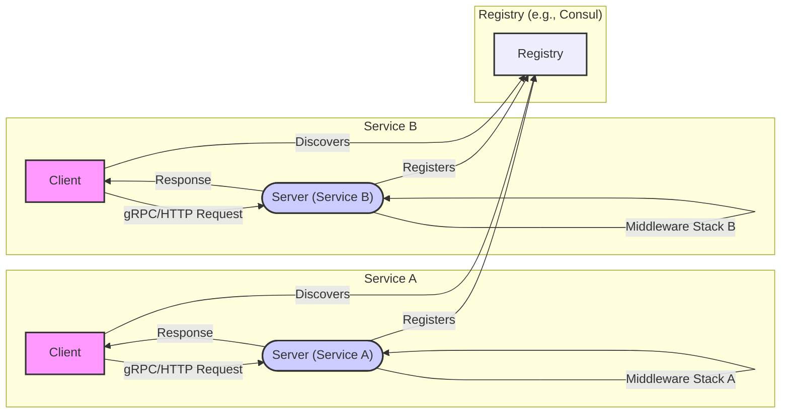

## Project Design Document: Go-Kratos Microservice Framework (Improved)

**1. Introduction**

This document provides an enhanced architectural design of the Go-Kratos microservice framework (https://github.com/go-kratos/kratos). This detailed design serves as a critical foundation for subsequent threat modeling activities, enabling a thorough understanding of the system's components, their interactions, and potential security vulnerabilities. The document is crafted to be clear, concise, and readily understandable by a diverse audience, including technical and non-technical stakeholders involved in the threat modeling process. Kratos's emphasis on convention over configuration and its provision of essential microservice building blocks make it a compelling subject for security analysis.

**2. Goals**

*   Deliver a comprehensive and refined overview of the Kratos framework's architecture.
*   Clearly identify key components and their specific responsibilities within the framework.
*   Precisely describe the interactions and data flow between these components, including the role of middleware.
*   Highlight potential areas of security concern with greater detail, providing specific examples for future threat modeling.
*   Serve as a definitive reference point for security assessments, vulnerability analysis, and the development of mitigation strategies.

**3. Scope**

This document encompasses the core architectural elements of the Kratos framework, focusing on aspects relevant to security. This includes:

*   Service definition and registration mechanisms.
*   Client-server communication protocols (gRPC and HTTP) and their implementations.
*   The role and implementation of Middleware and Interceptors in request processing.
*   Configuration management strategies and potential security implications.
*   Service discovery mechanisms and their security considerations.
*   Observability features (Tracing and Metrics) and their potential for security monitoring and vulnerabilities.
*   Error handling patterns and their impact on security.

This document explicitly excludes:

*   Specific business logic implemented within applications built using the Kratos framework.
*   In-depth implementation details of third-party libraries utilized by Kratos.
*   Specific deployment environments or underlying infrastructure configurations, although their general security implications are discussed.

**4. Target Audience**

*   Security engineers and architects tasked with performing threat modeling and security assessments.
*   Software developers building and maintaining microservices using the Kratos framework.
*   DevOps and operations teams responsible for deploying, managing, and monitoring Kratos-based services.

**5. High-Level Overview**

Kratos is a lightweight yet powerful Go framework specifically designed for building robust and scalable microservices. It promotes best practices through its opinionated structure and provides essential tools and libraries to streamline the development of distributed applications. Key features include built-in support for service discovery, efficient RPC communication (both gRPC and HTTP), a flexible middleware system, comprehensive observability features, and a focus on developer productivity. Its modular design allows developers to choose the components that best suit their needs.

**6. Architectural Design**

The Kratos framework employs a layered architecture, promoting modularity, maintainability, and a clear separation of concerns. The core components work together to facilitate the development and operation of microservices.

*   **Server:** The entry point for incoming requests, responsible for exposing service endpoints.
    *   **gRPC Server:** Handles requests using the gRPC protocol.
    *   **HTTP Server:** Handles requests using the HTTP protocol.
    *   Manages request routing and dispatching to appropriate handlers.
    *   Integrates with middleware for request processing.
*   **Client:** Used by services to make requests to other services.
    *   **gRPC Client:** Facilitates communication with gRPC servers.
    *   **HTTP Client:** Facilitates communication with HTTP servers.
    *   Handles service discovery to locate target service instances.
    *   Integrates with client-side middleware.
*   **Registry:** A central repository for service discovery, enabling services to locate and communicate with each other.
    *   Supports various implementations like Consul, Etcd, and Nacos.
    *   Provides APIs for service registration, deregistration, and discovery.
    *   May include health check mechanisms.
*   **Transport:**  Handles the underlying network communication protocols.
    *   **gRPC Transport:** Implements the gRPC protocol.
    *   **HTTP Transport:** Implements the HTTP protocol.
    *   Manages connection establishment and data serialization/deserialization.
*   **Middleware/Interceptor:**  A powerful mechanism for intercepting and processing requests and responses.
    *   Allows for implementing cross-cutting concerns like authentication, authorization, logging, tracing, and metrics collection.
    *   Executed in a defined order, forming a processing pipeline.
    *   Exists on both the server-side and client-side.
*   **Config:** Manages application configuration parameters.
    *   Supports loading configuration from various sources (files, environment variables, remote sources).
    *   Provides a unified interface for accessing configuration values.
    *   May support dynamic configuration updates.
*   **Metrics:** Collects and exposes service performance and resource utilization data.
    *   Integrates with metrics collection systems like Prometheus.
    *   Provides insights into service health and performance.
*   **Tracer:** Implements distributed tracing to track requests across multiple services.
    *   Assigns unique IDs to requests for end-to-end tracking.
    *   Integrates with tracing backends like Jaeger and Zipkin.
*   **Logger:** Provides a standardized interface for logging events and errors.
    *   Supports different logging levels and output formats.

**7. Component Interaction and Data Flow**

**Detailed Data Flow for a Typical Inter-Service Request:**

1. A **Client** (AC) within Service A needs to communicate with Service B.
2. The **Client** (AC) queries the **Registry** (REG) to discover the network address of an available instance of Service B.
3. The **Registry** (REG) returns the address(es) of available Service B **Server** (BMS) instances.
4. The **Client** (AC) establishes a connection with a Service B **Server** (BMS) instance using either gRPC or HTTP.
5. The **Client** (AC) sends a request to the Service B **Server** (BMS).
6. The request passes through a **Middleware Stack B** on the Service B **Server** (BMS). This stack can perform actions like authentication, authorization, logging, and tracing before the request reaches the service logic.
7. The Service B **Server** (BMS) processes the request.
8. The response from the service logic passes back through the **Middleware Stack B** on the Service B **Server** (BMS). This allows for actions like adding response headers or logging the response.
9. The Service B **Server** (BMS) sends the response back to the **Client** (AC) in Service A.
10. The response might pass through a **Middleware Stack A** on the Service A **Client** (AC) for processing on the client-side.

**8. Key Components and Responsibilities (Detailed)**

*   **Server:**
    *   **Responsibility:**  Receives and processes incoming requests, exposing service functionalities.
    *   **Details:** Listens on configured ports, routes requests based on defined endpoints, manages the request lifecycle, generates responses, integrates with server-side middleware for pre- and post-processing of requests. Handles protocol-specific logic for gRPC and HTTP.

*   **Client:**
    *   **Responsibility:** Initiates requests to other services, abstracting away the complexities of network communication.
    *   **Details:** Performs service discovery to locate target instances, establishes connections, serializes requests, sends them over the network, receives and deserializes responses, integrates with client-side middleware for actions like adding headers or handling errors.

*   **Registry:**
    *   **Responsibility:** Maintains a dynamic inventory of available services and their network locations, enabling service discovery.
    *   **Details:** Provides APIs for services to register their presence, deregister when unavailable, and for clients to query for service endpoints. May implement health checks to automatically remove unhealthy instances from the registry. Security considerations include access control to prevent unauthorized registration or modification of service information.

*   **Transport (gRPC & HTTP):**
    *   **Responsibility:** Handles the low-level details of network communication according to the chosen protocol.
    *   **Details:** Manages connection establishment, maintenance, and closure. Handles the serialization and deserialization of request and response payloads. Provides mechanisms for secure communication, such as TLS configuration. Security considerations include ensuring proper TLS configuration and preventing protocol-level vulnerabilities.

*   **Middleware/Interceptor:**
    *   **Responsibility:** Enables the implementation of cross-cutting concerns in a modular and reusable way.
    *   **Details:** Intercepts requests and responses at various stages of processing. Can be used for authentication (verifying the identity of the requester), authorization (determining if the requester has permission to access the resource), logging (recording request and response details), tracing (adding request IDs for distributed tracing), metrics collection (gathering performance data), input validation (ensuring data conforms to expected formats), and error handling. The order of middleware execution is crucial and can impact security.

*   **Config:**
    *   **Responsibility:** Provides a centralized and consistent way to manage application configuration.
    *   **Details:** Loads configuration from various sources, allowing for environment-specific settings. Provides an API for accessing configuration values. May support features like hot reloading of configuration changes. Security considerations include protecting sensitive configuration data (e.g., API keys, database credentials) and preventing unauthorized modification of configuration.

*   **Metrics:**
    *   **Responsibility:** Collects and exposes runtime metrics for monitoring and performance analysis.
    *   **Details:** Gathers data on request latency, error rates, resource utilization, and other relevant metrics. Exposes metrics in a format suitable for consumption by monitoring systems. Security considerations include controlling access to metrics endpoints to prevent information leakage.

*   **Tracer:**
    *   **Responsibility:** Implements distributed tracing to track requests as they propagate through multiple services.
    *   **Details:** Assigns unique identifiers to requests, allowing for the reconstruction of request paths and the identification of performance bottlenecks. Integrates with tracing backends for visualization and analysis. Security considerations include ensuring that tracing data does not inadvertently expose sensitive information.

*   **Logger:**
    *   **Responsibility:** Provides a standardized way to record events and errors within the application.
    *   **Details:** Supports different logging levels (e.g., debug, info, warning, error) and output formats. Security considerations include ensuring that sensitive information is not logged inappropriately.

**9. Security Considerations (Detailed for Threat Modeling)**

This section expands on potential security concerns, providing more specific examples for threat modeling.

*   **Authentication and Authorization:**
    *   **Threats:**  Bypass authentication mechanisms, brute-force attacks on login credentials, insecure storage of credentials, session hijacking, lack of proper authorization checks leading to unauthorized access to resources or functionalities.
    *   **Examples:** Weak password policies, use of default credentials, vulnerabilities in JWT token verification, missing authorization checks on API endpoints.

*   **Communication Security:**
    *   **Threats:** Man-in-the-middle attacks intercepting sensitive data in transit, eavesdropping on communication between services, data tampering.
    *   **Examples:** Lack of TLS encryption for inter-service communication, use of outdated or weak TLS versions, improper certificate validation.

*   **Input Validation:**
    *   **Threats:** Injection attacks (SQL injection, command injection, cross-site scripting), buffer overflows, denial of service through malformed input.
    *   **Examples:** Failure to sanitize user-provided data before using it in database queries, accepting excessively long input strings without validation.

*   **Service Discovery Security:**
    *   **Threats:**  Malicious services registering themselves to intercept traffic, unauthorized modification of service registration information, denial of service attacks against the registry.
    *   **Examples:** Lack of authentication for service registration, vulnerabilities in the registry implementation allowing for data manipulation.

*   **Dependency Management:**
    *   **Threats:** Exploitation of known vulnerabilities in third-party libraries used by Kratos or applications built on it.
    *   **Examples:** Using outdated versions of libraries with known security flaws, insecurely fetching dependencies.

*   **Secrets Management:**
    *   **Threats:** Exposure of sensitive credentials in configuration files, environment variables, or logs; unauthorized access to secrets.
    *   **Examples:** Storing database passwords in plain text in configuration files, hardcoding API keys in the codebase.

*   **Rate Limiting and Denial of Service:**
    *   **Threats:**  Overwhelming services with excessive requests, leading to service unavailability.
    *   **Examples:** Lack of rate limiting on public API endpoints, insufficient resource allocation to handle traffic spikes.

*   **Observability Security:**
    *   **Threats:** Exposure of sensitive information in logs or tracing data, unauthorized access to metrics endpoints revealing system internals.
    *   **Examples:** Logging personally identifiable information (PII) in debug logs, publicly accessible metrics dashboards.

*   **Middleware Security:**
    *   **Threats:** Security vulnerabilities introduced by custom middleware components, improper ordering of middleware leading to bypasses of security checks.
    *   **Examples:** A poorly written authentication middleware with vulnerabilities, an authorization middleware executed before an authentication middleware.

**10. Deployment Considerations (Security Implications)**

Deployment choices introduce their own security considerations:

*   **Containerization (Docker):** Requires secure image building practices, vulnerability scanning of container images, and proper configuration of the container runtime environment to prevent container escapes.
*   **Orchestration (Kubernetes):** Introduces complexities related to Role-Based Access Control (RBAC) for managing access to Kubernetes resources, network policies to control traffic flow between pods, and secure secret management within the cluster.
*   **Cloud Environments (AWS, Azure, GCP):**  Leveraging cloud-specific security features (e.g., IAM roles, security groups, network firewalls) is crucial. Misconfiguration of cloud resources can lead to significant security vulnerabilities.

**11. Future Considerations**

*   Develop detailed sequence diagrams illustrating specific security-sensitive workflows (e.g., authentication flow, authorization decision flow).
*   Document specific security features or best practices recommended or enforced by the Kratos framework itself.
*   Create a comprehensive mapping of Kratos components to potential attack surfaces and associated threat vectors.
*   Include considerations for security auditing and penetration testing of Kratos-based applications.
*   Analyze the security implications of different registry implementations and their integration with Kratos.

**12. Conclusion**

This improved design document provides a more detailed and nuanced architectural overview of the Go-Kratos microservice framework, with a strong emphasis on security considerations relevant for threat modeling. By clearly outlining the components, their interactions, and potential vulnerabilities, this document serves as a valuable resource for security engineers, developers, and operations teams involved in building and securing applications using Kratos. The enhanced details and specific examples provided will facilitate a more thorough and effective threat modeling process.