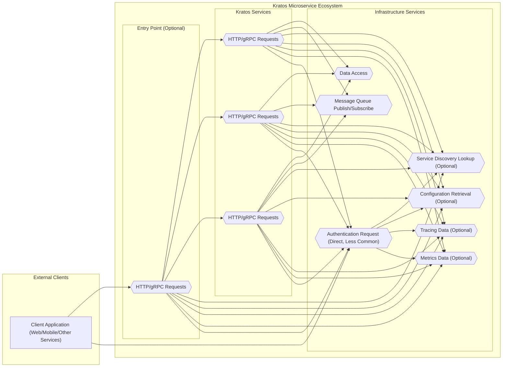

# Project Design Document: Kratos Microservice Framework (Improved)

**Project Name:** Kratos Microservice Framework Design Document for Threat Modeling

**Project Repository:** [https://github.com/go-kratos/kratos](https://github.com/go-kratos/kratos)

**Document Version:** 1.1
**Date:** 2023-10-27
**Author:** AI Software Architect

## 1. Introduction

This document provides an enhanced design overview of the Kratos microservice framework, specifically tailored for threat modeling activities. Building upon the previous version, this document offers a more granular description of architectural components, data flows, and security considerations. The goal remains to provide a clear and detailed understanding of the system's structure to facilitate effective threat identification and mitigation planning.

Kratos is a comprehensive Go-based microservice framework designed for building scalable, robust, and maintainable applications. It simplifies microservice development by offering features like gRPC and HTTP transports, robust middleware support, service discovery integration, distributed tracing, metrics collection, and flexible configuration management. This document will serve as the foundation for in-depth threat modeling exercises.

## 2. System Architecture Overview

Kratos applications typically adopt a microservice architecture. The framework encourages modularity and separation of concerns. The diagram below illustrates a more detailed high-level architecture of a Kratos-based application, including infrastructure service interactions.



## 3. Component Description (Enhanced)

This section provides a more detailed description of each component, emphasizing security aspects and potential vulnerabilities.

### 3.1. Client Application (Web/Mobile/Other Services)

* **Functionality:**  As before, represents external entities interacting with the Kratos ecosystem. Crucially, clients are the origin of all external requests and user interactions.
* **Security Considerations (Enhanced):**
    * **Client-Side Vulnerabilities:**  Exploitable vulnerabilities like XSS, CSRF (in web apps), insecure data storage, and insecure communication in client applications can directly impact the security of the Kratos backend.
    * **Insecure Client Implementation:** Poorly implemented clients might not properly handle authentication tokens, session management, or data validation, leading to security weaknesses.
    * **Phishing & Social Engineering:** Clients are often the target of phishing attacks to steal credentials or trick users into performing malicious actions.
    * **Device Security:** Security of the client device itself (e.g., malware on a user's phone) can compromise the application's security.

### 3.2. API Gateway (Optional, e.g., Kong, Envoy)

* **Functionality:**  Acts as a reverse proxy and central point of control for external traffic.  It can provide advanced features beyond basic routing.
* **Security Considerations (Enhanced):**
    * **API Gateway Vulnerabilities:** Vulnerabilities in the API Gateway software itself (e.g., configuration flaws, software bugs) can expose the entire backend.
    * **Bypass Vulnerabilities:** Misconfigurations or vulnerabilities might allow attackers to bypass the API Gateway and directly access backend services.
    * **Authentication & Authorization Weaknesses:** Improperly configured or implemented authentication and authorization at the gateway can lead to unauthorized access.
    * **Rate Limiting & DoS Configuration Errors:**  Insufficient or misconfigured rate limiting can fail to protect backend services from overload.
    * **TLS/SSL Configuration Issues:** Weak TLS configurations or certificate management issues can compromise confidentiality and integrity of communication.
    * **Injection Attacks (Gateway Level):**  API Gateways might be vulnerable to injection attacks if they process or transform requests without proper sanitization.

### 3.3. Kratos Services (Service 1, Service 2, Service N)

* **Functionality:** Core business logic components. Kratos provides building blocks for creating these services, including:
    * **Handlers:**  Implement the actual business logic for handling requests.
    * **Interceptors:**  Middleware for request/response processing (authentication, authorization, logging, tracing, etc.).
    * **Transports:** Support for gRPC and HTTP, defining how services communicate.
* **Security Considerations (Enhanced):**
    * **Handler Logic Vulnerabilities:**  Vulnerabilities in the business logic within handlers (e.g., business logic flaws, race conditions, insecure deserialization).
    * **Interceptor Bypass:**  Incorrectly configured interceptors or vulnerabilities in interceptor logic might allow attackers to bypass security checks.
    * **Insecure Dependencies:** Using vulnerable libraries or dependencies within services.
    * **Exposure of Internal APIs:**  Accidental exposure of internal service APIs without proper authentication or authorization.
    * **Resource Exhaustion:** Services might be vulnerable to resource exhaustion attacks if not properly designed to handle high load or malicious requests.
    * **Data Validation Failures:** Insufficient input validation in handlers can lead to injection attacks and data corruption.
    * **Error Handling Information Disclosure:**  Verbose error messages that leak sensitive information.
    * **Side-Channel Attacks:**  In certain scenarios, services might be vulnerable to side-channel attacks depending on the implemented algorithms and infrastructure.

### 3.4. Service Registry (e.g., Consul, etcd, Nacos)

* **Functionality:**  Centralized repository of service instance locations, enabling dynamic service discovery.
* **Security Considerations (Enhanced):**
    * **Registry Data Manipulation:** Unauthorized modification of service registry data can disrupt service communication, redirect traffic to malicious services, or cause denial of service.
    * **Information Disclosure (Registry Data):**  Exposure of service registry data can reveal system topology, service endpoints, and potentially sensitive metadata.
    * **Registry Availability:**  Denial of service attacks against the service registry can cripple the entire microservice ecosystem.
    * **Authentication & Authorization (Registry Access):** Weak or missing authentication and authorization for accessing and modifying the registry.
    * **Secure Communication (Registry Clients & Nodes):** Unencrypted communication between services and the registry, or between registry nodes, can expose sensitive information.

### 3.5. Configuration Server (e.g., Apollo, Nacos Config)

* **Functionality:**  Provides centralized and dynamic configuration management.
* **Security Considerations (Enhanced):**
    * **Configuration Data Breach:**  Unauthorized access to the configuration server can expose sensitive configuration data, including credentials, API keys, and internal settings.
    * **Malicious Configuration Injection:**  Attackers injecting malicious configurations can compromise services, alter their behavior, or gain unauthorized access.
    * **Configuration Versioning & Rollback Issues:**  Lack of proper versioning or secure rollback mechanisms can lead to instability or security breaches during configuration updates.
    * **Access Control Weaknesses (Configuration Management):**  Insufficient access control to configuration data and management interfaces.
    * **Unencrypted Configuration Storage/Transmission:** Storing or transmitting configurations without encryption exposes sensitive data.

### 3.6. Tracing System (e.g., Jaeger, Zipkin)

* **Functionality:**  Collects and visualizes distributed traces for monitoring and debugging.
* **Security Considerations (Enhanced):**
    * **Sensitive Data in Traces:**  Traces can inadvertently capture sensitive data like user IDs, request parameters, and internal system details.
    * **Access Control (Tracing Data):**  Unauthorized access to tracing data can reveal sensitive information about system behavior and user activity.
    * **Data Integrity (Tracing Data Tampering):**  Tampering with tracing data could mask malicious activity or provide misleading information for debugging and security analysis.
    * **Performance Impact (Tracing Overhead):**  Excessive tracing can impact system performance and potentially create denial of service conditions.

### 3.7. Metrics System (e.g., Prometheus)

* **Functionality:**  Collects and aggregates metrics for performance monitoring and alerting.
* **Security Considerations (Enhanced):**
    * **Metrics Data Exposure:**  Metrics data, while seemingly innocuous, can reveal usage patterns, performance bottlenecks, and potentially sensitive operational details.
    * **Access Control (Metrics Data):**  Unauthorized access to metrics dashboards and APIs can provide attackers with valuable reconnaissance information.
    * **Metrics Injection/Manipulation:**  Attackers might attempt to inject false metrics to mislead monitoring systems or mask malicious activity.
    * **Denial of Service (Metrics Collection Overload):**  Excessive metrics collection or scraping can overload services or the metrics system itself.

### 3.8. Message Queue (e.g., Kafka, RabbitMQ)

* **Functionality:** Enables asynchronous communication between services.
* **Security Considerations (Enhanced):**
    * **Message Interception/Eavesdropping:**  Unencrypted messages in transit can be intercepted and read by attackers.
    * **Message Tampering:**  Messages can be modified in transit, leading to data corruption or malicious actions.
    * **Unauthorized Message Access (Publish/Subscribe):**  Lack of proper authorization can allow unauthorized services or entities to publish or consume messages.
    * **Message Queue Availability:**  Denial of service attacks against the message queue can disrupt asynchronous communication and system functionality.
    * **Message Persistence Security:**  If messages are persisted, the security of the message storage becomes critical.

### 3.9. Data Storage (e.g., Databases, Caches)

* **Functionality:** Persistent data storage for services.
* **Security Considerations (Enhanced):**
    * **Data Breach (Database Compromise):**  Database breaches are a major security risk, leading to large-scale data exposure.
    * **SQL/NoSQL Injection:**  Vulnerabilities in data access logic can lead to injection attacks, allowing attackers to read, modify, or delete data.
    * **Insufficient Access Control (Database Level):**  Weak database access controls can allow unauthorized access to sensitive data.
    * **Data Backup Security:**  Insecure backups can be a target for attackers to gain access to historical data.
    * **Data Exfiltration:**  Attackers might attempt to exfiltrate data from databases after gaining unauthorized access.
    * **Data Integrity Issues:**  Data corruption or unauthorized modification can compromise data integrity.
    * **Cache Poisoning:**  In caches, vulnerabilities can lead to cache poisoning, serving stale or malicious data.

### 3.10. Authentication/Authorization Service (Optional, e.g., Keycloak, Auth0)

* **Functionality:**  Centralized service for handling authentication and authorization for the entire ecosystem.
* **Security Considerations (Enhanced):**
    * **Authentication Service Vulnerabilities:**  Vulnerabilities in the authentication service itself can compromise the entire system's security.
    * **Single Point of Failure (Security):**  The authentication service becomes a critical security component. Its failure or compromise has widespread impact.
    * **Token Management Issues:**  Insecure token generation, storage, or validation can lead to unauthorized access.
    * **Authorization Policy Bypass:**  Flaws in authorization policies or enforcement mechanisms can allow unauthorized actions.
    * **Account Takeover:**  Weaknesses in authentication mechanisms can lead to account takeover attacks.
    * **Identity Federation Issues:**  If integrated with external identity providers, vulnerabilities in federation mechanisms can be exploited.

## 4. Data Flow Diagram (Enhanced)

This enhanced data flow diagram provides a more detailed view, including infrastructure services and highlighting sensitive data types.

```mermaid
graph LR
    A["Client Application"] --> B["API Gateway"]{{"Request (e.g., User Credentials, PII, Business Data)"}}
    B --> C["Kratos Service 1"]{{"Request (e.g., User Credentials, PII, Business Data)"}}
    C --> D["Data Storage"]{{"Data Access (e.g., PII Retrieval/Storage, Business Data)"}}
    C --> E["Message Queue"]{{"Message (Potentially PII, Business Data)"}}
    C --> F["Service Registry"]{{"Service Registration/Lookup Data"}}
    C --> G["Configuration Server"]{{"Configuration Data (Potentially Credentials)"}}
    C --> H["Tracing System"]{{"Tracing Data (Potentially Sensitive Context)"}}
    C --> I["Metrics System"]{{"Metrics Data (Operational Info)"}}
    C --> J["Authentication/Authorization Service"]{{"Authz Request (User Context, Permissions)"}}
    J --> C{{"Authz Response (Permit/Deny)"}}
    C --> B{{"Response (Potentially PII, Business Data)"}}
    B --> A{{"Response (Potentially PII, Business Data)"}}

    style A fill:#f9f,stroke:#333,stroke-width:2px
    style B fill:#ccf,stroke:#333,stroke-width:2px
    style C fill:#ccf,stroke:#333,stroke-width:2px
    style D fill:#ffc,stroke:#333,stroke-width:2px
    style E fill:#ffc,stroke:#333,stroke-width:2px
    style F fill:#eee,stroke:#333,stroke-width:1px,stroke-dasharray: 5 5
    style G fill:#eee,stroke:#333,stroke-width:1px,stroke-dasharray: 5 5
    style H fill:#eee,stroke:#333,stroke-width:1px,stroke-dasharray: 5 5
    style I fill:#eee,stroke:#333,stroke-width:1px,stroke-dasharray: 5 5
    style J fill:#eee,stroke:#333,stroke-width:1px,stroke-dasharray: 5 5
```

**Enhanced Data Flow Description:**

This diagram expands on the previous version by explicitly showing interactions with infrastructure services and categorizing data types. It highlights the flow of:

* **User Credentials:** Authentication information passed from the client.
* **PII (Personally Identifiable Information):** Sensitive user data.
* **Business Data:** Core application data.
* **Configuration Data:** Service configurations, potentially including sensitive credentials.
* **Service Registration/Lookup Data:** Information exchanged with the service registry.
* **Tracing Data:** Distributed tracing information.
* **Metrics Data:** Performance and operational metrics.
* **Authorization Requests/Responses:** Communication with the optional Authentication/Authorization Service.

## 5. Security Considerations for Threat Modeling (Actionable)

This section provides a more actionable list of security considerations, framed as questions to guide threat modeling.

**5.1. Authentication and Authorization:**

* **Client Authentication:**
    * What authentication schemes are used for external clients? (OAuth 2.0, API Keys, Basic Auth, etc.)
    * How are credentials protected in transit and at rest (client-side)?
    * Are there multi-factor authentication options?
    * What are the password policies and complexity requirements?
    * How is account lockout handled after failed login attempts?
* **Service-to-Service Authentication:**
    * Is mutual TLS (mTLS) used for service-to-service communication?
    * Are JWTs used for service authentication and authorization? How are JWTs generated, signed, and verified?
    * How are service accounts and API keys managed and rotated?
* **Authorization Enforcement:**
    * Is Role-Based Access Control (RBAC) or Attribute-Based Access Control (ABAC) used?
    * Where is authorization enforced? (API Gateway, within services, or both?)
    * How are authorization policies defined and managed?
    * Are there mechanisms to prevent privilege escalation?
* **Session Management:**
    * How are user sessions managed? (Cookies, tokens, etc.)
    * What are the session timeout policies?
    * How are sessions invalidated (logout, inactivity)?
    * Are sessions protected against hijacking and fixation attacks?

**5.2. Input Validation and Output Encoding:**

* **Input Validation:**
    * Where is input validation performed? (Client-side, API Gateway, Services?)
    * What types of input validation are implemented? (Data type, format, range, length, whitelisting, blacklisting?)
    * Are all input sources validated (HTTP headers, query parameters, request bodies, messages from queues)?
    * Are common injection attack vectors (SQL, command, XSS, etc.) considered during validation?
* **Output Encoding:**
    * Where is output encoding applied? (Services, API Gateway, Client-side?)
    * What encoding schemes are used to prevent XSS? (HTML encoding, URL encoding, JavaScript encoding?)
    * Is output encoding context-aware?

**5.3. Data Security:**

* **Encryption at Rest:**
    * Which data stores contain sensitive data? (Databases, caches, configuration server, message queues?)
    * Is data at rest encrypted in these stores? What encryption algorithms and key management are used?
    * Are backups also encrypted at rest?
* **Encryption in Transit:**
    * Is TLS/HTTPS enforced for all external communication (client to API Gateway, API Gateway to services)?
    * Is gRPC communication secured with TLS?
    * Is service-to-service communication encrypted (mTLS)?
    * Are connections to databases and message queues encrypted?
* **Data Masking/Redaction:**
    * Where is data masking or redaction implemented? (Logs, traces, metrics, error messages?)
    * What sensitive data is masked or redacted?
    * Are masking/redaction techniques effective and consistently applied?
* **Data Minimization & Retention:**
    * Is data minimization practiced? Is only necessary data collected and stored?
    * What are the data retention policies? Are data retention policies compliant with regulations (GDPR, etc.)?
    * How is data securely purged or anonymized when no longer needed?

**5.4. Logging and Auditing:**

* **Logging Scope:**
    * What security-relevant events are logged? (Authentication attempts, authorization decisions, access to sensitive data, configuration changes, errors, security exceptions?)
    * Are logs comprehensive enough for security monitoring and incident response?
    * Are logs timestamped and correlated across services?
* **Audit Trail Security:**
    * Is there a secure audit trail that cannot be tampered with by unauthorized users?
    * How is the integrity of audit logs ensured?
    * Who has access to audit logs?
* **Log Management:**
    * Where are logs stored? Are logs stored securely?
    * What log retention policies are in place?
    * Are logs monitored for security alerts and anomalies?

**5.5. Rate Limiting and DDoS Protection:**

* **Rate Limiting Implementation:**
    * Where is rate limiting implemented? (API Gateway, Services?)
    * What rate limiting algorithms are used? (Token bucket, leaky bucket, fixed window?)
    * Are rate limits appropriately configured to protect against abuse and DoS?
    * Are different rate limits applied based on user roles or API endpoints?
* **DDoS Mitigation Strategies:**
    * What DDoS mitigation strategies are in place? (WAF, CDN, cloud provider DDoS protection services?)
    * Are DDoS mitigation measures tested and regularly reviewed?

**5.6. Dependency Management:**

* **Vulnerability Scanning Process:**
    * Is there a process for scanning dependencies for known vulnerabilities?
    * How frequently are dependency scans performed?
    * What tools are used for dependency scanning?
* **Dependency Update Process:**
    * Is there a process for updating dependencies to patch security vulnerabilities?
    * How quickly are security patches applied?
    * Are dependency updates tested before deployment?

**5.7. Configuration Management Security:**

* **Secure Configuration Storage:**
    * How is configuration data stored? Is it encrypted at rest?
    * Are secrets (credentials, API keys) stored securely (e.g., using vault, secrets management services)?
* **Access Control to Configuration:**
    * Who has access to read and modify configuration data?
    * Are access controls enforced for configuration management systems?
    * Is there an audit trail for configuration changes?
* **Configuration Injection Prevention:**
    * Are there mechanisms to prevent configuration injection attacks?
    * Is configuration data validated before being applied?

**5.8. Service Discovery Security:**

* **Service Registry Access Control:**
    * Who has access to register, deregister, and query services in the service registry?
    * Are access controls enforced for the service registry?
* **Secure Communication with Service Registry:**
    * Is communication between services and the service registry encrypted?
    * Is communication between service registry nodes encrypted?

**5.9. Message Queue Security:**

* **Message Security:**
    * Are messages encrypted in transit and at rest in the message queue?
    * What encryption algorithms are used for message encryption?
* **Message Queue Access Control:**
    * Who has permissions to publish and consume messages from specific queues/topics?
    * Are access controls enforced for the message queue system?

**5.10. Infrastructure Security:**

* **OS and Network Hardening:**
    * Are operating systems and networks hardened according to security best practices?
    * Are unnecessary ports and services disabled?
    * Is network segmentation implemented to isolate components?
* **Container Security (if applicable):**
    * Are container images scanned for vulnerabilities?
    * Are containers run with minimal privileges?
    * Is container orchestration platform (Kubernetes) secured?
    * Are network policies in place to restrict container communication?

## 6. Deployment Model Security Details

Expanding on deployment model considerations for security:

* **Cloud Deployment (e.g., AWS, GCP, Azure):**
    * **Shared Responsibility Model:** Understand the cloud provider's security responsibilities and the organization's responsibilities.
    * **Cloud Security Services:** Leverage cloud-native security services for identity and access management (IAM), key management (KMS), network security groups, web application firewalls (WAFs), security monitoring, and compliance.
    * **Compliance & Certifications:** Ensure cloud deployments meet relevant compliance standards (e.g., SOC 2, ISO 27001, HIPAA, PCI DSS) if required.
    * **Data Residency & Sovereignty:** Consider data residency requirements and choose cloud regions accordingly.
    * **Vendor Lock-in Security Implications:** Be aware of security implications of vendor lock-in and plan for potential migration scenarios.

* **On-Premise Deployment:**
    * **Full Security Responsibility:** Organization assumes full responsibility for all aspects of security, including physical security, infrastructure security, and application security.
    * **Security Expertise Required:** Requires in-house security expertise to design, implement, and maintain a secure on-premise environment.
    * **Capital Expenditure (CAPEX):** Significant upfront investment in hardware, software, and security infrastructure.
    * **Patch Management & Updates:**  Organization is responsible for timely patching and updates of all infrastructure components and software.
    * **Scalability & Resilience Challenges:**  Scaling and ensuring resilience can be more complex and costly compared to cloud deployments.

## 7. Technology Stack (Detailed)

Providing more detail on the technology stack for deeper threat analysis:

* **Programming Language:** Go
    * **Memory Safety:** Go's memory safety features reduce the risk of certain types of vulnerabilities (e.g., buffer overflows).
    * **Standard Library Security:** Leverage Go's standard library for secure coding practices.
    * **Dependency Management (Go Modules):** Use Go modules for managing dependencies and vulnerability scanning.
* **Transport Protocols:** gRPC, HTTP/2, HTTP/1.1
    * **gRPC Security:** Supports TLS for encryption and authentication. Consider mutual TLS (mTLS) for service-to-service security.
    * **HTTP/2 & HTTP/1.1 Security:**  Enforce HTTPS (TLS) for all HTTP communication. Be aware of HTTP-specific vulnerabilities (e.g., HTTP request smuggling).
* **Service Discovery:** Consul, etcd, Nacos (pluggable)
    * **Security Features:** Review the security features of the chosen service registry (access control, encryption, authentication).
    * **Configuration:** Securely configure the service registry and its clients.
* **Configuration Management:** Apollo, Nacos Config (pluggable)
    * **Security Features:**  Utilize security features of the chosen configuration server (access control, encryption, audit logging).
    * **Secret Management Integration:** Integrate with secret management solutions for storing sensitive configuration data.
* **Tracing:** Jaeger, Zipkin (pluggable, OpenTelemetry support)
    * **Data Privacy Controls:** Configure tracing systems to minimize capture of sensitive data and implement data masking if needed.
    * **Access Control:** Restrict access to tracing dashboards and APIs.
* **Metrics:** Prometheus (pluggable, OpenTelemetry support)
    * **Access Control:** Restrict access to Prometheus dashboards and APIs.
    * **Data Sensitivity:** Be mindful of potential information leakage through metrics data.
* **Message Queues:** Kafka, RabbitMQ (pluggable)
    * **Security Features:**  Utilize security features of the chosen message queue (encryption, access control, authentication).
    * **Protocol Security:**  Ensure secure communication protocols are used for message queue clients.
* **Data Storage:** Databases (PostgreSQL, MySQL, MongoDB, etc.), Caches (Redis, Memcached) - depends on service implementation.
    * **Database-Specific Security:** Follow security best practices for the chosen database (hardening, access control, encryption, patching).
    * **Cache Security:** Secure cache instances and consider encryption for sensitive data in caches.
* **Middleware (Kratos Interceptors):** Customizable middleware for security functions.
    * **Custom Security Logic:** Implement custom interceptors for authentication, authorization, input validation, and other security controls.
    * **Interceptor Security:** Ensure interceptor logic is secure and does not introduce new vulnerabilities.

## 8. Threat Modeling Methodology Suggestion

For effective threat modeling of a Kratos-based application, consider using a structured methodology like **STRIDE** (Spoofing, Tampering, Repudiation, Information Disclosure, Denial of Service, Elevation of Privilege).

**Applying STRIDE to Kratos Components:**

For each component described in this document (API Gateway, Kratos Services, Service Registry, etc.), systematically analyze potential threats using the STRIDE categories:

* **Spoofing:** Can an attacker impersonate this component or a user interacting with it?
* **Tampering:** Can data associated with this component be tampered with (data in transit, data at rest, configuration data)?
* **Repudiation:** Can a user or service deny performing an action related to this component?
* **Information Disclosure:** Can this component leak sensitive information (configuration, data, operational details)?
* **Denial of Service:** Can this component be targeted for denial of service attacks?
* **Elevation of Privilege:** Can an attacker gain elevated privileges through vulnerabilities in this component?

By applying STRIDE to each component and data flow, you can systematically identify potential threats and prioritize security mitigations for your Kratos-based application.

## 9. Conclusion (Improved)

This enhanced design document provides a more detailed and actionable foundation for threat modeling Kratos microservice applications. By understanding the architecture, component functionalities, data flows, and security considerations outlined here, security teams can conduct more comprehensive threat modeling exercises. The actionable security questions and the suggested STRIDE methodology aim to facilitate a structured and thorough approach to identifying and mitigating potential security risks in Kratos-based systems.  Regularly reviewing and updating this document as the system evolves is crucial for maintaining a strong security posture.