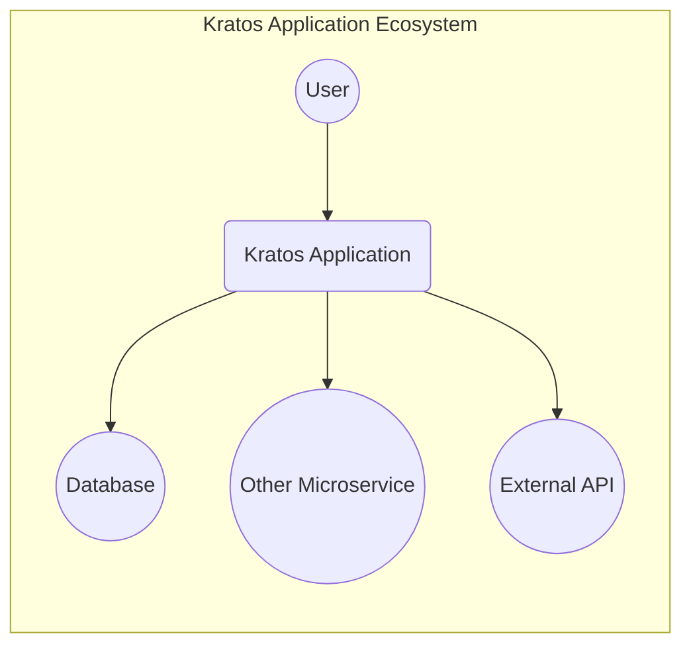
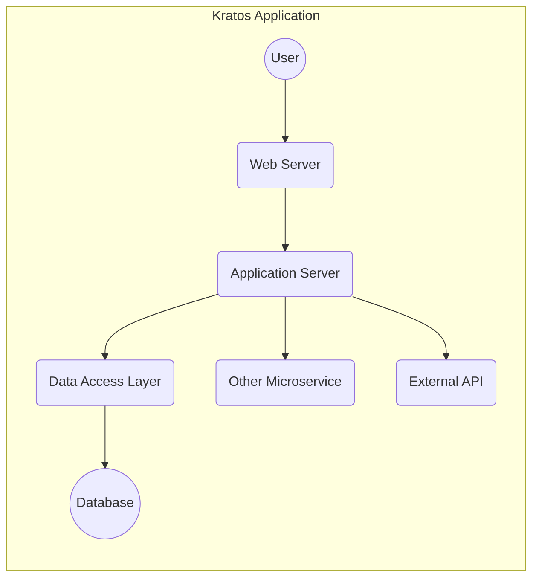
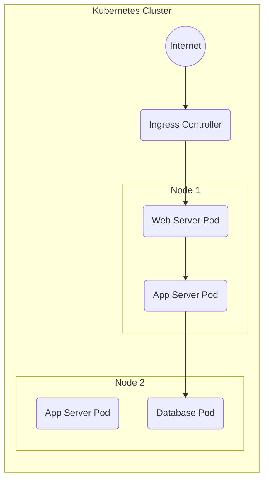
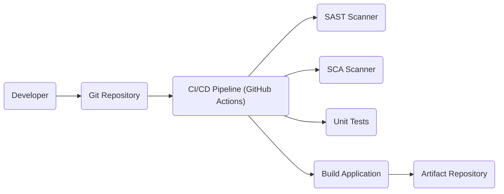

Okay, let's create a design document for the Kratos project, focusing on aspects relevant for threat modeling.

# BUSINESS POSTURE

Kratos is a Go framework for building cloud-native microservices.  It aims to simplify the development of robust, scalable, and maintainable applications.  Given its open-source nature and focus on microservices, the following business priorities and risks are apparent:

Priorities:

*   Rapid Development: Enable developers to quickly build and deploy new services.
*   Scalability: Support applications that can handle a large number of users and requests.
*   Reliability: Ensure services are resilient to failures.
*   Maintainability: Make it easy to update and maintain services over time.
*   Community Adoption:  Grow a strong community around the framework to ensure its long-term viability and support.
*   Reduced Operational Overhead: Simplify deployment and management of microservices.

Business Risks:

*   Security Vulnerabilities:  Vulnerabilities in the framework could be exploited to compromise applications built using it. This is the *most critical risk*, as it directly impacts the security of all systems built with Kratos.
*   Supply Chain Attacks:  Compromised dependencies could introduce vulnerabilities into the framework.
*   Lack of Adoption: If the framework doesn't gain sufficient traction, it may become difficult to maintain and support.
*   Complexity:  Microservices architectures can be complex to manage, potentially leading to operational issues.
*   Inconsistent Implementations:  If developers don't follow best practices when using the framework, it could lead to inconsistent and potentially insecure applications.
*   Data Breaches:  Applications built with Kratos may handle sensitive data, making them targets for data breaches.
*   Compliance Violations: Applications may need to comply with various regulations (e.g., GDPR, HIPAA), and the framework should facilitate this.

# SECURITY POSTURE

Existing Security Controls:

*   security control: Dependency Management: Kratos uses Go modules for dependency management, allowing for version pinning and checksum verification (go.mod and go.sum files).
*   security control: Code Linting: The project uses linters (as seen in the Makefile and CI workflows) to enforce code style and identify potential issues.
*   security control: Testing: The project includes unit and integration tests (evident from the directory structure and CI workflows).
*   security control: CI/CD Pipeline: GitHub Actions are used for continuous integration and continuous delivery, automating builds, tests, and deployments.
*   security control: Documentation: The project provides documentation on its website and within the repository, including security considerations.
*   security control: Community Support: An active community can help identify and address security issues.
*   security control: Transport Layer Security: Kratos supports secure communication via TLS, as indicated in documentation and examples.
*   security control: Error Handling: The framework provides mechanisms for consistent error handling, reducing the risk of information leakage.

Accepted Risks:

*   accepted risk: The framework itself is under continuous development, and new vulnerabilities may be discovered.
*   accepted risk: Developers using the framework may introduce security vulnerabilities in their own code.
*   accepted risk: Third-party dependencies may introduce vulnerabilities, even with dependency management.
*   accepted risk: The framework relies on the underlying security of the Go runtime and operating system.

Recommended Security Controls:

*   Static Application Security Testing (SAST): Integrate SAST tools into the CI/CD pipeline to automatically scan for vulnerabilities in the framework's code.
*   Dynamic Application Security Testing (DAST): Perform regular DAST scans on deployed instances of applications built with Kratos to identify runtime vulnerabilities.
*   Software Composition Analysis (SCA): Use SCA tools to identify known vulnerabilities in third-party dependencies.
*   Security Audits: Conduct regular security audits of the framework's codebase and infrastructure.
*   Fuzz Testing: Implement fuzz testing to identify unexpected behavior and potential vulnerabilities.
*   Threat Modeling: Perform regular threat modeling exercises to identify and mitigate potential security threats.

Security Requirements:

*   Authentication:
    *   The framework should provide mechanisms for implementing secure authentication, such as supporting standard protocols like OAuth 2.0 and OpenID Connect.
    *   Support for multi-factor authentication (MFA) should be considered.
    *   Secure storage of credentials (e.g., hashing and salting passwords) is crucial.
*   Authorization:
    *   The framework should support role-based access control (RBAC) or attribute-based access control (ABAC) to restrict access to resources.
    *   Fine-grained authorization policies should be configurable.
*   Input Validation:
    *   All input from external sources (e.g., user requests, API calls) must be validated to prevent injection attacks (e.g., SQL injection, cross-site scripting).
    *   The framework should provide utilities or guidance for implementing input validation.
*   Cryptography:
    *   The framework should use strong cryptographic algorithms and libraries for secure communication (TLS) and data protection.
    *   Key management should be handled securely.
    *   Support for data encryption at rest should be considered.

# DESIGN

## C4 CONTEXT

Context Diagram Element Descriptions:

*   Element: User
    *   Name: User
    *   Type: Person
    *   Description: Represents a user interacting with the Kratos application.
    *   Responsibilities: Initiates requests, provides input, receives responses.
    *   Security controls: Browser security features, user-side security software.

*   Element: Kratos Application
    *   Name: Kratos Application
    *   Type: Software System
    *   Description: The application built using the Kratos framework.
    *   Responsibilities: Handles user requests, processes data, interacts with other systems.
    *   Security controls: Authentication, authorization, input validation, error handling, secure communication (TLS).

*   Element: Database
    *   Name: Database
    *   Type: Software System
    *   Description: A database used by the Kratos application to store data.
    *   Responsibilities: Stores and retrieves data.
    *   Security controls: Database access controls, encryption at rest, auditing.

*   Element: Other Microservice
    *   Name: Other Microservice
    *   Type: Software System
    *   Description: Another microservice that the Kratos application interacts with.
    *   Responsibilities: Provides specific functionality to the Kratos application.
    *   Security controls: Authentication, authorization, secure communication (TLS).

*   Element: External API
    *   Name: External API
    *   Type: Software System
    *   Description: An external API that the Kratos application uses.
    *   Responsibilities: Provides external data or functionality.
    *   Security controls: API keys, rate limiting, authentication, authorization.

## C4 CONTAINER

Container Diagram Element Descriptions:

*   Element: User
    *   Name: User
    *   Type: Person
    *   Description: Represents a user interacting with the Kratos application.
    *   Responsibilities: Initiates requests, provides input, receives responses.
    *   Security controls: Browser security features, user-side security software.

*   Element: Web Server
    *   Name: Web Server
    *   Type: Container (e.g., Nginx, Apache)
    *   Description: Handles incoming HTTP requests and routes them to the application server.
    *   Responsibilities: TLS termination, request routing, static content serving.
    *   Security controls: TLS configuration, firewall rules, DDoS protection.

*   Element: Application Server
    *   Name: Application Server
    *   Type: Container (Go Kratos Application)
    *   Description: Contains the core business logic of the application.
    *   Responsibilities: Handles business logic, interacts with the data access layer and other services.
    *   Security controls: Authentication, authorization, input validation, error handling.

*   Element: Data Access Layer
    *   Name: Data Access Layer
    *   Type: Component within Application Server
    *   Description: Handles interactions with the database.
    *   Responsibilities: Executes database queries, manages database connections.
    *   Security controls: Prepared statements, parameterized queries, database connection security.

*   Element: Database
    *   Name: Database
    *   Type: Container (e.g., PostgreSQL, MySQL)
    *   Description: Stores application data.
    *   Responsibilities: Data storage and retrieval.
    *   Security controls: Database access controls, encryption at rest, auditing.

*   Element: Other Microservice
    *   Name: Other Microservice
    *   Type: Container
    *   Description: Another microservice that the Kratos application interacts with.
    *   Responsibilities: Provides specific functionality.
    *   Security controls: Authentication, authorization, secure communication (TLS).

*   Element: External API
    *   Name: External API
    *   Type: Container
    *   Description: An external API used by the Kratos application.
    *   Responsibilities: Provides external data or functionality.
    *   Security controls: API keys, rate limiting, authentication, authorization.

## DEPLOYMENT

Possible Deployment Solutions:

1.  Kubernetes: The most common and recommended deployment environment for Kratos applications, given its focus on microservices.
2.  Docker Compose: Suitable for development and testing environments, but less scalable than Kubernetes.
3.  Virtual Machines:  Possible, but less efficient than containerized deployments.
4.  Serverless (e.g., AWS Lambda):  Potentially suitable for specific parts of a Kratos application, but not the entire framework.

Chosen Solution (Kubernetes):

Deployment Diagram Element Descriptions:

*   Element: Internet
    *   Name: Internet
    *   Type: External
    *   Description: The public internet.
    *   Responsibilities: Source of external traffic.
    *   Security controls: Firewall, DDoS protection.

*   Element: Kubernetes Cluster
    *   Name: Kubernetes Cluster
    *   Type: Infrastructure
    *   Description: The Kubernetes cluster where the application is deployed.
    *   Responsibilities: Orchestrates containers, manages resources.
    *   Security controls: Kubernetes RBAC, network policies, pod security policies.

*   Element: Ingress Controller
    *   Name: Ingress Controller
    *   Type: Kubernetes Ingress
    *   Description: Handles incoming traffic and routes it to the appropriate services.
    *   Responsibilities: TLS termination, request routing.
    *   Security controls: TLS configuration, firewall rules.

*   Element: Node 1 & Node 2
    *   Name: Node 1 & Node 2
    *   Type: Kubernetes Node
    *   Description: Worker nodes in the Kubernetes cluster.
    *   Responsibilities: Run pods.
    *   Security controls: Node-level security hardening, OS-level security.

*   Element: Pod1 (Web Server Pod)
    *   Name: Pod1 (Web Server Pod)
    *   Type: Kubernetes Pod
    *   Description: Contains the web server container (e.g., Nginx).
    *   Responsibilities: Handles incoming HTTP requests.
    *   Security controls: Network policies, resource limits.

*   Element: Pod2 & Pod3 (App Server Pod)
    *   Name: Pod2 & Pod3 (App Server Pod)
    *   Type: Kubernetes Pod
    *   Description: Contains the Kratos application server container.
    *   Responsibilities: Runs the application logic.
    *   Security controls: Network policies, resource limits, secrets management.

*   Element: Pod4 (Database Pod)
    *   Name: Pod4 (Database Pod)
    *   Type: Kubernetes Pod
    *   Description: Contains the database container (e.g., PostgreSQL).
    *   Responsibilities: Runs the database.
    *   Security controls: Network policies, resource limits, persistent volume security.

## BUILD

Build Process Description:

1.  Developer: The developer writes code and pushes it to the Git repository (GitHub).
2.  Git Repository: The code is stored in the Git repository.
3.  CI/CD Pipeline (GitHub Actions):  A GitHub Actions workflow is triggered on code push.
4.  SAST Scanner: A Static Application Security Testing tool scans the code for vulnerabilities.
5.  SCA Scanner: A Software Composition Analysis tool scans dependencies for known vulnerabilities.
6.  Unit Tests: Unit tests are executed to verify code correctness.
7.  Build Application: The application is built, creating an executable or container image.
8.  Artifact Repository: The built artifact (e.g., container image) is pushed to an artifact repository (e.g., Docker Hub, GitHub Container Registry).

Security Controls in Build Process:

*   Code Review:  Manual code review before merging changes.
*   SAST: Automated static analysis to identify vulnerabilities in the code.
*   SCA: Automated analysis of dependencies to identify known vulnerabilities.
*   Signed Commits:  Use signed commits to verify the integrity of the code.
*   Least Privilege:  The CI/CD pipeline should run with the least necessary privileges.
*   Secrets Management:  Sensitive information (e.g., API keys, passwords) should be stored securely and not hardcoded in the repository.

# RISK ASSESSMENT

Critical Business Processes:

*   User Authentication and Authorization: Ensuring only authorized users can access the application and its resources.
*   Data Processing: Handling user data securely and correctly.
*   Service Availability: Maintaining the availability of the application.
*   Inter-service Communication: Secure communication between microservices.

Data Sensitivity:

*   The Kratos framework itself does not inherently handle specific data. The sensitivity of data depends entirely on the applications built *using* Kratos.
*   Applications built with Kratos *could* handle:
    *   Personally Identifiable Information (PII):  High sensitivity.
    *   Financial Data: High sensitivity.
    *   Health Data: High sensitivity (subject to HIPAA or similar regulations).
    *   Authentication Credentials:  Extremely high sensitivity.
    *   Application-Specific Data:  Sensitivity varies depending on the application.

# QUESTIONS & ASSUMPTIONS

Questions:

*   What specific types of applications are intended to be built with Kratos (e.g., e-commerce, healthcare, finance)? This will significantly impact the data sensitivity and security requirements.
*   What are the target deployment environments (e.g., specific cloud providers, on-premise)?
*   What are the specific compliance requirements (e.g., GDPR, HIPAA, PCI DSS)?
*   What level of security expertise is available within the development teams using Kratos?
*   Are there any existing security tools or infrastructure that should be integrated with?

Assumptions:

*   BUSINESS POSTURE: It is assumed that the primary goal is to create a secure and reliable framework for building microservices, prioritizing security alongside rapid development and scalability.
*   SECURITY POSTURE: It is assumed that developers using Kratos have a basic understanding of security principles, but may not be security experts. The framework should provide guidance and tools to help them build secure applications.
*   DESIGN: It is assumed that Kubernetes will be the primary deployment environment for applications built with Kratos. The design reflects this assumption. It is also assumed that applications will follow a typical microservices architecture.