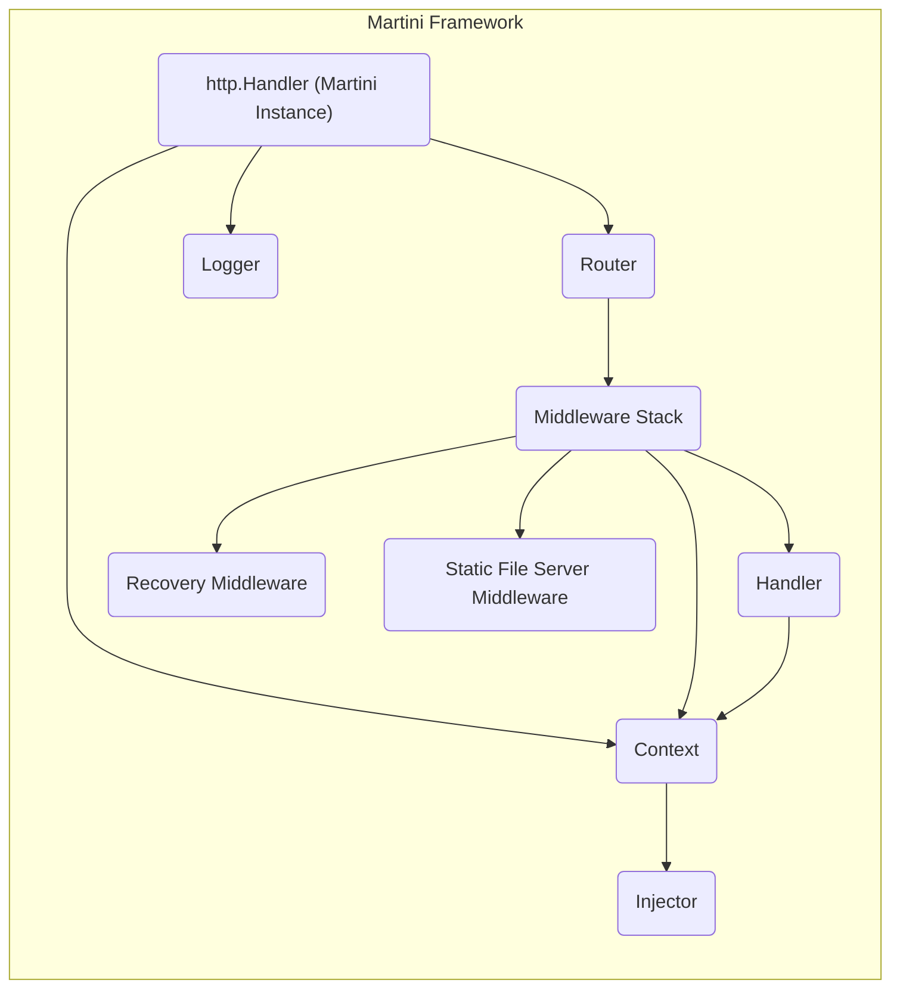
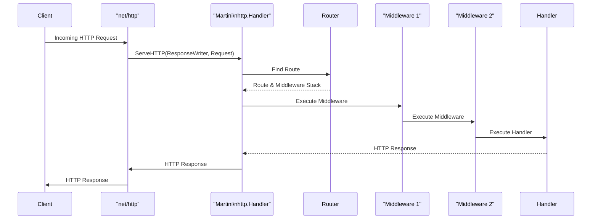

## Project Design Document: Martini Web Framework

**1. Introduction**

This document provides a detailed architectural design of the Martini web framework ([https://github.com/go-martini/martini](https://github.com/go-martini/martini)). This design will serve as the foundation for subsequent threat modeling activities. The document outlines the key components, their interactions, and the data flow within the framework. This information is crucial for identifying potential security vulnerabilities and designing appropriate mitigations.

**2. Goals**

*   Clearly define the architecture of the Martini web framework.
*   Identify the key components and their responsibilities.
*   Describe the flow of data through the framework during request processing.
*   Provide a visual representation of the architecture and request flow.
*   Serve as a basis for future threat modeling exercises.

**3. Target Audience**

This document is intended for:

*   Security engineers and architects responsible for threat modeling and security assessments.
*   Developers working with or extending the Martini framework.
*   Anyone seeking a deeper understanding of Martini's internal workings.

**4. Overview of Martini**

Martini is a lightweight and modular web framework for the Go programming language. It provides a set of essential features for building web applications and APIs, including:

*   Routing: Mapping HTTP request paths to specific handler functions.
*   Middleware: A mechanism for intercepting and processing requests before they reach the handler.
*   Dependency Injection: A built-in service injection mechanism for managing dependencies.
*   Handlers: Functions responsible for processing requests and generating responses.

Martini emphasizes simplicity and extensibility, allowing developers to easily add or replace components.

**5. Architectural Design**

Martini's architecture is centered around the concept of middleware and a request context. A request passes through a chain of middleware functions before reaching the final handler.

**5.1. Key Components:**

Here's a list of the key components within the Martini framework:

*   **`http.Handler` Interface:** Martini itself implements the `http.Handler` interface from the Go standard library's `net/http` package. This allows it to be used with the standard `http.ListenAndServe` function.
*   **Router:** The router is responsible for matching incoming HTTP requests to specific handler functions based on the request method and path. Martini uses a tree-based router for efficient matching.
*   **Middleware Stack:** A collection of middleware functions that are executed sequentially for each incoming request. Middleware can perform various tasks, such as logging, authentication, authorization, request modification, and response manipulation.
*   **Handler:** The final function in the processing pipeline that handles the request and generates the response. Handlers have access to the request context and injected services.
*   **Context (`Context`):** A per-request object that holds request-specific data and provides access to injected services. Middleware and handlers can use the context to share information and access dependencies.
*   **Injector (`inject.Injector`):** Martini uses the `inject` library for dependency injection. The injector manages the creation and provision of services that can be injected into middleware and handlers.
*   **Logger:** A component for logging request information and other relevant events.
*   **Recovery Middleware:** A built-in middleware that recovers from panics during request processing and returns a 500 Internal Server Error.
*   **Static File Server Middleware:** A middleware for serving static files from a specified directory.

**5.2. Component Interactions:**

The following list describes the typical flow of an incoming HTTP request through the Martini framework:

1. An HTTP request arrives at the server.
2. The `net/http` package passes the request to the Martini `http.Handler`.
3. Martini's router attempts to match the request path and method to a defined route.
4. If a matching route is found, the associated middleware stack and handler are identified.
5. The middleware functions in the stack are executed sequentially. Each middleware function can:
    *   Process the request.
    *   Modify the request or response.
    *   Abort the request processing.
    *   Pass control to the next middleware in the stack.
6. After all middleware has been executed (or if a middleware aborts the process), the final handler function is invoked.
7. The handler processes the request, potentially accessing services from the context.
8. The handler generates an HTTP response.
9. The response is sent back to the client.

**5.3. Data Flow:**

The primary data flowing through the Martini framework during request processing includes:

*   **HTTP Request:** The raw HTTP request received by the server, including headers, body, and URL.
*   **Request Context:** Data associated with the current request, managed by the `Context` object. This can include injected services, route parameters, and data set by middleware.
*   **Route Parameters:** Values extracted from the request path based on the defined route patterns.
*   **Injected Services:** Instances of dependencies managed by the injector and made available to middleware and handlers through the context.
*   **HTTP Response:** The response generated by the handler, including headers, status code, and body.

**6. Diagrams**

**6.1. Component Diagram:**

**6.2. Request Flow Diagram:**

**7. Security Considerations (Initial Thoughts)**

Based on the architecture, some initial security considerations for threat modeling include:

*   **Middleware Security:**
    *   Vulnerabilities in custom middleware could expose the application.
    *   The order of middleware execution is important and could lead to bypasses if not configured correctly.
    *   Middleware that handles authentication and authorization needs careful scrutiny.
*   **Routing Vulnerabilities:**
    *   Improperly configured routes could allow access to unintended resources.
    *   Route parameter handling needs to be secure to prevent injection attacks.
*   **Dependency Injection Security:**
    *   If the dependency injection mechanism is not secure, malicious actors might be able to inject their own services.
    *   Care must be taken when injecting sensitive information.
*   **Handler Security:**
    *   Handlers are the primary point of interaction with application logic and require thorough security review.
    *   Input validation and output encoding are crucial in handlers to prevent common web vulnerabilities.
*   **Static File Serving:**
    *   Improperly configured static file serving middleware could expose sensitive files.
    *   Path traversal vulnerabilities could allow access to files outside the intended directory.
*   **Error Handling:**
    *   Verbose error messages in development mode could leak sensitive information in production.
    *   The recovery middleware should be robust and prevent information leakage during panics.

**8. Conclusion**

This document provides a comprehensive design overview of the Martini web framework, focusing on its architecture, components, and data flow. This information will be invaluable for conducting thorough threat modeling exercises to identify and mitigate potential security risks. The diagrams provide a visual representation of the framework's structure and request processing, aiding in understanding the system's behavior. This document serves as a solid foundation for further security analysis and development efforts related to the Martini framework.