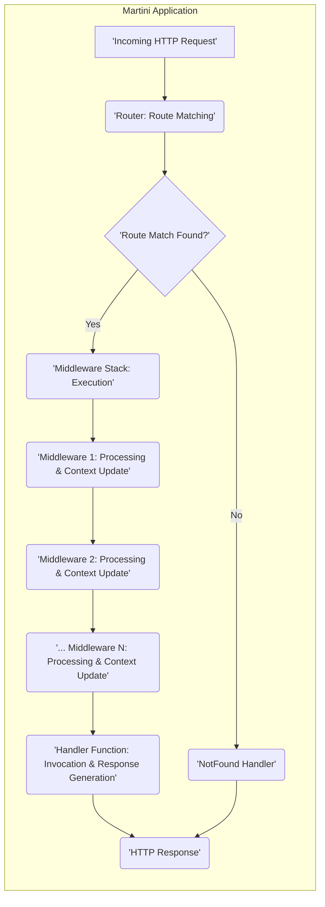

# Project Design Document: Martini Web Framework

**Version:** 1.1
**Date:** October 26, 2023
**Prepared By:** Gemini (AI Model)

## 1. Introduction

This document provides an enhanced design overview of the Martini web framework, based on the codebase at [https://github.com/go-martini/martini](https://github.com/go-martini/martini). This revision aims to provide a more detailed and practical understanding of the framework's architecture, components, and request lifecycle, specifically tailored for subsequent threat modeling activities.

## 2. Goals

The primary goals of this design document are to:

*   Provide a comprehensive and practical understanding of the Martini framework's architecture.
*   Clearly identify key components and illustrate their interactions with concrete examples.
*   Detail the typical request lifecycle within the framework, including data transformations.
*   Highlight potential areas of security concern based on the design, with specific attack vectors.
*   Serve as a robust and actionable basis for conducting a thorough threat model of the Martini framework.

## 3. Scope

This document focuses on the core functionalities and architecture of the Martini framework itself. It includes:

*   Detailed explanation of the request routing mechanism with examples.
*   In-depth analysis of middleware handling and execution flow.
*   Illustrative examples of handler function invocation and data access.
*   Explanation of the dependency injection (services) mechanism.
*   Detailed description of basic HTTP request and response processing.

This document excludes:

*   Specific implementations of middleware (e.g., authentication libraries, session management handlers) that are external to the core Martini framework.
*   Detailed configurations of deployment environments beyond general considerations.
*   In-depth code-level analysis of external dependencies' internal workings.

## 4. Architectural Overview

Martini is designed as a lightweight and extensible web framework for Go, emphasizing a modular, middleware-driven approach. The core principles of its architecture are:

*   **Convention over Configuration:** Martini provides sensible defaults to simplify development.
*   **Middleware Pipeline:** Requests are processed through a chain of middleware functions, enabling cross-cutting concerns to be handled systematically.
*   **Dependency Injection:** Martini's built-in injector facilitates the creation of loosely coupled components.

Key architectural elements include:

*   A central **`Martini` instance** that manages the framework's lifecycle.
*   A **`Router`** responsible for mapping HTTP requests to handlers.
*   A **stack of `Middleware`** functions executed in order.
*   **`Handler` functions** that contain the application's core logic.
*   An **`Injector`** for managing and providing dependencies.

## 5. Component Description

Here's a more detailed look at the key components:

*   **`martini.Martini`:**
    *   The central hub of the framework.
    *   Responsible for creating the `Router` and managing the middleware stack.
    *   Provides methods for adding routes, middleware, and services.
    *   Example: Creating a Martini instance:
        ```go
        m := martini.Classic() // Includes common middleware
        ```
*   **`router.Router`:**
    *   Manages the mapping of HTTP methods and URL patterns to handler functions.
    *   Uses a tree-like structure for efficient route matching.
    *   Supports route parameters and named routes.
    *   Example: Defining a route:
        ```go
        m.Get("/hello/:name", func(params martini.Params) string {
            return "Hello, " + params["name"]
        })
        ```
*   **`context.Context`:**
    *   A crucial object passed through the middleware chain and to handlers.
    *   Provides access to:
        *   `http.ResponseWriter`: For writing the HTTP response.
        *   `*http.Request`: Representing the incoming HTTP request.
        *   Injected services.
        *   A mechanism to stop the middleware chain.
    *   Example: Accessing the request and response:
        ```go
        m.Use(func(res http.ResponseWriter, req *http.Request, c martini.Context) {
            log.Println("Incoming request:", req.URL.Path)
            c.Next() // Pass control to the next middleware/handler
        })
        ```
*   **`http.ResponseWriter`:**
    *   The standard Go interface for constructing HTTP responses.
    *   Used by handlers and middleware to set headers, write the response body, and set the status code.
*   **`*http.Request`:**
    *   The standard Go structure containing information about the incoming HTTP request (headers, body, URL, etc.).
*   **Middleware Functions:**
    *   Functions with the signature `func(http.ResponseWriter, *http.Request, martini.Context)`.
    *   Executed sequentially before the final handler.
    *   Can perform tasks like logging, authentication, request modification, and response manipulation.
    *   Example: A simple logging middleware:
        ```go
        func Logger() martini.Handler {
            return func(res http.ResponseWriter, req *http.Request, c martini.Context) {
                start := time.Now()
                c.Next()
                log.Printf("[%s] %q %v\n", req.Method, req.URL, time.Since(start))
            }
        }
        m.Use(Logger())
        ```
*   **Handler Functions:**
    *   Functions that contain the core application logic for a specific route.
    *   Can have various signatures depending on the services they require (through dependency injection).
    *   Example: A simple handler:
        ```go
        m.Get("/", func() string {
            return "Hello, World!"
        })
        ```
*   **Injector:**
    *   Manages the creation and provision of services (dependencies).
    *   Services can be values or functions that return values.
    *   Injected into middleware and handlers based on their parameter types.
    *   Example: Registering a service:
        ```go
        type MyService struct {
            Message string
        }
        m.Map(&MyService{"Hello from service"})
        m.Get("/service", func(s *MyService) string {
            return s.Message
        })
        ```

## 6. Data Flow

The following diagram illustrates the detailed request lifecycle within a Martini application, highlighting data flow:



**Detailed Request Flow with Data Considerations:**

1. **Incoming HTTP Request:** The Martini application receives an `*http.Request` containing headers, body, and URL information.
2. **Router: Route Matching:** The `router.Router` analyzes the request's method and URL path. Route parameters are extracted and stored (accessible via `martini.Params`).
3. **Route Match Found?:**
    *   **Yes:** The corresponding middleware stack and handler function are identified.
    *   **No:** The framework's "NotFound" handler is selected.
4. **Middleware Stack: Execution:** The registered middleware functions are executed sequentially.
5. **Middleware 1: Processing & Context Update:**
    *   Middleware receives the `http.ResponseWriter`, `*http.Request`, and `martini.Context`.
    *   Middleware can:
        *   Inspect and modify the `*http.Request` (e.g., parsing request body).
        *   Inspect and modify the `http.ResponseWriter` (e.g., setting headers).
        *   Inject values into the `martini.Context` for subsequent middleware or the handler.
        *   Abort the chain by not calling `c.Next()`.
6. **Middleware 2: Processing & Context Update:** Similar processing as Middleware 1, operating on the potentially modified request and response, and further updating the context.
7. **... Middleware N: Processing & Context Update:**  The middleware chain continues, with each middleware potentially transforming data or adding to the context.
8. **Handler Function: Invocation & Response Generation:**
    *   The designated handler function is invoked.
    *   The handler receives the `martini.Context` and any required services through dependency injection.
    *   The handler processes the request data (potentially accessed from the `context` or request object).
    *   The handler generates the HTTP response by writing to the `http.ResponseWriter`.
9. **NotFound Handler:** If no route is matched, the "NotFound" handler generates a default 404 response.
10. **HTTP Response:** The generated `http.ResponseWriter` (containing headers and body) is used to send the HTTP response back to the client.

## 7. Security Considerations (Detailed)

Building upon the preliminary considerations, here's a more detailed look at potential security risks:

*   **Route Handling Vulnerabilities:**
    *   **Path Traversal:**
        *   **Attack Vector:** Maliciously crafted URLs with ".." sequences could bypass intended route restrictions and access unauthorized resources if not properly handled in route definitions or handler logic.
        *   **Mitigation:** Avoid relying solely on client-provided input for file paths; use canonicalization and validation.
    *   **Route Hijacking/Ambiguity:**
        *   **Attack Vector:** Overlapping or insufficiently specific route definitions could lead to unintended handlers being invoked for certain requests.
        *   **Mitigation:** Carefully design route patterns, ensuring they are distinct and unambiguous. Prioritize more specific routes.
*   **Middleware Security:**
    *   **Vulnerable Middleware:**
        *   **Attack Vector:** Third-party or custom middleware with security flaws (e.g., XSS vulnerabilities in logging middleware, authentication bypasses) can compromise the application.
        *   **Mitigation:** Thoroughly vet and audit all middleware components. Keep dependencies updated.
    *   **Order of Execution Issues:**
        *   **Attack Vector:** Incorrect middleware ordering can lead to security checks being bypassed (e.g., authentication after authorization).
        *   **Mitigation:** Carefully plan the middleware execution order, ensuring security-related middleware is executed early in the chain.
    *   **Information Disclosure:**
        *   **Attack Vector:** Middleware might inadvertently log sensitive information (e.g., API keys, user credentials) or expose error details in responses.
        *   **Mitigation:** Review middleware logging practices and error handling to prevent information leaks.
*   **Handler Security:**
    *   **Injection Attacks (SQL, Command, etc.):**
        *   **Attack Vector:** Handlers that directly incorporate user-provided input into database queries or system commands without proper sanitization are vulnerable.
        *   **Mitigation:** Implement robust input validation and sanitization. Use parameterized queries or prepared statements for database interactions. Avoid direct execution of shell commands with user input.
    *   **Cross-Site Scripting (XSS):**
        *   **Attack Vector:** Handlers that output user-provided data directly into HTML without proper encoding can allow attackers to inject malicious scripts.
        *   **Mitigation:** Employ context-aware output encoding to sanitize user-generated content before rendering it in HTML.
    *   **Broken Authentication/Authorization:**
        *   **Attack Vector:** Flaws in handler logic related to authentication and authorization can allow unauthorized access to resources or actions.
        *   **Mitigation:** Implement robust authentication and authorization mechanisms. Follow security best practices for session management and access control.
*   **Dependency Injection Security:**
    *   **Accidental Exposure of Sensitive Services:**
        *   **Attack Vector:**  Registering services containing sensitive information with broad accessibility could lead to unintended exposure.
        *   **Mitigation:** Carefully consider the scope and accessibility of registered services.
    *   **Type Confusion/Exploitation:**
        *   **Attack Vector:**  If the dependency injection mechanism is not type-safe, it might be possible to inject unexpected objects, potentially leading to vulnerabilities.
        *   **Mitigation:** While Martini's injection is based on type, ensure careful registration and usage of services.
*   **Error Handling:**
    *   **Information Leakage through Errors:**
        *   **Attack Vector:** Detailed error messages displayed to users can reveal sensitive information about the application's internal workings.
        *   **Mitigation:** Implement generic error pages for production environments and log detailed errors securely.

## 8. Deployment Considerations

Understanding deployment scenarios is crucial for threat modeling:

*   **Reverse Proxies (Nginx, Apache):** Commonly used for:
    *   **TLS Termination:** Handling encryption and decryption, protecting data in transit. Misconfiguration can lead to vulnerabilities (e.g., accepting insecure TLS versions).
    *   **Load Balancing:** Distributing traffic, but misconfigurations can expose internal servers.
    *   **Web Application Firewall (WAF):** Filtering malicious requests, but effectiveness depends on configuration and rules.
*   **Containerization (Docker, Kubernetes):**
    *   **Image Security:** Vulnerabilities in base images or application dependencies within containers can be exploited.
    *   **Orchestration Security:** Misconfigured Kubernetes deployments can lead to unauthorized access or resource manipulation.
*   **Cloud Platforms (AWS, Azure, GCP):**
    *   **IAM (Identity and Access Management):** Incorrectly configured IAM roles and permissions can grant excessive access.
    *   **Network Security Groups/Firewalls:** Misconfigured network rules can expose services to the internet or unauthorized networks.
    *   **Storage Security:** Improperly secured storage buckets can lead to data breaches.

## 9. Future Considerations

This design document will be continuously updated. Future enhancements could include:

*   Detailed diagrams illustrating the internal workings of the `Router` component.
*   Specific examples of common middleware implementations and their security implications (e.g., authentication middleware).
*   Analysis of integration points with external services and associated security considerations (e.g., database connections, third-party APIs).
*   Consideration of security best practices for Martini application development.

This enhanced design document provides a more comprehensive and actionable foundation for conducting a thorough threat model of the Martini web framework.