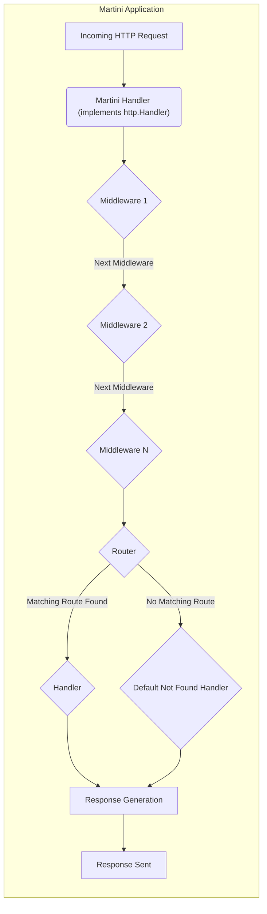
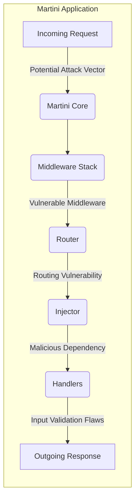
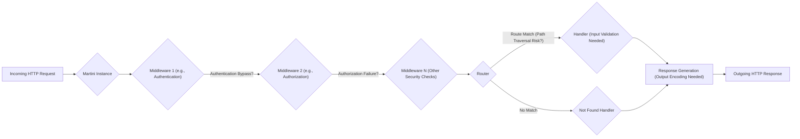

# Project Design Document: Martini Web Framework - Enhanced for Threat Modeling

**Version:** 1.1
**Date:** October 26, 2023
**Author:** AI Software Architect

## 1. Introduction

This document provides an enhanced architectural design of the Martini web framework (as represented by the `go-martini/martini` GitHub repository). This version is specifically tailored for conducting a comprehensive threat model. It details the key components, their interactions, and the data flow within the framework, with a strong emphasis on identifying potential security vulnerabilities and attack surfaces.

## 2. Project Goals

The primary goals of the Martini framework are to provide a streamlined and expressive way to build modular web applications in Go. From a security perspective, understanding these goals helps identify potential areas of risk:

*   **Simplified Routing:**  While simplifying development, complex or poorly defined routes can introduce vulnerabilities.
*   **Extensible Middleware:** The flexibility of middleware allows for powerful request processing but also introduces risks if middleware is insecure or improperly ordered.
*   **Dependency Injection:**  Facilitates modularity but can be a vector for injecting malicious or unintended dependencies.
*   **Concise API:**  While promoting ease of use, a concise API might abstract away important security considerations if not used carefully.

## 3. Architecture Overview

Martini employs a layered architecture centered around a middleware pipeline and a router. Incoming HTTP requests are processed sequentially by a chain of middleware before being routed to a specific handler. Dependency injection is a core mechanism for providing services and dependencies to both middleware and handlers. This architecture presents several key areas for security consideration: the integrity and order of the middleware stack, the security of the routing mechanism, and the potential for vulnerabilities within injected dependencies and handlers.

## 4. Component Details

This section provides a detailed breakdown of Martini's key components, highlighting potential security implications for each:

*   **`martini.Martini`:** The central application struct.
    *   Manages the middleware stack:  A compromised `Martini` instance could allow manipulation of the entire request processing pipeline.
    *   Orchestrates routing:  Vulnerabilities here could lead to incorrect handler execution.
    *   Controls dependency injection:  A weakness here could allow the injection of malicious components.
*   **`http.Handler` Interface Implementation:** Enables integration with Go's standard HTTP server.
    *   Any vulnerabilities in the underlying `net/http` package could be inherited.
*   **Router (`route.Router`):** Maps HTTP requests to handlers.
    *   **Route Definition Vulnerabilities:**  Improperly defined routes (e.g., overly broad regex) could lead to denial-of-service or unintended route matching.
    *   **Path Traversal Risks:**  Careless handling of route parameters could allow attackers to access unauthorized resources.
    *   **Route Collision:**  Overlapping routes might lead to unexpected behavior and potential security bypasses.
*   **Middleware Stack:** Ordered list of functions executed per request.
    *   **Malicious Middleware:**  Compromised or poorly written middleware can introduce vulnerabilities like authentication bypass, data exfiltration, or cross-site scripting (XSS).
    *   **Middleware Ordering Issues:** Incorrect order can lead to security flaws (e.g., authorization checks before authentication). A vulnerable middleware early in the chain can compromise subsequent middleware.
    *   **Bypass Vulnerabilities:**  Flaws in middleware logic might allow attackers to bypass security checks.
*   **Handlers:** Functions responsible for processing requests and generating responses.
    *   **Input Validation Failures:** Handlers are primary targets for injection attacks (SQL injection, command injection, etc.) if input is not properly validated and sanitized.
    *   **Output Encoding Issues:**  Failure to properly encode output can lead to XSS vulnerabilities.
    *   **Business Logic Flaws:**  Vulnerabilities in the handler's core logic can lead to unauthorized actions or data manipulation.
*   **Injector (`inject.Injector`):** Manages dependency injection.
    *   **Injection of Malicious Dependencies:** If the injection mechanism is not secure, attackers might be able to inject malicious dependencies that compromise the application.
    *   **Exposure of Sensitive Information:**  Accidental injection of sensitive configuration or credentials could lead to exposure.
    *   **Dependency Confusion:**  If dependencies are not managed carefully, the wrong version or a malicious dependency could be injected.
*   **Context (`context.Context`):** Request-scoped context passed through the pipeline.
    *   **Data Tampering:**  If the context is not properly protected, malicious middleware could tamper with data intended for later middleware or the handler.
    *   **Information Disclosure:**  Accidental inclusion of sensitive information in the context could lead to its exposure.
*   **Logger (`log.Logger`):** Provides logging functionality.
    *   **Information Leakage:**  Overly verbose logging might expose sensitive data.
    *   **Log Injection:**  If user input is directly included in logs without sanitization, attackers might be able to inject malicious log entries.
*   **Recovery Middleware:** Handles panics.
    *   **Information Disclosure:**  Default error messages might reveal sensitive information about the application's internals.
    *   **Denial of Service:**  While preventing crashes, poorly configured recovery might mask underlying issues that could be exploited for denial of service.
*   **Static File Server Middleware:** Serves static files.
    *   **Directory Traversal:**  Vulnerabilities could allow access to files outside the intended static directory.
    *   **Exposure of Sensitive Files:**  Incorrect configuration might expose sensitive files (e.g., configuration files, source code).

## 5. Data Flow

The following details the flow of an HTTP request through a Martini application, highlighting potential security checkpoints and vulnerabilities at each stage:

1. **"Request Received"**: The `net/http` server receives the request. Potential vulnerabilities at this stage are related to the underlying HTTP server implementation.
2. **"Martini Handler Invoked"**: The `martini.Martini` instance receives the request. This is the entry point for Martini's processing, and any vulnerabilities in Martini's core handling logic could be exploited here.
3. **"Middleware Execution"**: The ordered middleware stack processes the request. Each middleware represents a potential security check or vulnerability point. The order is critical.
    *   **"Middleware 1"**:  Could be an authentication middleware. A vulnerability here could bypass authentication.
    *   **"Middleware 2"**: Could be an authorization middleware. A flaw here could grant unauthorized access.
    *   **"Middleware N"**:  Other middleware for logging, request modification, etc. Each presents its own set of potential vulnerabilities.
4. **"Router"**: The router matches the request to a handler. Vulnerabilities here involve incorrect route matching or path traversal.
    *   **"Matching Route Found"**: The request is routed to the appropriate handler.
    *   **"No Matching Route"**: The request is typically handled by a "Not Found" handler, which itself could have vulnerabilities.
5. **"Handler"**: The designated handler processes the request. This is a prime location for input validation and output encoding vulnerabilities. The handler relies on the `Injector` for dependencies.
6. **"Response Generation"**: The handler generates the HTTP response. Vulnerabilities here involve the inclusion of sensitive information or improper formatting leading to exploits.
7. **"Response Sent"**: The response is sent back to the client. Security considerations at this stage involve ensuring the integrity and confidentiality of the response.

## 6. Security Considerations (Detailed)

This section expands on the preliminary security considerations, providing more specific examples of potential threats:

*   **Middleware Security:**
    *   **Example Threat:** A logging middleware might inadvertently log sensitive user data in plain text, leading to information disclosure.
    *   **Example Threat:** A poorly implemented authentication middleware might be vulnerable to bypass attacks.
    *   **Example Threat:**  If an authorization middleware is placed before an authentication middleware, unauthorized access could be granted.
*   **Routing Vulnerabilities:**
    *   **Example Threat:** A route defined as `/users/{id:[0-9]+}` might be bypassed with `/users/../admin` if not handled carefully, leading to path traversal.
    *   **Example Threat:**  Defining overlapping routes like `/api/v1/users` and `/api/{version}/users` without clear precedence can lead to unexpected handler execution.
    *   **Example Threat:**  Using overly complex regular expressions in route definitions can lead to Regular Expression Denial of Service (ReDoS) attacks.
*   **Dependency Injection Security:**
    *   **Example Threat:** If the dependency injection configuration is sourced from an untrusted source, a malicious actor could inject a compromised database connection pool.
    *   **Example Threat:** Injecting a service that performs external API calls without proper rate limiting could lead to abuse.
    *   **Example Threat:**  Injecting a logger configured to write to a publicly accessible location could lead to information leakage.
*   **Handler Security:**
    *   **Example Threat:** A handler processing user input for a database query without proper sanitization is vulnerable to SQL injection.
    *   **Example Threat:** A handler displaying user-provided content without proper encoding is vulnerable to XSS.
    *   **Example Threat:**  A handler that doesn't implement proper error handling might leak stack traces or internal information to the client.
*   **Static File Serving:**
    *   **Example Threat:**  If the static file server is configured to serve from the root directory, attackers could potentially access sensitive configuration files.
    *   **Example Threat:**  A directory traversal vulnerability in the static file server could allow attackers to access arbitrary files on the server.
*   **Panic Recovery:**
    *   **Example Threat:**  The default recovery middleware might display a generic error message that doesn't provide enough information for debugging but might still hint at internal errors.
    *   **Example Threat:**  If custom error handling logic within the recovery middleware is flawed, it could introduce new vulnerabilities.
*   **Logging Security:**
    *   **Example Threat:** Logging user passwords or API keys, even unintentionally, can have severe security consequences.
    *   **Example Threat:**  If logs are not properly secured, attackers might be able to tamper with them to cover their tracks.
*   **Third-Party Dependencies:**
    *   **Example Threat:**  Using a vulnerable version of a third-party library in a middleware or handler can introduce known security flaws.

## 7. Diagrams

### 7.1. High-Level Architecture Diagram (Security Focused)

### 7.2. Request Processing Flow (Security Checkpoints)

## 8. Conclusion

This enhanced design document provides a more detailed and security-focused overview of the Martini web framework. By outlining the key components, their interactions, and the data flow with specific security considerations, this document serves as a strong foundation for conducting a thorough threat model. The identified potential threats and vulnerabilities should be further analyzed and mitigated to ensure the security of applications built using the Martini framework. The next step is to utilize this document in a structured threat modeling exercise, such as using STRIDE or PASTA, to systematically identify and address potential security risks.