# Project Design Document: Martini Web Framework for Threat Modeling (Improved)

**Project Name:** Martini Web Framework

**Project Repository:** [https://github.com/go-martini/martini](https://github.com/go-martini/martini)

**Document Version:** 1.1

**Date:** 2023-10-27

**Author:** AI Software Architect

## 1. Introduction

This document provides an enhanced design overview of the Martini web framework, specifically tailored for threat modeling and security analysis. Martini, a lightweight and productive web framework for Go, is designed for rapid development of web applications and APIs. This document details the key architectural components, data flow, and security considerations within Martini to facilitate a comprehensive threat modeling exercise, enabling proactive identification and mitigation of potential security risks. This document is intended to be used as a basis for applying threat modeling methodologies such as STRIDE to Martini-based applications.

## 2. Project Overview

Martini prioritizes simplicity and ease of use for building web applications in Go, drawing inspiration from Sinatra and Express. Its core features are designed to streamline web development:

*   **Elegant Routing:**  A straightforward and expressive routing system to map HTTP requests to specific handlers based on path and HTTP method.
*   **Modular Middleware:**  A robust middleware system promoting code reusability and separation of concerns in request processing. Middleware components can handle cross-cutting concerns like logging, authentication, and request modification.
*   **Built-in Dependency Injection:**  A simple dependency injection mechanism to manage and provide dependencies to handlers and middleware, enhancing testability and maintainability.
*   **Concise Handlers:**  Functions that encapsulate the application's business logic, processing requests and generating appropriate responses.
*   **Request-Scoped Context:**  A context object associated with each incoming request, facilitating data sharing and service access throughout the request lifecycle within middleware and handlers.

This design document focuses on the architectural elements of Martini that are most relevant to security and threat modeling, providing a foundation for identifying potential vulnerabilities and attack vectors.

## 3. Architectural Design

### 3.1. High-Level Architecture Diagram

The following diagram illustrates the high-level architecture of Martini and the flow of an HTTP request through the framework. This diagram highlights the key components involved in processing a request and is crucial for understanding potential threat entry points and data flow paths.

```mermaid
graph LR
    subgraph "External World"
        A["'User Request (HTTP)'"] --> B["'Reverse Proxy / Load Balancer (Optional)'"]
    end
    B --> C["'Martini Application (Go Process)'"]
    C --> D["'HTTP Listener'"]
    D --> E["'Router'"]
    E --> F["'Middleware Stack'"]
    F --> G["'Handler'"]
    G --> H["'Context'"]
    H --> F
    H --> E
    H --> D
    G --> I["'Response Writer'"]
    I --> C
    C --> B
    B --> A

    classDef external fill:#f9f,stroke:#333,stroke-width:2px
    class "External World" external
```

**Diagram Description:**

1.  **'User Request (HTTP)':**  An HTTP request initiated by a user or client application, representing the initial point of interaction with the Martini application.
2.  **'Reverse Proxy / Load Balancer (Optional)':**  An optional but recommended component often deployed in front of Martini applications. It provides benefits such as TLS termination, load distribution across multiple Martini instances, and enhanced security features like Web Application Firewalls (WAFs).
3.  **'Martini Application (Go Process)':**  The running instance of the Martini application, implemented as a Go process, responsible for handling incoming requests.
4.  **'HTTP Listener':**  The component within the Martini application that listens for incoming TCP connections on a specified port, accepts these connections, and parses the raw HTTP request data stream. This is typically provided by Go's standard `net/http` package.
5.  **'Router':**  The routing component responsible for matching the incoming request's path and HTTP method against a set of defined routes. Upon a match, it directs the request to the associated handler and middleware chain.
6.  **'Middleware Stack':**  An ordered sequence of middleware functions that are executed sequentially for each incoming request *before* the handler is invoked. Middleware functions can perform a wide range of tasks, including logging, authentication, authorization, request/response modification, and error handling.
7.  **'Handler':**  The core application logic component. Handlers are functions that process the request, implement the application's business logic, interact with backend services or databases, and generate the HTTP response.
8.  **'Context':**  A request-scoped context object created for each incoming request. It is passed through the middleware stack and to the handler, serving as a container for request-specific data, services (via dependency injection), and allowing data sharing within the request lifecycle.
9.  **'Response Writer':**  An interface (typically `http.ResponseWriter` in Go) used by middleware and handlers to construct the HTTP response. It allows setting response headers, status codes, and writing the response body that will be sent back to the client.

### 3.2. Component Descriptions

#### 3.2.1. 'HTTP Listener'

*   **Functionality:**  Establishes a listening socket on a configured port, accepts incoming TCP connections, and parses HTTP requests from the incoming data stream. Relies on Go's `net/http` package for core HTTP handling.
*   **Security Considerations:**
    *   **TLS/SSL Configuration Vulnerabilities:** Misconfigured TLS/SSL settings can lead to weak encryption, man-in-the-middle attacks, or exposure of sensitive data. Ensure strong cipher suites, up-to-date certificates, and proper TLS versions are configured.
    *   **Denial of Service (DoS) via Connection Exhaustion:**  If not properly configured, the listener might be vulnerable to DoS attacks by exhausting connection resources. Implement connection limits, timeouts, and potentially rate limiting at the listener level or upstream.
    *   **HTTP Header Parsing Vulnerabilities:**  Vulnerabilities in HTTP header parsing logic (in `net/http` or underlying libraries) could be exploited by sending malformed or excessively large headers, leading to crashes or unexpected behavior. Keep Go runtime updated to patch known vulnerabilities.
    *   **Request Body Size Limits:** Lack of or insufficient request body size limits can lead to resource exhaustion DoS attacks by sending extremely large requests. Configure appropriate limits.

#### 3.2.2. 'Router'

*   **Functionality:**  Matches incoming HTTP requests to registered routes based on the request path and HTTP method. Martini uses a pattern-matching system for route definition, allowing for dynamic path segments and parameter extraction.
*   **Security Considerations:**
    *   **Route Definition Exposure:**  Overly permissive or poorly designed route patterns can unintentionally expose sensitive functionalities or data. Adhere to the principle of least privilege when defining routes, making them as specific as necessary.
    *   **Path Traversal via Route Parameters:**  If route parameters are not properly sanitized and validated before being used to access files or resources, path traversal vulnerabilities can arise, allowing attackers to access unauthorized files.
    *   **Route Collision and Confusion:**  Ambiguous or overlapping route definitions can lead to route collisions, potentially causing requests to be routed to unintended handlers, leading to unexpected behavior or security bypasses.
    *   **Regular Expression Denial of Service (ReDoS):**  If regular expressions are used in route definitions (especially complex ones), they can be susceptible to ReDoS attacks. Carefully design and test regular expressions used in routing to avoid excessive backtracking.

#### 3.2.3. 'Middleware Stack'

*   **Functionality:**  A chain of middleware functions executed sequentially before the handler. Middleware provides a mechanism for intercepting and processing requests and responses, enabling modular implementation of cross-cutting concerns.
*   **Security Considerations:**
    *   **Middleware Order Dependency Issues:**  The order of middleware execution is critical for security. Incorrect ordering can lead to vulnerabilities. For example, authentication middleware *must* precede authorization middleware.
    *   **Vulnerable Middleware Components:**  Third-party or custom middleware components may contain vulnerabilities. Thoroughly vet and regularly update all middleware dependencies. Conduct security audits of custom middleware.
    *   **Middleware Bypass Vulnerabilities:**  Logic errors in middleware implementation could allow attackers to bypass security checks implemented in middleware, such as authentication or authorization.
    *   **State Management Security in Middleware:**  If middleware manages state (e.g., caching, session data), ensure secure state management practices are followed to prevent data leakage, tampering, or race conditions.
    *   **Error Handling Weaknesses in Middleware:**  Improper error handling in middleware can lead to information disclosure (e.g., exposing stack traces) or denial-of-service. Middleware should handle errors gracefully and securely.

#### 3.2.4. 'Handler'

*   **Functionality:**  The core application logic that processes requests and generates responses. Handlers implement the specific functionalities of the web application or API.
*   **Security Considerations:**
    *   **Injection Vulnerabilities (SQL, Command, etc.):**  Handlers are primary locations for injection vulnerabilities if input data is not properly validated and sanitized before being used in database queries, system commands, or other sensitive operations.
    *   **Cross-Site Scripting (XSS):**  If handlers generate dynamic content (HTML, JavaScript, etc.) without proper output encoding, they can be vulnerable to XSS attacks. Always encode output based on the context (HTML encoding, JavaScript encoding, URL encoding, etc.).
    *   **Business Logic Flaws:**  Vulnerabilities can arise from flaws in the application's business logic implemented within handlers, leading to unauthorized access, data manipulation, or other security breaches.
    *   **Insufficient Authorization Checks:**  Handlers must enforce proper authorization to ensure users only access resources and perform actions they are permitted to. Missing or inadequate authorization checks can lead to privilege escalation and unauthorized access.
    *   **Sensitive Data Exposure:**  Handlers might unintentionally expose sensitive data in responses (e.g., in error messages, logs, or response bodies). Avoid exposing sensitive information and implement proper data masking and redaction.

#### 3.2.5. 'Context'

*   **Functionality:**  Provides a request-scoped storage and sharing mechanism for data and services within the request lifecycle. Facilitates dependency injection and allows middleware and handlers to communicate and share information.
*   **Security Considerations:**
    *   **Information Leakage via Context:**  If sensitive data is stored in the context and not properly managed, it could potentially leak between requests or be exposed in error conditions. Minimize storing sensitive data in the context and ensure proper cleanup.
    *   **Context Injection Attacks:**  Although less common in typical Martini usage, vulnerabilities could arise if external input can directly influence the context data in an uncontrolled manner, potentially leading to unexpected behavior or security bypasses.
    *   **Data Integrity Issues in Context:**  If multiple middleware components or the handler modify data in the context concurrently without proper synchronization, data integrity issues or race conditions could occur, potentially leading to security vulnerabilities.

#### 3.2.6. 'Response Writer'

*   **Functionality:**  Provides an interface for middleware and handlers to construct the HTTP response, including setting headers, status codes, and writing the response body.
*   **Security Considerations:**
    *   **HTTP Header Injection:**  Improper handling of response headers can lead to header injection vulnerabilities. Attackers might be able to inject malicious headers to manipulate browser behavior, set cookies, or perform other attacks. Sanitize and validate header values before setting them.
    *   **Response Splitting:**  In certain scenarios, vulnerabilities related to response splitting might arise if response headers are not properly handled, potentially allowing attackers to inject arbitrary content into the response stream.
    *   **Content-Type Mismatch Vulnerabilities:**  Incorrectly setting the `Content-Type` header can lead to browser misinterpretation of the response, potentially leading to XSS or other vulnerabilities. Ensure the `Content-Type` accurately reflects the response body content.
    *   **Error Response Information Disclosure:**  Error responses generated via the Response Writer should be carefully crafted to avoid leaking sensitive information (e.g., internal paths, database details, stack traces). Provide generic error messages to clients and log detailed errors securely server-side.

## 4. Data Flow Diagram

This diagram provides a more detailed view of the data flow during HTTP request processing within Martini, highlighting data transformation and potential security checkpoints.

```mermaid
graph LR
    subgraph "Request Data"
        A["'HTTP Request (Raw Data)'"] --> B["'Request Parsing'"]
        B --> C["'Request Object (Parsed)'"]
    end
    C --> D["'Router'"]
    D --> E["'Middleware 1 (e.g., Logging)'"]
    E --> F["'Middleware 2 (e.g., Authentication)'"]
    F --> G["'Middleware 3 (e.g., Input Validation)'"]
    G --> H["'... Middleware N'"]
    H --> I["'Handler (Application Logic)'"]
    I --> J["'Response Generation'"]
    J --> K["'Response Object'"]
    K --> L["'Response Writing'"]
    L --> M["'HTTP Response (Raw Data)'"]

    style A fill:#ccf,stroke:#333,stroke-width:1px
    style M fill:#ccf,stroke:#333,stroke-width:1px
```



**Data Flow Description:**

1.  **'HTTP Request (Raw Data)':**  The initial raw byte stream of the incoming HTTP request as received by the HTTP Listener.
2.  **'Request Parsing':**  The HTTP Listener parses the raw data stream into a structured HTTP request object, interpreting headers, body, method, and URL.
3.  **'Request Object (Parsed)':**  A structured representation of the HTTP request, now readily accessible to the Martini application, containing parsed headers, body, method, URL, and other request attributes.
4.  **'Router':**  The Router receives the parsed request object and determines the appropriate handler and middleware chain based on the request's URL path and HTTP method.
5.  **'Middleware 1 (e.g., Logging)'... 'Middleware N':** The request object is passed sequentially through the middleware stack. Each middleware component can inspect, modify, or enrich the request and context. Examples include logging middleware, authentication middleware, input validation middleware, etc.
6.  **'Handler (Application Logic)':**  The designated handler receives the processed request object and context. This is where the core application logic is executed, potentially involving interactions with databases, external APIs, and business rule processing.
7.  **'Response Generation':**  The handler generates a response based on the request processing. This involves constructing the response body, setting appropriate headers, and determining the HTTP status code.
8.  **'Response Object':**  A structured representation of the HTTP response, including headers, status code, and the response body content.
9.  **'Response Writing':**  The Response Writer takes the response object and writes it back to the HTTP connection as a raw data stream, preparing it for transmission to the client.
10. **'HTTP Response (Raw Data)':**  The final raw byte stream of the HTTP response, ready to be sent back to the client over the network.

**Data Security Considerations:**

*   **Sensitive Data in Transit:**  Identify points where sensitive data is transmitted (e.g., request body, response body, headers). Ensure encryption (HTTPS/TLS) is used to protect data in transit.
*   **Data Validation and Sanitization Points:**  Middleware and handlers should implement data validation and sanitization at various stages of the data flow to prevent malicious data from reaching backend systems or being reflected in responses. Input validation middleware (e.g., validating request parameters) and output encoding in handlers are crucial.
*   **Data Transformation Security:**  Be aware of data transformations performed by middleware and handlers. Ensure transformations are secure and do not introduce vulnerabilities (e.g., insecure deserialization, format string vulnerabilities).
*   **Logging of Sensitive Data:**  Avoid logging sensitive data in plain text. Implement secure logging practices, such as masking or redacting sensitive information before logging.
*   **Access Control to Data:**  Implement access control mechanisms to restrict access to sensitive data based on user roles and permissions. Authorization middleware and handler-level checks are essential.

## 5. Security Considerations for Threat Modeling

This section summarizes key security considerations for threat modeling Martini applications, categorized for clarity and actionability. These considerations should be used to guide the threat modeling process, specifically when applying methodologies like STRIDE.

*   **Input Validation & Sanitization (STRIDE: Input Manipulation):**
    *   **Threat:** Injection attacks (SQL, Command, XSS, etc.), data corruption, unexpected application behavior.
    *   **Mitigation:** Implement robust input validation in middleware and handlers. Sanitize all input data from requests (headers, parameters, body) before processing. Use parameterized queries or ORMs to prevent SQL injection. Encode output to prevent XSS.
*   **Output Encoding (STRIDE: Information Disclosure, XSS):**
    *   **Threat:** Cross-Site Scripting (XSS) vulnerabilities, information leakage.
    *   **Mitigation:**  Encode all dynamic output in handlers based on the output context (HTML, JavaScript, URL, etc.). Use templating engines with auto-escaping features. Set appropriate `Content-Type` headers.
*   **Authentication & Authorization (STRIDE: Authentication, Authorization):**
    *   **Threat:** Unauthorized access, privilege escalation, data breaches.
    *   **Mitigation:** Implement strong authentication middleware to verify user identity. Implement authorization middleware and handler-level checks to enforce access control based on roles and permissions. Use secure session management practices.
*   **Session Management (STRIDE: Session Management):**
    *   **Threat:** Session hijacking, session fixation, session replay attacks.
    *   **Mitigation:** Use secure session management techniques (e.g., HTTP-only, Secure flags for cookies, short session timeouts, session invalidation on logout). Protect session tokens from unauthorized access.
*   **Error Handling & Logging (STRIDE: Information Disclosure, DoS):**
    *   **Threat:** Information leakage via error messages, denial of service through excessive error logging, security monitoring gaps.
    *   **Mitigation:** Implement secure error handling. Avoid exposing sensitive information in error responses to clients. Log detailed errors securely server-side. Implement robust logging for security events and audits.
*   **Dependency Management (STRIDE: Using Components with Known Vulnerabilities):**
    *   **Threat:** Exploitation of known vulnerabilities in third-party libraries and middleware.
    *   **Mitigation:** Regularly audit and update all dependencies (including Martini itself and middleware). Use dependency scanning tools to identify known vulnerabilities.
*   **Middleware Security (STRIDE: Trust Boundary Violation, Tampering):**
    *   **Threat:** Vulnerabilities in middleware components, bypass of security checks in middleware, malicious middleware.
    *   **Mitigation:** Carefully vet and review all middleware components, especially third-party ones. Ensure middleware is configured and used securely. Implement security audits of custom middleware.
*   **Route Security (STRIDE: Improper Configuration, Access Control):**
    *   **Threat:** Unintended exposure of functionalities, unauthorized access due to overly permissive routes.
    *   **Mitigation:** Define routes with the principle of least privilege. Avoid overly broad or permissive route patterns. Implement route-level access control if needed.
*   **TLS/SSL Configuration (STRIDE: Information Disclosure, Tampering):**
    *   **Threat:** Man-in-the-middle attacks, eavesdropping, data interception.
    *   **Mitigation:** Configure TLS/SSL properly for HTTPS. Use strong cipher suites, up-to-date certificates, and enforce secure TLS versions.
*   **Denial of Service (DoS) Prevention (STRIDE: Denial of Service):**
    *   **Threat:** Application unavailability, resource exhaustion.
    *   **Mitigation:** Implement DoS prevention measures such as request rate limiting, connection limits, request body size limits, and resource management.
*   **Context Security (STRIDE: Information Disclosure, Data Integrity):**
    *   **Threat:** Information leakage via context, data corruption in context.
    *   **Mitigation:** Minimize storing sensitive data in the request context. Ensure proper data isolation between requests. Avoid context injection vulnerabilities.
*   **Header Security (STRIDE: Information Disclosure, Client-Side Vulnerabilities):**
    *   **Threat:** Client-side vulnerabilities (XSS, clickjacking), information disclosure via headers.
    *   **Mitigation:** Implement security-related HTTP headers (e.g., Content Security Policy, X-Frame-Options, Strict-Transport-Security, X-Content-Type-Options).

## 6. Deployment Considerations

Secure deployment practices are crucial for the overall security of Martini applications. Consider these deployment security aspects:

*   **Reverse Proxy/Load Balancer (Security Perimeter):**  Mandatory for production deployments. Use a reverse proxy or load balancer for TLS termination, load balancing, and implementing WAF features to protect against common web attacks.
*   **Containerization (Isolation & Reproducibility):** Deploy Martini applications in containers (e.g., Docker) for isolation, resource control, and reproducible deployments. Use minimal container images and follow container security best practices.
*   **Cloud Security (Cloud-Native Security):**  In cloud environments, leverage cloud-native security services (e.g., AWS Security Groups, Azure Network Security Groups, GCP Firewall Rules, IAM roles) to control network access, manage identities, and enforce security policies.
*   **Operating System & Infrastructure Security (Foundation Security):**  Harden the underlying operating system and infrastructure. Keep systems patched and up-to-date. Implement strong access controls and security configurations at the OS and infrastructure level.
*   **Monitoring & Logging (Detection & Response):**  Implement comprehensive monitoring and logging of the deployed application and infrastructure. Monitor for security events, anomalies, and potential attacks. Use security information and event management (SIEM) systems for centralized logging and analysis.
*   **Regular Security Audits & Penetration Testing (Validation):** Conduct regular security audits and penetration testing of the deployed Martini application to identify and address vulnerabilities proactively.

## 7. Conclusion

This improved design document provides a more detailed and security-focused overview of the Martini web framework architecture. It emphasizes components, data flow, and critical security considerations relevant for threat modeling. This document is intended to be a valuable resource for security professionals and developers to conduct thorough threat modeling exercises for Martini-based applications, particularly when using methodologies like STRIDE. By understanding the architecture, data flow, and potential threats outlined, teams can proactively identify, mitigate, and prevent security vulnerabilities, ultimately building more secure and resilient web applications with the Martini framework.

This document should be used as a starting point for a comprehensive security strategy that includes code reviews, automated security testing, penetration testing, and continuous security monitoring to maintain a strong security posture for Martini-based projects throughout their lifecycle.