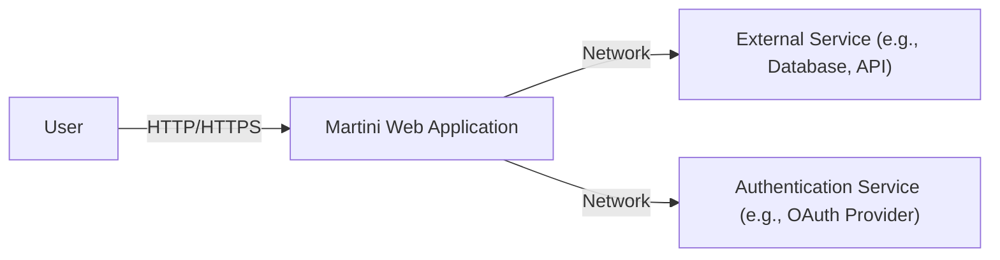
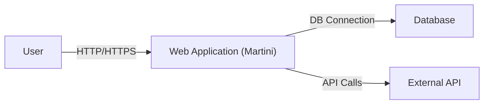
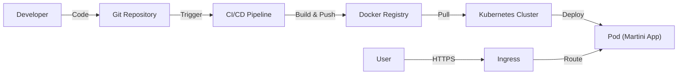

Okay, let's create a design document for the Martini project, focusing on aspects relevant for threat modeling.

# BUSINESS POSTURE

Martini is a lightweight, yet powerful, web framework for Go.  It's designed to make writing modular web applications and APIs in Go easier and faster.  It emphasizes flexibility and minimal overhead.  Given its nature as a foundational framework, the business priorities and goals revolve around:

*   Rapid Development: Enabling developers to quickly build and deploy web applications.
*   Flexibility and Extensibility: Allowing developers to customize and extend the framework to meet their specific needs.
*   Performance: Providing a fast and efficient foundation for web applications.
*   Community and Ecosystem: Fostering a strong community and a rich ecosystem of middleware and plugins.
*   Simplicity: Keeping the core framework small and easy to understand.

Based on these priorities, the most important business risks are:

*   Security Vulnerabilities: Vulnerabilities in the framework could be exploited to compromise applications built upon it, leading to data breaches, service disruptions, and reputational damage. This is the most critical risk.
*   Performance Bottlenecks: Poor performance in the framework could negatively impact the performance of applications built on it, leading to poor user experience and potential loss of users.
*   Lack of Maintainability: If the framework is difficult to maintain or update, it could lead to security vulnerabilities and hinder the ability to add new features.
*   Dependency Issues: Reliance on vulnerable or poorly maintained third-party dependencies could introduce security risks and instability.
*   Lack of Adoption: If the framework fails to gain sufficient adoption, it may become difficult to maintain and support in the long term.

# SECURITY POSTURE

Martini, being a framework, provides building blocks but leaves many security decisions to the application developer using it.  Here's a breakdown:

*   security control: Routing: Martini provides a flexible routing mechanism. (Implemented in `martini.go` and related routing files).
*   security control: Middleware Support: Martini's core strength is its middleware support, allowing developers to inject custom logic (including security controls) into the request handling pipeline. (Implemented throughout the framework, particularly in `martini.go`).
*   security control: Context Handling: Martini provides a context object that can be used to pass data between middleware and handlers, including security-related information. (Implemented in `context.go`).
*   accepted risk: Limited Built-in Security Features: Martini itself provides minimal built-in security features beyond basic routing and middleware support. It relies heavily on developers implementing appropriate security controls within their applications and middleware.
*   accepted risk: Dependency Management: While Martini aims for minimal dependencies, it does rely on some external packages. The security of these dependencies is crucial.
*   accepted risk: Secure by Default Configuration: Martini does not enforce secure-by-default configurations for things like TLS, CORS, or input validation. These must be explicitly configured by the developer.

Recommended Security Controls (High Priority):

*   security control: Input Validation Middleware: Create or utilize robust input validation middleware to sanitize all user inputs and prevent common injection vulnerabilities (XSS, SQLi, etc.).
*   security control: Authentication and Authorization Middleware: Implement or integrate well-vetted authentication and authorization middleware to control access to resources.
*   security control: Secure Header Middleware: Add middleware to set appropriate security headers (e.g., `Strict-Transport-Security`, `Content-Security-Policy`, `X-Frame-Options`, `X-Content-Type-Options`).
*   security control: Rate Limiting Middleware: Implement rate limiting to mitigate brute-force attacks and denial-of-service attempts.
*   security control: CSRF Protection Middleware: Integrate CSRF protection middleware to prevent Cross-Site Request Forgery attacks.
*   security control: Dependency Scanning: Regularly scan Martini and its dependencies for known vulnerabilities.

Security Requirements:

*   Authentication:
    *   The framework should facilitate the integration of various authentication mechanisms (e.g., OAuth 2.0, JWT, API keys).
    *   Authentication middleware should be easily pluggable into the request pipeline.
*   Authorization:
    *   The framework should support role-based access control (RBAC) or other authorization models.
    *   Authorization checks should be easily integrated into route handlers or middleware.
*   Input Validation:
    *   All user inputs (including URL parameters, query parameters, request bodies, and headers) must be validated against strict rules.
    *   Validation should prevent common injection vulnerabilities (XSS, SQLi, command injection, etc.).
*   Cryptography:
    *   The framework should encourage the use of secure cryptographic practices (e.g., using strong hashing algorithms for passwords, using TLS for all communication).
    *   Sensitive data should be encrypted at rest and in transit.
*   Output Encoding:
    *   All output to the client should be properly encoded to prevent XSS vulnerabilities.

# DESIGN

## C4 CONTEXT

*   Elements Description:
    *   Name: User
        *   Type: Person
        *   Description: A user interacting with the Martini web application through a web browser or other client.
        *   Responsibilities: Initiates requests to the application.
        *   Security controls: Browser security settings, potentially multi-factor authentication.
    *   Name: Martini Web Application
        *   Type: Software System
        *   Description: The web application built using the Martini framework.
        *   Responsibilities: Handles user requests, processes data, interacts with external services.
        *   Security controls: Input validation, authentication, authorization, output encoding, secure headers, CSRF protection, rate limiting.
    *   Name: External Service (e.g., Database, API)
        *   Type: Software System
        *   Description: An external service that the Martini application interacts with, such as a database, a third-party API, or a message queue.
        *   Responsibilities: Provides specific functionality or data to the Martini application.
        *   Security controls: Authentication, authorization, encryption in transit, access controls.
    *   Name: Authentication Service (e.g., OAuth Provider)
        *   Type: Software System
        *   Description: An external service used for user authentication, such as an OAuth provider or an identity provider.
        *   Responsibilities: Authenticates users and provides identity information to the Martini application.
        *   Security controls: Secure authentication protocols, strong password policies, multi-factor authentication.

## C4 CONTAINER

*   Elements Description:

    *   Name: User
        *   Type: Person
        *   Description: A user interacting with the Martini web application.
        *   Responsibilities: Initiates requests to the application.
        *   Security controls: Browser security settings, potentially multi-factor authentication.
    *   Name: Web Application (Martini)
        *   Type: Container: Go Web Application
        *   Description: The core web application built using Martini, handling routing, middleware, and request processing.
        *   Responsibilities: Handles user requests, processes data, interacts with the database and external APIs.
        *   Security controls: Input validation, authentication, authorization, output encoding, secure headers, CSRF protection, rate limiting.  All middleware-based security controls are implemented here.
    *   Name: Database
        *   Type: Container: Database
        *   Description: The database used by the Martini application to store data.
        *   Responsibilities: Stores and retrieves data for the application.
        *   Security controls: Access controls, encryption at rest, auditing, input validation (at the database level).
    *   Name: External API
        *   Type: Container: External API
        *   Description: An external API that the Martini application interacts with.
        *   Responsibilities: Provides specific functionality or data to the Martini application.
        *   Security controls: Authentication, authorization, encryption in transit, rate limiting.

## DEPLOYMENT

Martini applications, being Go applications, can be deployed in various ways:

1.  **Bare Metal/Virtual Machine:** Compile the Go application into a binary and run it directly on a server.
2.  **Docker Container:** Package the application and its dependencies into a Docker container and deploy it to a container orchestration platform (e.g., Kubernetes, Docker Swarm).
3.  **Cloud Platform (PaaS):** Deploy the application to a Platform-as-a-Service provider (e.g., Google App Engine, Heroku, AWS Elastic Beanstalk).
4.  **Serverless Functions:** Deploy individual Martini handlers as serverless functions (e.g., AWS Lambda, Google Cloud Functions). This approach might require some adaptation of the Martini application structure.

We'll describe the **Docker Container** approach in detail, as it's a common and recommended practice:

*   Elements Description:

    *   Name: Developer
        *   Type: Person
        *   Description: A developer working on the Martini application.
        *   Responsibilities: Writes code, commits changes to the Git repository.
        *   Security controls: Strong passwords, multi-factor authentication for Git access.
    *   Name: Git Repository
        *   Type: Version Control System
        *   Description: The Git repository storing the application's source code.
        *   Responsibilities: Stores code, tracks changes, enables collaboration.
        *   Security controls: Access controls, branch protection rules, code review policies.
    *   Name: CI/CD Pipeline
        *   Type: Automation System
        *   Description: The Continuous Integration/Continuous Deployment pipeline.
        *   Responsibilities: Automates the build, test, and deployment process.
        *   Security controls: Secure access to the pipeline, vulnerability scanning, static code analysis.
    *   Name: Docker Registry
        *   Type: Container Registry
        *   Description: A registry for storing Docker images.
        *   Responsibilities: Stores and distributes Docker images.
        *   Security controls: Access controls, image signing, vulnerability scanning.
    *   Name: Kubernetes Cluster
        *   Type: Container Orchestration Platform
        *   Description: A Kubernetes cluster for managing and running containerized applications.
        *   Responsibilities: Orchestrates container deployment, scaling, and networking.
        *   Security controls: Network policies, role-based access control (RBAC), pod security policies.
    *   Name: Pod (Martini App)
        *   Type: Kubernetes Pod
        *   Description: A pod running the Martini application container.
        *   Responsibilities: Executes the application code.
        *   Security controls: Resource limits, security context settings.
    *   Name: Ingress
        *   Type: Kubernetes Ingress
        *   Description: An Ingress controller managing external access to the application.
        *   Responsibilities: Routes external traffic to the appropriate pods.
        *   Security controls: TLS termination, access controls, web application firewall (WAF).
    *   Name: User
        *   Type: Person
        *   Description: End-user accessing application.
        *   Responsibilities: Access application.
        *   Security controls: N/A.

## BUILD

The build process for a Martini application typically involves the following steps:

1.  **Code Checkout:** The CI/CD pipeline checks out the source code from the Git repository.
2.  **Dependency Management:** Dependencies are fetched and managed (e.g., using `go mod`).
3.  **Static Analysis:** Static analysis tools (e.g., linters, security scanners) are run to identify potential code quality and security issues.  Examples include `go vet`, `golint`, `staticcheck`, and `gosec`.
4.  **Compilation:** The Go compiler builds the application into an executable binary.
5.  **Testing:** Unit tests and integration tests are executed.
6.  **Containerization:** The application binary and its dependencies are packaged into a Docker image.
7.  **Image Scanning:** The Docker image is scanned for known vulnerabilities.
8.  **Image Push:** The Docker image is pushed to a Docker registry.

```mermaid
graph LR
    Developer["Developer"]
    GitRepo["Git Repository"]
    Checkout["Checkout Code"]
    Dependencies["Fetch Dependencies"]
    StaticAnalysis["Static Analysis (SAST)"]
    Compile["Compile"]
    Testing["Testing"]
    Containerize["Containerize"]
    ImageScan["Image Scan"]
    Push["Push to Registry"]
    Artifact["Docker Image"]

    Developer -- Code --> GitRepo
    GitRepo --> Checkout
    Checkout --> Dependencies
    Dependencies --> StaticAnalysis
    StaticAnalysis --> Compile
    Compile --> Testing
    Testing --> Containerize
    Containerize --> ImageScan
    ImageScan --> Push
    Push --> Artifact
```

Security Controls in the Build Process:

*   security control: Dependency Management: Use `go mod` to manage dependencies and ensure they are pinned to specific versions. Regularly update dependencies and check for known vulnerabilities.
*   security control: Static Analysis (SAST): Integrate static analysis tools (e.g., `gosec`, `staticcheck`) into the CI/CD pipeline to detect security vulnerabilities in the code.
*   security control: Image Scanning: Use a container image scanning tool (e.g., Trivy, Clair) to scan the Docker image for known vulnerabilities before pushing it to the registry.
*   security control: Build Automation: Use a CI/CD pipeline (e.g., GitHub Actions, Jenkins, GitLab CI) to automate the build process and ensure consistency and reproducibility.
*   security control: Least Privilege: Ensure that the build process runs with the least necessary privileges.

# RISK ASSESSMENT

*   Critical Business Processes:
    *   User authentication and authorization.
    *   Data processing and storage.
    *   API interactions with external services.
    *   Serving web content to users.

*   Data Sensitivity:
    *   User credentials (passwords, API keys, tokens): Highly sensitive.
    *   Personally Identifiable Information (PII): Sensitive, subject to regulations (e.g., GDPR, CCPA).
    *   Financial data: Highly sensitive, subject to regulations (e.g., PCI DSS).
    *   Application data: Sensitivity depends on the specific application.
    *   Configuration data (database credentials, API keys): Highly sensitive.

# QUESTIONS & ASSUMPTIONS

*   Questions:
    *   What specific types of data will applications built with Martini typically handle? This will help refine the data sensitivity assessment.
    *   What are the expected deployment environments for Martini applications? (e.g., cloud providers, on-premise)
    *   What is the expected scale and traffic volume for Martini applications?
    *   Are there any existing security policies or guidelines that should be considered?
    *   What level of logging and monitoring is required for Martini applications?

*   Assumptions:
    *   Developers using Martini are responsible for implementing most security controls within their applications.
    *   The deployment environment (e.g., Kubernetes cluster) is configured securely.
    *   The CI/CD pipeline is secure and protected from unauthorized access.
    *   Developers are aware of common web application security vulnerabilities and best practices.
    *   Regular security audits and penetration testing will be conducted.
    *   Martini itself will be kept up-to-date with security patches.