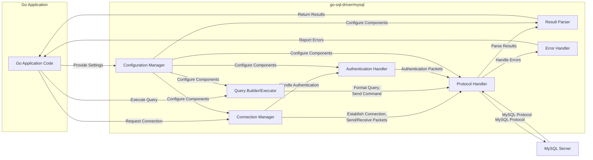
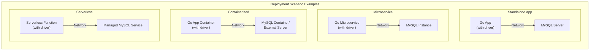

# Project Design Document: go-sql-driver/mysql

**Version:** 1.1
**Date:** October 26, 2023
**Author:** Gemini (AI Language Model)

## 1. Introduction

This document provides an enhanced design overview of the `go-sql-driver/mysql` project, a pure Go MySQL driver for the Go programming language. Building upon the previous version, this document offers a more detailed understanding of the driver's architecture, component interactions, and data flow, further solidifying its role as a foundation for subsequent threat modeling activities.

## 2. Project Overview

The `go-sql-driver/mysql` project remains a cornerstone library for Go developers needing to interact with MySQL databases. It provides a robust and performant implementation of the MySQL client protocol, enabling Go applications to establish, manage, and utilize connections for executing SQL queries and retrieving results. Its widespread adoption underscores its importance in the Go ecosystem.

## 3. Goals

* Deliver a comprehensive and native Go implementation of the MySQL client protocol, adhering closely to its specifications.
* Offer a stable and dependable mechanism for Go applications to seamlessly connect to and interact with MySQL databases.
* Ensure broad compatibility with a diverse range of MySQL server versions and configurations.
* Maintain a focus on performance, minimizing latency and resource consumption during database operations.
* Provide clear and concise documentation, facilitating easy integration and usage for Go developers.
* Support essential MySQL features, including prepared statements, transactions, and various data types.

## 4. Non-Goals

* Development of a full-fledged Object-Relational Mapper (ORM) with features like automatic schema management or complex relationship mapping.
* Implementation of database schema migration tools or functionalities.
* Provision of advanced caching layers beyond basic connection management (application-level caching is expected).
* Inclusion of security features beyond the scope of the standard MySQL protocol (e.g., data encryption at rest within the driver).

## 5. Target Audience

This document is primarily intended for:

* Security engineers and architects tasked with performing thorough threat modeling on systems that leverage the `go-sql-driver/mysql`.
* Developers actively contributing to the development, maintenance, or extension of the `go-sql-driver/mysql` project.
* DevOps engineers responsible for deploying, configuring, and monitoring applications that utilize this driver.
* Software architects and senior developers seeking a deep understanding of the driver's internal workings and design principles.

## 6. System Architecture

The `go-sql-driver/mysql` driver is structured around several interconnected components, each with specific responsibilities in facilitating communication with a MySQL server.

### 6.1. Components

* **Connection Manager:**
    * **Responsibility:** Establishes, maintains, and manages the lifecycle of connections to the MySQL server. This includes opening new connections, potentially reusing existing connections (though explicit connection pooling is often external), and gracefully closing connections.
    * **Details:** Handles parsing connection strings, managing connection state, and potentially implementing basic keep-alive mechanisms. It interacts closely with the Authentication Handler during the initial connection phase.

* **Protocol Handler:**
    * **Responsibility:** Implements the core logic for encoding outgoing requests according to the MySQL client/server protocol and decoding incoming responses.
    * **Details:** Manages the binary format of packets exchanged, including handling different command types, data serialization/deserialization, and error code interpretation. It's responsible for ensuring protocol compliance and handling protocol-level errors.

* **Query Builder/Executor:**
    * **Responsibility:** Takes SQL query strings from the Go application and prepares them for transmission to the MySQL server.
    * **Details:** While not a full query builder, it handles the formatting of queries for execution. Crucially, it provides mechanisms for parameterized queries (using placeholders) to prevent SQL injection vulnerabilities. It interacts with the Protocol Handler to send the formatted query.

* **Result Parser:**
    * **Responsibility:** Processes the raw byte stream received from the MySQL server (via the Protocol Handler) and transforms it into usable Go data structures.
    * **Details:** Handles parsing different result set formats, including row data, metadata (column names, types), and status messages. It maps MySQL data types to corresponding Go types.

* **Authentication Handler:**
    * **Responsibility:** Manages the authentication handshake process with the MySQL server, ensuring secure credential exchange.
    * **Details:** Implements various MySQL authentication methods (e.g., `mysql_native_password`, `caching_sha2_password`). It handles the cryptographic operations required for secure authentication and interacts with the Protocol Handler to send and receive authentication packets.

* **Error Handler:**
    * **Responsibility:**  Intercepts and processes errors that occur during communication with the MySQL server or within the driver itself.
    * **Details:** Parses MySQL-specific error codes and messages, providing more context to the Go application. It may also handle driver-level errors, such as network issues or protocol violations.

* **Configuration Manager:**
    * **Responsibility:** Manages driver-specific configuration options provided by the user.
    * **Details:** Allows customization of connection behavior, such as timeouts, character sets, connection attributes, and enabling/disabling certain features. These configurations influence the behavior of other components.

### 6.2. Enhanced Component Diagram

### 6.3. Detailed Data Flow for Query Execution

The process of executing a SQL query involves a more intricate flow of data and control between the components:

1. **Application Request:** The Go application initiates a database operation (e.g., `db.Query("SELECT * FROM users")`).
2. **Connection Acquisition:** The **Connection Manager** is invoked to provide a valid connection. It may retrieve an existing connection from an internal pool (if implemented externally by the user) or establish a new one.
3. **Query Preparation:** The **Query Builder/Executor** receives the SQL query string. For parameterized queries, the application provides the query with placeholders and separate arguments. The executor prepares the query for transmission, potentially escaping or sanitizing inputs (especially with parameterized queries).
4. **Command Encoding:** The **Query Builder/Executor** passes the prepared query to the **Protocol Handler**. The Protocol Handler encodes the query into the appropriate MySQL command packet format.
5. **Transmission to Server:** The **Protocol Handler** sends the encoded command packet over the established network connection to the **MySQL Server**.
6. **Server Processing:** The **MySQL Server** receives and processes the query.
7. **Response Generation:** The **MySQL Server** generates a response, which could be row data, an error message, or a status update.
8. **Response Transmission:** The **MySQL Server** sends the response back to the driver over the network connection, formatted according to the MySQL protocol.
9. **Packet Reception and Decoding:** The **Protocol Handler** receives the response packets. It decodes the binary data according to the MySQL protocol specification.
10. **Result Parsing:** The **Protocol Handler** passes the decoded data to the **Result Parser**. The Result Parser interprets the data based on the type of query executed (e.g., SELECT, INSERT, UPDATE). It converts the raw bytes into Go data structures like `sql.Rows` or `sql.Result`.
11. **Error Handling (if applicable):** If the MySQL server returns an error, the **Protocol Handler** identifies the error code. The **Error Handler** is invoked to parse the error and provide a more meaningful error to the application.
12. **Result Return:** The **Result Parser** returns the processed data to the Go application.

### 6.4. Authentication Flow Deep Dive

The authentication process is a critical security aspect:

1. **Connection Initiation:** The **Connection Manager** attempts to establish a TCP connection with the MySQL server.
2. **Server Handshake:** The **MySQL Server** sends an initial handshake packet containing server version information, a random salt (scramble), and supported authentication methods.
3. **Handshake Processing:** The **Protocol Handler** receives and parses the handshake packet.
4. **Authentication Method Selection:** The **Authentication Handler** determines the appropriate authentication method to use based on the server's capabilities and the client's configuration.
5. **Credential Retrieval:** The **Authentication Handler** retrieves the username and password from the connection parameters.
6. **Authentication Response Generation:**  Based on the chosen authentication method and the salt from the server, the **Authentication Handler** generates an authentication response. This often involves cryptographic hashing of the password and the salt.
7. **Response Transmission:** The **Authentication Handler** sends the generated authentication response to the **Protocol Handler**.
8. **Server Verification:** The **Protocol Handler** transmits the authentication response to the **MySQL Server**. The server uses its stored credentials and the received response to verify the client's identity.
9. **Authentication Result:** The **MySQL Server** sends an authentication result packet (success or failure).
10. **Result Processing:** The **Protocol Handler** receives the authentication result. If successful, the connection is established. If it fails, the **Error Handler** is invoked, and the connection attempt is terminated.

## 7. Enhanced Security Considerations

Building upon the previous considerations, here are more specific security aspects:

* **Connection Security:**
    * **Opportunistic TLS:** While the driver supports TLS, ensure it's not operating in an "opportunistic" mode where connections fall back to plaintext if TLS negotiation fails. Enforce TLS.
    * **Cipher Suite Selection:** The driver's underlying Go TLS implementation dictates the available cipher suites. Ensure strong and up-to-date cipher suites are used.
    * **Certificate Pinning:** For highly sensitive environments, consider application-level certificate pinning to further validate the server's identity.

* **Authentication:**
    * **Password Hashing Algorithms:** Be aware of the hashing algorithms used by different MySQL authentication plugins and their security implications.
    * **Credential Injection:** Protect against scenarios where attackers might inject malicious connection strings or credentials into the application's configuration.
    * **Secure Credential Storage:** Emphasize the importance of storing database credentials securely (e.g., using environment variables, secrets management systems) and avoiding hardcoding.

* **SQL Injection:**
    * **Prepared Statements are Key:**  Stress the absolute necessity of using parameterized queries (prepared statements) for all user-provided input to prevent SQL injection.
    * **Avoid Dynamic Query Construction:** Discourage constructing SQL queries by directly concatenating strings, as this is a primary source of SQL injection vulnerabilities.

* **Data Confidentiality:**
    * **Data in Transit:** While TLS encrypts data in transit, understand its limitations and ensure proper configuration.
    * **Data at Rest:** The driver doesn't handle data at rest encryption. This is the responsibility of the database server or application-level encryption.
    * **Sensitive Data Handling:** Implement best practices for handling sensitive data within the application, such as avoiding logging sensitive information in plain text.

* **Denial of Service (DoS):**
    * **Connection Limits:** Be mindful of connection limits on the MySQL server and implement robust connection pooling or management to avoid exhausting resources.
    * **Query timeouts:** Configure appropriate query timeouts to prevent long-running or malicious queries from tying up resources.

* **Dependency Security:**
    * **Regular Updates:** Keep the `go-sql-driver/mysql` library updated to benefit from bug fixes and security patches.
    * **Dependency Scanning:** Utilize dependency scanning tools to identify potential vulnerabilities in the driver's dependencies.

## 8. Refined Deployment Model

The `go-sql-driver/mysql` is typically integrated as a library within a Go application. The deployment context can vary:

* **Standalone Applications:** The driver is linked directly into the Go application binary, which connects directly to the MySQL server.
* **Microservices:**  Each microservice requiring database access will include the driver and connect to its designated MySQL instance.
* **Containerized Environments (Docker, Kubernetes):** The Go application and the driver are packaged within a container, communicating with a MySQL server (which may also be containerized or external).
* **Serverless Functions:** The driver can be used within serverless functions to interact with managed MySQL services (e.g., AWS RDS, Google Cloud SQL). Consider connection management implications in ephemeral environments.

## 9. Technologies Used

* **Core Language:** Go
* **Database Protocol Standard:** MySQL Client/Server Protocol
* **Secure Communication:** TLS/SSL (using Go's `crypto/tls` package)

## 10. Future Considerations

* **Enhanced Connection Health Monitoring:** Implement more robust mechanisms for detecting and handling broken or stale connections.
* **Metrics and Observability:**  Integrate with common Go observability libraries to provide metrics on connection usage, query performance, and error rates.
* **Support for Advanced MySQL Features:** Continuously adapt to new features and security enhancements introduced in newer MySQL server versions.

This enhanced design document provides a more granular and comprehensive understanding of the `go-sql-driver/mysql`. This detailed information is crucial for conducting a thorough and effective threat model, enabling the identification of potential security vulnerabilities and the implementation of appropriate mitigation strategies.