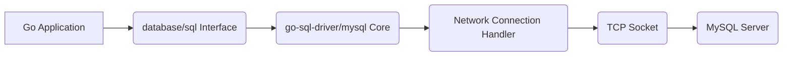
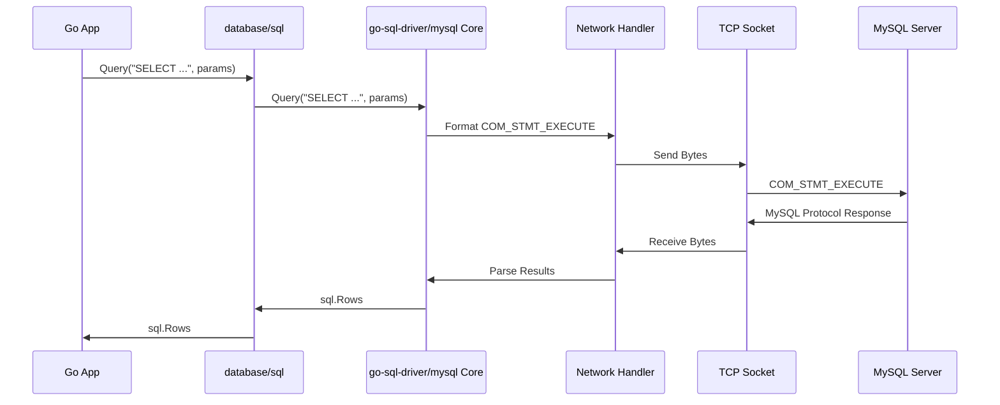

# Project Design Document: go-sql-driver/mysql

**Version:** 1.1
**Date:** October 26, 2023
**Author:** AI Software Architect

## 1. Introduction

This document provides an enhanced and more detailed design overview of the `go-sql-driver/mysql` project, a pure Go MySQL driver for the Go programming language's `database/sql` package. Building upon the previous version, this document further clarifies the architecture, components, and data flow of the driver, with a stronger emphasis on aspects relevant to threat modeling.

## 2. Goals

The primary goals of this design document are to:

*   Provide a comprehensive and in-depth understanding of the `go-sql-driver/mysql` architecture and its internal workings.
*   Clearly identify key components, their specific responsibilities, and their interactions.
*   Thoroughly describe the data flow during various database operations, including connection establishment and error handling.
*   Highlight potential security considerations and vulnerabilities relevant to the driver's design and usage, categorized for clarity.
*   Serve as a robust and detailed basis for future threat modeling exercises, enabling a more granular analysis of potential risks.

## 3. Scope

This document covers the design of the `go-sql-driver/mysql` driver itself, focusing on its interaction with:

*   Go applications utilizing the `database/sql` interface, detailing the API boundaries.
*   MySQL server instances, including the specifics of the MySQL client/server protocol.
*   The underlying network transport (typically TCP), with attention to connection establishment and security.

This document does not cover:

*   The internal implementation details of the Go `database/sql` package beyond its interaction with the driver.
*   The intricate implementation details of the MySQL server.
*   Specific application logic using the driver, although best practices for secure usage will be implied.
*   Operating system level security configurations, although their impact on the driver's security is acknowledged.

## 4. Architectural Overview

The `go-sql-driver/mysql` acts as a crucial bridge, translating Go's abstract database operations into concrete MySQL protocol messages and interpreting the responses. The core architecture, with more detailed component names, can be visualized as follows:

The key components involved are:

*   **Go Application:** The application code that initiates database interactions using the `database/sql` package.
*   **`database/sql` Interface:** Go's standard library interface, providing methods like `Open`, `Query`, `Exec`, and `Prepare`.
*   **`go-sql-driver/mysql` Core:** The central part of the driver, handling protocol implementation, query processing, and result parsing.
*   **Network Connection Handler:** Manages the underlying network connection to the MySQL server, including connection establishment and TLS negotiation.
*   **TCP Socket:** The operating system's abstraction for the network connection.
*   **MySQL Server:** The database server responsible for processing queries and managing data.

## 5. Component Details

### 5.1. `database/sql` Interface

*   Provides a standardized API for database interactions, abstracting away database-specific details.
*   Manages connection pooling, allowing efficient reuse of database connections.
*   Handles transaction management at a high level, providing `Begin`, `Commit`, and `Rollback` methods.
*   Offers mechanisms for prepared statements to enhance performance and security.

### 5.2. `go-sql-driver/mysql` Core

*   **Connection Management Logic:**
    *   Implements the logic for establishing new connections to the MySQL server based on the provided connection string.
    *   Handles connection pooling if not delegated entirely to `database/sql`.
    *   Manages the lifecycle of connections, including handling idle connections and timeouts.
*   **MySQL Protocol Implementation:**
    *   Implements the various stages of the MySQL client/server protocol, including the handshake process.
    *   Encodes SQL queries and commands into the binary MySQL protocol format.
    *   Decodes responses from the MySQL server, including result sets and error messages.
    *   Handles different MySQL protocol versions and capabilities.
*   **Query Processing:**
    *   Receives SQL queries from the `database/sql` interface.
    *   Formats and sends these queries to the MySQL server using the established connection.
    *   Handles different types of queries (e.g., SELECT, INSERT, UPDATE, DELETE).
    *   Manages the execution of prepared statements, including parameter binding.
*   **Result Handling:**
    *   Parses the result sets returned by the MySQL server.
    *   Converts MySQL data types to corresponding Go data types.
    *   Provides the results back to the `database/sql` interface in a usable format (`sql.Rows`).
*   **Transaction Handling:**
    *   Translates `database/sql` transaction commands into the appropriate MySQL protocol commands (e.g., `START TRANSACTION`, `COMMIT`, `ROLLBACK`).
    *   Ensures proper transaction boundaries are maintained.
*   **Error Handling and Mapping:**
    *   Receives error codes and messages from the MySQL server.
    *   Maps these MySQL-specific errors to standard Go error types (`error`).
    *   Provides access to more detailed error information when available.
*   **Character Set and Collation Handling:**
    *   Manages the encoding and decoding of strings based on the configured character set and collation.
    *   Ensures data is transmitted and interpreted correctly.

### 5.3. Network Connection Handler

*   **TCP Connection Establishment:**
    *   Initiates TCP connections to the specified MySQL server address and port.
    *   Handles connection timeouts and retries.
*   **TLS/SSL Negotiation:**
    *   Implements the client-side of the TLS/SSL handshake to establish secure connections.
    *   Supports various TLS versions and cipher suites.
    *   Handles server certificate verification, including options for custom certificate authorities.
*   **Data Transmission and Reception:**
    *   Provides methods for sending and receiving raw bytes over the TCP connection.
    *   Handles potential network errors and connection interruptions.
*   **Connection Pooling (Optional):**
    *   May implement its own connection pooling logic or rely on the `database/sql` package.

### 5.4. TCP Socket

*   The operating system's interface for network communication using the TCP protocol.
*   Handles the low-level details of packet transmission and reception.

### 5.5. MySQL Server

*   Receives and processes SQL queries sent by the client.
*   Authenticates client connections based on provided credentials.
*   Manages databases, tables, and data.
*   Enforces access control and security policies.
*   Returns query results and error messages to the client.

## 6. Data Flow

The following details the data flow for executing a parameterized SQL query, highlighting the steps involved:

1. **Application Request with Parameters:** The Go application calls a method on the `database/sql` `DB` object, such as `db.Query("SELECT * FROM users WHERE id = ?", userID)`.
2. **`database/sql` Prepares Statement (Optional):** If the query is executed multiple times, `database/sql` might prepare the statement.
3. **Driver's `Prepare` Method:** `database/sql` calls the `Prepare` method on the `go-sql-driver/mysql` driver, which sends a `COM_STMT_PREPARE` command to the MySQL server.
4. **Server Prepares Statement:** The MySQL server parses and prepares the statement, returning a statement handle.
5. **Driver's `Query` or `Exec` Method with Parameters:** `database/sql` calls the `Query` or `Exec` method on the driver, providing the statement handle and parameter values.
6. **Parameter Binding and Protocol Formatting:** The driver binds the provided parameter values and formats the request into a `COM_STMT_EXECUTE` command in the MySQL protocol.
7. **Network Transmission:** The driver sends the formatted command over the TCP connection through the Network Connection Handler.
8. **Server Processing:** The MySQL server receives the command, retrieves the prepared statement, substitutes the parameters, executes the query, and prepares the results.
9. **Result Transmission:** The MySQL server sends the query results (or an error message) back to the driver over the TCP connection, using the MySQL protocol.
10. **Driver Result Parsing:** The driver receives the response, parses the MySQL protocol, and converts the results into Go data types (`sql.Rows`).
11. **`database/sql` Response:** The driver returns the results to the `database/sql` package.
12. **Application Receives Results:** The `database/sql` package returns the results to the Go application.

This can be visualized with a more detailed sequence diagram:

## 7. Security Considerations

This section outlines potential security considerations, categorized for better understanding:

### 7.1. Connection Security

*   **Man-in-the-Middle (MITM) Attacks:**
    *   **Vulnerability:** Unencrypted connections are susceptible to eavesdropping and manipulation of data in transit.
    *   **Mitigation:** Enforce TLS/SSL connections by configuring the connection string appropriately (`tls=true` or specifying a custom TLS configuration). Ensure proper server certificate verification.
*   **Downgrade Attacks:**
    *   **Vulnerability:** An attacker might try to force the connection to use an older, less secure TLS version.
    *   **Mitigation:** Configure the driver to use a minimum supported TLS version and strong cipher suites.
*   **Insecure Credential Transmission:**
    *   **Vulnerability:** Sending credentials in plaintext over an unencrypted connection.
    *   **Mitigation:** Always use TLS/SSL to encrypt the connection during the authentication handshake.

### 7.2. Authentication and Authorization

*   **Credential Stuffing/Brute-Force Attacks:**
    *   **Vulnerability:** Attackers attempting to guess valid usernames and passwords.
    *   **Mitigation:**  While the driver itself doesn't prevent this, applications should implement measures like rate limiting and account lockout. Use strong, unique passwords.
*   **Weak Password Policies:**
    *   **Vulnerability:**  Using easily guessable passwords.
    *   **Mitigation:** Enforce strong password policies at the MySQL server level.
*   **Storage of Credentials:**
    *   **Vulnerability:** Storing database credentials insecurely in application code or configuration files.
    *   **Mitigation:** Utilize secure credential management practices, such as environment variables, secrets management systems, or vault solutions.

### 7.3. Data Integrity and Confidentiality

*   **SQL Injection:**
    *   **Vulnerability:** Improperly sanitized user input being incorporated into SQL queries, allowing attackers to execute arbitrary SQL code.
    *   **Mitigation:**  **Crucially, always use parameterized queries (prepared statements)**. The driver facilitates this, but the application developer must use it correctly. Avoid dynamic SQL construction with user input.
*   **Data Exposure through Error Messages:**
    *   **Vulnerability:**  Detailed error messages revealing sensitive information about the database structure or data.
    *   **Mitigation:** Configure the driver and application to log errors appropriately and avoid displaying overly detailed error messages to end-users.
*   **Data Tampering:**
    *   **Vulnerability:**  Unauthorized modification of data in transit (if not using TLS) or within the database.
    *   **Mitigation:** Use TLS for connection encryption. Implement proper authorization and access controls at the MySQL server level.

### 7.4. Availability

*   **Denial of Service (DoS) Attacks:**
    *   **Vulnerability:**  Attackers overwhelming the database server or the driver with excessive requests.
    *   **Mitigation:** Implement connection pooling with appropriate limits, set timeouts for database operations, and consider rate limiting at the application or network level.
*   **Resource Exhaustion:**
    *   **Vulnerability:**  Malicious queries consuming excessive server resources.
    *   **Mitigation:** Implement query timeouts and resource limits on the MySQL server.

### 7.5. Dependency Management

*   **Vulnerabilities in Dependencies:**
    *   **Vulnerability:**  The driver might rely on third-party libraries with known security flaws.
    *   **Mitigation:** Regularly update the driver's dependencies and perform security audits of the dependency tree.

## 8. Future Considerations

*   **Enhanced Support for MySQL Features:** Continuously update the driver to support new features and protocol enhancements introduced in newer MySQL versions.
*   **Performance Optimization:**  Identify and implement further performance improvements in areas like connection handling, query execution, and result parsing.
*   **Improved Observability:**  Integrate with tracing and metrics systems to provide better insights into the driver's behavior and performance.
*   **Advanced Authentication Methods:** Explore and potentially implement support for more advanced MySQL authentication methods.
*   **Security Audits and Hardening:**  Conduct regular security audits of the driver's codebase and configuration options to identify and address potential vulnerabilities.

This improved design document provides a more detailed and security-focused overview of the `go-sql-driver/mysql` project, serving as a valuable resource for comprehensive threat modeling and security analysis.