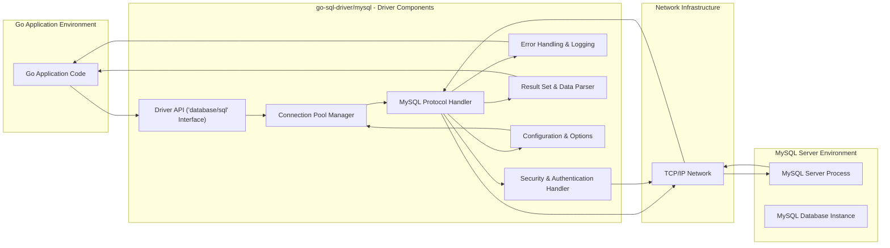

# Project Design Document: go-sql-driver/mysql

**Project Name:** go-sql-driver/mysql

**Project Repository:** [https://github.com/go-sql-driver/mysql](https://github.com/go-sql-driver/mysql)

**Document Version:** 1.1
**Date:** 2023-10-27
**Author:** AI Expert

## 1. Project Overview

### 1.1. Project Description

The `go-sql-driver/mysql` project is a robust, open-source, and widely adopted pure Go MySQL driver designed for use with Go's standard `database/sql` package.  It facilitates seamless interaction between Go applications and MySQL database servers by implementing the native MySQL client protocol. This eliminates the need for C-based MySQL client libraries, simplifying deployment, enhancing portability across different operating systems and architectures, and potentially improving performance in Go environments. The driver focuses on providing a feature-rich, performant, and secure interface for Go developers to leverage the capabilities of MySQL databases.

### 1.2. Project Goals

* **Native Go Implementation:** Provide a MySQL driver written entirely in Go, removing C dependencies and their associated complexities in build processes and deployment.
* **`database/sql` Compatibility:** Fully adhere to Go's `database/sql` interface, ensuring ease of use and integration with existing Go database interaction patterns and libraries.
* **High Performance and Efficiency:** Optimize the driver for speed and minimal resource consumption, crucial for high-throughput applications and efficient database operations.
* **Comprehensive MySQL Feature Support:** Implement a broad spectrum of MySQL features, including but not limited to: connection pooling, prepared statements, transactions, stored procedures, character set handling, and various authentication methods.
* **Security and Reliability Focus:** Prioritize security by supporting encrypted connections (TLS/SSL), secure authentication mechanisms, and robust error handling to prevent vulnerabilities and ensure stable operation.
* **Maintainability and Extensibility:** Design the driver for maintainability and allow for future extensions and feature additions by the open-source community.

### 1.3. Target Audience

The primary users of this driver are Go developers building applications that require connectivity to MySQL databases. This encompasses a wide range of roles and application types:

* **Backend and API Developers:** Building web services, REST APIs, and microservices that rely on MySQL for data persistence.
* **Data Engineers and ETL Developers:** Creating data pipelines, data migration tools, and ETL processes that interact with MySQL databases.
* **DevOps and System Administrators:** Developing automation scripts, monitoring tools, and infrastructure management solutions that involve MySQL.
* **Go Application Developers in General:** Any Go programmer needing to access and manipulate data stored in MySQL databases.

## 2. System Architecture

### 2.1. High-Level Architecture Diagram



### 2.2. Component Description

* **"Go Application Code"**: Represents the Go application that utilizes the `database/sql` package to interact with MySQL. This code initiates database operations through the standard `database/sql` API. It is responsible for constructing SQL queries, processing results, and handling application-specific logic.
* **"Driver API ('database/sql' Interface)"**: This is the public interface of the `go-sql-driver/mysql`. It implements the `database/sql` interfaces (e.g., `DB`, `Conn`, `Stmt`, `Rows`, `Tx`) and functions (e.g., `Open`, `Query`, `Exec`, `Prepare`). This component acts as the entry point for Go applications to interact with the driver, abstracting away the underlying MySQL protocol details.
* **"Connection Pool Manager"**:  Manages a pool of reusable connections to the MySQL server. This component is crucial for performance, as it reduces the overhead of establishing new connections for each database operation. It handles connection creation, idle connection management, connection recycling, and connection limits. Configuration options within this component allow tuning pool size, connection timeouts, and other parameters.
* **"MySQL Protocol Handler"**: The core of the driver, responsible for implementing the MySQL client-server protocol. It handles:
    * **Connection Lifecycle Management:** Establishing, maintaining, and closing TCP connections to the MySQL server.
    * **Command Serialization & Deserialization:** Encoding SQL queries and commands into the binary MySQL protocol format for transmission and decoding server responses.
    * **State Management:** Maintaining the connection state, handling server status flags, and managing the communication flow according to the MySQL protocol specification.
* **"Security & Authentication Handler"**:  Manages all security-related aspects of the connection:
    * **TLS/SSL Encryption:**  Negotiates and establishes encrypted connections using TLS/SSL to protect data confidentiality and integrity during transmission. Handles certificate verification and cipher suite selection.
    * **Authentication Mechanisms:** Implements various MySQL authentication methods, including username/password authentication, and potentially more advanced methods like plugin-based authentication. Securely handles credential management during the authentication process.
* **"Error Handling & Logging"**:  Provides robust error handling and logging capabilities:
    * **Error Detection & Propagation:** Detects errors from the MySQL server and within the driver itself. Translates MySQL error codes into Go error types for application consumption.
    * **Error Logging:** Provides options for logging errors and potentially debug information. This can be crucial for diagnosing issues and monitoring driver behavior.
    * **Graceful Error Recovery:**  Attempts to handle recoverable errors gracefully and provides mechanisms for applications to handle errors appropriately.
* **"Result Set & Data Parser"**:  Responsible for efficiently parsing and converting data received from the MySQL server:
    * **Result Set Parsing:** Parses tabular result sets returned by SELECT queries, converting binary data from the MySQL protocol into Go data structures (e.g., `sql.Rows`).
    * **Data Type Conversion:** Converts MySQL data types (e.g., INT, VARCHAR, TIMESTAMP) to corresponding Go data types (`int`, `string`, `time.Time`). Handles character set conversions and data encoding.
* **"Configuration & Options"**:  Manages driver configuration parameters and connection options. This includes:
    * **Connection String Parsing:** Parses connection strings to extract connection parameters like host, port, username, password, database name, and various connection options.
    * **Option Handling:**  Provides mechanisms to configure various driver behaviors, such as connection timeouts, read/write timeouts, character sets, TLS settings, and connection pool parameters.

* **"TCP/IP Network"**: Represents the underlying network layer facilitating communication between the Go application (via the driver) and the MySQL server.
* **"MySQL Server Process"**: The running MySQL server instance responsible for receiving client connections, processing SQL queries, managing databases, and returning results.
* **"MySQL Database Instance"**: The specific MySQL database instance being accessed, containing tables, stored procedures, user accounts, and the actual data.

## 3. Data Flow

### 3.1. Query Execution Data Flow Diagram

This diagram details the data flow for executing a SQL query, including error scenarios and connection management.

```mermaid
graph LR
    A["Go Application"] --> B["Driver API ('Query'/'Exec')"]: "SQL Query Request"
    B --> C["Connection Pool Manager"]: "Get Connection from Pool"
    C -- "Existing Connection" --> D["MySQL Protocol Handler"]
    C -- "New Connection (if needed)" --> D["MySQL Protocol Handler"]
    D --> E["Security & Authentication Handler"]: "Encryption (TLS), Authentication (if new conn)"
    E --> F["TCP/IP Network"]: "Encrypted/Plain Query & Auth Data"
    F --> G["MySQL Server"]: "Query & Auth Received"
    G --> G["MySQL Server"]: "Query Processing & Database Access"
    G --> F["TCP/IP Network"]: "Query Results / Error Response"
    F --> E["Security & Authentication Handler"]: "Decryption (TLS)"
    E --> D["MySQL Protocol Handler"]: "Results / Error"
    D --> H["Result Set & Data Parser"]: "Parse Results (if successful query)"
    D --> I["Error Handling & Logging"]: "Handle Error (if error response)"
    H --> B["Driver API"]: "Results"
    I --> B["Driver API"]: "Error"
    B --> A["Go Application"]: "Results / Error"
    C -- "Return Connection to Pool" --> C

    style C fill:#f9f,stroke:#333,stroke-width:2px
```

### 3.2. Data Flow Description

1. **"Go Application"** initiates a database operation (e.g., `db.Query()`, `db.Exec()`) sending an "SQL Query Request" to the **"Driver API ('Query'/'Exec')"**.
2. **"Driver API ('Query'/'Exec')"** interacts with the **"Connection Pool Manager"** to "Get Connection from Pool".
3. **"Connection Pool Manager"** checks for an available "Existing Connection" in the pool. If none is available or a new connection is needed, it may establish a "New Connection (if needed)" via the "MySQL Protocol Handler".
4. **"MySQL Protocol Handler"** receives the connection (existing or new) and the SQL query. For new connections, it interacts with the **"Security & Authentication Handler"** for "Encryption (TLS)" and "Authentication".
5. **"Security & Authentication Handler"** handles TLS handshake if configured and performs MySQL authentication.
6. **"TCP/IP Network"** transmits the "Encrypted/Plain Query & Auth Data" to the **"MySQL Server"**.
7. **"MySQL Server"** receives the "Query & Auth Received", performs "Query Processing & Database Access" against the **"MySQL Database Instance"**.
8. **"MySQL Server"** sends back "Query Results / Error Response" through the **"TCP/IP Network"**.
9. **"Security & Authentication Handler"** decrypts the response if TLS is enabled.
10. **"MySQL Protocol Handler"** receives the "Results / Error". If it's a successful query, it passes the results to the **"Result Set & Data Parser"**. If it's an error, it passes it to the **"Error Handling & Logging"**.
11. **"Result Set & Data Parser"** parses the "Results" into Go data types.
12. **"Error Handling & Logging"** handles the "Error", potentially logging it and preparing a Go error object.
13. **"Driver API"** receives either "Results" from the parser or "Error" from the error handler.
14. **"Driver API"** returns the "Results / Error" back to the **"Go Application"**.
15. **"Connection Pool Manager"** receives the connection back from the "MySQL Protocol Handler" and "Return Connection to Pool", making it available for reuse.

## 4. Technology Stack

* **Programming Language:** Go (Golang) - for driver implementation.
* **Database Protocol:** MySQL Client Protocol - for communication with MySQL servers.
* **Networking Protocol:** TCP/IP - for network communication.
* **Security Protocols:** TLS/SSL (Transport Layer Security/Secure Sockets Layer) - for encrypted connections.
* **Authentication Methods:** MySQL Native Password, Caching SHA2 Password, and potentially others as supported by MySQL and implemented in the driver.
* **Standard Library Dependencies:** Go standard library packages (e.g., `net`, `time`, `crypto/tls`, `crypto/sha256`, `database/sql`, `context`, `sync`).

## 5. Security Considerations (Detailed)

This section expands on the initial security considerations, providing more detail and potential threat vectors.

* **Connection Security (TLS/SSL):**
    * **Threat:** Man-in-the-Middle (MITM) attacks, eavesdropping on sensitive data (credentials, query data, results) in transit.
    * **Mitigation:** Enforce TLS/SSL for all connections to encrypt communication. Implement proper certificate validation to prevent MITM attacks using forged certificates. Support strong cipher suites and disable weak or deprecated ones. Configuration options should allow users to enforce TLS versions (e.g., TLS 1.2 or higher).
    * **Configuration Weakness:**  Defaulting to insecure connection modes or allowing easy disabling of TLS can lead to vulnerabilities.
* **Authentication and Credential Management:**
    * **Threat:** Brute-force attacks on login credentials, credential theft, insecure storage of credentials in application code or configuration.
    * **Mitigation:** Support strong authentication mechanisms offered by MySQL. Encourage users to use strong passwords and consider more secure authentication plugins.  The driver itself should not store credentials; it should securely transmit them to the server during authentication. Applications using the driver must follow best practices for secure credential management (e.g., using environment variables, secrets management systems, avoiding hardcoding).
    * **Vulnerability:**  If the driver were to implement a flawed authentication protocol or be susceptible to authentication bypass, it would be a critical vulnerability.
* **SQL Injection Prevention (Application Responsibility, Driver Support):**
    * **Threat:** SQL Injection attacks where malicious SQL code is injected through application inputs, potentially leading to data breaches, data manipulation, or unauthorized access.
    * **Mitigation:**  **Primarily an application-level responsibility.** Applications MUST use parameterized queries (prepared statements) provided by the `database/sql` interface and supported by the driver.  The driver must correctly implement prepared statements and ensure proper escaping/parameterization to prevent SQL injection.
    * **Driver's Role:** The driver's correct implementation of prepared statements is crucial. Bugs in parameter handling within the driver could negate the security benefits of prepared statements.
* **Denial of Service (DoS):**
    * **Threat:**  DoS attacks targeting the driver or the MySQL server, potentially exhausting resources (connections, CPU, memory) and making the application unavailable.
    * **Mitigation:** Connection pooling in the driver helps manage connection resources.  Driver configuration options (e.g., connection limits, timeouts) should be available to mitigate resource exhaustion.  The driver should handle connection failures and server unavailability gracefully, preventing application crashes. Rate limiting and request throttling are typically handled at the application or infrastructure level, but the driver should not introduce vulnerabilities that amplify DoS risks.
    * **Driver-Specific DoS:**  Bugs in the driver's connection handling, protocol parsing, or error handling could be exploited to cause a DoS on the application itself.
* **Protocol Vulnerabilities and Malicious Server Responses:**
    * **Threat:** Vulnerabilities in the MySQL client protocol itself, or malicious responses from a compromised or rogue MySQL server.
    * **Mitigation:**  Adherence to the MySQL protocol specification and secure parsing of protocol messages are critical. The driver should be resilient to malformed or unexpected server responses and avoid vulnerabilities like buffer overflows, integer overflows, or other memory corruption issues when parsing server data. Regular updates to address any discovered protocol vulnerabilities are necessary.
    * **Example:** A malicious server might send excessively large result sets or crafted responses designed to exploit parsing vulnerabilities in the driver.
* **Dependency Security (Go Standard Library):**
    * **Threat:** Security vulnerabilities in the Go standard library components used by the driver.
    * **Mitigation:**  Regularly update the Go toolchain to the latest stable version to benefit from security patches in the standard library. Monitor security advisories related to Go and its standard libraries.

## 6. Assumptions and Constraints

* **Assumptions:**
    * MySQL server is correctly configured and hardened according to security best practices.
    * Network infrastructure is reasonably secure and protected from unauthorized access.
    * Go applications using the driver are developed with security awareness, including input validation, secure credential management, and proper error handling.
    * The driver is used as intended – for connecting to and interacting with MySQL databases – and not misused in unintended or unsupported ways.
* **Constraints:**
    * Must fully implement the `database/sql` interface to ensure compatibility and ease of use within the Go ecosystem.
    * Performance is a critical non-functional requirement; the driver must be efficient and minimize overhead.
    * Broad compatibility with various MySQL server versions (including different versions and distributions) is essential.
    * Maintainability, readability, and adherence to Go coding standards are important for long-term project health and community contributions.
    * Open-source licensing and community-driven development model.

## 7. Future Considerations

* **Enhanced Observability:** Implement more comprehensive logging and tracing capabilities for debugging, performance monitoring, and security auditing. Consider integration with popular observability platforms.
* **Advanced Authentication Plugin Support:** Expand support for more advanced MySQL authentication plugins and methods as they emerge.
* **Performance Tuning and Optimization:** Continuously profile and optimize the driver for even better performance, especially in high-load scenarios. Explore techniques like connection multiplexing or asynchronous operations where applicable within the `database/sql` constraints.
* **Security Audits and Penetration Testing:** Conduct regular security audits and penetration testing by external security experts to proactively identify and address potential vulnerabilities.
* **Improved Connection Management Features:** Explore features like connection health checks, automatic reconnection strategies, and more granular control over connection pool behavior.
* **Support for Emerging MySQL Features:**  Continuously adapt and add support for new features and protocol extensions introduced in newer MySQL server versions.

This improved design document provides a more detailed and comprehensive overview of the `go-sql-driver/mysql` project. It will serve as a strong foundation for developing a thorough threat model and implementing robust security measures.