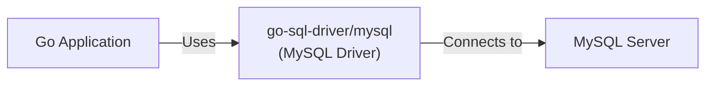
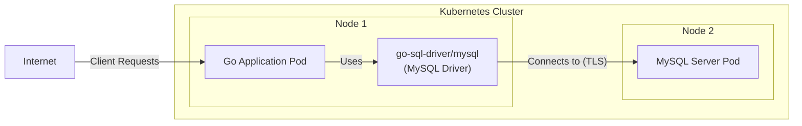
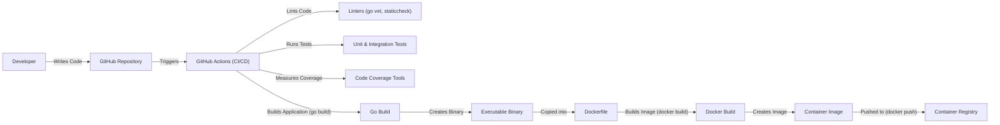

Okay, let's create a design document for the `go-sql-driver/mysql` project. This is a popular MySQL driver for Go's `database/sql` package.  Since it's a library, the "deployment" aspect will be slightly different than a typical application.

# BUSINESS POSTURE

*   Priorities and Goals:
    *   Provide a reliable and efficient MySQL driver for Go applications.
    *   Maintain compatibility with various MySQL server versions.
    *   Ensure data integrity and security during database interactions.
    *   Offer a user-friendly API that integrates seamlessly with Go's `database/sql` package.
    *   Provide good performance.
    *   Provide good test coverage.
*   Business Risks:
    *   Data breaches due to SQL injection vulnerabilities.
    *   Data corruption caused by driver bugs.
    *   Connection leaks or instability leading to application downtime.
    *   Incompatibility with specific MySQL server configurations, limiting adoption.
    *   Performance bottlenecks impacting application responsiveness.
    *   Lack of support for newer MySQL features.

# SECURITY POSTURE

*   Existing Security Controls:
    *   security control: Parameterized queries (prepared statements) are supported and encouraged through the `database/sql` interface, mitigating SQL injection risks. (Implemented in Go's `database/sql` package and utilized by this driver).
    *   security control: TLS/SSL connection support for encrypted communication with the MySQL server. (Described in the project's README and implemented within the driver).
    *   security control: Tests to prevent regressions. (Implemented in GitHub Actions).
    *   security control: Go modules to manage dependencies. (Implemented in go.mod file).
    *   security control: Automatic connection retries. (Implemented in the driver).
*   Accepted Risks:
    *   accepted risk: The driver relies on the security of the underlying MySQL server configuration. Misconfigurations on the server-side (e.g., weak passwords, exposed ports) are outside the driver's control.
    *   accepted risk: The driver itself might contain undiscovered vulnerabilities, although the project's maturity and widespread use reduce this risk.
    *   accepted risk: The driver does not implement advanced security features like client-side field-level encryption.
    *   accepted risk: The driver does not implement protection against timing attacks.
*   Recommended Security Controls:
    *   security control: Integrate with static analysis tools (e.g., GoSec) to automatically detect potential security issues in the driver's codebase during development.
    *   security control: Conduct regular security audits and penetration testing to identify and address vulnerabilities.
    *   security control: Implement fuzz testing to discover edge cases and unexpected behavior that could lead to security flaws.
    *   security control: Provide clear documentation and examples on secure usage patterns, emphasizing the importance of parameterized queries and secure connection configurations.
*   Security Requirements:
    *   Authentication: The driver must support secure authentication mechanisms provided by MySQL, including password-based authentication and potentially plugin-based authentication (e.g., using PAM or native MySQL plugins). TLS/SSL should be used to protect credentials in transit.
    *   Authorization: The driver should not bypass or interfere with MySQL's built-in authorization mechanisms. Access control should be managed on the MySQL server.
    *   Input Validation: While the primary responsibility for preventing SQL injection lies with the application using the driver (by using parameterized queries), the driver should internally handle input sanitization where appropriate to provide an additional layer of defense.
    *   Cryptography: The driver must support secure communication with the MySQL server using TLS/SSL. It should correctly handle certificate validation and cipher suite negotiation.

# DESIGN

## C4 CONTEXT

*   Elements:
    *   1. Name: Go Application
        *   Type: Software System
        *   Description: Any application written in Go that uses the `database/sql` package and this MySQL driver to interact with a MySQL database.
        *   Responsibilities:
            *   Initiates database connections.
            *   Executes SQL queries and commands.
            *   Processes query results.
            *   Handles database transactions.
        *   Security Controls:
            *   Uses parameterized queries to prevent SQL injection.
            *   Implements appropriate error handling and input validation.
            *   Manages database connections securely (e.g., connection pooling, timeouts).
    *   2. Name: go-sql-driver/mysql (MySQL Driver)
        *   Type: Software Library
        *   Description: The Go MySQL driver library, providing the implementation for interacting with MySQL servers.
        *   Responsibilities:
            *   Establishes connections to the MySQL server.
            *   Translates Go's `database/sql` calls into MySQL network protocol commands.
            *   Handles data type conversions between Go and MySQL.
            *   Manages connection state and errors.
        *   Security Controls:
            *   Supports TLS/SSL for secure connections.
            *   Provides mechanisms for parameterized queries (through `database/sql`).
            *   Handles character encoding correctly.
    *   3. Name: MySQL Server
        *   Type: Database System
        *   Description: The MySQL database server that stores and manages the data.
        *   Responsibilities:
            *   Receives and processes SQL queries from clients.
            *   Manages data storage and retrieval.
            *   Enforces access control and security policies.
            *   Handles transactions and data consistency.
        *   Security Controls:
            *   Implements user authentication and authorization.
            *   Provides data encryption at rest and in transit (if configured).
            *   Offers auditing and logging capabilities.
            *   Includes security features like firewalls and intrusion detection systems (depending on deployment).

## C4 CONTAINER

Since this is a library, the container diagram is essentially the same as the context diagram. The "container" in this case is the library itself.

*   Elements:
    *   1. Name: Go Application
        *   Type: Software System
        *   Description: Any application written in Go that uses the `database/sql` package and this MySQL driver to interact with a MySQL database.
        *   Responsibilities:
            *   Initiates database connections.
            *   Executes SQL queries and commands.
            *   Processes query results.
            *   Handles database transactions.
        *   Security Controls:
            *   Uses parameterized queries to prevent SQL injection.
            *   Implements appropriate error handling and input validation.
            *   Manages database connections securely (e.g., connection pooling, timeouts).
    *   2. Name: go-sql-driver/mysql (MySQL Driver)
        *   Type: Software Library
        *   Description: The Go MySQL driver library, providing the implementation for interacting with MySQL servers.
        *   Responsibilities:
            *   Establishes connections to the MySQL server.
            *   Translates Go's `database/sql` calls into MySQL network protocol commands.
            *   Handles data type conversions between Go and MySQL.
            *   Manages connection state and errors.
        *   Security Controls:
            *   Supports TLS/SSL for secure connections.
            *   Provides mechanisms for parameterized queries (through `database/sql`).
            *   Handles character encoding correctly.
    *   3. Name: MySQL Server
        *   Type: Database System
        *   Description: The MySQL database server that stores and manages the data.
        *   Responsibilities:
            *   Receives and processes SQL queries from clients.
            *   Manages data storage and retrieval.
            *   Enforces access control and security policies.
            *   Handles transactions and data consistency.
        *   Security Controls:
            *   Implements user authentication and authorization.
            *   Provides data encryption at rest and in transit (if configured).
            *   Offers auditing and logging capabilities.
            *   Includes security features like firewalls and intrusion detection systems (depending on deployment).

## DEPLOYMENT

The `go-sql-driver/mysql` library is not deployed in the traditional sense. It's a dependency that gets compiled into a Go application.  However, we can describe the deployment of a Go application *using* this driver.

*   Possible Deployment Solutions:
    *   Bare Metal Server: The Go application (with the compiled driver) is deployed directly onto a physical server.
    *   Virtual Machine (VM): The Go application is deployed within a VM on a hypervisor.
    *   Container (e.g., Docker): The Go application is packaged into a container image and deployed using a container orchestration platform (e.g., Kubernetes, Docker Swarm).
    *   Serverless (e.g., AWS Lambda, Google Cloud Functions): The Go application is deployed as a serverless function. This often involves specific packaging and deployment tools provided by the cloud provider.

*   Chosen Solution (Example: Containerized Deployment with Kubernetes):

*   Elements:
    *   1. Name: Kubernetes Cluster
        *   Type: Container Orchestration Platform
        *   Description:  A Kubernetes cluster manages the deployment, scaling, and operation of containerized applications.
        *   Responsibilities:
            *   Scheduling and running containers.
            *   Managing networking and storage for containers.
            *   Providing service discovery and load balancing.
            *   Monitoring container health and restarting failed containers.
        *   Security Controls:
            *   Role-Based Access Control (RBAC) for managing cluster access.
            *   Network policies to control traffic flow between pods.
            *   Pod security policies to enforce security constraints on pods.
            *   Secrets management for storing sensitive data.
    *   2. Name: Node 1
        *   Type: Worker Node
        *   Description: A physical or virtual machine that is part of the Kubernetes cluster.
        *   Responsibilities: Running pods.
        *   Security Controls: OS hardening, regular security updates.
    *   3. Name: Node 2
        *   Type: Worker Node
        *   Description: A physical or virtual machine that is part of the Kubernetes cluster.
        *   Responsibilities: Running pods.
        *   Security Controls: OS hardening, regular security updates.
    *   4. Name: Go Application Pod
        *   Type: Pod
        *   Description: A Kubernetes pod running the Go application, which includes the compiled MySQL driver.
        *   Responsibilities:
            *   Executing the application logic.
            *   Connecting to the MySQL database.
        *   Security Controls:
            *   Runs as a non-root user.
            *   Uses resource limits to prevent resource exhaustion.
            *   Mounts secrets securely.
    *   5. Name: go-sql-driver/mysql (MySQL Driver)
        *   Type: Software Library
        *   Description: The compiled-in MySQL driver.
        *   Responsibilities:
            *   Facilitating communication with the MySQL server.
        *   Security Controls:
            *   Uses TLS for encrypted communication.
    *   6. Name: MySQL Server Pod
        *   Type: Pod
        *   Description: A Kubernetes pod running the MySQL server.
        *   Responsibilities:
            *   Storing and managing data.
            *   Responding to database queries.
        *   Security Controls:
            *   Runs as a non-root user.
            *   Uses persistent volumes for data storage.
            *   Configured with strong passwords and appropriate access controls.
            *   Network policies restrict access to the pod.
    *   7. Name: Internet
        *   Type: Network
        *   Description: External network.
        *   Responsibilities: Provides access to application.
        *   Security Controls: Firewall, WAF.

## BUILD

The build process for the `go-sql-driver/mysql` library itself, and for applications using it, are distinct.

*   Library Build Process:

    *   Developer writes code and tests.
    *   Code is pushed to the GitHub repository.
    *   GitHub Actions (CI/CD) are triggered:
        *   Code is linted (using `go vet`, `staticcheck`, etc.).
        *   Tests are run (including unit tests and integration tests against a real MySQL server).
        *   Code coverage is measured.
        *   If all checks pass, a new version can be tagged and released.  Go modules handle dependency management and versioning.
    *   The library is *not* "built" into a standalone artifact; it's a source code library.

*   Application Build Process (Example using Go modules and Docker):

    *   Developer writes application code that imports `go-sql-driver/mysql`.
    *   `go mod tidy` is used to manage dependencies (downloading the driver if needed).
    *   `go build` compiles the application, including the linked driver code, into a single executable binary.
    *   A Dockerfile is used to create a container image:
        *   The Go binary is copied into the image.
        *   Any necessary configuration files are added.
        *   A base image (e.g., `golang:alpine`) is used to minimize image size and attack surface.
    *   `docker build` creates the container image.
    *   `docker push` pushes the image to a container registry (e.g., Docker Hub, Google Container Registry).
    *   The image can then be deployed to a container orchestration platform (e.g., Kubernetes).

*   Security Controls in Build Process:
    *   security control: Dependency management with Go modules ensures that known-good versions of dependencies are used.
    *   security control: Static analysis tools (linters) help identify potential code quality and security issues.
    *   security control: Automated testing (unit and integration tests) verifies the correctness and security of the code.
    *   security control: Containerization (using Docker) provides isolation and reduces the attack surface.
    *   security control: Minimal base images for containers minimize the inclusion of unnecessary software.
    *   security control: Container image scanning (using tools like Trivy, Clair) can detect vulnerabilities in the container image.

# RISK ASSESSMENT

*   Critical Business Processes:
    *   Reliable data storage and retrieval for applications using MySQL databases.
    *   Maintaining data integrity and consistency.
    *   Ensuring application availability and responsiveness.

*   Data Protection:
    *   Data Sensitivity: Varies greatly depending on the application using the driver. Could range from non-sensitive public data to highly sensitive PII, financial data, or trade secrets.
    *   Data in Transit: Must be protected using TLS/SSL encryption.
    *   Data at Rest: The driver itself doesn't handle data at rest; this is the responsibility of the MySQL server configuration.
    *   Data handled by the driver:
        *   SQL queries (potentially containing sensitive data).
        *   Query results (containing data retrieved from the database).
        *   Connection parameters (including usernames and passwords).

# QUESTIONS & ASSUMPTIONS

*   Questions:
    *   What specific MySQL server versions are targeted for compatibility?
    *   Are there any specific performance requirements or benchmarks?
    *   Are there any plans to support advanced MySQL features like JSON data types or stored procedures?
    *   What is the expected level of concurrency (number of simultaneous connections)?
    *   Are there any specific security certifications or compliance requirements (e.g., PCI DSS, HIPAA)?
    *   What are the plans for handling future vulnerabilities?
    *   What are the plans for supporting new authentication plugins?

*   Assumptions:
    *   assumption: Developers using the driver will follow secure coding practices, especially using parameterized queries to prevent SQL injection.
    *   assumption: The MySQL server is configured securely, with strong passwords, appropriate access controls, and TLS/SSL enabled.
    *   assumption: The Go application using the driver will handle errors and exceptions gracefully.
    *   assumption: The network connection between the application and the MySQL server is reasonably reliable.
    *   assumption: The underlying operating system and infrastructure are secure.
    *   assumption: Go modules will be used for dependency management.
    *   assumption: GitHub Actions will be used for CI/CD.