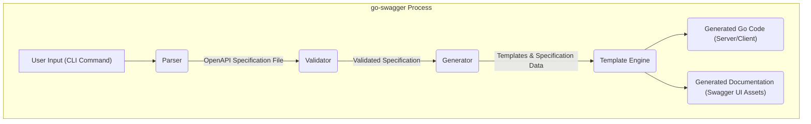

# Project Design Document: go-swagger

**Version:** 1.1
**Date:** October 26, 2023
**Author:** AI Software Architect

## 1. Introduction

This document provides a detailed design overview of the go-swagger project. go-swagger is a widely adopted open-source project offering a comprehensive toolkit for working with the OpenAPI Specification (formerly known as Swagger) within the Go programming language ecosystem. This document aims to clearly articulate the project's architecture, individual components, and the flow of data between them. It serves as a foundational resource for subsequent threat modeling activities and provides a clear understanding of the system's structure.

## 2. Goals

The primary goals of the go-swagger project are to:

*   Enable the parsing and validation of OpenAPI specifications, ensuring adherence to the specification's rules.
*   Facilitate the generation of idiomatic Go server-side code (including handlers, data models, and routing logic) directly from OpenAPI specifications.
*   Enable the generation of Go client-side code, simplifying the process of consuming APIs defined by OpenAPI specifications.
*   Generate interactive and user-friendly API documentation (leveraging Swagger UI) from OpenAPI specifications.
*   Provide a robust and intuitive command-line interface (CLI) for seamless interaction with the parsing, validation, and generation functionalities.
*   Maintain compatibility and support for various versions of the OpenAPI specification.

## 3. Scope

This design document specifically focuses on the internal architecture and core functionalities of the go-swagger project itself. It encompasses the processes of parsing OpenAPI specifications, validating their structure and content, generating code (both server and client), and generating API documentation. The scope explicitly excludes the specifics of the *generated* code, the applications that utilize these generated artifacts, and the detailed implementation of the Swagger UI library itself.

## 4. Non-Goals

This design document does not cover:

*   The detailed implementation of specific Go packages used within go-swagger.
*   Performance benchmarks or optimization strategies for go-swagger.
*   The specifics of how generated code should be deployed or managed.
*   Detailed instructions on how to use the go-swagger CLI (refer to the project's documentation for this).
*   The internal workings of the Swagger UI library beyond its integration with go-swagger.

## 5. High-Level Architecture

The go-swagger project is architected as a modular system, comprising several distinct components that collaborate to achieve its goals.

*   **Parser:** The entry point for processing OpenAPI specifications, responsible for reading and interpreting the specification file.
*   **Validator:** Ensures the structural and semantic correctness of the parsed OpenAPI specification against the specification's rules.
*   **Generator:** The core engine for transforming the validated specification into various outputs like Go code and documentation.
*   **Template Engine:**  A crucial sub-component of the Generator, responsible for applying templates to the specification data to produce the final output.
*   **CLI (Command Line Interface):** The primary interface for users to interact with go-swagger's functionalities.
*   **Swagger UI Integration:**  The mechanism for generating and potentially serving interactive API documentation.

## 6. Detailed Component Description

### 6.1. Parser

*   **Functionality:** Reads and deserializes OpenAPI specification files, supporting both JSON and YAML formats. Transforms the specification into an internal, structured representation suitable for further processing.
*   **Input:** A file path or a remote URL pointing to an OpenAPI specification file.
*   **Output:** An in-memory data structure (likely a set of Go structs) representing the complete OpenAPI specification.
*   **Key Considerations:** Must handle different OpenAPI specification versions correctly. Needs robust error handling for malformed or syntactically incorrect specification files. Should be resilient against potential denial-of-service attempts through excessively large or deeply nested specifications.

### 6.2. Validator

*   **Functionality:** Analyzes the in-memory representation of the OpenAPI specification produced by the Parser. Enforces the rules and constraints defined by the OpenAPI specification standard. Reports any violations as validation errors.
*   **Input:** The in-memory representation of the OpenAPI specification.
*   **Output:** A list of validation errors, if any are found. If no errors are present, it implicitly confirms the specification's validity.
*   **Key Considerations:**  Implements the complete set of validation rules for the supported OpenAPI specification versions. Provides clear and actionable error messages to assist users in correcting their specifications.

### 6.3. Generator

*   **Functionality:**  The central component responsible for transforming the validated OpenAPI specification into tangible outputs. This includes generating Go server-side code, Go client-side code, and the necessary assets for Swagger UI documentation.
*   **Input:** The validated in-memory representation of the OpenAPI specification. Configuration options specifying the desired output type (server, client, documentation) and any relevant customization settings.
*   **Output:** Generated Go source code files (organized into packages), static files for Swagger UI (HTML, CSS, JavaScript).
*   **Sub-components:**
    *   **Server Generator:**  Generates Go code for API handlers, data models (structs), request and response validation logic, and routing configurations based on the specification's paths and operations.
    *   **Client Generator:** Generates Go code for making API requests, including data models for request and response bodies, and functions for interacting with the API endpoints.
    *   **Documentation Generator:**  Generates the necessary configuration and static files to render interactive API documentation using Swagger UI, reflecting the API defined in the specification.
*   **Key Considerations:**  Heavily relies on the Template Engine for code and documentation generation. Needs to handle various code generation options and user-defined customizations. The security of the generated code is paramount.

### 6.4. Template Engine

*   **Functionality:** Processes template files, typically written using Go's `text/template` or `html/template` packages. Merges the template logic with data extracted from the validated OpenAPI specification to produce the final output (Go code or documentation files).
*   **Input:** Template files containing placeholders and control structures, the validated OpenAPI specification data.
*   **Output:** Generated text-based output, which constitutes the Go source code or the files for Swagger UI.
*   **Key Considerations:**  The security of the templates is critical. Care must be taken to prevent template injection vulnerabilities if user-controlled data is incorporated into the templates.

### 6.5. CLI (Command Line Interface)

*   **Functionality:** Provides a command-line interface for users to interact with go-swagger's core functionalities. Parses user commands and options, invokes the appropriate components (Parser, Validator, Generator), and displays the results or error messages.
*   **Input:** Command-line arguments and options provided by the user.
*   **Output:**  Feedback to the user, including success messages, generated file paths, or error messages indicating issues with the specification or generation process.
*   **Key Considerations:**  Needs robust input validation to prevent unexpected behavior or security issues. Should provide clear and informative error messages.

### 6.6. Swagger UI Integration

*   **Functionality:** Integrates the Swagger UI library to generate interactive and visually appealing API documentation. Can optionally serve the generated documentation through an embedded web server for easy access during development.
*   **Input:** The validated OpenAPI specification. Configuration options for customizing the Swagger UI.
*   **Output:** Static HTML, CSS, and JavaScript files that constitute the Swagger UI. Optionally, a running web server serving these files.
*   **Key Considerations:**  Ensures the generated Swagger UI accurately reflects the API defined in the specification. Consider the security implications if the Swagger UI is served in a production environment.

## 7. Data Flow

**Data Flow Description:**

1. The user initiates the go-swagger process by executing a command through the **CLI**.
2. The **Parser** receives the path to the OpenAPI Specification file from the CLI command.
3. The **Parser** reads and parses the **OpenAPI Specification File**, producing an in-memory representation.
4. The **Validator** receives the in-memory representation of the specification.
5. The **Validator** performs validation checks and outputs the **Validated Specification** (or error messages).
6. The **Generator** receives the validated specification and any specified generation options.
7. The **Generator** utilizes predefined **Templates** and the **Specification Data**.
8. The **Template Engine** processes the templates, populating them with data from the specification.
9. The **Template Engine** generates **Go Code** (either server-side or client-side, depending on the configuration).
10. The **Template Engine** also generates **Documentation** assets for the Swagger UI.

## 8. Key Data Elements

*   **OpenAPI Specification File:** The fundamental input to go-swagger, defining the API's structure, endpoints, data models, and other characteristics. Can be in either JSON or YAML format.
*   **Parsed Specification (In-Memory):** The internal representation of the OpenAPI specification after it has been successfully parsed by the Parser. This is typically a structured set of Go data types.
*   **Templates:** Files containing the blueprint and logic for generating code and documentation. These templates use a templating language (likely Go's `text/template` or `html/template`).
*   **Validated Specification:** The in-memory representation of the OpenAPI specification after it has been successfully validated by the Validator.
*   **Generated Go Code:** The output of the code generation process, encompassing server handlers, data models, client libraries, and related code.
*   **Swagger UI Assets:** The collection of HTML, CSS, JavaScript, and image files that constitute the interactive API documentation rendered by Swagger UI.

## 9. Security Considerations (Pre-Threat Modeling)

This section highlights potential security considerations that warrant further investigation during a dedicated threat modeling exercise.

*   **Input Validation Vulnerabilities (Parser):**  The Parser could be vulnerable to attacks exploiting weaknesses in its parsing logic when processing maliciously crafted OpenAPI specification files. This could lead to denial-of-service, resource exhaustion, or even arbitrary code execution.
*   **Template Injection Vulnerabilities (Template Engine):** If user-controlled data from the OpenAPI specification is directly embedded into templates without proper sanitization, it could create opportunities for template injection attacks, potentially leading to arbitrary code execution on the server running go-swagger.
*   **Vulnerabilities in Generated Code:** Flaws in the templates or the generation logic could result in the generation of insecure code. Examples include:
    *   **Server-side:**  Generated handlers susceptible to injection attacks (SQL injection, command injection), cross-site scripting (XSS) vulnerabilities in generated responses, or insecure deserialization of request bodies.
    *   **Client-side:** Generated clients that do not properly handle untrusted server responses, leading to vulnerabilities.
*   **Dependency Vulnerabilities:** go-swagger relies on external Go libraries. Vulnerabilities in these dependencies could introduce security risks to go-swagger itself. Regular dependency updates and security audits are crucial.
*   **Access Control for CLI Execution:**  Restricting who can execute the go-swagger CLI is important, as unauthorized execution could lead to the generation of malicious code or the exposure of sensitive API definitions.
*   **Security of Configuration Files:** If go-swagger utilizes configuration files, the security of these files and any sensitive information they contain (e.g., API keys, credentials) needs careful consideration.
*   **Exposure of Sensitive Information in Generated Documentation:**  Ensure that the generated Swagger UI documentation does not inadvertently expose sensitive information, such as internal API endpoints or security details, if it is publicly accessible.

## 10. Deployment Considerations

go-swagger is primarily employed as a development-time tool, typically integrated into software development workflows and CI/CD pipelines.

*   **Local Development Environment:** Developers use the go-swagger CLI on their local machines to generate server and client code, as well as API documentation, during the development process.
*   **Continuous Integration/Continuous Deployment (CI/CD) Pipelines:** go-swagger can be integrated into CI/CD pipelines to automate the generation of code and documentation whenever the OpenAPI specification is updated. This ensures that the generated artifacts are always in sync with the latest API definition.
*   **Documentation Hosting:** The generated Swagger UI assets are typically deployed as static files on a web server or a content delivery network (CDN) to make the API documentation accessible to developers and consumers.
*   **Internal Tooling:**  Organizations might use go-swagger as part of internal tooling to generate client libraries for their internal microservices, streamlining communication between services.

## 11. Technology Stack

*   **Programming Language:** Go
*   **OpenAPI Specification Support:** Supports OpenAPI Specification versions 2.0 and 3.x.
*   **Template Engine:** Primarily utilizes Go's standard `text/template` and `html/template` packages.
*   **YAML/JSON Parsing:** Leverages Go libraries for parsing YAML and JSON, such as `gopkg.in/yaml.v3` and `encoding/json`.
*   **CLI Framework:**  Employs the `github.com/spf13/cobra` library for building the command-line interface.
*   **Swagger UI:** Integrates the standard Swagger UI JavaScript library for rendering interactive API documentation.

This improved design document provides a more detailed and structured overview of the go-swagger project, enhancing its value as a foundation for threat modeling and general understanding of the system. The added clarity, expanded component descriptions, and more specific security considerations contribute to a more comprehensive and useful resource.