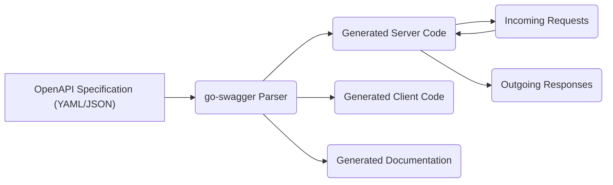

## High and Critical go-swagger Threats

This list focuses on high and critical threats directly involving the `go-swagger` library.

### Threat Flow Diagram

### Threat List

*   **Threat:** Maliciously Crafted OpenAPI Specification - Denial of Service
    *   **Description:** An attacker provides a specially crafted OpenAPI specification (e.g., with extremely deep nesting or very large arrays) that overwhelms the `go-swagger` parser during processing. This could prevent the application from starting or cause it to become unresponsive.
    *   **Impact:** Application downtime, resource exhaustion on the server running the `go-swagger` tooling.
    *   **Affected Component:** `go-swagger Parser`
    *   **Risk Severity:** High
    *   **Mitigation Strategies:**
        *   Implement resource limits (e.g., memory, CPU time) for the `go-swagger` parsing process.
        *   Use a schema validator to pre-validate OpenAPI specifications before using them with `go-swagger`.
        *   Monitor resource usage during the specification parsing phase.

*   **Threat:** Maliciously Crafted OpenAPI Specification - Code Injection during Generation
    *   **Description:** An attacker crafts an OpenAPI specification that exploits a vulnerability in the `go-swagger` parser to inject malicious code into the generated server or client code. This code could then be executed by the application.
    *   **Impact:** Full compromise of the application and potentially the underlying server.
    *   **Affected Component:** `go-swagger Parser`
    *   **Risk Severity:** Critical
    *   **Mitigation Strategies:**
        *   Keep `go-swagger` updated to the latest version to benefit from security patches.
        *   Perform rigorous security code reviews of the generated code.
        *   Use static analysis security testing (SAST) tools on the generated code.
        *   Restrict access to the OpenAPI specification files.

*   **Threat:** Insecure Handling of External References ($ref) - Man-in-the-Middle (MITM)
    *   **Description:** The OpenAPI specification uses external references ($ref) that are fetched over an insecure protocol (HTTP). An attacker intercepts the network traffic and modifies the referenced content, potentially injecting malicious data or code.
    *   **Impact:**  Compromised generated code, leading to application vulnerabilities or malicious behavior.
    *   **Affected Component:** `go-swagger Parser`
    *   **Risk Severity:** High
    *   **Mitigation Strategies:**
        *   Ensure all external references in OpenAPI specifications use HTTPS.
        *   Implement mechanisms to verify the integrity of fetched external references (e.g., using checksums or digital signatures).
        *   Restrict the domains from which external references are allowed.

*   **Threat:** Insecure Handling of External References ($ref) - Server-Side Request Forgery (SSRF)
    *   **Description:** An attacker manipulates the external references in the OpenAPI specification to cause the `go-swagger` parser to make requests to internal or restricted network resources.
    *   **Impact:** Exposure of internal services, potential data breaches, or the ability to pivot to other internal systems.
    *   **Affected Component:** `go-swagger Parser`
    *   **Risk Severity:** High
    *   **Mitigation Strategies:**
        *   Implement a strict allow-list of allowed domains or IP addresses for external references.
        *   Disable or restrict the use of external references if not absolutely necessary.
        *   Sanitize and validate the URLs of external references.

*   **Threat:** Incorrect Handling of Security Definitions in Generated Server Code
    *   **Description:** The generated server code does not correctly implement the security schemes (e.g., API keys, OAuth2) defined in the OpenAPI specification, leading to authentication or authorization bypasses. This is a direct consequence of how `go-swagger` interprets and generates code based on the security definitions.
    *   **Impact:** Unauthorized access to resources, data breaches, and potential for privilege escalation.
    *   **Affected Component:** `Generated Server Code` (specifically the security implementation generated by `go-swagger`)
    *   **Risk Severity:** Critical
    *   **Mitigation Strategies:**
        *   Carefully review the generated authentication and authorization logic.
        *   Implement robust testing of the security mechanisms.
        *   Consult security best practices for implementing the specified security schemes.
        *   Consider using security middleware or frameworks to supplement the generated security logic.

*   **Threat:** Hardcoded Credentials or API Keys in Generated Client Code
    *   **Description:** The OpenAPI specification or the way `go-swagger` is used leads to hardcoding credentials or API keys directly into the generated client code. This is a direct result of how `go-swagger` processes the specification and generates client code.
    *   **Impact:** Complete compromise of the associated accounts or services if the client code is exposed.
    *   **Affected Component:** `Generated Client Code` (specifically the code generation logic in `go-swagger`)
    *   **Risk Severity:** Critical
    *   **Mitigation Strategies:**
        *   Avoid hardcoding credentials in the OpenAPI specification or during `go-swagger` usage.
        *   Use secure methods for managing and storing credentials, such as environment variables or dedicated secrets management systems.
        *   Review the generated client code for any hardcoded secrets.
