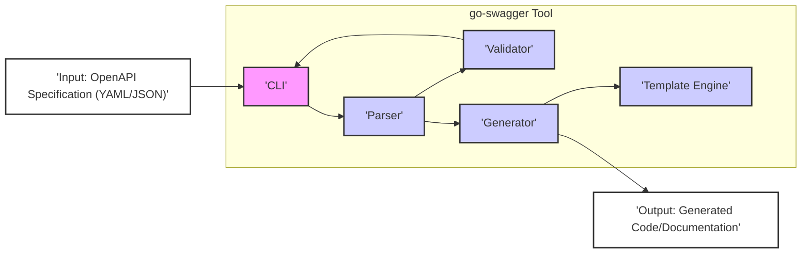

# Project Design Document: go-swagger

**Version:** 1.1
**Date:** October 26, 2023
**Author:** AI Software Architect

## 1. Introduction

This document provides an enhanced and more detailed design overview of the `go-swagger` project. Building upon the previous version, this document aims to provide an even stronger foundation for subsequent threat modeling activities. It elaborates on the key components, data flows, and architectural considerations of the `go-swagger` tool, offering a deeper understanding of the system's structure and functionality for security analysis.

## 2. Goals

*   Provide a comprehensive and granular description of the architecture and components of the `go-swagger` project.
*   Detail the data flow within the system, including data transformations and interactions between components.
*   Clearly identify interaction points, trust boundaries, and potential attack surfaces.
*   Offer sufficient technical detail to facilitate effective and targeted threat modeling.

## 3. Overview

`go-swagger` is a powerful open-source project written in Go, offering a comprehensive suite of tools for managing and utilizing OpenAPI specifications (formerly known as Swagger). Its core functionalities include parsing, validating, and generating code and documentation from OpenAPI documents. This enables developers to streamline API development by automatically creating server stubs, client SDKs, and interactive documentation.

## 4. Architecture

The `go-swagger` project comprises several interconnected components, each with specific responsibilities:

*   **Command Line Interface (CLI):**
    *   The primary entry point for users to interact with `go-swagger`.
    *   Accepts commands and flags to initiate various operations like code generation, validation, and specification analysis.
    *   Responsible for parsing user input and delegating tasks to other components.
*   **Parser:**
    *   Responsible for reading and interpreting OpenAPI specification files, supporting both YAML and JSON formats.
    *   Performs lexical analysis and syntax parsing to convert the specification into an internal, structured representation (often a set of Go data structures).
    *   Handles different versions of the OpenAPI specification.
*   **Validator:**
    *   Ensures that the parsed OpenAPI specification adheres to the rules and constraints defined by the OpenAPI specification standard.
    *   Performs semantic validation, checking for inconsistencies, missing required fields, and type mismatches.
    *   Reports errors and warnings to the user, indicating issues within the specification.
*   **Generator:**
    *   The core engine for generating various outputs based on the validated OpenAPI specification.
    *   Utilizes templates to produce code, documentation, and other artifacts.
    *   Different types of generators exist for specific purposes:
        *   **Server Generator:** Creates server-side code (handlers, controllers, models) in Go, often leveraging frameworks like `net/http`.
        *   **Client Generator:** Generates client SDKs in Go, providing functions to interact with the API defined in the specification.
        *   **Model Generator:** Creates Go data structures (structs) representing the schemas defined in the OpenAPI specification.
        *   **Document Generator:** Produces documentation, often in the form of Swagger UI, for visualizing and interacting with the API.
*   **Template Engine:**
    *   `go-swagger` leverages Go's built-in templating engines (`text/template` or `html/template`).
    *   Templates define the structure and logic for generating output files.
    *   The Generator component populates these templates with data extracted from the parsed OpenAPI specification.
*   **Input (OpenAPI Specification):**
    *   The external data source that drives the `go-swagger` process.
    *   Typically a YAML or JSON file conforming to the OpenAPI specification.
    *   The content of this file dictates the structure and behavior of the generated outputs.
*   **Output (Generated Code/Documentation):**
    *   The result of the `go-swagger` processing.
    *   Can include Go source code files, documentation files (HTML, Markdown), or other artifacts depending on the chosen generator.

## 5. Data Flow

The data flow within `go-swagger` can be broken down into the following steps:

1. **Input Processing:** The user invokes the `go-swagger` CLI with a specific command and provides the path to an OpenAPI specification file (YAML or JSON).
2. **Parsing and Representation:** The CLI passes the specification file to the Parser component. The Parser reads the file, performs lexical and syntactic analysis, and transforms the specification into an internal representation, typically a hierarchy of Go structs and maps. This internal representation captures the structure and semantics of the API definition.
3. **Validation Against Schema:** The internal representation of the specification is then passed to the Validator component. The Validator iterates through the representation, comparing it against the rules and constraints defined by the OpenAPI specification. This includes checks for data types, required fields, valid formats, and adherence to schema definitions.
4. **Generation Logic:** Based on the user's command (e.g., `generate server`, `generate client`) and the validated internal representation, the Generator component is invoked. The Generator selects the appropriate template set based on the desired output type.
5. **Template Population:** The Generator iterates through the internal representation of the OpenAPI specification and extracts relevant data. This data is then used to populate the placeholders and logic within the selected templates.
6. **Output Generation:** The Template Engine processes the templates with the provided data, generating the final output files. For example, the server generator might create Go files containing handler functions, data models, and routing logic. The client generator would produce Go code for interacting with the API.
7. **Output Writing:** The generated files are written to the file system at the location specified by the user or default configurations.

## 6. Security Considerations (Detailed for Threat Modeling)

This section expands on the initial security considerations, providing more specific details relevant for threat modeling:

*   **Input Validation Vulnerabilities (Parser):**
    *   **Malicious Specification Parsing:** A carefully crafted, malicious OpenAPI specification could exploit vulnerabilities in the Parser, leading to:
        *   **Denial of Service (DoS):**  By providing extremely large or deeply nested specifications that consume excessive memory or processing power.
        *   **Arbitrary Code Execution:** In extreme cases, vulnerabilities in the parsing logic could potentially be exploited to execute arbitrary code on the system running `go-swagger`.
        *   **Schema Poisoning:**  Introducing invalid or misleading schema definitions that could lead to unexpected behavior in generated code.
    *   **Format String Bugs:** If the parser uses string formatting functions without proper sanitization, it could be vulnerable to format string attacks.
*   **Code Generation Vulnerabilities (Generator & Template Engine):**
    *   **Code Injection:** If templates are not properly sanitized or if the generation logic has flaws, it could introduce vulnerabilities into the generated code, such as:
        *   **SQL Injection:** If database queries are generated based on unsanitized input from the specification.
        *   **Cross-Site Scripting (XSS):** If documentation generation includes user-controlled data without proper escaping.
        *   **Command Injection:** If the generated code executes external commands based on specification data.
    *   **Insecure Defaults:**  Generated code might have insecure default configurations or lack necessary security measures.
*   **Dependency Management:**
    *   **Vulnerable Dependencies:** `go-swagger` relies on various Go libraries. Vulnerabilities in these dependencies could be exploited if not properly managed and updated.
    *   **Supply Chain Attacks:** Compromised dependencies could introduce malicious code into the `go-swagger` tool itself.
*   **Access Control and Configuration:**
    *   **Unauthorized Access:** If `go-swagger` is used in automated pipelines (e.g., CI/CD), securing access to the tool and its configuration is crucial.
    *   **Exposure of Sensitive Information:** Configuration files or command-line arguments might contain sensitive information (e.g., API keys, database credentials) if not handled securely.
*   **Information Disclosure:**
    *   **Verbose Error Messages:** Detailed error messages during parsing or generation could reveal information about the system's internal workings or the structure of the OpenAPI specification.
    *   **Logging:** Excessive or insecure logging could expose sensitive data.
*   **Secure Configuration of `go-swagger`:**
    *   Users need to be aware of secure configuration practices for `go-swagger` itself, such as:
        *   Verifying the integrity of the `go-swagger` binary.
        *   Restricting access to the `go-swagger` installation and configuration files.
        *   Carefully reviewing and understanding the implications of different generation options and flags.

## 7. Assumptions and Constraints

*   It is assumed that the user has a working Go environment to run `go-swagger`.
*   The primary input is expected to be a syntactically correct OpenAPI specification file, although the validator aims to catch semantic errors.
*   The security of the generated code ultimately depends on the secure coding practices of the developers using the generated output. `go-swagger` aims to provide a secure foundation but cannot guarantee complete security.
*   The tool operates within the security context of the user running it.
*   The security of the underlying operating system and Go runtime environment is assumed.

## 8. Future Considerations

*   **Enhanced Input Sanitization:** Implementing more robust input sanitization and validation within the Parser to mitigate potential vulnerabilities from malicious specifications.
*   **Security-Focused Code Generation Options:** Providing options to generate code with built-in security features (e.g., input validation, output encoding).
*   **Static Analysis Integration:** Integrating with static analysis tools to automatically identify potential security vulnerabilities in the generated code.
*   **Dependency Scanning:** Incorporating automated dependency scanning to identify and alert users about known vulnerabilities in `go-swagger`'s dependencies.
*   **Improved Error Handling and Security Logging:** Enhancing error handling to prevent information disclosure and implementing more comprehensive security logging.
*   **Support for Security Schemes in Generation:**  Improving the generation of authentication and authorization logic based on the security schemes defined in the OpenAPI specification.