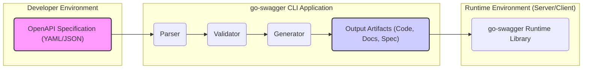
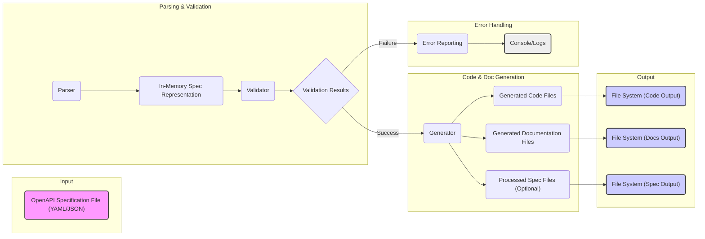

# Project Design Document: go-swagger (Improved)

**Project Name:** go-swagger

**Project Repository:** [https://github.com/go-swagger/go-swagger](https://github.com/go-swagger/go-swagger)

**Document Version:** 1.1
**Date:** 2023-10-27
**Author:** AI Software Architect

## 1. Introduction

This document provides an enhanced design overview of the go-swagger project, a widely used Go library for interacting with the OpenAPI Specification. This document is designed to serve as a foundation for comprehensive threat modeling and security analysis. It details the key components, their interactions, data flow, and the underlying technology stack of go-swagger. The information presented here will facilitate the identification of potential security vulnerabilities and inform mitigation strategies.

## 2. Project Overview

go-swagger is a Go framework designed to streamline the development and consumption of RESTful APIs defined using the OpenAPI Specification (OAS). It offers a suite of tools accessible via a Command Line Interface (CLI) and a runtime library, enabling developers to:

*   **Parse and Validate OAS Definitions:** Load and rigorously validate OpenAPI Specification files (in YAML or JSON format) against the official OAS schema and semantic rules.
*   **Generate Code:** Automatically generate server-side Go boilerplate code (handlers, models, routers, middleware), client SDKs in Go for API consumption, and interactive API documentation (Swagger UI) directly from OAS specifications.
*   **Serve OAS Documentation:**  Host and serve the OpenAPI Specification as a web endpoint, facilitating API discovery, documentation access, and interactive exploration using tools like Swagger UI.
*   **Provide a CLI Tool (`swagger`):** Offer a versatile command-line interface (`swagger`) for executing various operations, including code generation, specification validation, and serving documentation.

The core objective of go-swagger is to enhance API development efficiency and consistency by leveraging the OpenAPI Specification as the central, authoritative source of truth throughout the API lifecycle.

## 3. System Architecture

The go-swagger project is architecturally structured into distinct components that interact to provide its functionalities.

### 3.1. High-Level Architecture Diagram

**Diagram Description:**

*   **Developer Environment:** Represents the environment where developers create and manage OpenAPI Specification files. This is the starting point for using go-swagger.
*   **go-swagger CLI Application:** This is the primary interface for interacting with go-swagger. It encapsulates the core processing pipeline:
    *   **Parser:**  Responsible for reading and interpreting OpenAPI Specification files (YAML or JSON).
    *   **Validator:** Ensures the parsed specification adheres to OpenAPI Specification standards and semantic correctness.
    *   **Generator:**  Transforms the validated specification into various output artifacts like server code, client SDKs, and documentation.
    *   **Output Artifacts:**  The results of the generation process, including code, documentation files, and potentially processed OpenAPI specifications.
*   **Runtime Environment (Server/Client):**  This represents the environment where the generated code (server or client) is executed. The `go-swagger Runtime Library` provides essential functionalities for these generated applications.

### 3.2. Component Description

#### 3.2.1. OpenAPI Specification (YAML/JSON)

*   **Description:** The OpenAPI Specification file is the foundational input to go-swagger. It's a document written in YAML or JSON that meticulously describes a RESTful API, adhering to the OpenAPI Specification. It details endpoints, request and response structures, authentication methods, data models, and other crucial API characteristics.
*   **Functionality:** Serves as the definitive contract for the API. It's the single source of truth driving all go-swagger operations, ensuring consistency and automation.
*   **Input:** Path to a YAML or JSON file, or the raw content of an OpenAPI Specification.
*   **Output:** A parsed and validated in-memory representation of the OpenAPI specification, ready for further processing by go-swagger.

#### 3.2.2. Parser

*   **Description:** The Parser component is responsible for the initial stage of processing: reading and understanding the OpenAPI Specification file. It supports both YAML and JSON formats, accommodating the flexibility of the OpenAPI standard.
*   **Functionality:**
    *   **File Input:** Reads the OpenAPI Specification file from a specified file path or directly from an input stream.
    *   **Format Parsing:** Parses the YAML or JSON content, converting it into a structured, in-memory data representation that go-swagger can work with.
    *   **Syntax Error Handling:** Detects and reports syntax errors within the specification file, providing feedback to the user for correction.
*   **Input:** OpenAPI Specification file (YAML/JSON) as a file path or raw content string.
*   **Output:** An in-memory data structure (typically Go structs) representing the parsed OpenAPI Specification.

#### 3.2.3. Validator

*   **Description:** The Validator component plays a critical role in ensuring the quality and correctness of the OpenAPI Specification. It verifies that the parsed specification is valid according to the OpenAPI schema and adheres to semantic rules defined by the specification.
*   **Functionality:**
    *   **Schema Validation:** Validates the parsed specification against the official OpenAPI schema, ensuring structural correctness and adherence to the specification's grammar.
    *   **Semantic Validation:** Performs deeper semantic checks to identify logical inconsistencies, missing required fields, and deviations from best practices within the OpenAPI specification (e.g., ensuring consistent data types, proper referencing).
    *   **Error and Warning Reporting:** Generates detailed validation errors and warnings, providing users with actionable feedback to correct issues in their OpenAPI specification.
*   **Input:** In-memory representation of the OpenAPI Specification (output from the Parser).
*   **Output:** Validation results (success or failure indication, along with a list of error and warning messages if validation fails). A validated in-memory representation of the OpenAPI Specification is passed on for subsequent processing if validation is successful.

#### 3.2.4. Generator

*   **Description:** The Generator component is the core engine of go-swagger, responsible for code and documentation generation. It leverages the validated OpenAPI Specification to produce various artifacts that facilitate API development and consumption.
*   **Functionality:**
    *   **Server Code Generation:** Generates server-side Go code, including:
        *   API Handlers: Functions to implement API endpoint logic.
        *   Data Models: Go structs representing request and response schemas.
        *   Routers: Code to map HTTP requests to appropriate handlers.
        *   Middleware:  Reusable components for request processing (e.g., authentication, validation).
    *   **Client SDK Generation:** Generates Go SDKs that simplify API consumption for client applications, providing functions for each API operation.
    *   **Documentation Generation:** Creates API documentation in formats like Swagger UI, enabling interactive API exploration and documentation.
    *   **Customization:** Supports customization of generated code and documentation through templates and configuration options, allowing developers to tailor the output to their specific needs.
*   **Input:** Validated in-memory representation of the OpenAPI Specification (from the Validator). Generation configuration parameters (target language, output directory, templates, etc.).
*   **Output:** Generated code files (Go source code), documentation files (HTML, YAML/JSON), and other artifacts written to the file system in specified output directories.

#### 3.2.5. Output Artifacts (Code, Docs, Spec)

*   **Description:** This component represents the tangible results produced by the Generator. These artifacts are the practical outputs of go-swagger processing, ready for integration into API development and deployment workflows.
*   **Functionality:** Provides the generated resources for API implementation, client integration, and documentation.
*   **Input:** Generated artifacts from the Generator component.
*   **Output:** Files written to the file system, including:
    *   Go source code for server-side API implementation.
    *   Go source code for client-side SDKs.
    *   API documentation assets (Swagger UI distribution, OpenAPI specification files).
    *   Potentially modified or processed OpenAPI specification files (e.g., bundled specifications).

#### 3.2.6. Runtime Library

*   **Description:** The go-swagger Runtime Library is a Go library that provides essential runtime functionalities required by both the generated server and client code, as well as internally by the go-swagger CLI tools. It offers a set of reusable components and utilities.
*   **Functionality:**
    *   **Base Types and Interfaces:** Defines core interfaces and abstract types for request and response handling, providing a consistent structure for generated code.
    *   **Middleware and Request/Response Processing:** Implements common middleware patterns and logic for processing HTTP requests and responses in generated server applications.
    *   **Data Validation and Serialization/Deserialization:** Offers utilities for validating request and response data against schemas defined in the OpenAPI specification and for serializing and deserializing data in various formats (JSON, XML, etc.).
    *   **Data Format Support:** Handles different data formats specified in the OpenAPI specification, ensuring proper data handling across various API interactions.
*   **Input:** Request data, response data, configuration settings, data schemas.
*   **Output:** Processed request/response data, validated data, serialized/deserialized data. Used internally by generated code and the CLI tools to provide core functionalities at runtime.

### 3.3. Data Flow Diagram (Detailed)

**Diagram Description (Detailed Data Flow):**

1.  **OpenAPI Specification File:** The process begins with the OpenAPI Specification file (YAML/JSON) provided as input.
2.  **Parser:** The Parser reads and parses the specification file, handling YAML or JSON formats.
3.  **In-Memory Spec Representation:** The Parser creates a structured, in-memory representation of the OpenAPI specification, making it accessible to other components.
4.  **Validator:** The Validator takes the in-memory representation and performs schema and semantic validation against OpenAPI standards.
5.  **Validation Results:** The Validator produces validation results, indicating success or failure and providing detailed error messages if validation fails.
6.  **Success Path (Code & Doc Generation):** If validation is successful:
    *   **Generator:** The validated specification is passed to the Generator component.
    *   **Generated Code Files:** The Generator produces server code, client SDK code, etc.
    *   **Generated Documentation Files:** The Generator creates API documentation (Swagger UI, etc.).
    *   **Processed Spec Files (Optional):**  In some cases, the Generator might output processed or bundled OpenAPI specification files.
7.  **Output to File System:**
    *   **File System (Code Output):** Generated code files are written to the designated file system location.
    *   **File System (Docs Output):** Generated documentation files are written to the file system.
    *   **File System (Spec Output):** Processed specification files (if any) are written to the file system.
8.  **Failure Path (Error Handling):** If validation fails:
    *   **Error Reporting:** The Validator triggers the Error Reporting mechanism.
    *   **Console/Logs:** Error messages and warnings are outputted to the console or logged for the user to review and correct the OpenAPI specification.

## 4. Technology Stack (Detailed)

*   **Core Language:** Go (Golang) -  The primary programming language for the entire go-swagger project, including the CLI and runtime library.
*   **Specification Languages:**
    *   OpenAPI Specification (OAS) - Version 2.0 and 3.x are supported.
    *   YAML - For human-readable OpenAPI specification files. Libraries like `gopkg.in/yaml.v2` or `gopkg.in/yaml.v3` are likely used for YAML parsing.
    *   JSON - For machine-readable OpenAPI specification files. Go's standard `encoding/json` package is used for JSON parsing and generation.
*   **Parsing and Validation Libraries:**
    *   Potentially custom parsing logic for OpenAPI structure.
    *   Validation logic likely implemented using Go code and potentially leveraging schema validation libraries or custom validation rules.
*   **Code Generation Engine:**
    *   Go's `text/template` package - Used for template-based code generation, allowing for flexible and customizable output.
    *   Potentially custom template functions and logic to handle OpenAPI-specific constructs during code generation.
*   **CLI Framework:**
    *   `github.com/spf13/cobra` - A popular Go library for building modern CLI applications. Likely used to structure the `swagger` command-line tool, handle commands, flags, and arguments.
    *   `github.com/urfave/cli` - Another potential CLI framework option in Go, although Cobra is more commonly used in similar projects.
*   **HTTP Handling (Runtime Library):**
    *   Go's standard `net/http` package - Used for building HTTP servers and clients in the generated code and runtime library.
    *   Potentially external routing libraries like `github.com/gorilla/mux` or similar for more advanced routing capabilities in generated server code.
*   **Data Serialization/Deserialization (Runtime Library):**
    *   Go's standard `encoding/json` and `encoding/xml` packages - Used for handling JSON and XML data serialization and deserialization as specified in OpenAPI.
    *   Potentially external libraries for handling other data formats if supported by go-swagger or user-defined extensions.
*   **Documentation Generation:**
    *   Swagger UI -  Integrated or used to generate Swagger UI compatible documentation.
    *   Markdown - Potentially used for generating documentation in Markdown format.

## 5. Security Considerations (Detailed)

Security is a crucial aspect of go-swagger, as it processes API definitions and generates code. Potential security considerations include:

*   **OpenAPI Specification Parsing Vulnerabilities:**
    *   **YAML/JSON Parsing Exploits:** Vulnerabilities in YAML or JSON parsing libraries could be exploited by crafted malicious OpenAPI specifications to cause denial of service, arbitrary code execution, or information disclosure.
    *   **Schema Poisoning:**  Maliciously crafted schemas within the OpenAPI specification could attempt to exploit vulnerabilities in the validation process or influence code generation in unintended ways.
*   **Validation Bypass:**
    *   **Insufficient Validation:** Incomplete or flawed validation logic could allow invalid or malicious OpenAPI specifications to pass validation and proceed to code generation, potentially leading to vulnerable generated code.
    *   **Semantic Validation Gaps:**  Lack of robust semantic validation could miss logical inconsistencies or security-related misconfigurations in the OpenAPI specification.
*   **Code Generation Vulnerabilities:**
    *   **Injection Flaws:** Templates used for code generation might be vulnerable to injection attacks if not properly sanitized or if user-provided data is directly embedded without escaping. This could lead to generated code with SQL injection, command injection, or cross-site scripting (XSS) vulnerabilities.
    *   **Insecure Defaults:** Generated code might contain insecure default configurations (e.g., weak authentication, permissive CORS policies) if not carefully designed.
    *   **Denial of Service (DoS) in Generated Code:**  Generated server code could be vulnerable to DoS attacks if not designed to handle large requests, resource exhaustion, or malicious input effectively.
*   **Dependency Vulnerabilities:**
    *   **Third-Party Library Vulnerabilities:** go-swagger relies on various third-party Go libraries. Vulnerabilities in these dependencies could indirectly affect go-swagger's security. Regular dependency updates and vulnerability scanning are essential.
*   **Command Line Interface (CLI) Security:**
    *   **Privilege Escalation:** If the `swagger` CLI tool is not properly secured, vulnerabilities could potentially be exploited for privilege escalation on the system where it's executed.
    *   **Input Sanitization in CLI:**  The CLI tool should properly sanitize user inputs to prevent command injection or other CLI-specific vulnerabilities.
*   **Information Disclosure:**
    *   **Error Message Verbosity:**  Overly verbose error messages during parsing, validation, or code generation could unintentionally disclose sensitive information about the system or the OpenAPI specification itself.
    *   **Generated Documentation Exposure:**  If generated API documentation (Swagger UI) is not properly secured, it could expose sensitive API details to unauthorized users.
*   **Denial of Service (DoS) Attacks on go-swagger Tool:**
    *   **Resource Exhaustion during Processing:** Processing extremely large or complex OpenAPI specifications could potentially exhaust resources (CPU, memory) on the machine running the `swagger` CLI tool, leading to a DoS condition.

## 6. Assumptions and Constraints (Refined)

*   **Assumption: Input OpenAPI Specification Quality:** While go-swagger aims to be robust, it's assumed that users will generally provide OpenAPI Specification files that are at least structurally valid. go-swagger is designed to handle invalid specifications gracefully by providing informative error messages, but it's not intended to correct fundamentally flawed API designs.
*   **Assumption: Generated Code as a Starting Point:** The generated code is intended to be a foundation and starting point for API implementation. Developers are expected to review, customize, and further secure the generated code to meet their specific security requirements and best practices. go-swagger does not guarantee inherently secure generated code in all scenarios.
*   **Constraint: OpenAPI Specification Limitations:** go-swagger's capabilities are inherently limited by the features and expressiveness of the OpenAPI Specification itself. If the OAS lacks a feature, go-swagger cannot magically generate code or documentation for it.
*   **Constraint: Performance Considerations:** Performance of parsing, validation, and code generation is a factor, especially when dealing with very large and complex OpenAPI specifications. Optimization efforts are likely ongoing within the go-swagger project to maintain reasonable performance.
*   **Constraint: Go Language Ecosystem:** go-swagger is built within the Go language ecosystem and relies on Go libraries and best practices. Security considerations and limitations inherent to the Go language and its ecosystem also apply to go-swagger.

## 7. Future Work (Security Focused)

Building upon this design document and the identified security considerations, future work should prioritize security enhancements:

*   **Comprehensive Threat Modeling:** Conduct a detailed threat modeling exercise using methodologies like STRIDE or PASTA, specifically focusing on the components and data flows outlined in this document. This will help systematically identify potential threats and vulnerabilities.
*   **Security Requirements Specification (SRS):** Develop a formal Security Requirements Specification based on the threat model. This SRS will define specific security requirements for go-swagger components, generated code, and the overall project.
*   **Enhanced Input Validation:** Strengthen OpenAPI Specification parsing and validation to mitigate parsing vulnerabilities and prevent malicious specification injection. Implement more robust semantic validation rules to catch security-related misconfigurations.
*   **Secure Code Generation Practices:** Implement secure coding practices in the code generation templates to prevent injection flaws and ensure generated code follows security best practices. This includes input sanitization, output encoding, and secure default configurations.
*   **Dependency Security Management:** Implement automated dependency scanning and update processes to proactively identify and address vulnerabilities in third-party libraries used by go-swagger.
*   **Security Testing and Auditing:** Conduct regular security testing, including:
    *   **Static Application Security Testing (SAST):** Analyze go-swagger's source code for potential vulnerabilities.
    *   **Dynamic Application Security Testing (DAST):** Test the running `swagger` CLI tool and generated applications for vulnerabilities.
    *   **Penetration Testing:** Engage security experts to perform penetration testing to identify and exploit vulnerabilities.
    *   **Security Code Reviews:** Conduct regular security-focused code reviews of go-swagger's codebase.
*   **Security Documentation and Guidance:** Provide clear security documentation and guidance for go-swagger users, including best practices for securing generated code and using the `swagger` CLI tool securely.
*   **Vulnerability Disclosure and Response Plan:** Establish a clear vulnerability disclosure and response plan to handle security vulnerabilities reported by the community or identified through testing.

This document will be continuously updated to reflect the evolving design of go-swagger and the findings of ongoing security analysis and improvements.