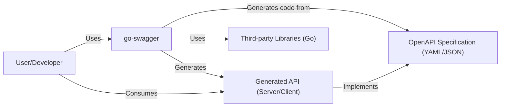
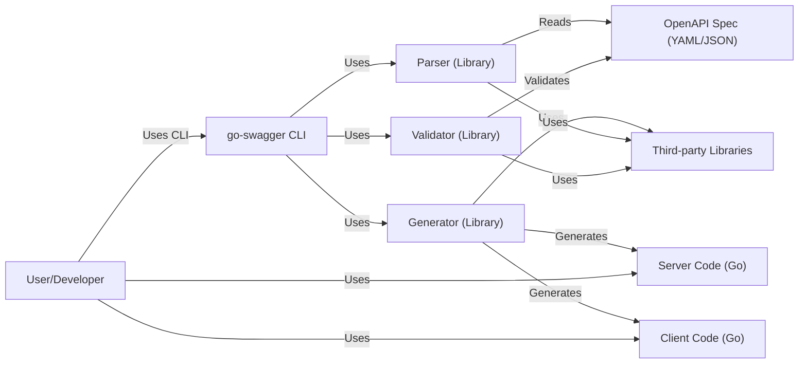
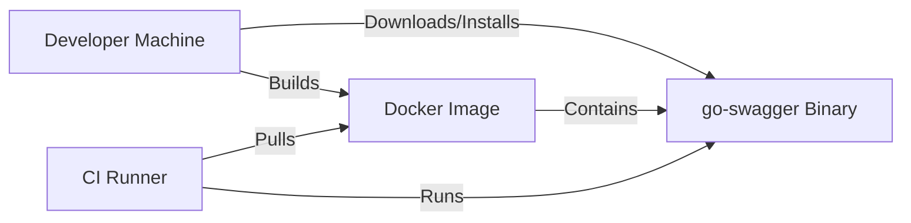
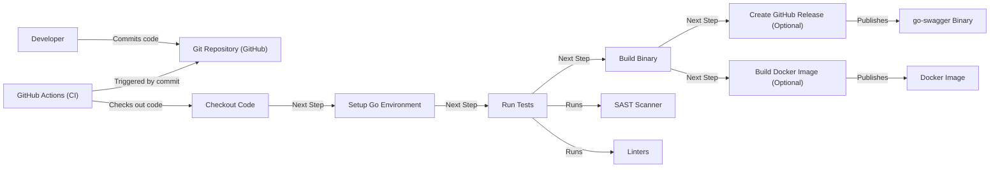

Okay, let's create a design document for the `go-swagger` project.

# BUSINESS POSTURE

Business Priorities and Goals:

*   Enable developers to easily design, build, document, and consume RESTful APIs using the OpenAPI/Swagger specification.
*   Provide a comprehensive toolset that covers the entire API lifecycle, from design-first to code generation and validation.
*   Reduce the time and effort required to create and maintain high-quality APIs.
*   Promote the adoption of the OpenAPI specification within the Go community.
*   Foster a vibrant open-source community around the project.

Business Risks:

*   Inconsistent API designs across different teams or projects, leading to integration challenges and reduced interoperability.
*   Security vulnerabilities in generated code or the tooling itself, potentially exposing APIs to attacks.
*   Lack of proper API documentation, making it difficult for developers to understand and use the APIs.
*   Difficulty in keeping up with changes in the OpenAPI specification, leading to compatibility issues.
*   Competition from other API frameworks or tools, potentially reducing the adoption of `go-swagger`.
*   Lack of community support and contributions.

# SECURITY POSTURE

Existing Security Controls:

*   security control: Input validation: `go-swagger` validates API specifications against the OpenAPI schema, ensuring that the input conforms to the defined structure and data types. Implemented in the `validate` package and command-line tool.
*   security control: Code generation: `go-swagger` generates server and client code from OpenAPI specifications, reducing the risk of manual coding errors that could introduce vulnerabilities. Implemented in the `generate` package.
*   security control: Middleware support: `go-swagger` generated server code includes support for middleware, allowing developers to add custom security logic such as authentication and authorization. Described in the documentation.
*   security control: Regular dependency updates: The project maintainers regularly update dependencies to address known vulnerabilities. Tracked in the project's `go.mod` file.
*   security control: Community security audits: As an open-source project, `go-swagger` benefits from community scrutiny, which can help identify and address security issues.

Accepted Risks:

*   accepted risk: Reliance on third-party libraries: `go-swagger` depends on several third-party libraries, which could potentially introduce vulnerabilities.
*   accepted risk: Complexity of the OpenAPI specification: The OpenAPI specification is complex, and subtle errors in the specification could lead to unexpected behavior or vulnerabilities.
*   accepted risk: User-provided API specifications: `go-swagger` processes user-provided API specifications, which could contain malicious or flawed definitions.

Recommended Security Controls:

*   security control: Implement SAST (Static Application Security Testing) scanning in the CI/CD pipeline to identify potential vulnerabilities in the `go-swagger` codebase itself.
*   security control: Implement DAST (Dynamic Application Security Testing) on a sample generated API to identify runtime vulnerabilities.
*   security control: Provide clear security guidelines and best practices for users of `go-swagger`, including how to securely configure authentication, authorization, and input validation in generated APIs.
*   security control: Conduct regular security audits of the `go-swagger` codebase and its dependencies.
*   security control: Establish a vulnerability disclosure program to encourage responsible reporting of security issues.

Security Requirements:

*   Authentication:
    *   Generated server code should support common authentication mechanisms such as API keys, OAuth 2.0, and JWT.
    *   Authentication mechanisms should be configurable through the OpenAPI specification.
    *   Sensitive information (e.g., passwords, API keys) should never be stored in the API specification or generated code.
*   Authorization:
    *   Generated server code should support role-based access control (RBAC) or other authorization mechanisms.
    *   Authorization rules should be configurable through the OpenAPI specification or external configuration.
*   Input Validation:
    *   Generated server code should validate all incoming requests against the OpenAPI specification, including data types, formats, and constraints.
    *   Input validation should be performed at multiple levels (e.g., request parameters, request body, headers).
    *   Invalid input should be rejected with appropriate error messages.
*   Cryptography:
    *   Sensitive data transmitted over the network should be encrypted using TLS/SSL.
    *   Cryptographic keys and secrets should be managed securely, following best practices for key management.
    *   Hashing algorithms used for passwords or other sensitive data should be strong and up-to-date.

# DESIGN

## C4 CONTEXT

Element Descriptions:

*   Element:
    *   Name: User/Developer
    *   Type: Person
    *   Description: A developer who uses `go-swagger` to generate code and/or interacts with the generated API.
    *   Responsibilities: Provides OpenAPI specifications, configures `go-swagger`, uses generated code, interacts with generated APIs.
    *   Security controls: N/A (external to the system)

*   Element:
    *   Name: go-swagger
    *   Type: Software System
    *   Description: The `go-swagger` toolkit itself, including the command-line tool and libraries.
    *   Responsibilities: Parses OpenAPI specifications, validates specifications, generates server and client code, provides documentation generation.
    *   Security controls: Input validation of OpenAPI specifications, secure code generation practices.

*   Element:
    *   Name: OpenAPI Specification (YAML/JSON)
    *   Type: Document
    *   Description: A machine-readable description of a RESTful API, conforming to the OpenAPI Specification.
    *   Responsibilities: Defines API endpoints, request/response schemas, security requirements, etc.
    *   Security controls: N/A (input to the system)

*   Element:
    *   Name: Third-party Libraries (Go)
    *   Type: Software Libraries
    *   Description: External Go libraries used by `go-swagger` for various functionalities.
    *   Responsibilities: Provide supporting functionalities like YAML parsing, code generation, etc.
    *   Security controls: Regular dependency updates, vulnerability scanning.

*   Element:
    *   Name: Generated API (Server/Client)
    *   Type: Software System
    *   Description: The server or client code generated by `go-swagger` from an OpenAPI specification.
    *   Responsibilities: Implements the API defined in the OpenAPI specification.
    *   Security controls: Input validation, authentication, authorization (as configured in the OpenAPI specification and implemented using middleware).

## C4 CONTAINER

Element Descriptions:

*   Element:
    *   Name: User/Developer
    *   Type: Person
    *   Description: A developer who uses the `go-swagger` CLI.
    *   Responsibilities: Provides OpenAPI specifications, configures `go-swagger`, uses generated code.
    *   Security controls: N/A (external to the system)

*   Element:
    *   Name: go-swagger CLI
    *   Type: Application
    *   Description: The command-line interface for `go-swagger`.
    *   Responsibilities: Provides commands for parsing, validating, and generating code.
    *   Security controls: Input validation of command-line arguments.

*   Element:
    *   Name: Parser (Library)
    *   Type: Library
    *   Description: A library for parsing OpenAPI specifications.
    *   Responsibilities: Reads and parses YAML/JSON OpenAPI specifications.
    *   Security controls: Input validation of OpenAPI specifications.

*   Element:
    *   Name: Validator (Library)
    *   Type: Library
    *   Description: A library for validating OpenAPI specifications.
    *   Responsibilities: Validates OpenAPI specifications against the OpenAPI schema.
    *   Security controls: Input validation of OpenAPI specifications.

*   Element:
    *   Name: Generator (Library)
    *   Type: Library
    *   Description: A library for generating server and client code.
    *   Responsibilities: Generates Go code for servers and clients based on OpenAPI specifications.
    *   Security controls: Secure code generation practices.

*   Element:
    *   Name: OpenAPI Spec (YAML/JSON)
    *   Type: Document
    *   Description: A machine-readable description of a RESTful API.
    *   Responsibilities: Defines API endpoints, request/response schemas, etc.
    *   Security controls: N/A (input to the system)

*   Element:
    *   Name: Server Code (Go)
    *   Type: Code
    *   Description: Generated Go code for the API server.
    *   Responsibilities: Implements the API endpoints and logic.
    *   Security controls: Input validation, authentication, authorization (as configured in the OpenAPI specification).

*   Element:
    *   Name: Client Code (Go)
    *   Type: Code
    *   Description: Generated Go code for the API client.
    *   Responsibilities: Provides functions for interacting with the API server.
    *   Security controls: Secure communication with the server (e.g., TLS).

*   Element:
    *   Name: Third-party Libraries
    *   Type: Libraries
    *   Description: External Go libraries used by `go-swagger`.
    *   Responsibilities: Provide supporting functionalities.
    *   Security controls: Regular dependency updates, vulnerability scanning.

## DEPLOYMENT

Possible Deployment Solutions:

1.  Standalone Binary: `go-swagger` is a command-line tool, so the primary deployment method is as a standalone binary. Users download and install the binary on their local machines or build servers.
2.  Docker Image: A Docker image could be provided for users who prefer to run `go-swagger` in a containerized environment. This is useful for CI/CD pipelines.
3.  Go Install: Users can install using `go install` command.

Chosen Deployment Solution (Standalone Binary + Docker):

Element Descriptions:

*   Element:
    *   Name: Developer Machine
    *   Type: Infrastructure
    *   Description: The developer's local machine.
    *   Responsibilities: Downloading, installing, and running the `go-swagger` binary. Building Docker image.
    *   Security controls: Standard operating system security controls.

*   Element:
    *   Name: go-swagger Binary
    *   Type: Executable
    *   Description: The compiled `go-swagger` executable.
    *   Responsibilities: Parsing, validating, and generating code.
    *   Security controls: Code signing (optional), regular security audits.

*    Element:
    *   Name: Docker Image
    *   Type: Container Image
    *   Description: Docker image that contains `go-swagger` binary.
    *   Responsibilities: Provide isolated environment to run `go-swagger`.
    *   Security controls: Image scanning, minimal base image.

*   Element:
    *   Name: CI Runner
    *   Type: Infrastructure
    *   Description: Machine that runs CI jobs.
    *   Responsibilities: Pulling and running Docker image.
    *   Security controls: Access control, network security.

## BUILD

Build Process Description:

1.  Developer commits code to the GitHub repository.
2.  GitHub Actions is triggered by the commit.
3.  The workflow checks out the code.
4.  The workflow sets up the Go environment.
5.  The workflow runs tests, including unit tests, integration tests, SAST scanning (e.g., using `gosec`), and linters (e.g., `golangci-lint`).
6.  If tests pass, the workflow builds the `go-swagger` binary.
7.  Optionally, a GitHub release is created, and the binary is published.
8.  Optionally, Docker image is build and published.

Security Controls in Build Process:

*   security control: SAST scanning: Static analysis of the codebase to identify potential vulnerabilities.
*   security control: Linters: Enforce code style and identify potential errors.
*   security control: Dependency management: Use of `go mod` to manage dependencies and track vulnerabilities.
*   security control: Automated build: Ensures consistent and reproducible builds.
*   security control: Code signing (optional): Digitally sign the binary to ensure authenticity and integrity.

# RISK ASSESSMENT

Critical Business Processes:

*   API Design and Development: `go-swagger` is crucial for designing and developing RESTful APIs, which are often the foundation of modern applications and services.
*   API Documentation: Accurate and up-to-date API documentation is essential for developers to understand and use APIs effectively.
*   API Integration: Consistent API designs and implementations are critical for seamless integration between different systems and services.

Data Sensitivity:

*   OpenAPI Specifications (Low to Medium): OpenAPI specifications may contain information about the API's structure, endpoints, and data models. While not typically containing sensitive data directly, they could reveal information about the underlying system.
*   Generated Code (Low to Medium): The generated code itself does not typically contain sensitive data, but it implements the logic for handling data, so vulnerabilities in the generated code could lead to data breaches.
*   API Data (Varies): The data handled by the generated APIs can range from non-sensitive to highly sensitive, depending on the specific application. This is outside the direct scope of `go-swagger` but is a crucial consideration for users of the tool.

# QUESTIONS & ASSUMPTIONS

Questions:

*   Are there any specific compliance requirements (e.g., GDPR, HIPAA, PCI DSS) that need to be considered for APIs generated using `go-swagger`?
*   What is the expected level of support and maintenance for `go-swagger`?
*   What are the target deployment environments for the generated APIs?
*   What are the specific security concerns of the users of `go-swagger`?

Assumptions:

*   BUSINESS POSTURE: The primary goal is to provide a robust and user-friendly tool for API development, with a secondary focus on security.
*   SECURITY POSTURE: Users of `go-swagger` are responsible for the security of their API specifications and the overall security of their generated APIs. `go-swagger` provides tools and features to help with security, but it is not a complete security solution.
*   DESIGN: The design of `go-swagger` prioritizes ease of use and flexibility, while still incorporating security best practices.
*   The project is actively maintained and updated.
*   Users have a basic understanding of RESTful APIs and the OpenAPI specification.
*   Generated code will be deployed in a secure environment with appropriate network security controls.