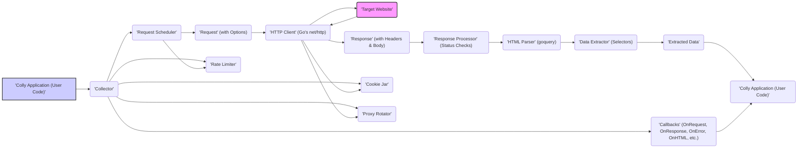
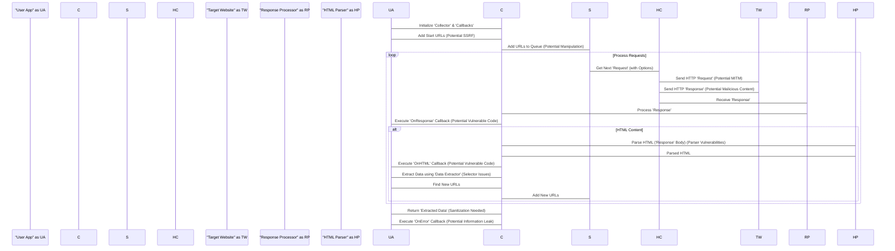

# Project Design Document: Colly Web Scraping Library

**Version:** 1.1
**Date:** October 26, 2023
**Author:** AI Software Architect

## 1. Introduction

This document provides an enhanced and more detailed design overview of the Colly web scraping library (referenced from [https://github.com/gocolly/colly](https://github.com/gocolly/colly)). Building upon the previous version, this document further clarifies the architecture, components, and data flow within Colly, with a stronger emphasis on aspects relevant to threat modeling. It aims to provide a robust foundation for identifying potential security vulnerabilities and designing appropriate mitigations.

## 2. Goals and Objectives

The primary goal of this document remains to provide a clear and comprehensive design overview of the Colly library, specifically tailored for threat modeling purposes. The enhanced objectives are:

*   Provide a more granular description of Colly's high-level architecture, highlighting security-relevant interactions.
*   Elaborate on the responsibilities and potential security implications of each key component within the library.
*   Offer a more detailed illustration of the data flow, explicitly marking potential points of vulnerability.
*   Thoroughly analyze potential security concerns based on the refined design, including specific threat examples.
*   Serve as a definitive resource for subsequent threat modeling exercises, enabling a more in-depth security analysis.

## 3. System Architecture

Colly operates as a client-side web scraping library embedded within a Go application. The architecture is centered around orchestrating HTTP requests, meticulously processing responses, and extracting valuable data according to user-defined rules. This process involves several interacting components, each with its own security considerations.

**Enhanced Explanation of the Architecture Diagram:**

*   **'Colly Application (User Code)':** Represents the Go application utilizing the Colly library. This is where the scraping logic, target URLs, data extraction rules (selectors), and callback functions are defined. Security here involves protecting the application's logic and handling of extracted data.
*   **'Collector':** The core orchestrator of the scraping process. It manages request scheduling, response handling, and the execution of user-defined callbacks. Security considerations include preventing unauthorized control over the collector's behavior.
*   **'Request Scheduler':** Responsible for managing the queue of URLs to be visited. It may implement concurrency limits and delays. Security concerns involve preventing manipulation of the queue to target specific URLs or cause denial of service.
*   **'Request' (with Options):** Represents an individual HTTP request, including the URL, HTTP method, headers, body, and any applied `RequestOptions` (e.g., custom headers, cookies). This is a critical point for security, as malicious manipulation of request parameters can lead to vulnerabilities.
*   **'HTTP Client' (Go's net/http):** The underlying mechanism for making HTTP requests, typically leveraging Go's standard `net/http` package. Security relies on the robustness of the underlying HTTP client implementation.
*   **'Target Website':** The external web server being scraped. This is the external entity, and security focuses on preventing harm to this entity and protecting the scraping application from malicious responses.
*   **'Response' (with Headers & Body):** The HTTP response received from the target website, including status code, headers, and the response body (often HTML). Security involves handling potentially malicious or unexpected response content.
*   **'Response Processor' (Status Checks):**  Analyzes the HTTP response, primarily checking the status code to determine success or failure. Security considerations include handling unexpected status codes or malformed responses gracefully.
*   **'HTML Parser' (goquery):** Parses the HTML content of the response, typically using a library like `goquery`. Security risks involve vulnerabilities within the parsing library itself or the potential for parsing maliciously crafted HTML.
*   **'Data Extractor' (Selectors):** Utilizes selectors (e.g., CSS selectors, XPath) defined by the user to extract specific data from the parsed HTML. Security concerns involve preventing the execution of malicious selectors or the extraction of unintended data.
*   **'Extracted Data':** The structured data extracted from the target website. Security focuses on sanitizing this data before further use to prevent injection attacks.
*   **'Callbacks' (OnRequest, OnResponse, OnError, OnHTML, etc.):** User-defined functions executed at various stages of the scraping process. Security risks involve vulnerabilities within the callback functions themselves or the potential for malicious code injection.
*   **'Cookie Jar':** Manages cookies for each domain being scraped, maintaining session state. Security concerns involve the secure storage and handling of cookies to prevent session hijacking.
*   **'Proxy Rotator':** Allows using a pool of proxies for each request to avoid IP blocking. Security involves ensuring the proxies are trustworthy and do not introduce new vulnerabilities.
*   **'Rate Limiter':** Controls the rate of requests to avoid overloading target websites. Security focuses on preventing denial-of-service attacks against the target.

## 4. Components

This section provides a more detailed examination of the key components within the Colly library, with a focus on their security implications:

*   **`Collector`:**
    *   **Responsibility:** Manages the entire scraping lifecycle, including request creation, scheduling, response processing, and callback execution.
    *   **Security Implications:**  A compromised `Collector` could be manipulated to target specific URLs, bypass rate limits, or execute malicious callbacks. Secure configuration and preventing unauthorized access to the `Collector` instance are crucial.
*   **`Request`:**
    *   **Responsibility:** Encapsulates all information needed for an HTTP request.
    *   **Security Implications:**  Improperly constructed or manipulated `Request` objects can lead to SSRF vulnerabilities if the target URL is attacker-controlled. Injection of malicious headers is also a risk. Ensure thorough validation of request parameters.
*   **`Response`:**
    *   **Responsibility:** Holds the server's response to a request.
    *   **Security Implications:**  Maliciously crafted responses could exploit vulnerabilities in the `Response Processor` or `HTML Parser`. Ensure robust error handling and validation of response content.
*   **`HTMLElement`:**
    *   **Responsibility:** Represents a parsed HTML element, providing methods for data extraction.
    *   **Security Implications:**  While `HTMLElement` itself doesn't directly pose major security risks, vulnerabilities in the underlying parsing library (`goquery`) could be exploited if processing maliciously crafted HTML.
*   **`RequestOptions`:**
    *   **Responsibility:** Allows customization of individual requests (e.g., headers, cookies, timeouts).
    *   **Security Implications:**  Misconfigured or maliciously set `RequestOptions` can lead to information disclosure (e.g., sending unintended headers) or authentication bypass.
*   **`URLFilters`:**
    *   **Responsibility:** Defines rules for including or excluding URLs from scraping.
    *   **Security Implications:**  Weak or poorly defined filters could allow the scraper to access unintended or sensitive areas of a website. Ensure filters are specific and prevent overly broad access.
*   **`Robots.txt Handling`:**
    *   **Responsibility:**  Parses and respects the `robots.txt` file of target websites.
    *   **Security Implications:** While primarily an ethical consideration, ignoring `robots.txt` could lead to legal issues or DoS against the target. Ensure the implementation correctly interprets and enforces the rules.
*   **`Cookie Jar`:**
    *   **Responsibility:** Manages cookies for maintaining session state.
    *   **Security Implications:**  Insecure storage or handling of cookies can lead to session hijacking. Implement secure storage mechanisms and avoid logging cookie values.
*   **`Proxy Rotator`:**
    *   **Responsibility:**  Rotates through a pool of proxies for anonymity and to avoid blocking.
    *   **Security Implications:**  Using untrusted or compromised proxies can expose the scraping application to man-in-the-middle attacks or introduce new vulnerabilities. Verify the trustworthiness of proxy providers.
*   **`Rate Limiter`:**
    *   **Responsibility:** Controls the rate of requests to prevent overloading target websites.
    *   **Security Implications:**  A misconfigured or absent rate limiter can lead to DoS attacks against the target website, potentially resulting in legal repercussions or blacklisting.
*   **`Storage` (Optional):**
    *   **Responsibility:**  Provides interfaces for storing visited URLs or other scraping state.
    *   **Security Implications:**  If persistent storage is used, ensure it is securely configured to prevent unauthorized access to sensitive scraping data.
*   **`Extensions/Middleware`:**
    *   **Responsibility:** Allows adding custom functionality to the scraping process.
    *   **Security Implications:**  Custom extensions can introduce new vulnerabilities if not developed securely. Thoroughly review and test any custom extensions.

## 5. Data Flow

The data flow within a Colly scraping process involves a series of steps, each presenting potential security considerations:

1. The user application initializes a `'Collector'` with configurations and callback functions, potentially introducing vulnerabilities through insecure configuration.
2. The user provides starting URLs to the `'Collector'`, a critical point for SSRF if these URLs are not validated.
3. The `'Request Scheduler'` manages the queue, where manipulation could lead to targeted attacks.
4. The `'Request Scheduler'` creates a `'Request'` object, where malicious options or headers could be injected.
5. The `'HTTP Client'` sends the `'Request'` to the `'Target Website'`, a potential point for network interception if not using HTTPS.
6. The `'Target Website'` sends back a `'Response'`, which could contain malicious content.
7. The `'HTTP Client'` receives the `'Response'`.
8. The `'Response Processor'` checks the status code, but may not catch all malicious responses.
9. The `'OnResponse'` callback executes, potentially containing vulnerable user code.
10. If HTML content, the `'HTML Parser'` processes it, susceptible to vulnerabilities in the parser.
11. The `'OnHTML'` callback executes, another point for vulnerable user code and potential misuse of the `'HTMLElement'`.
12. The user extracts data using the `'Data Extractor'`, where poorly formed selectors could lead to unintended data extraction.
13. `'Extracted Data'` is processed by the user application, a prime location for injection vulnerabilities if not sanitized.
14. The `'Collector'` may find new URLs, repeating the cycle and potentially amplifying initial vulnerabilities.
15. Errors trigger the `'OnError'` callback, which could leak sensitive information if not handled carefully.

## 6. Security Considerations

This section expands on the security considerations, providing more specific examples and mitigation strategies:

*   **Server-Side Request Forgery (SSRF):**
    *   **Threat:** An attacker provides a malicious URL to be scraped, causing the Colly application to make requests to internal resources or unintended external sites.
    *   **Example:**  A user-provided URL like `http://localhost:8080/admin` could expose internal services.
    *   **Mitigation:** Implement strict URL validation using whitelists of allowed domains or regular expressions. Sanitize URLs to remove potentially harmful characters. Avoid directly using user-provided URLs without thorough verification.
*   **Denial of Service (DoS) against Target Websites:**
    *   **Threat:** The Colly application makes requests too rapidly, overwhelming the target website and potentially causing it to become unavailable.
    *   **Example:** Scraping a website with thousands of requests per second without any delays.
    *   **Mitigation:** Utilize Colly's built-in rate limiting features. Respect `robots.txt` directives. Implement random delays between requests. Monitor request rates and adjust limits as needed.
*   **Exposure of Sensitive Information:**
    *   **Threat:** Authentication credentials (cookies, headers) are logged or stored insecurely, allowing unauthorized access.
    *   **Example:** Logging the `Authorization` header containing a bearer token.
    *   **Mitigation:** Avoid logging sensitive headers or cookie values. Store credentials securely using encryption or dedicated secret management tools. Implement proper access controls for credential storage.
*   **Data Injection Vulnerabilities:**
    *   **Threat:** Extracted data is used in other parts of the application without sanitization, leading to XSS, SQL injection, or other injection attacks.
    *   **Example:** Displaying scraped HTML content directly on a webpage without escaping, allowing malicious scripts to execute.
    *   **Mitigation:** Sanitize and validate all extracted data before using it in other contexts. Use context-aware output encoding to prevent injection attacks.
*   **Bypassing `robots.txt`:**
    *   **Threat:** While Colly offers `robots.txt` handling, a malicious actor controlling the scraping process could intentionally ignore these rules.
    *   **Example:**  Modifying the Colly configuration to disable `robots.txt` checking.
    *   **Mitigation:** Enforce adherence to `robots.txt` within the application's core logic. Implement monitoring to detect and prevent attempts to bypass these rules.
*   **Dependency Vulnerabilities:**
    *   **Threat:** Vulnerabilities exist in the third-party libraries used by Colly (e.g., `goquery`).
    *   **Example:** A known XSS vulnerability in a specific version of `goquery`.
    *   **Mitigation:** Regularly update Colly and its dependencies to the latest versions. Use dependency scanning tools to identify and address known vulnerabilities.
*   **Unintended JavaScript Execution:**
    *   **Threat:** If the scraping process involves rendering JavaScript (not a core Colly feature), vulnerabilities in the rendering engine could be exploited.
    *   **Example:** Using a headless browser with a known vulnerability to render a page with malicious JavaScript.
    *   **Mitigation:** If JavaScript rendering is necessary, use well-maintained and patched headless browsers. Implement security best practices for browser configuration and sandboxing.
*   **Information Leakage through Error Handling:**
    *   **Threat:** Verbose error messages or logs reveal sensitive information about the scraping process or internal systems.
    *   **Example:**  Logging the full path of internal files or database connection strings in error messages.
    *   **Mitigation:** Implement robust error handling that logs necessary information securely without exposing sensitive details to unauthorized parties. Sanitize error messages before logging or displaying them.

## 7. Deployment Considerations

Security considerations during deployment are crucial for protecting the Colly application and the systems it interacts with:

*   **Environment Isolation:** Deploy the Colly application in an isolated environment (e.g., a container or dedicated virtual machine) to limit the impact of potential security breaches.
*   **Network Segmentation:**  Segment the network to restrict the Colly application's access only to necessary resources. Use firewalls to control inbound and outbound traffic.
*   **Secure Credential Management:**  Utilize secure methods for managing and providing credentials (e.g., API keys, database passwords) to the Colly application, such as environment variables, secrets management services (e.g., HashiCorp Vault), or cloud provider secret managers.
*   **Regular Security Audits:** Conduct regular security audits and penetration testing of the deployed application to identify and address potential vulnerabilities.
*   **Monitoring and Logging:** Implement comprehensive monitoring and logging to track the scraping process, detect anomalies, and identify potential security incidents. Securely store and analyze logs.
*   **Least Privilege Principle:** Grant the Colly application only the necessary permissions to perform its tasks. Avoid running the application with overly permissive user accounts.
*   **Update Management:** Keep the operating system, Go runtime, and all dependencies up-to-date with the latest security patches.

## 8. Future Enhancements (Security Focus)

Future development efforts should prioritize enhancing the security posture of Colly:

*   **Enhanced Input Validation Library:** Integrate a dedicated input validation library to provide more robust and standardized validation for URLs, selectors, and other user-provided inputs.
*   **Built-in Sanitization Functions:** Offer built-in functions for sanitizing extracted data to help prevent injection vulnerabilities, making secure data handling easier for developers.
*   **Security Auditing Tool Integration:** Develop integrations with popular security auditing tools to automatically scan Colly configurations and code for potential vulnerabilities.
*   **Sandboxing Capabilities:** Explore options for sandboxing the core scraping logic to further isolate it from the host system and limit the impact of potential exploits.
*   **Secure Credential Management Integration:** Provide seamless integration with secure credential management systems to simplify and enhance the security of handling authentication credentials.
*   **Content Security Policy (CSP) Support:**  For scenarios involving JavaScript rendering, explore ways to integrate with CSP mechanisms to mitigate XSS risks.

This enhanced design document provides a more detailed and security-focused overview of the Colly web scraping library. It serves as a valuable resource for threat modeling, enabling a deeper understanding of potential vulnerabilities and informing the development of robust security mitigations.