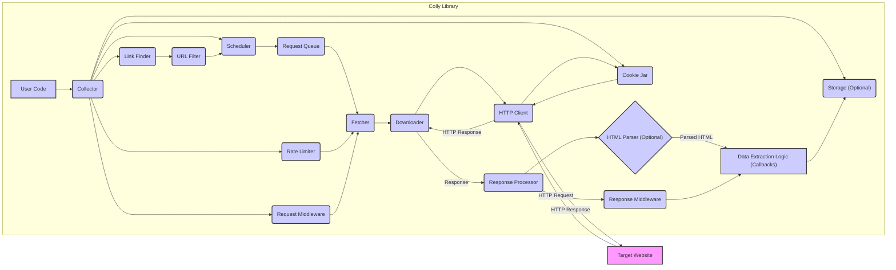

# Project Design Document: Colly Web Scraping Library

**Version:** 1.1
**Date:** October 26, 2023
**Author:** Gemini (AI Language Model)
**Project:** Colly Web Scraping Library (https://github.com/gocolly/colly)

## 1. Introduction

This document provides an enhanced and more detailed design overview of the Colly web scraping library. It elaborates on the key components, their interactions, and the overall architecture, with a stronger emphasis on aspects relevant to threat modeling. This document aims to provide a robust foundation for identifying and mitigating potential security vulnerabilities within the system.

## 2. Goals and Objectives

The primary goal of this document remains to provide a clear and comprehensive architectural overview of the Colly library. The enhanced objectives are:

*   Provide more granular details about the core components of the Colly library, including their configurations and potential vulnerabilities.
*   Offer a more detailed illustration of the data flow and interactions between these components, highlighting potential interception or manipulation points.
*   Elaborate on key functionalities and extension points within the library, specifically focusing on those that might introduce security risks.
*   Serve as a refined and more actionable basis for identifying potential security threats and vulnerabilities during threat modeling exercises.

## 3. Architectural Overview

Colly is a Go-based web scraping framework designed for efficient and flexible data collection from websites. The `Collector` remains the central orchestrator of the scraping process.

## 4. Component Details

This section provides a more detailed description of the key components, including potential security considerations for each.

*   **User Code:** The developer's implementation using the Colly library.
    *   Defines target URLs, request headers, cookies, and scraping logic.
    *   **Security Consideration:** Vulnerable if it directly incorporates unsanitized user input into scraping configurations, potentially leading to SSRF or header injection.
*   **Collector:** The central orchestrator.
    *   Configures concurrency, delays, user agents, and other scraping parameters.
    *   Manages request and response middleware.
    *   **Security Consideration:** Improper configuration (e.g., overly permissive URL filters, disabled TLS verification) can introduce vulnerabilities.
*   **Scheduler:** Manages the queue of URLs.
    *   Can be configured with different queue implementations (e.g., in-memory, Redis).
    *   **Security Consideration:** If a shared or persistent queue is used (like Redis), access control and data integrity are crucial.
*   **Request Queue:** Holds URLs to be visited.
    *   Typically a FIFO queue but can be customized.
    *   **Security Consideration:**  If the queue is exposed or not properly secured, attackers might inject malicious URLs.
*   **Fetcher:** Retrieves web pages.
    *   Handles request creation, including headers and cookies.
    *   Implements retry mechanisms and timeouts.
    *   **Security Consideration:**  Vulnerable to manipulation if request middleware is not carefully implemented, potentially leading to unintended requests.
*   **Downloader:** Manages the HTTP client.
    *   Configures TLS settings, proxies, and timeouts.
    *   Uses Go's `net/http` or a custom client.
    *   **Security Consideration:**  Disabling TLS verification or using untrusted proxies exposes the scraper to MitM attacks.
*   **HTTP Client:** Sends HTTP requests and receives responses.
    *   Handles various HTTP methods (GET, POST, etc.).
    *   **Security Consideration:**  Susceptible to vulnerabilities in the underlying HTTP implementation if not kept up-to-date.
*   **Response Processor:** Handles HTTP responses.
    *   Checks status codes and content types.
    *   Executes response middleware and user-defined callbacks.
    *   **Security Consideration:**  Vulnerable if response middleware doesn't properly handle malicious or unexpected responses, potentially leading to parsing errors or further exploitation.
*   **HTML Parser (Optional):** Parses HTML content.
    *   Uses libraries like `goquery`.
    *   Allows selection of elements using CSS selectors.
    *   **Security Consideration:**  Parsing untrusted HTML can expose vulnerabilities if the parser itself has flaws. Malicious HTML could trigger parsing errors or even code execution in extreme cases.
*   **Data Extraction Logic (Callbacks):** User-defined functions for processing scraped data.
    *   Extracts and transforms data.
    *   Stores data in various formats and destinations.
    *   **Security Consideration:**  A major point of vulnerability. If not carefully coded, it can introduce injection flaws (SQL, command injection) when interacting with databases or external systems.
*   **Link Finder:** Discovers new URLs within scraped content.
    *   Parses HTML for `<a>` tags and other link-containing elements.
    *   **Security Consideration:**  If not properly configured, it might follow links to unintended or malicious domains.
*   **URL Filter:** Filters URLs before adding them to the queue.
    *   Uses regular expressions or custom logic.
    *   **Security Consideration:**  Insufficiently restrictive filters can lead to scraping unintended parts of a website or even external domains (SSRF).
*   **Rate Limiter:** Controls the request rate.
    *   Prevents overloading target servers.
    *   **Security Consideration:** While primarily for ethical scraping, misconfiguration can lead to the scraper being blocked, hindering its functionality.
*   **Cookie Jar:** Manages cookies.
    *   Persists cookies across requests.
    *   **Security Consideration:**  Improper handling or storage of cookies can expose sensitive session information.
*   **Storage (Optional):** Stores scraped data.
    *   Can be files, databases, or other storage mechanisms.
    *   **Security Consideration:**  Requires proper access control and secure storage practices to protect scraped data.
*   **Request Middleware:** Functions executed before sending a request.
    *   Allows modification of requests (e.g., adding headers, authentication).
    *   **Security Consideration:**  Poorly implemented middleware can introduce vulnerabilities by adding incorrect or malicious headers.
*   **Response Middleware:** Functions executed after receiving a response.
    *   Allows inspection and modification of responses.
    *   **Security Consideration:**  Can be vulnerable if it doesn't handle unexpected or malicious responses correctly.

## 5. Data Flow (Enhanced)

The data flow within Colly, with a focus on potential security checkpoints, is as follows:

1. The **User Code** initiates scraping by providing URLs and configurations to the **Collector**. **Security Checkpoint:** Ensure user input for URLs and configurations is validated to prevent SSRF or injection attacks.
2. The **Collector** adds URLs to the **Request Queue** via the **Scheduler**. **Security Checkpoint:**  If a persistent queue is used, ensure its integrity and access controls.
3. The **Scheduler** provides URLs to the **Fetcher**, respecting rate limits imposed by the **Rate Limiter**.
4. The **Fetcher**, potentially modified by **Request Middleware**, uses the **Downloader** and **HTTP Client** to send an HTTP request to the **Target Website**. **Security Checkpoint:**  Middleware should be carefully reviewed to prevent unintended header manipulation or credential leakage. Ensure TLS is enabled and certificate verification is in place.
5. The **Target Website** sends an **HTTP Response** back to the **HTTP Client**.
6. The **Downloader** receives the **HTTP Response**. **Security Checkpoint:**  Be wary of responses from unexpected origins if SSRF vulnerabilities exist.
7. The **Response Processor**, potentially modified by **Response Middleware**, receives the response. **Security Checkpoint:** Middleware should sanitize or validate responses to prevent exploitation of vulnerabilities in subsequent processing.
8. If the response is HTML, it's passed to the **HTML Parser**. **Security Checkpoint:**  The parser should be robust against malicious HTML. Consider using sandboxed parsing if dealing with untrusted sources.
9. The **Data Extraction Logic (Callbacks)** processes the parsed data. **Security Checkpoint:**  This is a critical point. Ensure all extracted data is properly sanitized before being used in further operations (especially database interactions or external API calls) to prevent injection attacks.
10. The **Link Finder** extracts new URLs, which are then filtered by the **URL Filter**. **Security Checkpoint:**  Ensure the URL filter is strict enough to prevent scraping unintended or malicious domains.
11. Allowed URLs are added back to the **Request Queue**.
12. The **Cookie Jar** manages cookies throughout the process. **Security Checkpoint:** Securely handle and store cookies to prevent session hijacking.
13. Scraped data can be persisted using the **Storage** component. **Security Checkpoint:** Implement proper access controls and encryption for stored data.

## 6. Security Considerations (Detailed)

This section expands on potential security implications, providing more context and examples:

*   **Server-Side Request Forgery (SSRF):** Occurs when the scraper can be tricked into making requests to unintended internal or external resources.
    *   **Colly Context:** If user-provided URLs or data within scraped content are directly used to form new scraping requests without validation, an attacker could force the scraper to interact with internal services or arbitrary external sites.
*   **Data Injection Vulnerabilities:**  Arise when unsanitized scraped data is used in subsequent operations.
    *   **Colly Context:** If data extracted using CSS selectors is directly inserted into SQL queries or used in shell commands without proper escaping or parameterization, it can lead to SQL injection or command injection.
*   **Denial of Service (DoS):**  Aggressive scraping can overwhelm target websites.
    *   **Colly Context:** While Colly provides rate limiting, misconfiguration or insufficient limits can still lead to DoS against the target.
*   **Exposure of Sensitive Information:**  The scraper might unintentionally access or store sensitive data.
    *   **Colly Context:**  If the scraper follows links into administrative areas or scrapes pages containing credentials, this information could be exposed if not handled carefully.
*   **Cookie Handling Vulnerabilities:**  Improper management of cookies can lead to session hijacking.
    *   **Colly Context:** If cookies are not stored securely or if the scraper doesn't handle cookie attributes (like `HttpOnly` or `Secure`) correctly, it could be vulnerable.
*   **Man-in-the-Middle (MitM) Attacks:**  Occur when communication between the scraper and the target is intercepted.
    *   **Colly Context:** If TLS verification is disabled or weak ciphers are used, the scraper is vulnerable to MitM attacks, allowing attackers to eavesdrop or modify traffic.
*   **Dependency Vulnerabilities:**  Flaws in Colly's dependencies can introduce security risks.
    *   **Colly Context:**  Vulnerabilities in the HTML parsing library (`goquery`) or the underlying HTTP client could be exploited. Regularly updating dependencies is crucial.
*   **Header Injection:**  Manipulating HTTP headers can lead to various attacks.
    *   **Colly Context:** If user input is used to set request headers without proper sanitization, attackers could inject malicious headers.
*   **Cross-Site Scripting (XSS) via Stored Data:** If scraped data containing malicious scripts is stored and later displayed without sanitization, it can lead to XSS attacks on users viewing the stored data.
    *   **Colly Context:**  If scraped HTML containing JavaScript is stored in a database and then rendered on a web page without proper encoding, it could execute malicious scripts in the user's browser.

## 7. Deployment Considerations

Deployment considerations with security implications:

*   **Environment Isolation:** Deploying the scraper in an isolated environment can limit the impact of potential security breaches.
*   **Secure Credential Management:**  If the scraper requires authentication, store credentials securely (e.g., using environment variables or a secrets manager).
*   **Network Segmentation:**  Restricting network access for the scraper can limit its ability to interact with unintended resources in case of compromise.
*   **Regular Security Audits:**  Periodically review the scraper's configuration and code for potential vulnerabilities.

## 8. Future Considerations

Future enhancements with potential security implications:

*   **Plugin System Security:** If a plugin system is implemented, ensure plugins are sandboxed and have limited access to core functionalities to prevent malicious extensions.
*   **Cloud Service Integration Security:** Securely manage API keys and authentication tokens when integrating with cloud services.
*   **Advanced Rate Limiting Security:**  Ensure rate limiting mechanisms cannot be bypassed by malicious actors.
*   **Headless Browser Security:**  When integrating with headless browsers, be aware of potential vulnerabilities within the browser itself.

This improved design document provides a more detailed and security-focused overview of the Colly library, facilitating more effective threat modeling and security analysis.