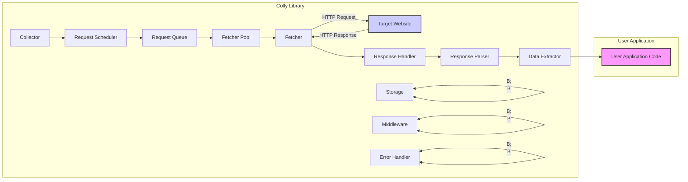

# Project Design Document: Colly Web Scraping Library

**Project:** Colly Web Scraping Library
**Project URL:** [https://github.com/gocolly/colly](https://github.com/gocolly/colly)
**Document Version:** 1.1
**Date:** October 27, 2023
**Author:** AI Software Architect

## 1. Introduction

This document provides a comprehensive design overview of the Colly web scraping library, a powerful and efficient Go framework for building web scrapers and crawlers.  It is intended to serve as a foundational resource for threat modeling and security analysis of systems built using Colly. This document details the library's architecture, key components, data flow, operational considerations, and security aspects. It aims to provide a clear understanding of Colly's inner workings to facilitate informed security assessments and development practices.

## 2. Project Overview

Colly is designed to simplify and accelerate the development of web scraping and crawling applications in Go. It abstracts away many of the complexities associated with web data extraction, offering a high-level API while maintaining performance and flexibility. Key features of Colly include:

*   **Asynchronous Request Handling:** Efficiently manages concurrent HTTP requests, maximizing scraping speed.
*   **Automatic Cookie and Session Management:** Handles website sessions and cookies seamlessly.
*   **HTML and XML Parsing:** Integrates with robust parsing libraries for extracting data from various web content formats.
*   **Request Scheduling and Rate Limiting:** Provides fine-grained control over request frequency to avoid overloading target websites and respect usage policies.
*   **Response Caching:** Supports caching of HTTP responses to reduce redundant requests and improve performance, especially during development and testing.
*   **`robots.txt` Compliance:** Automatically respects website's `robots.txt` directives to ensure ethical and compliant scraping.
*   **Extensibility:** Offers a flexible callback mechanism and middleware support for customization and extending functionality.
*   **Data Storage Integration:**  Allows integration with various storage solutions for persisting scraped data.

Colly's focus on speed, ease of use, and robust features makes it a popular choice for developers automating data extraction, monitoring website changes, and building web crawlers.

## 3. System Architecture

The following diagram illustrates the detailed architecture of a Colly application, highlighting the interactions between components:

**Detailed Component Description:**

*   **User Application Code ("User Application"):**  The Go program developed by the user that leverages the Colly library. This code defines the scraping logic, configures the `Collector`, registers callback functions, and processes the extracted data.
*   **Collector ("Collector"):** The central orchestrator of the Colly scraping process. It manages and configures all other components, including request scheduling, concurrency, storage, middleware, and error handling. The user interacts primarily with the `Collector` to define scraping behavior.
*   **Request Scheduler ("Request Scheduler"):**  Responsible for managing the order and timing of requests. It implements rate limiting, concurrency control, and prioritizes requests based on configuration. It interacts with the `Request Queue` to manage pending URLs.
*   **Request Queue ("Request Queue"):**  A data structure (typically in-memory or persistent) that holds the URLs待办 to be visited. The `Request Scheduler` pulls URLs from the queue and dispatches them to the `Fetcher Pool`.
*   **Fetcher Pool ("Fetcher Pool"):** Manages a pool of `Fetcher` instances to handle concurrent HTTP requests. The pool size is configurable and determines the level of concurrency in scraping.
*   **Fetcher ("Fetcher"):**  An individual worker responsible for executing HTTP requests. It takes a request from the `Fetcher Pool`, uses Go's `net/http` client to send the request to the `Target Website`, and receives the HTTP response. It handles details like connection management, timeouts, and TLS.
*   **Target Website ("Target Website"):** The external web server being scraped. It receives HTTP requests from the `Fetcher` and responds with HTTP responses (HTML, XML, JSON, etc.).
*   **Response Handler ("Response Handler"):** Processes the raw HTTP response received from the `Fetcher`. It checks for HTTP errors (status codes), handles redirects, manages cookies, and invokes registered response callbacks (`OnResponse`, `OnError`).
*   **Response Parser ("Response Parser"):**  Parses the response body based on its content type. For HTML and XML responses, it uses libraries like `goquery` to create a navigable document structure. For JSON, it handles JSON decoding.
*   **Data Extractor ("Data Extractor"):** Provides an API (e.g., `HTMLElement` in `goquery`) for users to easily extract data from the parsed response. It allows selection of elements using CSS selectors or XPath and retrieval of text, attributes, and other data.
*   **Storage ("Storage"):** An optional component that provides persistence for caching responses and storing scraped data. Colly supports various storage backends, allowing users to choose the most suitable option for their needs (e.g., in-memory cache, disk-based cache, Redis, databases).
*   **Middleware ("Middleware"):**  A chain of interceptors that can be applied to requests and responses. Middleware allows users to extend Colly's functionality by adding custom logic for request modification, response processing, error handling, logging, and more.
*   **Error Handler ("Error Handler"):**  Centralized component for managing errors that occur during the scraping process. It handles network errors, HTTP errors, parsing errors, and user-defined errors, triggering `OnError` callbacks and potentially implementing retry logic.

## 4. Data Flow

The data flow within a Colly application can be broken down into the following stages:

1.  **Initialization and Configuration:** The User Application initializes a `Collector` and configures its settings, including concurrency, rate limits, storage, middleware, error handling, and registers callback functions (`OnRequest`, `OnResponse`, `OnHTML`, `OnError`, `OnScraped`, etc.).
2.  **Seed URL Addition:** The User Application adds initial URLs (seed URLs) to the `Collector` to begin the crawling process. These URLs are placed in the `Request Queue`.
3.  **Request Scheduling and Queuing:** The `Request Scheduler` retrieves URLs from the `Request Queue` based on scheduling policies and rate limits. It ensures that requests are dispatched at the appropriate rate and concurrency level.
4.  **Request Dispatch to Fetcher Pool:** Scheduled requests are passed to the `Fetcher Pool`.
5.  **Fetcher Acquisition:** A `Fetcher` from the `Fetcher Pool` is assigned to handle the request.
6.  **HTTP Request Execution:** The `Fetcher` sends an HTTP request to the `Target Website` using Go's `net/http` client, incorporating configured headers, cookies, and proxies.
7.  **HTTP Response Reception:** The `Target Website` processes the request and sends back an HTTP response to the `Fetcher`.
8.  **Response Handling and Processing:** The `Response Handler` receives the HTTP response.
    *   It checks the HTTP status code. Errors trigger the `Error Handler` and `OnError` callback.
    *   Redirects are handled automatically, adding new requests to the `Request Queue`.
    *   Cookies are managed for session persistence.
    *   The `OnResponse` callback is executed for successful responses.
9.  **Response Parsing:** The `Response Parser` analyzes the `Content-Type` header of the response.
    *   For HTML or XML, it parses the response body using `goquery` or a similar library, creating a parse tree.
    *   For JSON, it decodes the JSON data.
10. **Data Extraction and Callback Invocation:** The `Data Extractor` provides methods to navigate the parsed document (e.g., `HTMLElement` for HTML).
    *   User-defined callbacks like `OnHTML` and `OnXML` are invoked, providing access to the parsed content for data extraction using CSS selectors, XPath, etc.
    *   The `OnScraped` callback is triggered after data extraction is complete for a given response.
11. **Data Processing and Storage (User Application):** Within the callbacks, the User Application code extracts, transforms, and stores the scraped data as needed.
12. **Link Discovery and Queueing (Automatic):** If configured, Colly automatically discovers links (e.g., `<a>` tags in HTML) within the parsed response. These discovered URLs are filtered based on user-defined rules and added to the `Request Queue` for further crawling.
13. **Middleware Processing:** Middleware is applied at various stages of the request-response cycle, allowing for custom logic to be executed before sending requests, after receiving responses, or during error handling.
14. **Storage Interaction (Optional):** The `Storage` component may be used to cache responses before parsing or to persist scraped data after extraction, depending on the application's requirements.
15. **Looping and Termination:** Steps 3-14 repeat until the `Request Queue` is empty and all scheduled requests are processed, or until the crawling process is explicitly stopped by the User Application.

## 5. Security Considerations

Security is paramount when developing and deploying web scraping applications. Here are key security considerations for Colly projects, categorized for clarity:

**5.1. Ethical and Legal Compliance:**

*   **Respect `robots.txt` (Confidentiality, Availability):** Colly's default behavior of respecting `robots.txt` is crucial for ethical scraping. Violating `robots.txt` can lead to IP blocking, legal repercussions, and damage website availability. Ensure your scraper always adheres to these directives.
*   **Website Terms of Service (Confidentiality, Integrity, Availability):** Review and comply with the target website's terms of service regarding scraping. Exceeding usage limits or violating terms can result in legal action or service disruption.
*   **Data Privacy Regulations (Confidentiality, Integrity):** Be mindful of data privacy regulations (GDPR, CCPA, etc.) when scraping personal data. Obtain necessary consent and implement data anonymization or pseudonymization techniques where required. Avoid scraping sensitive personal information without explicit justification and legal basis.

**5.2. Infrastructure and Operational Security:**

*   **Rate Limiting and Concurrency Control (Availability):**  Aggressive scraping without proper rate limiting can overload target websites, potentially causing Denial of Service (DoS). Configure Colly's rate limiting and concurrency settings to be respectful and avoid triggering website defenses.
*   **User-Agent Management (Confidentiality, Availability):** Use descriptive and legitimate User-Agent strings. Generic or suspicious User-Agents can lead to blocking. Rotate User-Agents and mimic legitimate browser behavior to reduce detection.
*   **Proxy Rotation (Confidentiality, Availability):** Implement proxy rotation to distribute requests across multiple IP addresses, mitigating IP-based blocking and improving anonymity. However, ensure proxies are from reputable providers and securely configured.
*   **CAPTCHA Handling (Availability):** Be prepared to handle CAPTCHAs, which are often used to detect and block bots. Consider integrating with CAPTCHA solving services or implementing strategies to minimize CAPTCHA encounters (e.g., realistic browsing patterns, avoiding rapid request bursts).
*   **Error Handling and Resilience (Availability, Integrity):** Implement robust error handling to gracefully manage network issues, website errors (4xx, 5xx), and unexpected response formats. Retry mechanisms and circuit breakers can enhance resilience.
*   **Logging and Monitoring (Availability, Integrity, Confidentiality):** Implement comprehensive logging to track scraper activity, identify errors, and monitor performance. Securely store logs and consider using monitoring tools to detect anomalies and potential security incidents.

**5.3. Application and Data Security:**

*   **Input Validation and Output Sanitization (Integrity, Availability):** If scraped data is used in other systems, rigorously validate and sanitize inputs to prevent injection vulnerabilities (SQL injection, XSS) in downstream applications.
*   **Dependency Management (Confidentiality, Integrity, Availability):** Keep Colly and its dependencies up-to-date to patch known security vulnerabilities. Regularly audit and update dependencies using vulnerability scanning tools.
*   **Storage Security (Confidentiality, Integrity, Availability):** Securely configure storage backends used for caching and data persistence. Implement access controls, encryption at rest and in transit, and regular security audits of storage infrastructure.
*   **Code Injection Vulnerabilities (Integrity, Availability):** Carefully review and sanitize any external data or user-provided input used within Colly callbacks or middleware to prevent code injection vulnerabilities. Avoid using `eval` or similar unsafe functions with scraped data.
*   **Information Disclosure (Confidentiality):** Be cautious about accidentally exposing sensitive information in logs, error messages, or scraped data storage. Implement appropriate data masking and redaction techniques.

## 6. Deployment Considerations

Deploying Colly applications effectively requires careful planning. Consider these aspects:

*   **Infrastructure Selection:**
    *   **Cloud Platforms (AWS, GCP, Azure):** Highly scalable and reliable, offering various compute options (VMs, containers, serverless). Ideal for large-scale scraping and production deployments. Leverage cloud security services for enhanced protection.
    *   **Dedicated Servers:** Provide more control over hardware and software. Suitable for consistent workloads and specific performance requirements. Ensure proper server hardening and security configurations.
    *   **Local Machines:** Suitable for development, testing, and small-scale, infrequent scraping tasks. Not recommended for production environments due to limited scalability and availability.

*   **Scalability and Performance:**
    *   **Horizontal Scaling:** Distribute scraping workload across multiple Colly instances for increased throughput and resilience. Use message queues (e.g., Redis, RabbitMQ) to coordinate distributed scraping.
    *   **Concurrency Tuning:** Optimize Colly's concurrency settings based on target website's capacity and network bandwidth. Experiment to find the optimal balance between speed and website impact.
    *   **Resource Monitoring:** Monitor CPU, memory, network usage to identify bottlenecks and optimize resource allocation.

*   **Deployment Automation:**
    *   **Containerization (Docker):** Package Colly applications in Docker containers for consistent deployments across environments. Simplify deployment and scaling with container orchestration platforms (Kubernetes).
    *   **Infrastructure as Code (IaC):** Use IaC tools (Terraform, CloudFormation) to automate infrastructure provisioning and configuration for repeatable and consistent deployments.
    *   **CI/CD Pipelines:** Implement CI/CD pipelines for automated building, testing, and deployment of Colly applications.

*   **Scheduling and Orchestration:**
    *   **Cron Jobs/Task Schedulers:** Schedule recurring scraping tasks using cron jobs or cloud-based task schedulers (AWS CloudWatch Events, Google Cloud Scheduler, Azure Logic Apps).
    *   **Workflow Orchestration Tools:** For complex scraping workflows, consider using workflow orchestration tools (Airflow, Prefect) to manage dependencies, retries, and monitoring.

## 7. Technology Stack

*   **Programming Language:** Go (Golang) - Version 1.16 or later recommended.
*   **HTTP Client:** `net/http` (Go standard library) - Provides core HTTP functionality.
*   **HTML Parsing:** `goquery` - A popular Go library providing jQuery-like syntax for HTML manipulation and traversal.
*   **XML Parsing:** `encoding/xml` (Go standard library) - For parsing XML responses. External libraries like `xmlpath` might be used for more complex XML processing.
*   **JSON Parsing:** `encoding/json` (Go standard library) - For parsing JSON responses.
*   **Robots.txt Parsing:**  `robotstxt` library (or similar Go library) - For parsing and interpreting `robots.txt` files.
*   **URL Parsing:** `net/url` (Go standard library) - For URL manipulation and parsing.
*   **Storage (Optional):**
    *   In-memory: Go `map` or other in-memory data structures.
    *   Filesystem: `os` and `io` packages (Go standard library).
    *   Redis: `github.com/go-redis/redis/v8` or similar Go Redis client libraries.
    *   Databases:  Go database drivers for various databases (e.g., `database/sql` and database-specific drivers like `github.com/lib/pq` for PostgreSQL, `github.com/go-sql-driver/mysql` for MySQL).
*   **Logging:** `log` (Go standard library) or more advanced logging libraries like `logrus`, `zap`.
*   **Testing:** `testing` (Go standard library), `testify` for assertions and mocking.

## 8. Threat Modeling Preparation

This design document is specifically structured to facilitate effective threat modeling for Colly-based applications. It provides the necessary information to apply various threat modeling methodologies, including:

*   **STRIDE:**  This document helps identify potential threats across the STRIDE categories (Spoofing, Tampering, Repudiation, Information Disclosure, Denial of Service, Elevation of Privilege) by:
    *   **System Boundaries and Components (Sections 3 & 4):** Defining the attack surface and key components susceptible to threats.
    *   **Data Flow (Section 4):**  Highlighting data paths where information disclosure or tampering could occur.
    *   **Security Considerations (Section 5):**  Proactively listing potential threats and vulnerabilities related to each component and data flow.

*   **Attack Trees:** The architecture diagram and component descriptions can be used to construct attack trees, visualizing potential attack paths and their likelihood.

*   **PASTA (Process for Attack Simulation and Threat Analysis):** This document provides the context and system understanding required for the initial stages of PASTA, including:
    *   **Stage 1 (Define Objectives):** Understanding the purpose and goals of the Colly application.
    *   **Stage 2 (Define Technical Scope):**  Clearly outlining the system boundaries and components described in this document.
    *   **Stage 3 (Application Decomposition):** Breaking down the system into components and data flows as presented in Sections 3 and 4.

**Using this document for Threat Modeling:**

1.  **Identify Assets:** Determine the valuable assets within the Colly application and its environment (e.g., scraped data, API keys, infrastructure).
2.  **Identify Threats:** Use the "Security Considerations" section and threat modeling methodologies (STRIDE, Attack Trees) to identify potential threats targeting the assets.
3.  **Vulnerability Analysis:** Analyze each component and data flow to identify potential vulnerabilities that could be exploited by the identified threats.
4.  **Risk Assessment:** Evaluate the likelihood and impact of each threat and vulnerability to prioritize risks.
5.  **Mitigation Strategies:** Develop and implement security controls and mitigations to address the identified risks. Refer to the "Security Considerations" and "Deployment Considerations" sections for potential mitigation strategies.
6.  **Validation and Testing:**  Conduct security testing (penetration testing, vulnerability scanning) to validate the effectiveness of implemented mitigations.

## 9. Conclusion

This enhanced design document provides a more detailed and structured overview of the Colly web scraping library. By elaborating on the architecture, data flow, security considerations, and deployment aspects, it aims to be a more valuable resource for developers and security professionals. This document serves as a solid foundation for building secure and robust web scraping applications with Colly and for conducting thorough threat modeling exercises to proactively address potential security risks. Continuous review and updates to this document are recommended as the Colly project and its ecosystem evolve.