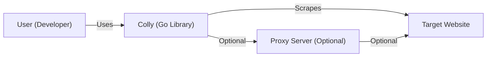
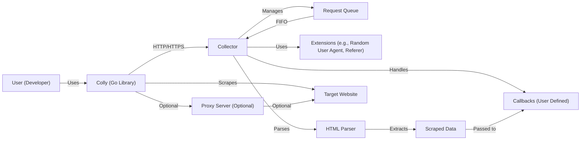
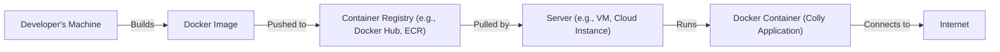
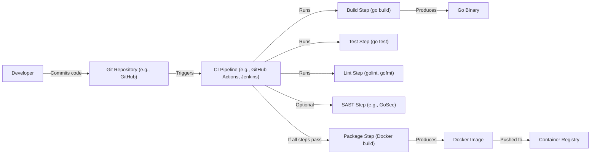

# BUSINESS POSTURE

Business Priorities and Goals:

*   Provide a fast and efficient web scraping and crawling framework for Go.
*   Offer an easy-to-use API for developers to extract structured data from websites.
*   Maintain a robust and reliable library that can handle various website structures and complexities.
*   Foster a strong community around the project, encouraging contributions and providing support.
*   Ensure the library remains performant and scalable to handle large-scale scraping tasks.

Business Risks:

*   Legal and ethical concerns related to web scraping, including potential violations of website terms of service and data privacy regulations.
*   Reputational damage if the library is used for malicious purposes, such as spamming or data theft.
*   Technical challenges in maintaining compatibility with evolving website technologies and anti-scraping measures.
*   Dependency on external websites, which may change their structure or become unavailable, impacting the functionality of the library.
*   Competition from other web scraping libraries and tools, requiring continuous improvement and innovation.

# SECURITY POSTURE

Existing Security Controls:

*   security control: Input validation: The library provides mechanisms for handling and sanitizing user inputs, such as URLs and selectors, to prevent injection vulnerabilities. (Described in documentation and implemented in code).
*   security control: Rate limiting: The library offers features for controlling the frequency of requests to avoid overwhelming target websites and triggering anti-scraping measures. (Described in documentation and implemented in code).
*   security control: Random user agent: The library allows setting random user agents to mimic different browsers and reduce the likelihood of being detected as a scraper. (Described in documentation and implemented in code).
*   security control: Proxy support: The library supports the use of proxy servers to mask the origin of requests and bypass IP-based restrictions. (Described in documentation and implemented in code).
*   security control: Cookie management: The library provides mechanisms for handling cookies, which can be necessary for interacting with websites that require authentication or session management. (Described in documentation and implemented in code).

Accepted Risks:

*   accepted risk: The library, by its nature, interacts with external websites, which are inherently untrusted environments. While the library provides some security controls, it cannot guarantee complete protection against all potential threats.
*   accepted risk: Users of the library are responsible for ensuring their scraping activities comply with legal and ethical guidelines, as well as the terms of service of the target websites.
*   accepted risk: Websites may implement anti-scraping measures that could block or limit the library's functionality.

Recommended Security Controls:

*   security control: Implement robust error handling and logging to detect and respond to unexpected website behavior or anti-scraping measures.
*   security control: Provide options for configuring request headers, such as referer and accept-language, to further mimic legitimate browser behavior.
*   security control: Consider incorporating CAPTCHA solving mechanisms or providing guidance on integrating with third-party CAPTCHA solving services.
*   security control: Offer features for respecting robots.txt rules to ensure ethical scraping practices.
*   security control: Regularly update the library to address security vulnerabilities and adapt to evolving website technologies.

Security Requirements:

*   Authentication:
    *   The library should support various authentication methods, including cookie-based authentication, HTTP basic authentication, and API key authentication, as required by target websites.
*   Authorization:
    *   The library itself does not handle authorization in the traditional sense, as it primarily focuses on data extraction. However, it should provide mechanisms for managing authenticated sessions and handling access control restrictions imposed by target websites.
*   Input Validation:
    *   The library must validate and sanitize all user-provided inputs, such as URLs, selectors, and regular expressions, to prevent injection vulnerabilities and ensure the integrity of the scraping process.
*   Cryptography:
    *   The library should use secure communication protocols (HTTPS) when interacting with websites to protect sensitive data in transit.
    *   If the library handles sensitive data, such as credentials or API keys, it should provide options for securely storing and managing this information.

# DESIGN

## C4 CONTEXT

Element List:

*   Element:
    *   Name: User (Developer)
    *   Type: Person
    *   Description: A developer who uses the Colly library in their Go application to scrape data from websites.
    *   Responsibilities:
        *   Writes and maintains the Go code that utilizes the Colly library.
        *   Configures the Colly collector with appropriate settings, such as allowed domains, request limits, and user agents.
        *   Handles the scraped data and integrates it into their application.
        *   Ensures compliance with legal and ethical guidelines for web scraping.
    *   Security controls:
        *   Follows secure coding practices to prevent vulnerabilities in their application.
        *   Uses strong passwords and secure authentication methods when accessing websites or APIs.
        *   Monitors their application for security issues and applies necessary updates.

*   Element:
    *   Name: Colly (Go Library)
    *   Type: Software System
    *   Description: The Colly web scraping and crawling framework for Go.
    *   Responsibilities:
        *   Provides an API for making HTTP requests to target websites.
        *   Parses HTML responses and extracts data based on user-defined selectors.
        *   Manages request queuing, concurrency, and rate limiting.
        *   Handles cookies, user agents, and proxy configurations.
        *   Provides callbacks for handling events during the scraping process.
    *   Security controls:
        *   Input validation for URLs and selectors.
        *   Rate limiting to prevent overwhelming target websites.
        *   Random user agent selection.
        *   Proxy support for masking request origin.
        *   Cookie management.

*   Element:
    *   Name: Target Website
    *   Type: Software System
    *   Description: The website that is being scraped by the Colly library.
    *   Responsibilities:
        *   Serves web pages and content to users and web scrapers.
        *   May implement anti-scraping measures to protect its data and resources.
    *   Security controls:
        *   Website security measures, such as firewalls, intrusion detection systems, and rate limiting.
        *   Anti-scraping techniques, such as CAPTCHAs, IP blocking, and user agent detection.

*   Element:
    *   Name: Proxy Server (Optional)
    *   Type: Software System
    *   Description: An optional intermediary server that can be used to route requests from the Colly library to the target website.
    *   Responsibilities:
        *   Forwards requests from the Colly library to the target website.
        *   Masks the origin IP address of the scraping requests.
        *   May provide additional features, such as caching or filtering.
    *   Security controls:
        *   Proxy server security measures, such as access controls and authentication.

## C4 CONTAINER

Element List:

*   Element:
    *   Name: Collector
    *   Type: Container
    *   Description: The core component of Colly that manages the scraping process.
    *   Responsibilities:
        *   Handles the main scraping logic and coordination.
        *   Manages the request queue and concurrency.
        *   Applies extensions and configurations.
        *   Triggers callbacks based on events.
    *   Security controls:
        *   Enforces rate limiting and concurrency limits.
        *   Applies configured security-related extensions.

*   Element:
    *   Name: Request Queue
    *   Type: Container
    *   Description: A queue that stores the URLs to be scraped.
    *   Responsibilities:
        *   Stores URLs in a FIFO (First-In, First-Out) order.
        *   Provides URLs to the Collector for processing.
    *   Security controls:
        *   None specific, relies on Collector's security controls.

*   Element:
    *   Name: Extensions
    *   Type: Container
    *   Description: Modules that provide additional functionality to the Collector.
    *   Responsibilities:
        *   Implement specific features, such as random user agent selection, referer header setting, and proxy rotation.
    *   Security controls:
        *   Implement security-related features, such as random user agents and proxy usage.

*   Element:
    *   Name: HTML Parser
    *   Type: Container
    *   Description: A component that parses HTML responses from websites.
    *   Responsibilities:
        *   Parses HTML documents into a structured format (DOM tree).
        *   Allows extraction of data using CSS selectors or XPath expressions.
    *   Security controls:
        *   Relies on the underlying HTML parsing library's security measures.

*   Element:
    *   Name: Callbacks
    *   Type: Container
    *   Description: User-defined functions that are triggered during the scraping process.
    *   Responsibilities:
        *   Handle events, such as receiving a response, encountering an error, or extracting data.
        *   Process the scraped data and perform actions, such as storing it in a database or sending notifications.
    *   Security controls:
        *   Dependent on the user's implementation. Users should follow secure coding practices within their callback functions.

*   Element:
    *   Name: Scraped Data
    *   Type: Data
    *   Description: The data extracted from the target website.
    *   Responsibilities: N/A
    *   Security controls: N/A

*   Element:
    *   Name: User (Developer)
    *   Type: Person
    *   Description: A developer who uses the Colly library in their Go application to scrape data from websites.
    *   Responsibilities:
        *   Writes and maintains the Go code that utilizes the Colly library.
        *   Configures the Colly collector with appropriate settings, such as allowed domains, request limits, and user agents.
        *   Handles the scraped data and integrates it into their application.
        *   Ensures compliance with legal and ethical guidelines for web scraping.
    *   Security controls:
        *   Follows secure coding practices to prevent vulnerabilities in their application.
        *   Uses strong passwords and secure authentication methods when accessing websites or APIs.
        *   Monitors their application for security issues and applies necessary updates.

*   Element:
    *   Name: Colly (Go Library)
    *   Type: Software System
    *   Description: The Colly web scraping and crawling framework for Go.
    *   Responsibilities:
        *   Provides an API for making HTTP requests to target websites.
        *   Parses HTML responses and extracts data based on user-defined selectors.
        *   Manages request queuing, concurrency, and rate limiting.
        *   Handles cookies, user agents, and proxy configurations.
        *   Provides callbacks for handling events during the scraping process.
    *   Security controls:
        *   Input validation for URLs and selectors.
        *   Rate limiting to prevent overwhelming target websites.
        *   Random user agent selection.
        *   Proxy support for masking request origin.
        *   Cookie management.

*   Element:
    *   Name: Target Website
    *   Type: Software System
    *   Description: The website that is being scraped by the Colly library.
    *   Responsibilities:
        *   Serves web pages and content to users and web scrapers.
        *   May implement anti-scraping measures to protect its data and resources.
    *   Security controls:
        *   Website security measures, such as firewalls, intrusion detection systems, and rate limiting.
        *   Anti-scraping techniques, such as CAPTCHAs, IP blocking, and user agent detection.

*   Element:
    *   Name: Proxy Server (Optional)
    *   Type: Software System
    *   Description: An optional intermediary server that can be used to route requests from the Colly library to the target website.
    *   Responsibilities:
        *   Forwards requests from the Colly library to the target website.
        *   Masks the origin IP address of the scraping requests.
        *   May provide additional features, such as caching or filtering.
    *   Security controls:
        *   Proxy server security measures, such as access controls and authentication.

## DEPLOYMENT

Possible Deployment Solutions:

1.  Standalone Go Application: The Colly library is typically used within a standalone Go application. This application can be deployed to various environments, such as a virtual machine, a container, or a serverless function.
2.  Docker Container: The Go application using Colly can be containerized using Docker. This allows for easy deployment and scaling across different environments.
3.  Kubernetes Cluster: For large-scale scraping operations, the Docker container can be deployed to a Kubernetes cluster. This provides orchestration, scaling, and fault tolerance.
4.  Cloud Functions (e.g., AWS Lambda, Google Cloud Functions): The Colly library can be used within a serverless function, allowing for event-triggered scraping and pay-per-use pricing.

Chosen Deployment Solution (Docker Container):

Element List:

*   Element:
    *   Name: Developer's Machine
    *   Type: Infrastructure
    *   Description: The machine where the developer writes and builds the Go application using Colly.
    *   Responsibilities:
        *   Hosts the development environment, including the Go compiler, IDE, and Colly library.
        *   Builds the Docker image for the application.
    *   Security controls:
        *   Developer machine security measures, such as antivirus software, firewall, and regular software updates.

*   Element:
    *   Name: Docker Image
    *   Type: Artifact
    *   Description: A packaged version of the Go application and its dependencies, including the Colly library.
    *   Responsibilities:
        *   Contains all the necessary files and configurations to run the application in a container.
    *   Security controls:
        *   Use of minimal base images to reduce attack surface.
        *   Regular scanning of the image for vulnerabilities.

*   Element:
    *   Name: Container Registry
    *   Type: Infrastructure
    *   Description: A repository for storing and managing Docker images.
    *   Responsibilities:
        *   Stores the Docker image for the Colly application.
        *   Provides access control and authentication for image retrieval.
    *   Security controls:
        *   Registry security measures, such as access controls, authentication, and vulnerability scanning.

*   Element:
    *   Name: Server
    *   Type: Infrastructure
    *   Description: The server or cloud instance where the Docker container will be deployed.
    *   Responsibilities:
        *   Hosts the Docker engine and runs the Colly application container.
        *   Provides network connectivity for the container to access the internet.
    *   Security controls:
        *   Server security measures, such as firewall, intrusion detection system, and regular security updates.
        *   Secure configuration of the Docker engine.

*   Element:
    *   Name: Docker Container (Colly Application)
    *   Type: Container
    *   Description: The running instance of the Docker image, containing the Colly application.
    *   Responsibilities:
        *   Executes the Go application that uses the Colly library to scrape websites.
    *   Security controls:
        *   Security controls implemented within the Colly library and the Go application.
        *   Container isolation to limit the impact of potential vulnerabilities.

*   Element:
    *   Name: Internet
    *   Type: Network
    *   Description: External network.
    *   Responsibilities: N/A
    *   Security controls: N/A

## BUILD

Build Process Description:

1.  Developer commits code changes to a Git repository (e.g., GitHub, GitLab).
2.  The commit triggers a CI/CD pipeline (e.g., GitHub Actions, Jenkins, CircleCI).
3.  The pipeline runs a build step using the `go build` command to compile the Go code and create an executable binary.
4.  The pipeline runs a test step using the `go test` command to execute unit tests and ensure code quality.
5.  The pipeline runs a lint step using tools like `golint` and `gofmt` to check for code style and formatting issues.
6.  Optionally, the pipeline runs a SAST (Static Application Security Testing) step using tools like GoSec to identify potential security vulnerabilities in the code.
7.  If all steps pass successfully, the pipeline proceeds to the package step.
8.  The package step uses Docker build to create a Docker image containing the Go binary and its dependencies.
9.  The Docker image is pushed to a container registry (e.g., Docker Hub, Amazon ECR).

Security Controls in Build Process:

*   security control: Code review: Code changes are reviewed by other developers before being merged into the main branch.
*   security control: Automated testing: Unit tests and integration tests are executed automatically to ensure code quality and prevent regressions.
*   security control: Linting: Code style and formatting checks are enforced to maintain consistency and readability.
*   security control: SAST (Static Application Security Testing): Static analysis tools are used to identify potential security vulnerabilities in the code.
*   security control: Dependency management: Dependencies are managed using a package manager (e.g., Go modules) and are regularly checked for security updates.
*   security control: Secure build environment: The CI/CD pipeline runs in a secure environment with limited access and appropriate security configurations.
*   security control: Image scanning: Docker images are scanned for vulnerabilities before being deployed.

# RISK ASSESSMENT

Critical Business Processes:

*   Data extraction: The core business process is extracting data from websites. The accuracy, reliability, and efficiency of this process are critical.
*   Application functionality: The Go application that utilizes Colly must function correctly and provide the intended features to its users.

Data Sensitivity:

*   Publicly available data: The primary data being accessed is publicly available information on websites. The sensitivity of this data depends on the specific content being scraped.
*   Potentially sensitive data: If the scraping targets websites that require authentication or contain user-specific information, the scraped data could be considered sensitive. Examples include:
    *   Usernames and passwords (if scraping login forms, which is generally discouraged).
    *   Personal information (if scraping profiles or user-generated content).
    *   Financial data (if scraping e-commerce sites or financial portals).
    *   Proprietary data (if scraping internal websites or APIs).

The sensitivity of the data being scraped should be carefully considered, and appropriate security measures should be implemented to protect it.

# QUESTIONS & ASSUMPTIONS

Questions:

*   Are there any specific legal or ethical guidelines that the scraping activities must adhere to?
*   Are there any specific websites or types of websites that are prohibited from being scraped?
*   What is the expected scale of the scraping operations (number of requests per day, number of websites)?
*   Are there any existing security tools or infrastructure in place that should be integrated with the Colly application?
*   What are the specific requirements for data storage and handling after it is scraped?
*   What level of logging and monitoring is required for the scraping activities?

Assumptions:

*   BUSINESS POSTURE: The primary goal is to extract data from websites efficiently and reliably, while adhering to ethical and legal guidelines.
*   SECURITY POSTURE: The existing security controls in the Colly library provide a baseline level of protection, but additional measures may be needed depending on the specific use case and data sensitivity.
*   DESIGN: The provided design diagrams represent a typical deployment scenario, but the actual deployment may vary based on specific requirements and infrastructure. The build process assumes the use of a CI/CD pipeline, but manual builds are also possible.