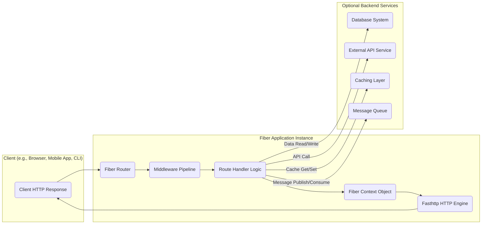

## Project Design Document: Fiber Web Framework (Improved)

**1. Introduction**

This document offers a detailed architectural blueprint of the Fiber web framework (https://github.com/gofiber/fiber), a high-performance and user-friendly web framework for Go. It is specifically designed to facilitate comprehensive threat modeling by providing a clear understanding of Fiber's internal workings, data pathways, and external interactions.

**2. Project Overview**

Fiber is a lightweight and efficient web framework for Go, heavily inspired by the popular Node.js framework, Express.js. Built upon the blazing-fast Fasthttp HTTP engine, Fiber prioritizes speed and ease of use, making it an excellent choice for building robust web applications and APIs with Go. Its familiar API reduces the learning curve for developers transitioning from other web frameworks.

**3. Goals and Objectives**

* **Maximize Performance:** Leverage the underlying Fasthttp engine to achieve optimal request processing speed and minimize resource consumption.
* **Simplify Development:** Provide an intuitive and developer-friendly API, mirroring the simplicity and ease of use of Express.js.
* **Boost Developer Productivity:** Reduce boilerplate code and offer convenient features for common web development tasks, such as routing, middleware, and request handling.
* **Enable Extensibility and Customization:**  Offer a flexible architecture that allows developers to extend functionality through middleware, plugins, and custom components.
* **Ensure Stability and Reliability:** Provide a stable and well-tested framework suitable for building production-grade applications.

**4. Target Audience**

* Go developers building web applications, RESTful APIs, and microservices.
* Developers with experience in Node.js and Express.js looking for a performant Go-based alternative.
* Teams seeking a lightweight and efficient framework for building high-throughput web services.

**5. High-Level Architecture**

**6. Component Details**

* **Client HTTP Request:** An incoming HTTP request initiated by a client. This includes details such as:
    * HTTP method (GET, POST, PUT, DELETE, etc.)
    * Requested URL path
    * HTTP headers (e.g., User-Agent, Content-Type)
    * Request body (if applicable)
* **Fiber Router:** The core component responsible for directing incoming requests to the appropriate handler. Key functionalities include:
    * Maintaining a routing table that maps URL patterns and HTTP methods to specific handler functions.
    * Performing pattern matching on incoming request paths to identify the correct route.
    * Supporting route parameters (e.g., `/users/:id`), wildcards, and optional segments.
    * Enabling route grouping for applying common prefixes or middleware to sets of routes.
* **Middleware Pipeline:** An ordered sequence of functions executed before or after the route handler. Middleware can perform a wide range of tasks, including:
    * **Request Pre-processing:**
        * Logging incoming requests.
        * Authenticating and authorizing users.
        * Parsing request bodies (JSON, XML, form data).
        * Validating request data.
        * Setting request-specific context.
    * **Response Post-processing:**
        * Setting response headers.
        * Compressing response bodies.
        * Logging response details.
        * Handling errors and exceptions.
* **Route Handler Logic:** The specific function associated with a matched route that contains the application's core business logic. This function:
    * Receives a `Fiber Context Object` providing access to request and response information.
    * Executes the necessary operations to fulfill the request (e.g., data retrieval, processing, interaction with other services).
    * Generates the HTTP response to be sent back to the client.
* **Fiber Context Object:** A central object that encapsulates all information related to the current HTTP request and response lifecycle. It provides methods for:
    * Accessing request details: parameters, headers, body, cookies, etc.
    * Setting response details: status code, headers, body, cookies, etc.
    * Managing request-scoped data that can be shared between middleware and handlers.
    * Aborting the request processing early.
    * Redirecting the request to another URL.
* **Fasthttp HTTP Engine:** The underlying high-performance HTTP server library that powers Fiber. It handles:
    * Accepting and managing incoming network connections.
    * Parsing HTTP requests and generating HTTP responses efficiently.
    * Managing TCP connections and socket operations.
    * Providing low-level control over HTTP processing.
* **Optional Backend Services:** External systems that the Fiber application may interact with to fulfill requests:
    * **Database System:** For persistent data storage and retrieval (e.g., PostgreSQL, MySQL, MongoDB).
    * **External API Service:** Other web services or APIs that the application needs to communicate with.
    * **Caching Layer:** Systems for storing frequently accessed data to improve performance (e.g., Redis, Memcached).
    * **Message Queue:** For asynchronous communication and task processing (e.g., RabbitMQ, Kafka).

**7. Data Flow**

1. A **Client HTTP Request** is sent to the Fiber application.
2. The **Fasthttp HTTP Engine** receives the request and hands it over to the **Fiber Router**.
3. The **Fiber Router** analyzes the request path and method to find a matching route in its routing table.
4. The **Middleware Pipeline** associated with the matched route is executed in order. Each middleware can process the request or response, and can optionally pass control to the next middleware or terminate the pipeline.
5. Once the middleware pipeline is complete, the **Route Handler Logic** for the matched route is invoked.
6. The **Route Handler Logic** uses the **Fiber Context Object** to access request data and interact with **Optional Backend Services** as needed.
7. The **Route Handler Logic** generates the HTTP response, setting headers and the response body using the **Fiber Context Object**.
8. The response is then passed back through the **Middleware Pipeline** in reverse order for any post-processing.
9. Finally, the **Fasthttp HTTP Engine** sends the **Client HTTP Response** back to the client.

**8. External Dependencies and Integrations**

Fiber applications often integrate with various external libraries and services. Common categories include:

* **Core Infrastructure:**
    * **Fasthttp:** The underlying HTTP server.
    * **Go Standard Library:** Utilizes core Go packages for networking, concurrency, etc.
* **Data Storage:**
    * Database drivers (e.g., `github.com/lib/pq` for PostgreSQL, `github.com/go-sql-driver/mysql` for MySQL, `go.mongodb.org/mongo-driver` for MongoDB).
    * ORM/ODM libraries (e.g., GORM, XORM).
* **Caching:**
    * Redis clients (e.g., `github.com/go-redis/redis/v8`).
    * Memcached clients.
* **Logging:**
    * Structured logging libraries (e.g., `go.uber.org/zap`, `github.com/sirupsen/logrus`).
* **Monitoring and Tracing:**
    * OpenTelemetry Go SDK.
    * Prometheus client libraries.
* **Authentication and Authorization:**
    * JWT libraries (e.g., `github.com/golang-jwt/jwt/v5`).
    * OAuth2 libraries.
* **Validation:**
    * Data validation libraries (e.g., `github.com/go-playground/validator/v10`).
* **Task Queues/Background Jobs:**
    * Libraries for interacting with message queues (e.g., `github.com/streadway/amqp` for RabbitMQ).
* **Third-Party Middleware:** A vast ecosystem of community-developed middleware for various functionalities (e.g., CORS, compression, security headers).

**9. Security Considerations (For Threat Modeling)**

* **Input Handling and Validation:**
    * **Data Sanitization:** Ensuring user-provided data is sanitized to prevent injection attacks (e.g., XSS).
    * **Input Validation:** Verifying the format, type, and range of user inputs to prevent unexpected behavior and vulnerabilities.
* **Authentication and Authorization:**
    * **Authentication Mechanisms:** Securely verifying user identities (e.g., using passwords, API keys, OAuth).
    * **Authorization Enforcement:** Controlling access to resources based on user roles and permissions.
    * **Session Management:** Securely managing user sessions to prevent session hijacking and fixation.
* **Output Encoding:**
    * **Contextual Output Encoding:** Encoding data appropriately based on the output context (e.g., HTML escaping, URL encoding) to prevent injection vulnerabilities.
* **Communication Security:**
    * **TLS/HTTPS:** Enforcing secure communication over encrypted connections to protect data in transit.
* **Error Handling and Logging:**
    * **Secure Error Handling:** Preventing sensitive information from being leaked in error messages.
    * **Security Logging:** Logging security-relevant events for auditing and incident response.
* **Dependency Management:**
    * **Vulnerability Scanning:** Regularly scanning dependencies for known vulnerabilities and updating them promptly.
* **Rate Limiting and Abuse Prevention:**
    * **Rate Limiting:** Protecting against denial-of-service attacks by limiting the number of requests from a single source.
* **Cross-Site Request Forgery (CSRF) Protection:**
    * Implementing CSRF tokens to prevent unauthorized actions on behalf of authenticated users.
* **Security Headers:**
    * Utilizing HTTP security headers (e.g., Content-Security-Policy, Strict-Transport-Security) to enhance client-side security.
* **Middleware Security:**
    * Carefully vetting and securing any custom or third-party middleware used in the application.

**10. Deployment Considerations**

Fiber applications can be deployed in various environments, each with its own characteristics:

* **Bare Metal Servers/Virtual Machines:**
    * **Pros:** Direct control over the environment, potentially lower cost for small deployments.
    * **Cons:** Requires manual configuration and management, scaling can be complex.
* **Containers (Docker, Kubernetes):**
    * **Pros:** Consistent environment across deployments, easy scaling and management, improved resource utilization.
    * **Cons:** Requires containerization knowledge and infrastructure.
* **Cloud Platforms (AWS, Azure, GCP):**
    * **Pros:** Scalability, reliability, managed services, pay-as-you-go pricing.
    * **Cons:** Vendor lock-in, potential complexity in configuration.
* **Serverless Functions (AWS Lambda, Azure Functions, Google Cloud Functions):**
    * **Pros:** Automatic scaling, cost-effective for event-driven applications, reduced operational overhead.
    * **Cons:** Cold starts, limitations on execution time and resources, potential architectural changes required.

**11. Conclusion**

This improved design document provides a more in-depth and structured understanding of the Fiber web framework's architecture, components, data flow, and security considerations. This detailed information is essential for conducting thorough threat modeling exercises and identifying potential vulnerabilities within applications built using Fiber. By carefully considering the information presented here, developers and security professionals can work together to build more secure and resilient web applications.
