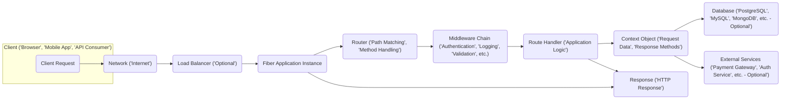

## Project Design Document: Go Fiber Web Framework (Improved)

**1. Project Overview**

*   **Project Name:** Fiber
*   **Project Repository:** [https://github.com/gofiber/fiber](https://github.com/gofiber/fiber)
*   **Project Description:** Fiber is a high-performance, minimalist web framework for Go, inspired by Node.js's Express. It leverages Fasthttp, the fastest HTTP engine for Go, to achieve significant performance gains. Fiber prioritizes developer experience by offering an intuitive and familiar API, making it suitable for building web applications, RESTful APIs, and microservices.
*   **Project Goals:**
    *   Deliver exceptional performance for Go-based web applications.
    *   Provide a developer-friendly API, reducing the learning curve for developers familiar with Express.
    *   Facilitate rapid development and iteration.
    *   Maintain a modular and extensible architecture through middleware.
*   **Target Audience:** Go developers seeking a fast and efficient web framework with an easy-to-use API for building various types of web services.

**2. Architecture Overview**

**3. Component Details**

*   **Client ('Browser', 'Mobile App', 'API Consumer'):**  The initiator of HTTP requests. This can be a web browser, a mobile application, another backend service, or any system capable of making HTTP requests. Security considerations at this level involve the client's own vulnerabilities and the security of the communication channel.
*   **Network ('Internet'):** The public network through which requests and responses travel. This is an untrusted environment, emphasizing the need for secure communication protocols (HTTPS).
*   **Load Balancer ('Optional'):** Distributes incoming traffic across multiple Fiber application instances. This enhances availability and scalability. Security considerations include the load balancer's own security configuration and its ability to mitigate certain types of attacks (e.g., DDoS).
*   **Fiber Application Instance:** A running instance of the Fiber application, responsible for processing incoming requests. This is the core of the system where vulnerabilities in the framework or application code can be exploited.
*   **Router ('Path Matching', 'Method Handling'):**  Responsible for directing incoming requests to the appropriate handler based on the request path and HTTP method.
    *   Key functionalities:
        *   Defining routes using specific paths and HTTP methods (e.g., `app.Get("/api/users", handler)`).
        *   Extracting parameters from URL paths (e.g., `/users/:id`). Improper handling of these parameters can lead to vulnerabilities.
        *   Supporting route groups for organizing related endpoints and applying shared middleware.
        *   Potential vulnerabilities: Incorrectly configured routes can expose unintended endpoints. Regular expression usage in routing, if not carefully implemented, can lead to ReDoS (Regular expression Denial of Service) attacks.
*   **Middleware Chain ('Authentication', 'Logging', 'Validation', etc.):** A series of functions executed sequentially before the route handler. Middleware plays a crucial role in security.
    *   Common security-related middleware:
        *   **Authentication Middleware:** Verifies the identity of the requester (e.g., using JWT, sessions). Vulnerabilities here can lead to unauthorized access.
        *   **Authorization Middleware:** Determines if an authenticated user has permission to access a specific resource. Improper authorization can lead to privilege escalation.
        *   **Logging Middleware:** Records request details for auditing and security monitoring. Care must be taken to avoid logging sensitive information.
        *   **Request Validation Middleware:** Ensures that incoming request data conforms to expected formats and constraints. This helps prevent injection attacks and data corruption.
        *   **Rate Limiting Middleware:** Restricts the number of requests from a specific client within a given time frame, mitigating DoS attacks.
        *   **CORS Middleware:** Configures Cross-Origin Resource Sharing policies, controlling which domains can access the application's resources. Misconfiguration can lead to security vulnerabilities.
        *   **Security Headers Middleware:** Sets HTTP security headers (e.g., `Content-Security-Policy`, `Strict-Transport-Security`) to enhance browser-side security.
    *   Potential vulnerabilities:  Vulnerabilities in middleware code can affect the entire application. The order of middleware execution is critical; misordering can bypass security checks.
*   **Route Handler ('Application Logic'):** The function containing the core business logic for a specific route. This is where developers must implement secure coding practices.
    *   Responsibilities:
        *   Processing the request based on its data.
        *   Interacting with databases or external services.
        *   Generating the HTTP response.
    *   Potential vulnerabilities: Injection flaws (SQL injection, NoSQL injection, command injection), business logic flaws, insecure handling of sensitive data.
*   **Context Object ('Request Data', 'Response Methods'):** Provides access to request information and methods for building the response.
    *   Key functionalities:
        *   Accessing request headers, parameters, and body. Care must be taken when accessing and processing user-provided data.
        *   Setting response headers, status codes, and body. Ensure proper encoding and escaping of response data to prevent XSS.
        *   Managing request-scoped data.
    *   Potential vulnerabilities:  Improper use of context methods can lead to information leakage or incorrect response construction.
*   **Response ('HTTP Response'):** The data sent back to the client, including headers, status code, and body. Security considerations involve ensuring the response does not contain sensitive information and is properly formatted to prevent client-side vulnerabilities.
*   **Database ('PostgreSQL', 'MySQL', 'MongoDB', etc. - Optional'):**  Used for persistent data storage. Security considerations include database access control, data encryption (at rest and in transit), and protection against injection attacks.
*   **External Services ('Payment Gateway', 'Auth Service', etc. - Optional'):**  Third-party services the application interacts with. Security considerations involve secure authentication and authorization with these services, secure data transmission, and handling potential vulnerabilities in the external services.

**4. Data Flow**

1. A **Client** sends an HTTP **Request** targeting a specific resource on the Fiber application.
2. The **Request** travels through the **Network**, potentially passing through a **Load Balancer**.
3. The **Fiber Application Instance** receives the **Request**.
4. The **Router** analyzes the request path and method to determine the matching route.
5. The **Middleware Chain** associated with the route is executed sequentially. Each middleware can inspect and modify the request or response, perform authentication or authorization checks, or terminate the request.
6. If the request passes through all middleware, the **Route Handler** for the matched route is invoked.
7. The **Route Handler** uses the **Context Object** to access request data and perform application-specific logic. This may involve interacting with a **Database** or **External Services**.
8. The **Route Handler** constructs the **Response**, setting headers, status code, and body using the **Context Object**.
9. The **Fiber Application Instance** sends the **Response** back through the **Network** to the **Client**.

**5. Security Considerations (Detailed)**

*   **Input Validation:** Fiber relies on developers to implement robust input validation. Failing to validate input can lead to various injection attacks (SQL, command, XSS). Consider using validation libraries and sanitizing user input.
*   **Authentication and Authorization:** Fiber provides mechanisms for implementing authentication and authorization, often through middleware. Ensure strong authentication schemes are used (e.g., multi-factor authentication), and authorization logic is correctly implemented to prevent unauthorized access to resources. Carefully manage session tokens or API keys.
*   **Session Management:** If using sessions, ensure secure session cookie attributes are set (`HttpOnly`, `Secure`, `SameSite`). Implement proper session invalidation and consider using secure session storage mechanisms.
*   **Cross-Site Scripting (XSS):**  Prevent XSS by properly escaping user-generated content before rendering it in HTML. Utilize template engines with built-in escaping features or manually escape output. Be mindful of both stored and reflected XSS.
*   **Cross-Site Request Forgery (CSRF):** Implement CSRF protection mechanisms, such as synchronizer tokens or the SameSite cookie attribute, to prevent malicious websites from making unauthorized requests on behalf of authenticated users.
*   **Rate Limiting and Denial of Service (DoS) Protection:** Implement rate limiting middleware to protect against brute-force attacks and DoS attacks. Consider using more advanced DoS protection mechanisms at the infrastructure level.
*   **Security Headers:**  Utilize middleware to set security-related HTTP headers like `Content-Security-Policy` (CSP) to mitigate XSS, `Strict-Transport-Security` (HSTS) to enforce HTTPS, `X-Frame-Options` to prevent clickjacking, and `X-Content-Type-Options` to prevent MIME sniffing.
*   **Dependency Management:** Regularly audit and update dependencies to patch known vulnerabilities. Use dependency management tools to track and manage dependencies effectively. Be aware of transitive dependencies.
*   **Error Handling and Logging:** Implement proper error handling to prevent sensitive information from being exposed in error messages. Log errors and security-related events for auditing and monitoring purposes. Ensure logs do not contain sensitive data.
*   **Transport Layer Security (TLS):** Enforce HTTPS to encrypt communication between the client and the server. Ensure TLS certificates are valid and properly configured. Consider using HSTS to enforce HTTPS usage.
*   **Middleware Security:** Carefully vet and review any third-party middleware used in the application, as vulnerabilities in middleware can compromise the entire application. Keep middleware updated.
*   **File Uploads:** If the application handles file uploads, implement strict validation on file types, sizes, and content. Store uploaded files securely and prevent direct access to uploaded files if they contain sensitive information. Scan uploaded files for malware.
*   **CORS (Cross-Origin Resource Sharing):** Configure CORS policies carefully to allow only trusted origins to access the application's resources. Avoid using wildcard (`*`) for the `Access-Control-Allow-Origin` header in production environments.

**6. Dependencies (Notable and Security Implications)**

*   **Fasthttp:** The underlying HTTP engine. While performant, any vulnerabilities in Fasthttp could directly impact Fiber applications. Stay updated with Fasthttp releases and security advisories.
*   **Standard Go Library:** Fiber relies on standard Go packages. Security vulnerabilities in the Go standard library could affect Fiber. Keep your Go installation updated.
*   **Third-party Middleware (Examples):**
    *   **`jwt-go` (or similar):** For JWT-based authentication. Vulnerabilities in JWT handling or key management can lead to authentication bypass.
    *   **`go-redis/redis` (or similar):** For interacting with Redis (often used for session storage or caching). Ensure secure connection configurations and prevent injection vulnerabilities if Redis is used to store user-provided data.
    *   **Database drivers (e.g., `lib/pq` for PostgreSQL, `go-sql-driver/mysql` for MySQL):** Vulnerabilities in database drivers can lead to SQL injection if not used securely.
    *   **Logging libraries (e.g., `sirupsen/logrus`, `uber-go/zap`):** Ensure logging configurations prevent the logging of sensitive information.
    *   **Validation libraries (e.g., `go-playground/validator/v10`):**  While helpful, ensure validation rules are comprehensive and correctly applied.

**7. Deployment Considerations (Security Focused)**

*   **Containerization (Docker):** When deploying with Docker, ensure the Docker image is built securely, minimizing the attack surface. Use minimal base images and avoid including unnecessary tools or credentials in the image. Regularly scan Docker images for vulnerabilities.
*   **Cloud Platforms (AWS, Google Cloud, Azure):** Leverage cloud provider security features such as firewalls, network segmentation, and identity and access management (IAM). Securely configure cloud storage for any persistent data.
*   **Reverse Proxies (Nginx, Apache):**  Use reverse proxies for TLS termination, load balancing, and adding security headers. Ensure the reverse proxy is configured securely and kept up-to-date. Protect communication between the reverse proxy and the Fiber application (e.g., using a private network).
*   **Serverless Environments:** When deploying in serverless environments, adhere to the security best practices for the specific platform. Pay attention to function permissions and secure storage of secrets.
*   **Secrets Management:**  Avoid hardcoding secrets (API keys, database credentials) in the application code or configuration files. Use secure secrets management solutions provided by cloud providers or dedicated tools like HashiCorp Vault.
*   **Network Segmentation:**  Isolate the Fiber application and its dependencies within a private network to limit the impact of potential breaches.
*   **Regular Security Audits and Penetration Testing:** Conduct regular security assessments to identify and address potential vulnerabilities in the application and its infrastructure.

This improved design document provides a more detailed and security-focused overview of the Fiber framework, making it more suitable for threat modeling activities. The expanded sections on component details, data flow, and security considerations offer a deeper understanding of potential attack vectors and mitigation strategies.