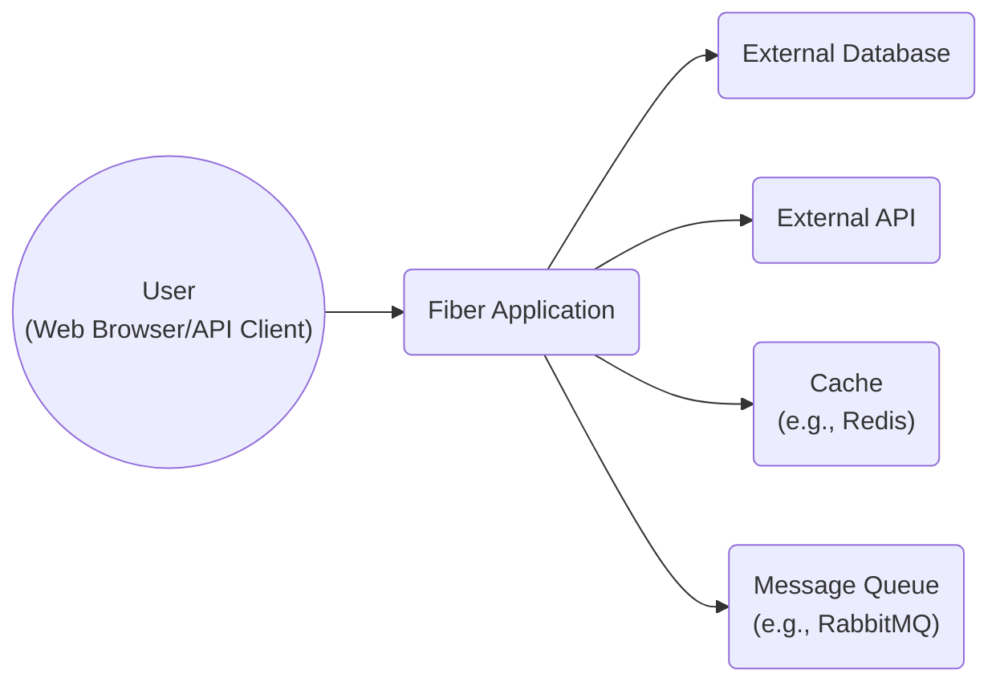
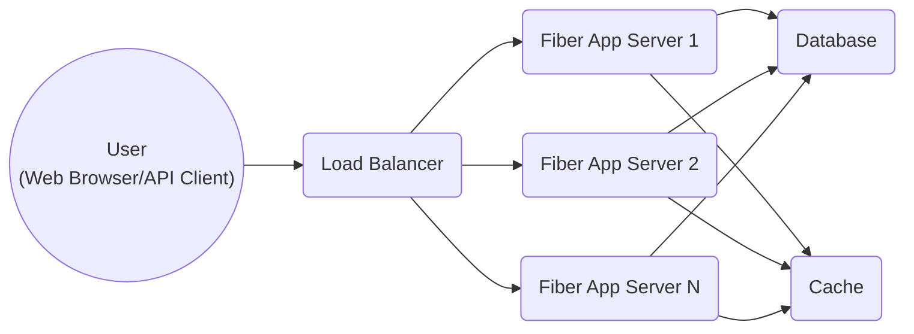
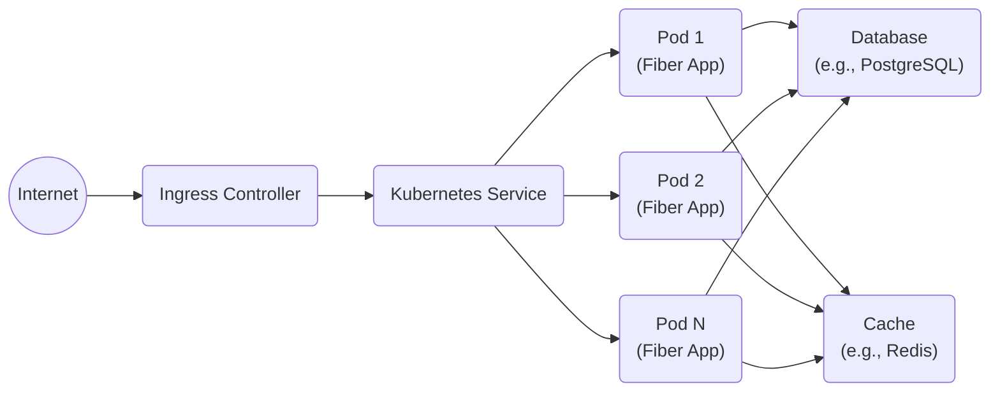
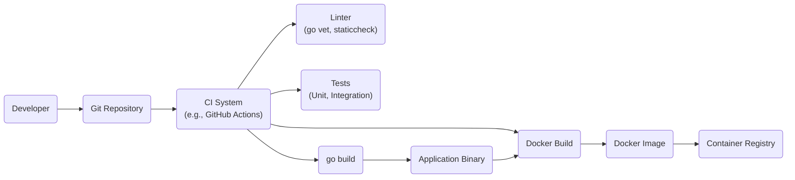

Okay, let's create a design document for the Fiber web framework, keeping in mind its use for threat modeling.

# BUSINESS POSTURE

Fiber is a web framework, and its primary business goal is to provide a fast, flexible, and easy-to-use platform for developers to build web applications and APIs.  The success of Fiber hinges on its adoption by the developer community, which in turn depends on its performance, ease of use, and perceived security.

Business Priorities:

*   Performance:  Fiber's core value proposition is speed and efficiency.  It must outperform or at least match competing frameworks.
*   Ease of Use:  A simple, intuitive API and clear documentation are crucial for attracting and retaining users.
*   Flexibility:  The framework should be adaptable to various use cases, from simple APIs to more complex web applications.
*   Community Growth:  A thriving community provides support, contributes to development, and promotes the framework.
*   Maintainability: The codebase should be maintainable and extensible to allow for future growth and feature additions.

Business Risks:

*   Competition:  The web framework landscape is crowded.  Fiber needs to differentiate itself and maintain a competitive edge.
*   Security Vulnerabilities:  Vulnerabilities in the framework could expose applications built with Fiber to attacks, damaging its reputation and adoption. This is the most important risk.
*   Lack of Adoption:  If developers don't find Fiber useful or easy to use, it won't gain traction.
*   Maintenance Burden:  If the codebase becomes too complex or difficult to maintain, development could stall.
*   Dependency Issues:  Vulnerabilities or breaking changes in Fiber's dependencies could impact the framework and applications built on it.

# SECURITY POSTURE

Fiber, being a web framework, acts as a foundational component for web applications. Therefore, its security posture is paramount. It needs to provide secure defaults and mechanisms for developers to build secure applications.

Existing Security Controls:

*   security control: Middleware Support: Fiber's middleware architecture allows developers to implement security controls like authentication, authorization, and input validation. (Described in Fiber documentation and examples).
*   security control: Context Handling: Fiber's `Ctx` object provides methods for securely handling requests and responses, including setting secure headers and managing cookies. (Described in Fiber documentation).
*   security control: Routing: Fiber's router allows for defining specific routes and associating them with handlers, enabling granular control over access. (Described in Fiber documentation).
*   security control: Community Scrutiny: Being open-source, Fiber benefits from community scrutiny, which can help identify and address security vulnerabilities. (Visible on GitHub).
*   security control: Dependency Management: Fiber uses Go modules, which helps manage dependencies and their security. (Visible in `go.mod` file).

Accepted Risks:

*   accepted risk: Developer Misuse: While Fiber provides security features, developers can still write insecure code using the framework. This is a common risk with any framework.
*   accepted risk: Zero-Day Vulnerabilities: Like any software, Fiber may contain undiscovered vulnerabilities.
*   accepted risk: Ecosystem security: Fiber ecosystem might contain security vulnerabilities.

Recommended Security Controls:

*   security control: Regular Security Audits: Conduct regular internal and external security audits of the Fiber codebase.
*   security control: Vulnerability Disclosure Program: Establish a clear process for reporting and addressing security vulnerabilities.
*   security control: Security-Focused Documentation: Provide comprehensive documentation and examples on how to use Fiber securely.
*   security control: Automated Security Testing: Integrate security testing tools (SAST, DAST, IAST) into the development pipeline.
*   security control: Dependency Scanning: Regularly scan dependencies for known vulnerabilities.
*   security control: Supply Chain Security: Implement measures to ensure the integrity of the Fiber supply chain.

Security Requirements:

*   Authentication: Fiber should provide or facilitate mechanisms for:
    *   Securely handling user credentials.
    *   Supporting various authentication methods (e.g., JWT, OAuth).
    *   Protecting against common authentication attacks (e.g., brute-force, credential stuffing).
*   Authorization: Fiber should provide or facilitate mechanisms for:
    *   Implementing role-based access control (RBAC) or other authorization models.
    *   Enforcing access control policies consistently.
    *   Protecting against unauthorized access to resources.
*   Input Validation: Fiber should provide or facilitate mechanisms for:
    *   Validating all user input against strict rules.
    *   Sanitizing input to prevent cross-site scripting (XSS) and other injection attacks.
    *   Handling different data types appropriately.
*   Cryptography: Fiber should provide or facilitate mechanisms for:
    *   Using strong cryptographic algorithms and protocols.
    *   Securely managing cryptographic keys.
    *   Protecting sensitive data in transit and at rest.
    *   Supporting HTTPS by default.

# DESIGN

## C4 CONTEXT

Element Descriptions:

*   Element:
    *   Name: User
    *   Type: Person
    *   Description: A user interacting with the Fiber application through a web browser or API client.
    *   Responsibilities: Initiates requests to the Fiber application.
    *   Security controls: Implements browser-based security controls (e.g., same-origin policy, cookie security).

*   Element:
    *   Name: Fiber Application
    *   Type: Software System
    *   Description: The web application built using the Fiber framework.
    *   Responsibilities: Handles incoming requests, processes data, interacts with external systems, and returns responses.
    *   Security controls: Implements application-level security controls (authentication, authorization, input validation, output encoding, error handling).

*   Element:
    *   Name: External Database
    *   Type: Software System
    *   Description: An external database system (e.g., PostgreSQL, MySQL, MongoDB).
    *   Responsibilities: Stores and retrieves data for the Fiber application.
    *   Security controls: Implements database-level security controls (access control, encryption, auditing).

*   Element:
    *   Name: External API
    *   Type: Software System
    *   Description: An external API that the Fiber application interacts with.
    *   Responsibilities: Provides specific services or data to the Fiber application.
    *   Security controls: Implements API-level security controls (authentication, authorization, rate limiting).

*   Element:
    *   Name: Cache
    *   Type: Software System
    *   Description: A caching system (e.g., Redis) used to improve performance.
    *   Responsibilities: Stores frequently accessed data for faster retrieval.
    *   Security controls: Implements cache-specific security controls (access control, data validation).

*   Element:
    *   Name: Message Queue
    *   Type: Software System
    *   Description: A message queue system (e.g., RabbitMQ) for asynchronous processing.
    *   Responsibilities: Handles asynchronous tasks and communication between different parts of the application.
    *   Security controls: Implements message queue-specific security controls (access control, message encryption).

## C4 CONTAINER

Element Descriptions:

*   Element:
    *   Name: User
    *   Type: Person
    *   Description: A user interacting with the Fiber application.
    *   Responsibilities: Initiates requests.
    *   Security controls: Browser-based security.

*   Element:
    *   Name: Load Balancer
    *   Type: Container (Software)
    *   Description: Distributes incoming traffic across multiple Fiber application servers.
    *   Responsibilities: Traffic distribution, health checks.
    *   Security controls: SSL termination, DDoS protection.

*   Element:
    *   Name: Fiber App Server (1, 2, N)
    *   Type: Container (Software)
    *   Description: An instance of the Fiber application running on a server.
    *   Responsibilities: Handles requests, processes data, interacts with other containers.
    *   Security controls: Application-level security (authentication, authorization, input validation).

*   Element:
    *   Name: Database
    *   Type: Container (Software)
    *   Description: The database system.
    *   Responsibilities: Data storage and retrieval.
    *   Security controls: Database-level security (access control, encryption).

*   Element:
    *   Name: Cache
    *   Type: Container (Software)
    *   Description: The caching system.
    *   Responsibilities: Caching data.
    *   Security controls: Cache-specific security.

## DEPLOYMENT

Possible Deployment Solutions:

1.  Bare Metal/Virtual Machines: Deploying Fiber applications directly onto physical or virtual servers.
2.  Containers (Docker): Packaging Fiber applications and their dependencies into containers.
3.  Container Orchestration (Kubernetes): Managing and scaling Fiber applications using Kubernetes.
4.  Serverless (AWS Lambda, Google Cloud Functions, Azure Functions): Deploying Fiber applications as serverless functions.
5.  Platform as a Service (PaaS) (Heroku, Google App Engine): Deploying Fiber applications on a managed platform.

Chosen Solution (for detailed description): Container Orchestration (Kubernetes)

Element Descriptions:

*   Element:
    *   Name: Internet
    *   Type: External
    *   Description: The public internet.
    *   Responsibilities: Source of incoming traffic.
    *   Security controls: Network firewalls, intrusion detection/prevention systems.

*   Element:
    *   Name: Ingress Controller
    *   Type: Node
    *   Description: Manages external access to the services in a Kubernetes cluster.
    *   Responsibilities: Routing traffic, SSL termination.
    *   Security controls: TLS encryption, access control rules.

*   Element:
    *   Name: Kubernetes Service
    *   Type: Node
    *   Description: An abstraction which defines a logical set of Pods and a policy by which to access them.
    *   Responsibilities: Load balancing across Pods.
    *   Security controls: Network policies.

*   Element:
    *   Name: Pod (1, 2, N)
    *   Type: Node
    *   Description: A Kubernetes Pod running a Fiber application container.
    *   Responsibilities: Running the application code.
    *   Security controls: Container security context, resource limits.

*   Element:
    *   Name: Database
    *   Type: Node
    *   Description: The database system (e.g., PostgreSQL). Could be a managed service or another Pod.
    *   Responsibilities: Data storage.
    *   Security controls: Database-level security, network policies.

*   Element:
    *   Name: Cache
    *   Type: Node
    *   Description: The caching system (e.g., Redis). Could be a managed service or another Pod.
    *   Responsibilities: Caching data.
    *   Security controls: Cache-specific security, network policies.

## BUILD

The build process for a Fiber application typically involves the following steps:

1.  Developer writes code and commits to a version control system (e.g., Git).
2.  A Continuous Integration (CI) system (e.g., GitHub Actions, Jenkins, GitLab CI) detects the changes.
3.  The CI system checks out the code.
4.  The CI system runs linters and static analysis tools (e.g., `go vet`, `staticcheck`).
5.  The CI system runs unit tests and integration tests.
6.  The CI system builds the application using `go build`.
7.  The CI system builds a Docker image containing the compiled application.
8.  The CI system pushes the Docker image to a container registry (e.g., Docker Hub, Google Container Registry).
9.  The CI system might trigger a deployment to a staging or production environment.

Security Controls in the Build Process:

*   security control: Code Review: All code changes should be reviewed by another developer before merging.
*   security control: Static Analysis: Use static analysis tools to identify potential security vulnerabilities in the code.
*   security control: Dependency Scanning: Scan dependencies for known vulnerabilities.
*   security control: Software Composition Analysis (SCA): Analyze the software supply chain for vulnerabilities and compliance issues.
*   security control: Container Scanning: Scan the Docker image for vulnerabilities before pushing it to the registry.
*   security control: Least Privilege: The CI system should have the minimum necessary permissions.
*   security control: Secret Management: Secrets (e.g., API keys, database credentials) should be securely managed and not hardcoded in the codebase or CI configuration.

# RISK ASSESSMENT

Critical Business Processes:

*   Serving web requests and API calls: The core function of any web application built with Fiber.
*   Data processing and storage: Handling user data, application data, and interactions with databases.
*   Integration with external services: Communicating with other APIs and services.

Data Sensitivity:

*   User Data: This could range from personally identifiable information (PII) like names, email addresses, and passwords to more sensitive data depending on the application's purpose.  Sensitivity: High to Critical.
*   Application Data: This includes any data specific to the application's functionality. Sensitivity: Varies depending on the application.
*   Session Data:  Data related to user sessions, including authentication tokens. Sensitivity: High.
*   Configuration Data:  Information about the application's configuration, including database connection strings and API keys. Sensitivity: High.

# QUESTIONS & ASSUMPTIONS

Questions:

*   What specific types of applications are most commonly built with Fiber? (This helps prioritize security controls for common use cases.)
*   What is the current level of security expertise within the Fiber development team?
*   What is the budget for security-related activities (e.g., audits, tooling)?
*   Are there any specific compliance requirements (e.g., GDPR, HIPAA) that need to be considered?
*   What level of logging and monitoring is currently in place for Fiber applications?
*   What is the process for handling security incidents?

Assumptions:

*   BUSINESS POSTURE: Fiber aims to be a general-purpose web framework, suitable for a wide range of applications.
*   BUSINESS POSTURE: The Fiber community is active and engaged in security discussions.
*   SECURITY POSTURE: Developers using Fiber have a basic understanding of web security principles.
*   SECURITY POSTURE: The Fiber core team is responsive to security reports.
*   DESIGN: Most Fiber applications will interact with a database.
*   DESIGN: Many Fiber applications will be deployed using containers.
*   DESIGN: The build process will involve a CI system.
*   DESIGN: Go modules are used for dependency management.