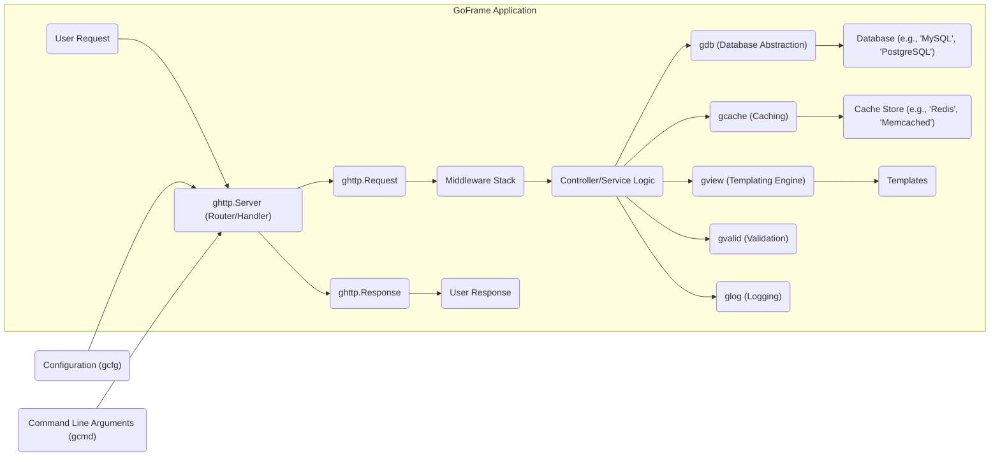

# Project Design Document: GoFrame Framework

**1. Introduction**

This document provides a detailed architectural overview of the GoFrame (gf) framework, a modular, powerful, and easy-to-use application development framework for Go. This document serves as a foundation for subsequent threat modeling activities, outlining the key components, data flows, and interactions within the framework.

**2. Goals**

*   Provide a comprehensive architectural description of the GoFrame framework.
*   Identify key components and their functionalities, including their primary responsibilities and dependencies.
*   Illustrate the typical data flow within a GoFrame application, highlighting key decision points and transformations.
*   Highlight potential areas of security concern for future threat modeling, categorized by relevant architectural aspects.

**3. Non-Goals**

*   Provide an exhaustive code-level analysis of the entire framework's implementation details.
*   Detail every single feature or module within GoFrame, focusing on core architectural components.
*   Offer specific security recommendations or mitigation strategies; this will be the dedicated focus of the subsequent threat modeling exercise.
*   Describe the internal implementation details of every function or method within the components.

**4. High-Level Architecture**

**5. Component Breakdown**

This section details the major components of the GoFrame framework and their functionalities, interactions, and data handling.

*   **gcmd (Command Line Interface):**
    *   Purpose: Handles command-line argument parsing and execution of application commands.
    *   Functionality: Parses command-line flags, defines and executes application commands, provides help messages, and manages command registration.
    *   Key Interactions: Interacts with the application's `main` entry point to process commands, and potentially with `gcfg` for command-specific configurations.
    *   Data Handled: Command-line arguments, command names, help text, and potentially configuration values.
    *   Technologies Used: Go standard library (`flag`, `os`).

*   **gcfg (Configuration Management):**
    *   Purpose: Provides a unified way to manage application configurations from various sources.
    *   Functionality: Loads configuration from files (e.g., YAML, JSON, TOML), environment variables, and command-line flags. Supports hot reloading of configuration changes and provides a hierarchical configuration structure.
    *   Key Interactions: Used by almost all other components to retrieve configuration settings. It interacts with the file system, environment variables, and `gcmd`.
    *   Data Handled: Configuration data in various formats (strings, numbers, booleans, arrays, maps).
    *   Technologies Used: Go standard library (`os`, `io/ioutil`), and potentially external libraries for specific file formats (e.g., `yaml.v3`).

*   **glog (Logging):**
    *   Purpose: Provides a flexible and configurable logging mechanism for recording application events.
    *   Functionality: Supports different log levels (Debug, Info, Warning, Error, Critical), output targets (console, file, network), and customizable formatting options. It also supports context-aware logging.
    *   Key Interactions: Used by various components to record events, errors, and debugging information. It interacts with the file system for file logging and potentially network services for remote logging.
    *   Data Handled: Log messages, timestamps, log levels, source file and line information, and contextual data.
    *   Technologies Used: Go standard library (`fmt`, `os`), and potentially external libraries for advanced logging features.

*   **gdebug (Debugging):**
    *   Purpose: Offers debugging utilities and helper functions to aid in development and troubleshooting.
    *   Functionality: Provides functions for printing debug information, stack traces, and error details. It might include features for enabling/disabling debug output based on configuration.
    *   Key Interactions: Primarily used by developers during development. It might interact with `glog` to output debug information.
    *   Data Handled: Debug messages, error details, stack traces, and potentially configuration settings for debug levels.
    *   Technologies Used: Go standard library (`runtime/debug`, `fmt`).

*   **gerror (Error Handling):**
    *   Purpose: Provides a standardized way to handle and manage errors within the application, offering more context than standard Go errors.
    *   Functionality: Defines error types, allows wrapping errors with context (e.g., file name, function name), and provides error reporting utilities. It facilitates structured error handling.
    *   Key Interactions: Used throughout the framework to handle and propagate errors between components. It might interact with `glog` for error logging.
    *   Data Handled: Error messages, error codes, contextual information (file, line, function).
    *   Technologies Used: Go standard library (`errors`).

*   **gutil (Utility Functions):**
    *   Purpose: Contains a collection of general-purpose utility functions that are commonly used across the framework.
    *   Functionality: Provides helper functions for string manipulation, data conversion, time operations, array/slice manipulation, and more.
    *   Key Interactions: Used by various components for common tasks, reducing code duplication.
    *   Data Handled: Various data types processed by utility functions (strings, numbers, slices, etc.).
    *   Technologies Used: Go standard library and potentially small, focused external libraries.

*   **gconv (Type Conversion):**
    *   Purpose: Provides functions for converting data between different Go types in a safe and convenient manner.
    *   Functionality: Offers robust type conversion between various Go data types (string to int, int to string, etc.), handling potential errors gracefully.
    *   Key Interactions: Used by various components when data type conversion is needed, especially when dealing with external data sources or user input.
    *   Data Handled: Data in various formats being converted.
    *   Technologies Used: Go standard library.

*   **gstr (String Manipulation):**
    *   Purpose: Offers a rich set of functions for manipulating strings beyond the capabilities of the standard library.
    *   Functionality: Provides functions for searching, replacing, formatting, encoding/decoding, and other string operations.
    *   Key Interactions: Used by components that need to process or manipulate string data, such as the HTTP server and templating engine.
    *   Data Handled: String data.
    *   Technologies Used: Go standard library and potentially optimized external libraries for specific string operations.

*   **gtime (Time Management):**
    *   Purpose: Provides enhanced time and date manipulation functionalities, offering more features than the standard `time` package.
    *   Functionality: Offers functions for parsing, formatting, calculating with dates and times, and handling time zones.
    *   Key Interactions: Used by components that need to work with time-related data, such as logging, scheduling, and caching.
    *   Data Handled: Date and time information.
    *   Technologies Used: Go standard library (`time`).

*   **gjson (JSON Handling):**
    *   Purpose: Provides efficient and convenient JSON encoding and decoding, with features for easy data access.
    *   Functionality: Offers functions for marshaling and unmarshaling JSON data, as well as accessing JSON values using path-like syntax.
    *   Key Interactions: Used for handling JSON data in API requests and responses, configuration files, and data serialization.
    *   Data Handled: JSON data (strings, numbers, booleans, arrays, objects).
    *   Technologies Used: Potentially external JSON parsing libraries for performance or extended features.

*   **gmlock (Mutex Lock):**
    *   Purpose: Provides mutex locking mechanisms for controlling concurrent access to shared resources, ensuring thread safety.
    *   Functionality: Implements mutex locks (both standard and RWMutex) to protect critical sections of code from race conditions in concurrent environments.
    *   Key Interactions: Used by components that manage shared state or resources accessed by multiple goroutines.
    *   Data Handled: Data protected by the mutex lock.
    *   Technologies Used: Go standard library (`sync`).

*   **gfsnotify (File System Notification):**
    *   Purpose: Provides file system event monitoring capabilities, allowing applications to react to changes in the file system.
    *   Functionality: Allows applications to receive notifications when files or directories are created, modified, or deleted. Often used for features like configuration hot reloading.
    *   Key Interactions: Used by components that need to monitor file system changes, such as `gcfg` for configuration reloading.
    *   Data Handled: File system event information (file paths, event types).
    *   Technologies Used: Potentially external libraries for cross-platform file system notifications.

*   **ghttp (HTTP Server):**
    *   Purpose: Provides a robust and feature-rich HTTP server implementation for building web applications and APIs.
    *   Functionality: Handles incoming HTTP requests, routing requests to appropriate handlers, executing middleware, managing sessions, handling file uploads and downloads, supporting WebSockets, and generating HTTP responses.
    *   Key Interactions: The central component for handling web requests. Interacts with `gcfg` for configuration, `glog` for logging, `gview` for rendering templates, `gvalid` for input validation, `gdb` for database access, and `gcache` for caching.
    *   Data Handled: HTTP requests and responses (headers, body, cookies, session data, uploaded files).
    *   Technologies Used: Go standard library (`net/http`), and potentially external libraries for specific HTTP features.

*   **gdb (Database Abstraction Layer):**
    *   Purpose: Provides a unified and database-agnostic interface for interacting with various relational databases.
    *   Functionality: Supports multiple database types (e.g., MySQL, PostgreSQL, SQLite), provides features like connection pooling, query building (including a fluent API), data mapping (ORM-like features), and transaction management.
    *   Key Interactions: Used by application logic to perform database operations. It interacts with database drivers and potentially `gcache` for caching query results.
    *   Data Handled: Database connection details, SQL queries, data retrieved from and written to the database.
    *   Technologies Used: Go standard library (`database/sql`) and specific database drivers (e.g., `github.com/go-sql-driver/mysql`).

*   **gcache (Caching):**
    *   Purpose: Provides a flexible caching mechanism for improving application performance by storing frequently accessed data in memory or external stores.
    *   Functionality: Supports in-memory caching and integration with external cache stores like Redis and Memcached. Offers features like setting and retrieving cached data, expiration policies, and cache invalidation.
    *   Key Interactions: Used by application logic to store and retrieve cached data. It interacts with external cache stores via their respective client libraries.
    *   Data Handled: Cached data, cache keys, expiration times.
    *   Technologies Used: Potentially external libraries for interacting with specific cache stores (e.g., `github.com/go-redis/redis/v8`).

*   **gview (Templating Engine):**
    *   Purpose: Provides a template engine for generating dynamic HTML content by embedding data into template files.
    *   Functionality: Supports template parsing, data binding, template inheritance, custom template functions, and various template syntaxes.
    *   Key Interactions: Used by the `ghttp.Server` to render responses. It interacts with the file system to load template files.
    *   Data Handled: Template files, data passed to templates for rendering.
    *   Technologies Used: Potentially external template engines.

*   **gvalid (Data Validation):**
    *   Purpose: Provides a declarative and convenient way to validate input data, ensuring data integrity and security.
    *   Functionality: Allows defining validation rules for request parameters, form data, and other input using tags or a fluent API. Supports built-in validation rules and custom validation logic.
    *   Key Interactions: Typically used within `ghttp` request handlers to validate incoming data before processing.
    *   Data Handled: Input data being validated, validation rules, error messages.
    *   Technologies Used: Potentially external validation libraries.

*   **gproc (Process Management):**
    *   Purpose: Provides utilities for managing the application's process, including graceful shutdown and signal handling.
    *   Functionality: Allows handling signals (e.g., SIGINT, SIGTERM) for graceful shutdown, managing child processes, and obtaining process information.
    *   Key Interactions: Interacts with the operating system's process management features.
    *   Data Handled: Process IDs, signal information.
    *   Technologies Used: Go standard library (`os`, `os/signal`).

*   **gtask (Task Management):**
    *   Purpose: Provides a mechanism for scheduling and executing asynchronous tasks, often used for background processing.
    *   Functionality: Allows defining and running tasks periodically or at specific times using various scheduling mechanisms (e.g., cron-like syntax).
    *   Key Interactions: Executes tasks in the background, potentially interacting with other components to perform specific actions.
    *   Data Handled: Task definitions, execution schedules, task results.
    *   Technologies Used: Potentially external scheduling libraries.

*   **gqueue (Queue Management):**
    *   Purpose: Provides queue data structures for asynchronous processing and decoupling components.
    *   Functionality: Supports various queue implementations (e.g., FIFO, LIFO, priority queues), allowing for asynchronous message passing and task processing.
    *   Key Interactions: Used for decoupling components and handling tasks asynchronously. Producers enqueue items, and consumers dequeue and process them.
    *   Data Handled: Data enqueued and dequeued.
    *   Technologies Used: Potentially external queue libraries (e.g., for distributed queues).

*   **gfile (File System Operations):**
    *   Purpose: Provides a set of utility functions for interacting with the file system, simplifying common file operations.
    *   Functionality: Offers functions for reading, writing, creating, deleting, and manipulating files and directories, including path manipulation and file information retrieval.
    *   Key Interactions: Used by various components for file-related operations, such as `gcfg` for loading configuration files, `glog` for writing log files, and `ghttp` for serving static files.
    *   Data Handled: File paths, file content, file metadata.
    *   Technologies Used: Go standard library (`os`, `io/ioutil`, `path/filepath`).

*   **genv (Environment Variables):**
    *   Purpose: Provides a convenient way to access and manage environment variables.
    *   Functionality: Allows retrieving and setting environment variables, providing a way to configure applications based on their deployment environment.
    *   Key Interactions: Used for accessing environment-specific configurations, often in conjunction with `gcfg`.
    *   Data Handled: Environment variable names and values.
    *   Technologies Used: Go standard library (`os`).

**6. Data Flow (Typical HTTP Request)**

```mermaid
graph LR
    A("User") --> B("ghttp.Server (Listener)")
    B --> C("ghttp.Request (Parsing)")
    C --> D("ghttp.Router (Route Matching)")
    D --> E("Middleware 1")
    E --> F("Middleware 2")
    F --> G("Controller Handler")
    subgraph "Controller Handler Logic"
        direction LR
        G --> H("gvalid (Validation)")
        H -- "Validation Success" --> I("gdb (Database Interaction)")
        H -- "Validation Failure" --> J("ghttp.Response (Error)")
        I --> K("gcache (Cache Retrieval)")
        K -- "Cache Hit" --> L("ghttp.Response (Cached Data)")
        K -- "Cache Miss" --> M("Business Logic")
        M --> N("gdb (Database Interaction)")
        N --> O("gcache (Cache Update)")
        O --> P("gview (Template Rendering)")
        P --> Q("ghttp.Response (HTML)")
    end
    G --> Q
    J --> R("ghttp.Response (Sending)")
    Q --> R
    R --> S("User")
```

**7. Security Considerations (Preliminary)**

This section outlines potential areas of security concern, categorized by the relevant architectural components, that will be further explored during the threat modeling process.

*   **ghttp (HTTP Server):**
    *   **Input Validation Vulnerabilities:** Lack of proper validation of request parameters, headers, and body can lead to XSS, SQL Injection (if data is used in database queries), command injection, and other vulnerabilities.
    *   **Authentication and Authorization Flaws:** Weak or missing authentication mechanisms, insecure session management, and improper authorization checks can allow unauthorized access to resources.
    *   **Cross-Site Request Forgery (CSRF):** Absence of CSRF protection mechanisms can allow attackers to perform actions on behalf of authenticated users.
    *   **HTTP Header Injection:** Improper handling of HTTP headers can lead to security vulnerabilities.
    *   **Denial of Service (DoS):** Vulnerabilities that can be exploited to overwhelm the server with requests.
    *   **File Upload Vulnerabilities:** Insecure handling of file uploads can lead to arbitrary file upload and potential code execution.

*   **gdb (Database Abstraction Layer):**
    *   **SQL Injection:** Improperly sanitized user inputs used in database queries can lead to SQL Injection attacks.
    *   **Exposure of Sensitive Data:** Inadequate protection of database credentials and connection strings.
    *   **Insufficient Access Controls:** Lack of proper database user permissions can lead to unauthorized data access or modification.

*   **gcache (Caching):**
    *   **Cache Poisoning:** Attackers might be able to inject malicious data into the cache, which is then served to users.
    *   **Cache Side-Channel Attacks:** Information leakage through timing differences in cache access.
    *   **Exposure of Sensitive Data:** Caching sensitive information without proper encryption or access controls.

*   **gcfg (Configuration Management):**
    *   **Exposure of Sensitive Configuration Data:** Storing sensitive information (e.g., database credentials, API keys) in plain text configuration files.
    *   **Configuration Injection:** Attackers might be able to manipulate configuration values to compromise the application.

*   **glog (Logging):**
    *   **Information Disclosure:** Logging sensitive information that could be exploited by attackers.
    *   **Log Injection:** Attackers might be able to inject malicious log entries.
    *   **Lack of Log Integrity:** Logs might be tampered with, hindering forensic analysis.

*   **gvalid (Data Validation):**
    *   **Insufficient Validation:** Not validating all user inputs or using weak validation rules can leave the application vulnerable to attacks.
    *   **Bypassable Validation:** Validation logic that can be easily bypassed by attackers.

*   **gview (Templating Engine):**
    *   **Server-Side Template Injection (SSTI):** Improperly sanitized data embedded in templates can lead to code execution on the server.
    *   **Cross-Site Scripting (XSS):** If user-provided data is not properly escaped before being rendered in templates.

*   **General Considerations:**
    *   **Dependency Vulnerabilities:** Vulnerabilities in third-party libraries used by GoFrame.
    *   **Insecure Defaults:** Default configurations that are not secure.
    *   **Error Handling and Information Disclosure:** Revealing sensitive information in error messages.

**8. Deployment Considerations**

GoFrame applications are typically deployed as standalone, compiled Go binaries. Deployment considerations that can impact security include:

*   **Operating System Security:** The security hardening and patching status of the underlying operating system.
*   **Network Security:** Firewall configurations, network segmentation, and intrusion detection/prevention systems.
*   **Reverse Proxies:** Security configurations of reverse proxies (e.g., Nginx, Apache) used in front of the GoFrame application, including SSL/TLS termination and header manipulation.
*   **Containerization (e.g., Docker):** Security of container images, container runtime environment, and orchestration platforms (e.g., Kubernetes).
*   **Cloud Environment Security:** Security configurations and services provided by cloud providers (e.g., AWS, Azure, GCP), such as IAM roles, security groups, and network policies.
*   **Secrets Management:** Secure storage and retrieval of sensitive credentials used by the application.

**9. Future Considerations**

Potential future developments in GoFrame that might impact the architecture and security include:

*   **Addition of New Modules and Features:** New components could introduce new attack surfaces and require new security considerations.
*   **Updates to Existing Components:** Changes to existing components might introduce new vulnerabilities or require adjustments to security best practices.
*   **Adoption of New Technologies:** Integrating with new technologies or protocols could bring new security challenges.
*   **Changes in Underlying Dependencies:** Updates to Go or third-party libraries could have security implications.

This improved document provides a more detailed and structured architectural overview of the GoFrame framework, specifically tailored for threat modeling. The enhanced component descriptions and categorized security considerations will facilitate a more comprehensive and effective threat analysis.