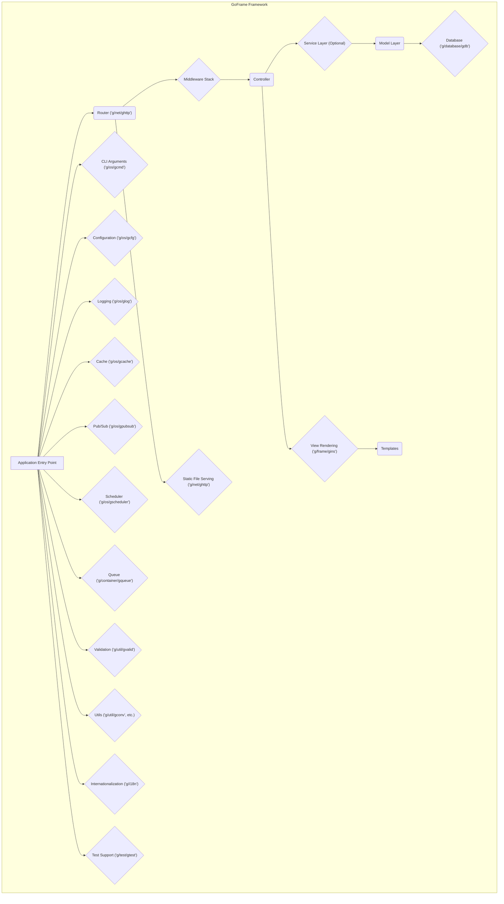
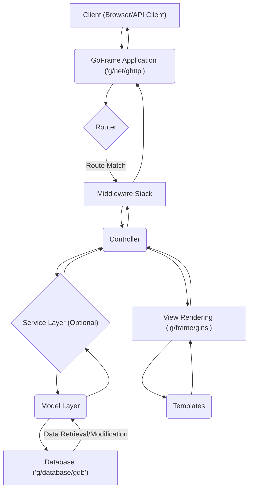

# Project Design Document: GoFrame Framework

**Version:** 1.1
**Date:** October 26, 2023
**Prepared By:** [Your Name/Team Name]

## 1. Introduction

This document provides an enhanced design overview of the GoFrame (gf) framework, a comprehensive, loosely coupled, and extendable Go application development framework. This detailed design serves as a foundational resource for subsequent threat modeling activities. It elaborates on the key architectural components, data flows, and interactions within the framework, providing a more in-depth understanding of its structure and functionality.

## 2. Goals and Objectives

The primary goals of the GoFrame framework are to:

* Provide a robust and efficient foundation for building diverse application types, including web applications, command-line interfaces (CLIs), and more.
* Offer a rich and integrated set of built-in features and components, significantly reducing boilerplate code and development time.
* Promote and enforce best practices in software development through its well-defined structure, clear API design, and comprehensive documentation.
* Ensure high performance and scalability to handle demanding workloads and growing application needs.
* Maintain a clean, intuitive, and easy-to-use API, fostering developer productivity and reducing the learning curve.

## 3. Scope

This design document focuses on the core architectural components and fundamental functionalities of the GoFrame framework itself. It provides a detailed exploration of:

* The fundamental structure and organizational principles of the framework, highlighting its modular design.
* Key modules and their specific responsibilities within the framework's ecosystem.
* The detailed lifecycle of a typical HTTP request within a GoFrame web application, outlining the sequence of operations.
* Mechanisms for data handling, including data validation, transformation, and persistence strategies.
* Comprehensive configuration management capabilities and how they are integrated throughout the framework.
* Robust logging and error handling mechanisms, including different logging levels and output destinations.
* Inter-process communication (IPC) capabilities offered by the framework for building distributed applications.
* Core utilities and a wide array of helper functions that simplify common development tasks.

This document explicitly excludes the specifics of individual applications built using GoFrame and does not delve into the intricate implementation details of every single function or method within the framework.

## 4. High-Level Architecture

The GoFrame framework is built upon a modular and layered architecture, emphasizing loose coupling between components and high cohesion within each module. This design promotes maintainability, testability, and extensibility.

**Detailed Explanation of Components:**

* **Application Entry Point:** The initial execution point of a GoFrame application, typically the `main.go` file containing the `main` function.
* **Router ('g/net/ghttp'):**  A crucial component responsible for inspecting incoming HTTP requests and mapping them to the appropriate handlers (Controllers) based on predefined routing rules. It manages the application's URL structure.
* **Middleware Stack:** An ordered chain of handler functions that intercept and process HTTP requests as they enter and exit the application's core logic. Middleware components perform tasks like authentication, authorization, logging, request modification, and error handling.
* **Controller:**  The component that encapsulates the specific business logic associated with a particular route or set of related routes. It receives input from the request, interacts with services or models to perform actions, and prepares the response to be sent back to the client.
* **Service Layer (Optional):** An intermediary layer positioned between Controllers and Models. It's often used to encapsulate complex business logic, orchestrate interactions between multiple models, and promote code reusability.
* **Model Layer:** Represents the data structures of the application and provides an abstraction layer for interacting with data sources. Models typically encapsulate data validation rules and data access logic.
* **Database ('g/database/gdb'):** A powerful database abstraction layer that provides a consistent API for interacting with various relational and NoSQL database systems (e.g., MySQL, PostgreSQL, SQLite, Redis, MongoDB). It handles connection management, query building, and data marshaling.
* **View Rendering ('g/frame/gins'):**  Responsible for rendering dynamic web pages by combining data with predefined templates. It supports various template engines, allowing developers to separate presentation logic from application logic.
* **Templates:** Files containing the structure and presentation logic for web pages. These files often use a templating language to embed dynamic content.
* **Static File Serving ('g/net/ghttp'):**  A built-in mechanism for efficiently serving static assets such as CSS files, JavaScript files, images, and other media directly to clients.
* **CLI Arguments ('g/os/gcmd'):**  Provides functionality for parsing command-line arguments passed to CLI applications, making it easy to create interactive command-line tools.
* **Configuration ('g/os/gcfg'):**  A comprehensive configuration management system that allows loading application settings from various sources, including configuration files (e.g., YAML, JSON, TOML), environment variables, and command-line flags. It supports features like hot reloading of configuration changes.
* **Logging ('g/os/glog'):**  A flexible and configurable logging facility for recording application events, errors, and debugging information. It supports different log levels (e.g., debug, info, warning, error, critical) and various output destinations (e.g., console, files, remote services).
* **Cache ('g/os/gcache'):**  Offers in-memory and potentially distributed caching mechanisms to improve application performance by storing frequently accessed data. It supports various cache eviction policies and expiration strategies.
* **Pub/Sub ('g/os/gpubsub'):**  Implements a publish/subscribe messaging pattern, enabling asynchronous communication between different parts of an application or between different applications.
* **Scheduler ('g/os/gscheduler'):**  Allows scheduling tasks to be executed at specific times or intervals, useful for background processing, cron-like jobs, and other time-based operations.
* **Queue ('g/container/gqueue'):** Provides various queue data structures (e.g., FIFO, LIFO) for managing tasks or messages to be processed asynchronously.
* **Validation ('g/util/gvalid'):**  A powerful data validation component that allows defining validation rules for input data, ensuring data integrity and preventing invalid data from entering the system.
* **Utils ('g/util/gconv', etc.):**  A rich collection of utility functions for performing common tasks such as data type conversion, string manipulation, time operations, and more.
* **Internationalization ('g/i18n'):**  Provides features for supporting multiple languages and regional variations in applications, including translation and localization.
* **Test Support ('g/test/gtest'):**  Offers utilities and assertions to facilitate writing unit tests and integration tests for GoFrame applications.

## 5. Key Components and Their Interactions

This section provides a more detailed look at the responsibilities and interactions of some of the core modules within the GoFrame framework:

* **'g/net/ghttp' (HTTP Server):**
    * **Responsibilities:**
        * Listens for and accepts incoming HTTP requests on configured network interfaces and ports.
        * Parses HTTP requests, extracting headers, parameters, and body content.
        * Routes incoming requests to the appropriate handler functions based on the defined routing rules.
        * Manages the execution of the middleware stack, allowing for request pre-processing and post-processing.
        * Handles the construction and sending of HTTP responses back to the client.
        * Provides built-in functionalities for managing sessions, handling cookies, processing file uploads, and implementing WebSocket connections.
    * **Interactions:**
        * Receives HTTP requests from clients (browsers, API consumers, etc.).
        * Delegates request handling to registered Controllers.
        * Interacts with the Middleware stack for request interception and processing.
        * Utilizes the View Rendering engine to generate dynamic HTML responses.
        * Serves static files directly to clients.

* **'g/database/gdb' (Database Abstraction Layer):**
    * **Responsibilities:**
        * Provides a unified and consistent API for interacting with various database systems, abstracting away database-specific details.
        * Manages database connection pooling and connection lifecycle.
        * Offers methods for executing raw SQL queries and building queries programmatically.
        * Supports database transactions with ACID properties (Atomicity, Consistency, Isolation, Durability).
        * Provides features for Object-Relational Mapping (ORM), allowing developers to interact with databases using Go structs.
        * Supports database schema management and migrations.
    * **Interactions:**
        * Primarily used by the Model Layer to perform data access operations on the underlying database.
        * Retrieves database connection configuration details from the Configuration module ('g/os/gcfg').

* **'g/os/gcfg' (Configuration Management):**
    * **Responsibilities:**
        * Loads configuration data from multiple sources, including configuration files (YAML, JSON, TOML, INI), environment variables, and command-line arguments.
        * Provides a centralized API for accessing configuration values using a hierarchical structure.
        * Supports type conversion for configuration values.
        * Allows for hot reloading of configuration changes without restarting the application.
        * Supports default configuration values and overrides.
    * **Interactions:**
        * Used by almost every component within the GoFrame framework to retrieve its configuration settings (e.g., database connection strings, server ports, logging levels, cache settings).

* **'g/os/glog' (Logging):**
    * **Responsibilities:**
        * Provides a flexible and extensible logging mechanism for recording application events and errors.
        * Supports different logging levels (DEBUG, INFO, WARNING, ERROR, CRITICAL) to categorize log messages.
        * Allows configuring multiple log targets or appenders (e.g., console, files, network sockets).
        * Supports customizable log formats, including timestamps, log levels, and source file information.
        * Provides features for asynchronous logging to improve performance.
    * **Interactions:**
        * Used by various components throughout the framework to record informational messages, warnings, errors, and debugging information.

## 6. Data Flow (Web Request)

The following diagram illustrates the typical data flow for processing a web request within a GoFrame application:

**Detailed Description of the Flow:**

1. **Client Request:** A client (e.g., a web browser or an API client) initiates an HTTP request to the GoFrame application.
2. **HTTP Server Reception:** The `'g/net/ghttp'` module, acting as the HTTP server, receives the incoming request.
3. **Routing:** The Router component analyzes the request's URL and matches it against the defined routing rules to determine the appropriate handler.
4. **Middleware Execution:** If a matching route is found, the request is passed through the configured Middleware Stack. Each middleware in the stack has the opportunity to process the request, perform actions like authentication or logging, and potentially modify the request or response.
5. **Controller Invocation:** The Router dispatches the request to the designated Controller function responsible for handling the specific route.
6. **Service Layer Interaction (Optional):** The Controller may interact with the Service Layer to delegate business logic execution and orchestrate interactions between different data models.
7. **Model Layer Interaction:** The Service Layer (or the Controller directly) interacts with the Model Layer to access or manipulate data. Models encapsulate data access logic and validation rules.
8. **Database Interaction:** The Model Layer utilizes the `'g/database/gdb'` module to communicate with the underlying database system, performing data retrieval or modification operations.
9. **Database Response:** The database returns the requested data or the result of the modification operation to the Model Layer.
10. **Data Processing:** The Model Layer processes the data received from the database and returns it to the Service Layer (if present).
11. **Controller Response Preparation:** The Service Layer (or the Model Layer directly) returns the processed data to the Controller. The Controller then prepares the response data to be sent back to the client.
12. **View Rendering (Optional):** For web requests that require dynamic HTML content, the Controller may utilize the `'g/frame/gins'` module for View Rendering.
13. **Template Processing:** The View Rendering engine combines the response data with the specified Templates to generate the final HTML output.
14. **Response Transmission:** The Controller sends the generated response (which could be HTML, JSON, XML, or other formats) back through the Middleware Stack.
15. **HTTP Server Response:** The `'g/net/ghttp'` module sends the HTTP response back to the client.
16. **Client Receives Response:** The client receives the response from the GoFrame application.

## 7. Security Considerations (Detailed)

This section expands on the security considerations within the GoFrame framework, providing more specific examples:

* **Input Validation and Sanitization:**
    * GoFrame provides the `'g/util/gvalid'` module for defining and enforcing validation rules on user inputs, preventing common injection attacks like SQL injection and Cross-Site Scripting (XSS).
    * Developers can define rules for data types, formats, ranges, and required fields.
    * Sanitization functions can be used to clean user inputs by removing potentially harmful characters or formatting.
* **Authentication and Authorization:**
    * Middleware can be implemented to handle authentication (verifying user identity) and authorization (granting access to resources based on identity).
    * GoFrame doesn't enforce a specific authentication mechanism, allowing developers to integrate various methods like JWT, OAuth 2.0, or session-based authentication.
    * Role-Based Access Control (RBAC) can be implemented using middleware to control access based on user roles and permissions.
* **Session Management:**
    * The `'g/net/ghttp'` module provides built-in session management capabilities, including storing session data in memory, files, or external stores like Redis.
    * Secure session identifiers are generated to prevent session hijacking.
    * Options for setting session expiration times and secure flags on session cookies are available.
* **Cross-Site Scripting (XSS) Prevention:**
    * When rendering dynamic content, GoFrame encourages the use of template engines that automatically escape output data to prevent XSS vulnerabilities.
    * Developers should be mindful of where user-provided data is displayed and ensure proper encoding is applied.
* **Cross-Site Request Forgery (CSRF) Protection:**
    * Middleware can be implemented to generate and validate CSRF tokens, protecting against unauthorized requests originating from malicious websites.
    * GoFrame provides utilities for generating and embedding CSRF tokens in forms.
* **SQL Injection Prevention:**
    * The `'g/database/gdb'` module encourages the use of parameterized queries or ORM features, which prevent SQL injection vulnerabilities by treating user inputs as data rather than executable code.
    * Avoid constructing SQL queries by directly concatenating user-provided strings.
* **Data Encryption:**
    * GoFrame itself doesn't provide built-in encryption mechanisms for data at rest. Developers should utilize appropriate libraries and techniques for encrypting sensitive data stored in databases or files.
    * For data in transit, ensure HTTPS is enabled to encrypt communication between clients and the server using TLS/SSL.
* **Error Handling and Logging:**
    * Proper error handling prevents leaking sensitive information to users.
    * The `'g/os/glog'` module should be configured to log errors and exceptions securely, potentially to separate log files with restricted access.
    * Avoid displaying detailed error messages to end-users in production environments.
* **Dependency Management:**
    * Regularly update GoFrame and its dependencies to patch known security vulnerabilities.
    * Use tools like `go mod` to manage dependencies and track updates.
* **Rate Limiting and Throttling:**
    * Middleware can be implemented to limit the number of requests from a specific IP address or user within a given timeframe, mitigating denial-of-service (DoS) attacks and brute-force attempts.

## 8. Deployment Considerations

GoFrame applications offer flexible deployment options:

* **Standalone Executables:** Go applications can be compiled into platform-specific, self-contained executables, simplifying deployment as they include all necessary dependencies. This allows for easy deployment to various operating systems without requiring external runtimes.
* **Containerization (Docker):**  Packaging GoFrame applications within Docker containers provides a consistent and isolated environment, ensuring that the application runs reliably across different infrastructure. Docker simplifies deployment, scaling, and management.
* **Cloud Platforms (AWS, Google Cloud, Azure):** GoFrame applications can be readily deployed on major cloud platforms using services like AWS Elastic Beanstalk, Google App Engine, or Azure App Service. These platforms offer scalability, reliability, and managed infrastructure.
* **Serverless Functions (AWS Lambda, Google Cloud Functions):** While GoFrame is a full-fledged framework, specific functionalities or APIs built with it can potentially be deployed as serverless functions for event-driven architectures.
* **Reverse Proxies (Nginx, Apache):**  Deploying GoFrame applications behind reverse proxies like Nginx or Apache enhances security by providing features like SSL termination, load balancing, and request filtering. Reverse proxies can also improve performance by caching static content.
* **Systemd or Initd Services:** On Linux systems, GoFrame applications can be managed as systemd or initd services, allowing for automatic startup, shutdown, and monitoring.

## 9. External Dependencies

While GoFrame aims to be comprehensive, it relies on some external Go packages. Understanding these dependencies is crucial for threat modeling:

* **Database Drivers:** The `'g/database/gdb'` module utilizes specific database drivers (e.g., `github.com/go-sql-driver/mysql` for MySQL) which are external dependencies. Vulnerabilities in these drivers could impact GoFrame applications.
* **Template Engines:** If using template engines other than the built-in one, those template engine libraries are external dependencies.
* **Third-Party Middleware:** Any custom or third-party middleware used in the application introduces external dependencies.
* **Caching Libraries (if not using built-in):** If integrating with external caching systems, those client libraries are external dependencies.

A thorough threat model should analyze the potential vulnerabilities introduced by these external dependencies.

## 10. Future Considerations

* Deeper analysis of individual sub-modules within GoFrame to understand their specific functionalities and potential security implications in greater detail.
* A comprehensive examination of the built-in security features provided by the framework and their configuration options.
* A detailed analysis of the external dependencies mentioned above, including version tracking and vulnerability scanning.
* Exploration of the framework's extensibility points and plugin architecture to understand how third-party extensions might introduce security risks.
* Performance testing and analysis to identify potential bottlenecks and vulnerabilities related to resource exhaustion.

This improved document provides a more detailed and comprehensive design overview of the GoFrame framework, offering a stronger foundation for subsequent threat modeling exercises. It clarifies key concepts, elaborates on component interactions, and provides more specific insights into security considerations and deployment strategies.