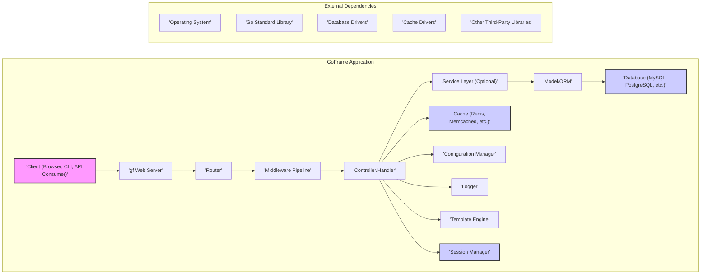

# Project Design Document: GoFrame Framework

**Version:** 1.1
**Date:** October 26, 2023
**Author:** AI Software Architect

## 1. Introduction

This document provides a detailed architectural design of the GoFrame framework (https://github.com/gogf/gf). This design serves as the foundation for subsequent threat modeling activities, aiming to identify potential security vulnerabilities and risks. The document outlines the key components, their interactions, data flow, and deployment considerations, with a focus on security implications.

## 2. Goals

*   Provide a comprehensive and security-focused overview of the GoFrame framework's architecture.
*   Identify key components and their responsibilities, highlighting potential attack surfaces.
*   Describe the typical data flow within a GoFrame application, emphasizing sensitive data paths.
*   Highlight specific potential areas of security concern for detailed threat modeling and risk assessment.

## 3. Target Audience

This document is intended for:

*   Security engineers and architects responsible for threat modeling the GoFrame framework or applications built upon it.
*   Developers working with GoFrame who need a deeper understanding of its architecture and security considerations.
*   Operations teams responsible for securely deploying and maintaining GoFrame applications.

## 4. Overview of GoFrame

GoFrame is a comprehensive, modular, and production-ready application development framework for Go. It offers a wide range of features to streamline development, including:

*   Robust web server and client functionalities for building web applications and APIs.
*   Powerful ORM (Object-Relational Mapping) for simplified database interactions.
*   Flexible cache management supporting various caching backends.
*   Comprehensive configuration management for managing application settings.
*   Advanced logging capabilities for monitoring and auditing.
*   Convenient command-line interface (CLI) tools for development and administration.
*   Efficient dependency injection for managing application dependencies.
*   Versatile template engine for generating dynamic content.
*   Extensive validation features for ensuring data integrity.
*   Support for internationalization (i18n) for building multi-lingual applications.

GoFrame's modularity allows developers to use only the components they need, but understanding the interactions between these components is crucial for security analysis.

## 5. Architectural Design

The GoFrame framework is designed with modularity in mind, allowing for flexibility and scalability. The core architecture and interactions are depicted below:

### 5.1. Key Components and Security Considerations

*   **Client ('Client (Browser, CLI, API Consumer)'):** The entry point for interactions. Security considerations include:
    *   Ensuring clients adhere to secure communication protocols (HTTPS).
    *   Protecting against malicious clients attempting to exploit vulnerabilities.
*   **gf Web Server ('gf Web Server'):** Handles incoming requests. Security considerations include:
    *   Protection against common web server attacks (e.g., DDoS).
    *   Proper configuration of TLS/SSL certificates.
    *   Vulnerability management of the underlying HTTP server implementation.
*   **Router ('Router'):** Directs requests to appropriate handlers. Security considerations include:
    *   Preventing route hijacking or manipulation.
    *   Ensuring proper access controls are enforced based on routes.
*   **Middleware Pipeline ('Middleware Pipeline'):** Intercepts and processes requests. Security considerations include:
    *   Ensuring middleware components are secure and do not introduce vulnerabilities.
    *   Proper ordering of middleware to enforce security policies (e.g., authentication before authorization).
    *   Potential for denial-of-service if a middleware component is inefficient.
*   **Controller/Handler ('Controller/Handler'):** Contains application logic. Security considerations include:
    *   Vulnerability to injection attacks (SQL, command, etc.) if input is not properly sanitized.
    *   Risk of business logic flaws leading to security breaches.
    *   Exposure of sensitive data if not handled carefully.
*   **Service Layer (Optional) ('Service Layer (Optional)'):** Encapsulates business logic. Security considerations are similar to Controllers/Handlers.
*   **Model/ORM ('Model/ORM'):** Interacts with the database. Security considerations include:
    *   Vulnerability to ORM-specific injection attacks.
    *   Ensuring proper data sanitization before database interaction.
    *   Potential for data leaks if ORM configurations are insecure.
*   **Database ('Database (MySQL, PostgreSQL, etc.)'):** Stores persistent data. Security considerations include:
    *   Secure database configuration and access controls.
    *   Protection against SQL injection attacks.
    *   Encryption of sensitive data at rest.
*   **Cache ('Cache (Redis, Memcached, etc.)'):** Stores frequently accessed data. Security considerations include:
    *   Securing access to the cache to prevent unauthorized data retrieval or modification.
    *   Potential for data leaks if sensitive information is cached without proper protection.
    *   Vulnerability to cache poisoning attacks.
*   **Configuration Manager ('Configuration Manager'):** Manages application settings. Security considerations include:
    *   Secure storage and access control for configuration files, especially those containing sensitive information (e.g., API keys, database credentials).
    *   Preventing unauthorized modification of configuration settings.
*   **Logger ('Logger'):** Records application events. Security considerations include:
    *   Preventing the logging of sensitive information.
    *   Ensuring log integrity to detect tampering.
    *   Protecting log files from unauthorized access.
*   **Template Engine ('Template Engine'):** Generates dynamic content. Security considerations include:
    *   Vulnerability to template injection attacks.
    *   Ensuring proper escaping of user-provided data within templates.
*   **Session Manager ('Session Manager'):** Manages user sessions. Security considerations include:
    *   Secure generation and storage of session identifiers.
    *   Protection against session fixation and hijacking attacks.
    *   Proper session timeout mechanisms.

### 5.2. Data Flow with Security Emphasis

A typical request flow in a GoFrame application, highlighting potential security checkpoints, is as follows:

1. A **Client** sends a request, potentially containing sensitive data, to the application. **Security Checkpoint:** Ensure secure transport (HTTPS).
2. The **gf Web Server** receives the request. **Security Checkpoint:**  Firewall rules, rate limiting.
3. The **Router** determines the appropriate handler. **Security Checkpoint:** Route access controls.
4. The request passes through the **Middleware Pipeline**. **Security Checkpoints:**
    *   Authentication middleware verifies user identity.
    *   Authorization middleware checks user permissions.
    *   Input validation middleware sanitizes user input.
    *   Logging middleware records request details.
5. The request reaches the **Controller/Handler**. **Security Checkpoint:** Business logic security checks.
6. The **Controller/Handler** may interact with:
    *   The **Service Layer** (if present). **Security Checkpoint:** Similar to Controller/Handler.
    *   The **Model/ORM** to access or modify data in the **Database**. **Security Checkpoints:** ORM configuration, parameterized queries to prevent SQL injection.
    *   The **Cache**. **Security Checkpoint:** Cache access controls.
    *   The **Configuration Manager**. **Security Checkpoint:** Access controls to configuration data.
    *   The **Logger**. **Security Checkpoint:** Ensuring no sensitive data is logged.
    *   The **Session Manager**. **Security Checkpoint:** Secure session data retrieval and modification.
7. The **Controller/Handler** generates a response, potentially containing sensitive data. **Security Checkpoint:** Ensure sensitive data is not inadvertently included.
8. The response passes back through the **Middleware Pipeline**. **Security Checkpoint:** Response header manipulation for security (e.g., HSTS).
9. The **gf Web Server** sends the response back to the **Client**. **Security Checkpoint:** Secure transport (HTTPS).

### 5.3. Deployment Considerations and Security Implications

The deployment environment significantly impacts the security of a GoFrame application:

*   **Standalone Server:** Requires careful manual configuration of security measures like firewalls, intrusion detection systems, and operating system hardening.
*   **Containerized Environment (Docker, Kubernetes):** Offers isolation and portability but requires secure container image management, network policies, and orchestration security configurations. Vulnerabilities in container images can be exploited.
*   **Cloud Platforms (AWS, Azure, GCP):** Provides various security services and features, but requires proper configuration and understanding of the cloud provider's security model. Misconfigurations can lead to significant security breaches. Consider using managed services where appropriate to offload some security responsibilities.

## 6. Security Considerations (Detailed)

This section expands on the initial security thoughts, providing more specific examples of potential threats.

*   **Input Validation:** Failure to validate inputs can lead to:
    *   **SQL Injection:** Malicious SQL code injected through input fields.
    *   **Cross-Site Scripting (XSS):**  Malicious scripts injected into web pages viewed by other users.
    *   **Command Injection:**  Execution of arbitrary commands on the server.
    *   **Path Traversal:** Accessing files and directories outside the intended scope.
*   **Authentication and Authorization:** Weaknesses can result in:
    *   **Unauthorized Access:** Users gaining access to resources they shouldn't.
    *   **Privilege Escalation:** Users with limited privileges gaining higher-level access.
    *   **Brute-force Attacks:** Attempts to guess passwords or API keys.
*   **Session Management:** Vulnerabilities can lead to:
    *   **Session Fixation:** Attackers forcing a user to use a known session ID.
    *   **Session Hijacking:** Attackers stealing a user's session ID.
    *   **Lack of Proper Timeout:** Sessions remaining active for too long, increasing the window for attack.
*   **Data Protection:** Insufficient protection can result in:
    *   **Data Breaches:** Exposure of sensitive data due to lack of encryption at rest or in transit.
    *   **Man-in-the-Middle Attacks:** Interception of sensitive data during transmission.
*   **Error Handling and Logging:** Improper handling can lead to:
    *   **Information Disclosure:** Leaking sensitive information through error messages.
    *   **Lack of Audit Trails:** Difficulty in tracking malicious activity due to insufficient logging.
*   **Dependency Management:** Using outdated dependencies can expose the application to known vulnerabilities.
*   **Configuration Security:** Insecure configuration can lead to:
    *   **Exposure of Credentials:** Database passwords or API keys being compromised.
    *   **Disabled Security Features:** Important security features being turned off.
*   **Middleware Security:** Vulnerable middleware can introduce security flaws into the application pipeline.
*   **Template Engine Security:** Improper use can lead to **Template Injection**, allowing attackers to execute arbitrary code on the server.
*   **File Upload Security:** Lack of proper validation can allow attackers to upload malicious files (e.g., malware, scripts).
*   **API Security:** Unsecured APIs can be exploited to access or manipulate data without proper authorization.

## 7. Dependencies and Security Implications

GoFrame applications rely on external components, and their security is paramount:

*   **Go Standard Library:** Generally considered secure, but vulnerabilities can still be found. Staying updated with Go versions is important.
*   **Database Drivers:** Vulnerabilities in database drivers can lead to injection attacks or other exploits. Using the latest stable versions is crucial.
*   **Cache Drivers:** Similar to database drivers, vulnerabilities can exist. Secure configuration and up-to-date versions are necessary.
*   **Other Third-Party Libraries:** These introduce a significant attack surface. Regularly auditing and updating these dependencies is essential to mitigate known vulnerabilities. Using dependency management tools to track and update libraries is recommended.

## 8. Future Considerations

*   Detailed sequence diagrams illustrating authentication and authorization flows.
*   Specific data flow diagrams highlighting the movement of personally identifiable information (PII).
*   Threat modeling diagrams using frameworks like STRIDE to categorize potential threats.
*   Security architecture diagrams showing network segmentation and security controls.

This document provides a comprehensive architectural design of the GoFrame framework with a strong focus on security considerations. This information will be crucial for conducting thorough threat modeling and implementing appropriate security measures.