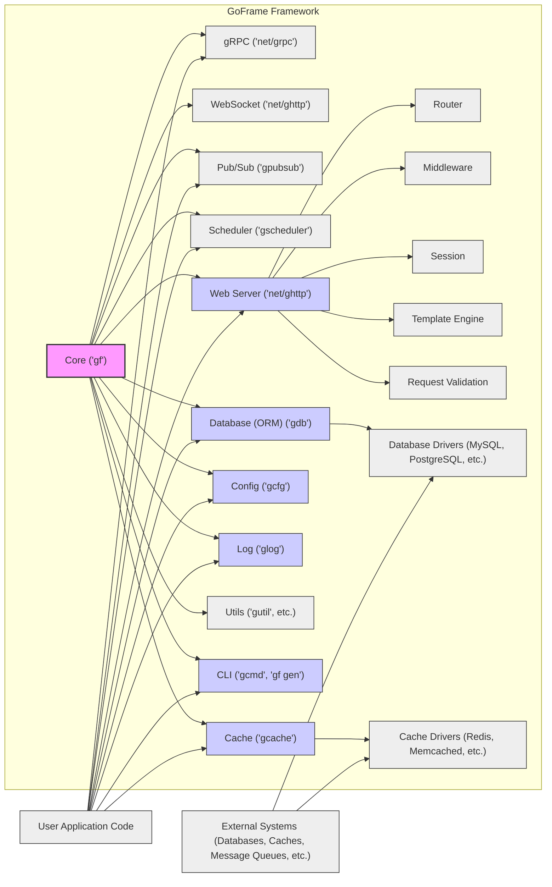
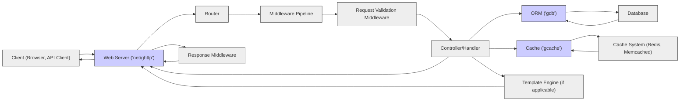

# Project Design Document: GoFrame Framework (Improved)

**Project Name:** GoFrame Framework

**Project Repository:** [https://github.com/gogf/gf](https://github.com/gogf/gf)

**Document Version:** 1.1
**Date:** 2023-10-27
**Author:** AI Software Architect

## 1. Introduction

This document provides an enhanced design overview of the GoFrame (GF) framework, a comprehensive application development and management framework for the Go programming language. GoFrame is engineered for efficiency, ease of use, and enterprise-grade application development, offering a rich set of integrated functionalities. This document is intended to provide a clear understanding of the framework's architecture and serve as the foundational document for subsequent threat modeling activities.

## 2. Project Overview

GoFrame is a modular and robust application development framework written in Go, designed for building enterprise-level applications. It offers a wide array of features, organized into modules for flexibility and selective usage:

*   **Web Server (`net/ghttp`):**  A powerful HTTP server featuring routing, middleware, session management, template engine integrations, request validation, and more.
*   **ORM (Object-Relational Mapping) (`gdb`):** A database access layer supporting various SQL databases. Key features include model management, flexible query building, data validation, and database schema management.
*   **Cache (`gcache`):**  Supports multi-level caching including in-memory, file-based, and distributed caching systems like Redis and Memcached.
*   **Configuration Management (`gcfg`):**  Flexible and hierarchical configuration loading and management from diverse sources such as files (JSON, YAML, TOML, INI), environment variables, and command-line arguments. Supports hot-reloading and centralized configuration.
*   **Logging (`glog`):**  A sophisticated logging system with configurable levels, formats (text, JSON, XML), and output destinations (console, files, network). Supports log rotation and custom log writers.
*   **Command-Line Interface (CLI) (`gcmd`, `gf gen`):**  Tools for project scaffolding, code generation (models, controllers, API definitions), build automation, and application management tasks.
*   **Utility Library (`gutil`, `gconv`, `gstr`, etc.):** A rich collection of utility functions and helpers for common programming tasks, including data conversion, string manipulation, data structures, and more.
*   **gRPC Support (`net/grpc`):** Seamless integration with gRPC for building microservices, including service registration, client generation, and middleware support.
*   **WebSocket Support (`net/ghttp`):** Real-time, bidirectional communication capabilities integrated within the web server module.
*   **Pub/Sub (`gpubsub`):** Publish-subscribe messaging patterns for asynchronous communication and event-driven architectures. Supports multiple drivers.
*   **Scheduler (`gscheduler`):** Task scheduling functionalities with cron-like expressions and programmatic scheduling.

GoFrame's primary goal is to streamline Go application development by providing a cohesive, well-documented, and integrated suite of tools and libraries, promoting development best practices and significantly reducing boilerplate code.

## 3. Architecture Overview

GoFrame is designed with a modular architecture, enabling developers to select and utilize only the necessary components. This modularity promotes efficiency and reduces application footprint. The core architecture is visualized below:

**Key Components (with Module Names):**

*   **Core (`gf`):** The bedrock of the framework, providing fundamental utilities and functionalities used across all modules.
*   **Web Server (`net/ghttp`):**  Handles all aspects of HTTP communication, from routing and middleware to sessions and template rendering.
*   **ORM (Database) (`gdb`):**  Provides a robust and feature-rich ORM for database interactions, supporting various database systems.
*   **Cache (`gcache`):**  Manages caching strategies and integrations with different cache backends.
*   **Config (`gcfg`):**  Handles application configuration loading, management, and hot-reloading.
*   **Log (`glog`):**  Provides a comprehensive logging system for application monitoring and debugging.
*   **Utils (`gutil`, `gconv`, `gstr`, etc.):**  Offers a wide range of utility functions for diverse programming needs.
*   **CLI (`gcmd`, `gf gen`):**  Provides command-line tools for development, scaffolding, and management tasks.
*   **gRPC (`net/grpc`), WebSocket (`net/ghttp`), Pub/Sub (`gpubsub`), Scheduler (`gscheduler`):**  Modules extending the framework's capabilities for specific application requirements like microservices, real-time communication, messaging, and task automation.

## 4. Component Details

### 4.1. Core (`gf`)

*   **Functionality:** Provides essential low-level functionalities such as error handling, context management, type conversion, string manipulation, data structure utilities, and more. It is the foundational layer upon which other modules are built.
*   **Data Flow:** Primarily internal data flow within the framework. It provides utility functions and structures consumed by other modules but generally does not directly interact with external systems.
*   **Dependencies:**  Minimal external dependencies. Primarily relies on standard Go libraries.
*   **Security Considerations:**  While not directly exposed to external networks, vulnerabilities in the core module can have widespread implications across the entire framework. Secure coding practices, thorough testing, and vulnerability scanning are paramount.

### 4.2. Web Server (`net/ghttp`)

*   **Functionality:**  Handles HTTP requests and responses, routing, middleware execution, session management, template rendering, request validation, file serving, and WebSocket communication. It is the primary interface for external interactions for web applications.
*   **Data Flow:**
    *   Receives HTTP requests from clients (web browsers, API clients, etc.).
    *   Parses requests and routes them based on defined routes.
    *   Executes a chain of middleware for request pre-processing and post-processing (e.g., logging, authentication, CORS).
    *   Dispatches requests to registered handlers (controllers, functions).
    *   Handlers interact with other GoFrame components (ORM, Cache, etc.) to process business logic.
    *   Generates HTTP responses (HTML, JSON, XML, etc.) and sends them back to clients.
    *   Manages WebSocket connections for real-time communication.
*   **Dependencies:** Core (`gf`), potentially Session, Template Engine, Validator, and other modules depending on the features used in the application.
*   **Security Considerations:**
    *   **Input Validation & Sanitization:** Rigorous validation and sanitization of all incoming HTTP request data (headers, parameters, body) is critical to prevent injection attacks (SQL Injection, Cross-Site Scripting (XSS), Command Injection, etc.). GoFrame's request validation features should be extensively utilized.
    *   **Output Encoding:**  Properly encode all output data, especially when rendering dynamic content in templates, to prevent XSS vulnerabilities. Use template engines that offer automatic escaping by default.
    *   **Authentication and Authorization:** Implement robust authentication (verifying user identity) and authorization (controlling access to resources) mechanisms. GoFrame provides middleware for authentication and authorization.
    *   **Session Management Security:** Secure session handling practices are essential to prevent session hijacking and fixation attacks. Use secure session IDs, HTTP-only and secure flags for cookies, and implement session timeout mechanisms.
    *   **Middleware Security:**  Carefully review and secure all custom and third-party middleware components. Ensure middleware does not introduce vulnerabilities or bypass security controls.
    *   **CORS (Cross-Origin Resource Sharing) Configuration:**  Properly configure CORS policies to restrict cross-origin requests and prevent unauthorized access from different domains.
    *   **Rate Limiting & DoS Protection:** Implement rate limiting and other mechanisms to protect against Denial-of-Service (DoS) and Distributed Denial-of-Service (DDoS) attacks.
    *   **HTTP Header Security:**  Configure security-related HTTP headers (e.g., `Strict-Transport-Security`, `X-Frame-Options`, `X-Content-Type-Options`, `Content-Security-Policy`) to enhance client-side security.
    *   **WebSocket Security:** For WebSocket endpoints, implement authentication and authorization, validate WebSocket messages, and protect against WebSocket-specific attacks.

### 4.3. ORM (Database) (`gdb`)

*   **Functionality:** Provides an abstraction layer for database interactions, simplifying database operations. Features include model definition, query building (fluent and raw SQL), data validation, transactions, connection pooling, database schema management (migrations), and caching of query results.
*   **Data Flow:**
    *   Receives database operation requests from application code (via ORM methods).
    *   Constructs SQL queries based on ORM operations, using parameterized queries or prepared statements.
    *   Interacts with database drivers to execute queries against the configured database.
    *   Retrieves data from the database and maps it to Go objects (models or data structures).
    *   Returns data or operation status back to the application code.
*   **Dependencies:** Core (`gf`), Database Drivers (e.g., `database/sql`, and specific drivers for MySQL, PostgreSQL, SQLite, etc.).
*   **Security Considerations:**
    *   **SQL Injection Prevention:**  The ORM *must* use parameterized queries or prepared statements exclusively to prevent SQL injection vulnerabilities. Raw SQL queries should be used with extreme caution and only when absolutely necessary, with thorough input sanitization.
    *   **Database Connection Security:** Securely manage database credentials (passwords, connection strings). Avoid hardcoding credentials in application code or configuration files directly. Use environment variables, secrets management systems, or encrypted configuration. Ensure secure network connections to the database server (e.g., TLS/SSL).
    *   **Data Validation (ORM Level):** Utilize ORM's data validation features to enforce data integrity at the database level. Validate data types, constraints, and business rules before writing to the database.
    *   **Access Control (Database Level):**  Implement database-level access control to restrict database user privileges based on the principle of least privilege. Grant only necessary permissions to database users used by the application.
    *   **Database Error Handling:**  Handle database errors gracefully and avoid exposing sensitive database information in error messages to the client. Log detailed error information securely for debugging purposes.

### 4.4. Cache (`gcache`)

*   **Functionality:** Provides multi-level caching capabilities to improve application performance by storing frequently accessed data in memory, file system, or distributed cache systems (Redis, Memcached). Supports cache expiration, invalidation, and different cache strategies.
*   **Data Flow:**
    *   Application code requests data.
    *   Cache module checks for data in the cache layers (in-memory, file, distributed).
    *   If data is found (cache hit), it is returned from the cache.
    *   If data is not found (cache miss), it is retrieved from the original source (e.g., database), stored in the cache (according to configured policies), and then returned to the application.
    *   Supports cache invalidation mechanisms to ensure data consistency.
*   **Dependencies:** Core (`gf`), Cache Drivers (e.g., Redis client, Memcached client) for distributed caching.
*   **Security Considerations:**
    *   **Cache Poisoning:**  Prevent attackers from injecting malicious data into the cache. Validate data retrieved from upstream sources before storing it in the cache. Implement input validation and sanitization for data being cached.
    *   **Cache Invalidation Security:**  Ensure cache invalidation mechanisms are secure and cannot be manipulated by unauthorized users to cause denial of service or data inconsistency.
    *   **Sensitive Data in Cache:**  Avoid caching sensitive data (PII, secrets) if possible. If caching sensitive data is necessary, encrypt the data in the cache and implement access controls to the cache system. Consider the security implications of storing sensitive data in different cache layers (in-memory vs. distributed).
    *   **Cache Access Control (Distributed Cache):** Secure access to distributed cache systems (Redis, Memcached). Implement authentication and authorization for cache access, especially in shared environments. Use secure network connections to cache servers.
    *   **Cache Side-Channel Attacks:** Be aware of potential side-channel attacks related to caching, such as timing attacks that could reveal information about cached data.

### 4.5. Config (`gcfg`)

*   **Functionality:** Loads, manages, and provides access to application configurations from various sources (files, environment variables, command-line arguments). Supports hierarchical configuration structures, configuration merging, hot-reloading of configuration changes, and centralized configuration management.
*   **Data Flow:**
    *   Application startup: Config module loads configurations from specified sources based on configuration paths and formats.
    *   Configuration data is parsed, merged, and stored in memory.
    *   Application components access configuration values through the Config module's API.
    *   Configuration changes (e.g., file modifications, environment variable updates) can trigger hot-reloading, updating the in-memory configuration.
*   **Dependencies:** Core (`gf`), file system access libraries, potentially libraries for parsing different configuration formats (YAML, JSON, TOML, INI).
*   **Security Considerations:**
    *   **Secure Configuration Storage:**  Store sensitive configuration data (database passwords, API keys, secrets) securely. *Never* store sensitive data in plain text in configuration files within the application codebase or version control. Utilize environment variables, secrets management systems (e.g., HashiCorp Vault, AWS Secrets Manager), or encrypted configuration files.
    *   **Configuration Injection Prevention:**  Prevent attackers from injecting malicious configurations. Restrict access to configuration files and configuration sources. Validate configuration data to ensure it conforms to expected formats and values.
    *   **Access Control to Configuration:**  Restrict access to configuration files and configuration management systems to authorized personnel and processes only. Implement access control mechanisms to prevent unauthorized modification of configurations.
    *   **Configuration Exposure:**  Avoid exposing configuration details unnecessarily, especially sensitive information, in logs, error messages, or API responses.

### 4.6. Log (`glog`)

*   **Functionality:** Provides a flexible and configurable logging system for recording application events, errors, debugging information, and security-related events. Supports different log levels, formats (text, JSON, XML), output destinations (console, files, network logging systems), log rotation, and custom log writers.
*   **Data Flow:**
    *   Application code generates log messages using the Log module's API.
    *   Log module processes log messages based on configured log levels, formats, and output destinations.
    *   Log messages are written to the configured output destinations (files, console, remote logging servers, etc.).
*   **Dependencies:** Core (`gf`), file system access libraries, network libraries for remote logging.
*   **Security Considerations:**
    *   **Log Injection Prevention:**  Sanitize log messages to prevent log injection attacks. Attackers might attempt to inject malicious data into logs to manipulate log analysis, monitoring systems, or gain unauthorized access. Properly encode or sanitize user-provided data before including it in log messages.
    *   **Sensitive Data in Logs:**  Avoid logging sensitive data (passwords, API keys, personal information, etc.) in logs. If logging sensitive data is absolutely necessary for debugging or auditing, redact or mask sensitive information before logging. Implement policies to regularly review and purge logs containing sensitive data.
    *   **Log Storage Security:**  Securely store log files and restrict access to authorized personnel only. Implement access controls to log files and log management systems. Protect log data from unauthorized modification or deletion. Consider encrypting log data at rest and in transit, especially if logs contain sensitive information.
    *   **Log Monitoring and Alerting:**  Implement log monitoring and alerting systems to detect suspicious activities, security incidents, and errors. Regularly review logs for security-related events and anomalies.

### 4.7. CLI (`gcmd`, `gf gen`)

*   **Functionality:** Provides command-line tools for project creation, code generation (models, controllers, APIs), build automation, application management, and other development-related tasks.
*   **Data Flow:**
    *   Developer executes CLI commands from the command line.
    *   CLI module parses commands and arguments.
    *   CLI module interacts with the file system, GoFrame framework components, external tools (e.g., database clients, code generators), or network services to perform the requested actions.
    *   CLI module provides output (messages, generated code, status updates) to the command-line interface.
*   **Dependencies:** Core (`gf`), potentially other GoFrame modules, file system access libraries, external command-line tools, and network libraries.
*   **Security Considerations:**
    *   **Command Injection Prevention:**  Carefully handle user input provided to CLI commands to prevent command injection vulnerabilities. Avoid directly executing shell commands with user-provided input. Sanitize and validate user input before using it in system commands or file paths.
    *   **File System Access Control:**  Ensure CLI tools operate within appropriate file system permissions. Prevent CLI tools from allowing unauthorized file access, modification, or deletion. Implement checks to ensure CLI operations are performed within the intended project directory or scope.
    *   **Privilege Escalation Prevention:**  Avoid CLI tools that could lead to unintended privilege escalation. Ensure CLI tools do not inadvertently grant users higher privileges than intended.
    *   **Secure Code Generation:**  When CLI tools generate code (e.g., code scaffolding, model generation), ensure the generated code follows secure coding practices and does not introduce vulnerabilities by default.
    *   **Dependency Security (CLI Tools):**  If CLI tools rely on external dependencies or libraries, ensure these dependencies are secure and up-to-date to prevent vulnerabilities in the CLI tools themselves.

### 4.8. gRPC (`net/grpc`), WebSocket (`net/ghttp`), Pub/Sub (`gpubsub`), Scheduler (`gscheduler`)

These modules extend GoFrame's capabilities for specific use cases. Their security considerations align with best practices for their respective technologies, and also integrate with GoFrame's core security principles:

*   **gRPC (`net/grpc`):**
    *   **Secure Communication Channels (TLS/SSL):** Enforce TLS/SSL for all gRPC communication to encrypt data in transit and protect against eavesdropping and man-in-the-middle attacks.
    *   **Authentication and Authorization:** Implement robust authentication (e.g., mutual TLS, API keys, JWT) and authorization mechanisms for gRPC services to control access and verify client identities. GoFrame provides middleware for gRPC authentication.
    *   **Input Validation (gRPC Requests):**  Thoroughly validate all input data in gRPC requests to prevent injection attacks and data integrity issues. Utilize gRPC validation mechanisms and GoFrame's validation features.
    *   **Error Handling (gRPC):**  Handle gRPC errors gracefully and avoid exposing sensitive information in gRPC error responses.
    *   **DoS Protection (gRPC):** Implement rate limiting and other mechanisms to protect gRPC services from Denial-of-Service attacks.

*   **WebSocket (`net/ghttp`):**
    *   **Secure WebSocket Connections (WSS):** Use WSS (WebSocket over TLS/SSL) for all WebSocket connections to encrypt communication and protect against eavesdropping.
    *   **Authentication and Authorization (WebSocket):** Implement authentication and authorization for WebSocket endpoints to control access and verify client identities. Use mechanisms like session-based authentication or token-based authentication.
    *   **Input Validation (WebSocket Messages):**  Validate all incoming WebSocket messages to prevent injection attacks and data integrity issues. Sanitize and validate data received via WebSocket messages.
    *   **WebSocket Frame Validation:** Validate WebSocket frames to prevent malformed or malicious frames from being processed.
    *   **DoS Protection (WebSocket):** Implement rate limiting and connection limits to protect WebSocket servers from Denial-of-Service attacks.

*   **Pub/Sub (`gpubsub`):**
    *   **Secure Message Queues:** If using external message queue systems (e.g., Redis Pub/Sub, Kafka), ensure secure configuration and access control for the message queue system itself.
    *   **Access Control (Topics/Channels):** Implement access control mechanisms to restrict publish and subscribe access to specific topics or channels.
    *   **Message Integrity and Confidentiality:** If messages contain sensitive data, consider encrypting messages before publishing and decrypting upon subscription. Ensure message integrity to prevent tampering.
    *   **Authentication and Authorization (Pub/Sub Clients):** Implement authentication and authorization for clients connecting to the Pub/Sub system.

*   **Scheduler (`gscheduler`):**
    *   **Secure Task Scheduling:**  Secure task scheduling configurations to prevent unauthorized task execution or modification. Restrict access to scheduler management interfaces.
    *   **Task Execution Security:**  Ensure scheduled tasks are executed securely and do not introduce vulnerabilities. Validate task inputs and outputs.
    *   **Access Control (Scheduler Management):** Implement access control to restrict who can create, modify, or delete scheduled tasks.

## 5. Data Flow Diagram (Web Request - Improved)

This diagram illustrates a more detailed data flow for a typical web request in a GoFrame application, including request validation and more specific component interactions:

**Improved Data Flow Description:**

1.  **Client Request:** A client sends an HTTP request to the GoFrame Web Server (`net/ghttp`).
2.  **Web Server Reception:** The Web Server receives the request.
3.  **Routing:** The Router component determines the appropriate handler based on the request URL.
4.  **Middleware Pipeline:** The request passes through a series of middleware components, including security middleware, logging, etc.
5.  **Request Validation Middleware:**  Specifically, a request validation middleware (if configured) validates the incoming request data against predefined rules. This is a crucial step for security.
6.  **Controller/Handler Execution:** The designated controller or handler function is executed to process the validated request.
7.  **Data Access (ORM & Cache):** The handler may interact with the ORM (`gdb`) to access the database and/or the Cache (`gcache`) to retrieve or store data.
8.  **Database/Cache Interaction:** ORM interacts with the Database, and Cache interacts with the Cache System.
9.  **Template Rendering (Optional):** If the response involves rendering a template, the Template Engine is used.
10. **Response Generation:** The handler generates an HTTP response.
11. **Response Middleware:** The response passes through response middleware for post-processing (e.g., adding security headers, logging).
12. **Web Server Response:** The Web Server sends the processed response back to the client.

## 6. Technology Stack (Detailed)

GoFrame leverages the following technologies:

*   **Core Language:** Go (Golang) - Utilizing Go's concurrency, performance, and standard library.
*   **Web Server (`net/ghttp`):** Built on Go's native `net/http` package, extended with routing, middleware, session management, WebSocket support, and request validation.
*   **ORM (`gdb`):** Custom-built ORM, supporting:
    *   SQL Databases: MySQL, PostgreSQL, SQLite, Oracle, SQL Server, TiDB, ClickHouse, and more via `database/sql` and specific database drivers.
    *   Features: Model management, query builder (fluent and raw SQL), data validation, transactions, connection pooling (using `database/sql`), schema migrations, and query caching.
*   **Cache (`gcache`):**  Supports:
    *   In-Memory Cache: Using Go's `sync.Map` and other in-memory data structures.
    *   File-Based Cache: Storing cache data on the local file system.
    *   Distributed Cache: Integrations with Redis, Memcached, and potentially other distributed cache systems via Go client libraries (e.g., `go-redis/redis`, `bradfitz/gomemcache`).
*   **Configuration (`gcfg`):**
    *   Configuration Formats: JSON, YAML, TOML, INI, XML, properties files.
    *   Configuration Sources: Files, environment variables, command-line arguments, remote configuration servers (customizable).
    *   Features: Hierarchical configuration, merging, hot-reloading, type conversion, and validation.
*   **Logging (`glog`):**
    *   Log Levels: Debug, Info, Notice, Warning, Error, Critical, Fatal.
    *   Log Formats: Text, JSON, XML, custom formats.
    *   Output Destinations: Console, files, network (TCP, UDP, HTTP), custom log writers.
    *   Features: Log rotation, asynchronous logging, structured logging, and customizable log formatters.
*   **Template Engine (`net/ghttp`):**
    *   Built-in Template Engine: Based on Go's `html/template` package, with extensions and security enhancements.
    *   Integration with External Template Engines: Support for integrating with other Go template engines.
*   **CLI (`gcmd`, `gf gen`):** Built using Go's `flag` package and custom CLI parsing logic. Code generation utilizes Go's `text/template` package.
*   **gRPC (`net/grpc`):**  Leverages standard Go gRPC libraries (`google.golang.org/grpc`).
*   **WebSocket (`net/ghttp`):** Built on Go's `net/http` and `golang.org/x/net/websocket` (or similar WebSocket libraries).
*   **Pub/Sub (`gpubsub`):**  Supports various Pub/Sub backends through driver interfaces, including in-memory, Redis Pub/Sub, and potentially integrations with other message queue systems.
*   **Scheduler (`gscheduler`):**  Custom scheduler implementation using Go's `time` package and concurrency primitives.

## 7. Deployment Model (Expanded)

GoFrame applications are highly versatile in deployment environments:

*   **Cloud Platforms (AWS, Azure, GCP, DigitalOcean, etc.):**
    *   Containerized Deployment (Docker, Kubernetes, ECS, AKS, GKE): Ideal for scalability, resilience, and orchestration. GoFrame applications can be easily containerized and deployed using Docker and orchestrated with Kubernetes or cloud-managed container services.
    *   Serverless Functions (AWS Lambda, Azure Functions, Google Cloud Functions): Certain GoFrame components or microservices can be adapted for serverless deployments, particularly for event-driven architectures or API endpoints with spiky traffic.
    *   Virtual Machines (EC2, Azure VMs, Compute Engine): Traditional VM-based deployments are also supported, offering more control over the underlying infrastructure.
*   **On-Premise Infrastructure:**
    *   Physical Servers: Deployment on bare-metal servers for maximum performance and control.
    *   Virtual Machines (VMware, Hyper-V, VirtualBox): Deployment within virtualized environments for resource optimization and isolation.
*   **Container Orchestration Platforms (Kubernetes, Docker Swarm, Nomad):** GoFrame's modularity and container-friendliness make it well-suited for deployment on container orchestration platforms, enabling automated scaling, rolling updates, and high availability.
*   **PaaS (Platform-as-a-Service) Providers (Heroku, Google App Engine, AWS Elastic Beanstalk):** GoFrame applications can be deployed on PaaS platforms that support Go applications, simplifying deployment and management.

**Typical Deployment Scenarios:**

*   **Web Applications (Frontend & Backend):** Serving dynamic web pages, RESTful APIs, and GraphQL endpoints.
*   **Microservices Architectures:** Building individual microservices for specific business capabilities, communicating via gRPC, REST, or message queues.
*   **Backend for Mobile Applications:** Providing APIs and backend logic for mobile applications.
*   **Real-time Applications:** Utilizing WebSocket for real-time communication features like chat applications, dashboards, and collaborative tools.
*   **Batch Processing and Task Scheduling:** Implementing background tasks, scheduled jobs, and data processing pipelines using the Scheduler module.
*   **Command-Line Tools and Utilities:** Creating CLI applications for system administration, automation, and development tasks.

## 8. Security Considerations (Comprehensive)

*(This section is expanded and more detailed, building upon the previous version)*

*   **Input Validation and Sanitization (Defense in Depth):**
    *   **Validate all external inputs:** HTTP requests (headers, parameters, body), CLI arguments, configuration data, WebSocket messages, gRPC requests, Pub/Sub messages.
    *   **Use strong validation rules:** Data type validation, format validation, range checks, length limits, regular expressions, business rule validation.
    *   **Sanitize inputs:** Encode or escape special characters to prevent injection attacks. Use context-aware sanitization based on the intended use of the data (e.g., HTML escaping for web output, SQL escaping for database queries).
    *   **Implement validation at multiple layers:** Client-side validation (for user experience), server-side validation (for security), and database-level constraints (for data integrity).
    *   **Utilize GoFrame's Request Validation features:** Leverage the built-in request validation middleware and validation rules provided by GoFrame.

*   **Output Encoding and Escaping (XSS Prevention):**
    *   **Encode all dynamic output:** When rendering dynamic content in web pages, APIs, or other outputs, encode data appropriately to prevent Cross-Site Scripting (XSS) vulnerabilities.
    *   **Use context-aware encoding:** HTML escaping for HTML output, JavaScript escaping for JavaScript output, URL encoding for URLs, etc.
    *   **Utilize template engines with automatic escaping:** GoFrame's template engine (and recommended external engines) should provide automatic escaping by default.
    *   **Content Security Policy (CSP):** Implement and configure CSP headers to further mitigate XSS risks by controlling the sources from which the browser is allowed to load resources.

*   **Authentication and Authorization (Access Control):**
    *   **Implement robust authentication:** Verify user identities using strong authentication mechanisms (e.g., password-based authentication with strong password policies, multi-factor authentication (MFA), OAuth 2.0, OpenID Connect, API keys, JWT).
    *   **Implement fine-grained authorization:** Control access to resources and functionalities based on user roles, permissions, or attributes. Use role-based access control (RBAC) or attribute-based access control (ABAC).
    *   **Principle of Least Privilege:** Grant users and components only the minimum necessary permissions required to perform their tasks.
    *   **Secure session management:** Use secure session IDs, HTTP-only and secure flags for session cookies, implement session timeout and idle timeout mechanisms, and protect against session fixation and hijacking attacks.
    *   **API Security:** Secure APIs using API keys, OAuth 2.0, JWT, or mutual TLS. Implement API rate limiting and input validation.

*   **Session Management Security:**
    *   **Secure Session ID Generation:** Use cryptographically secure random number generators to generate session IDs.
    *   **HTTP-Only and Secure Flags:** Set the `HttpOnly` and `Secure` flags for session cookies to prevent client-side JavaScript access and ensure cookies are only transmitted over HTTPS.
    *   **Session Timeout and Idle Timeout:** Implement session timeout and idle timeout mechanisms to automatically invalidate sessions after a period of inactivity or after a fixed duration.
    *   **Session Invalidation:** Provide mechanisms for users to explicitly log out and invalidate their sessions.
    *   **Session Storage Security:** Securely store session data (e.g., in encrypted cookies, server-side session stores).

*   **Error Handling and Logging (Security Monitoring):**
    *   **Implement proper error handling:** Handle errors gracefully and prevent application crashes or unexpected behavior.
    *   **Avoid exposing sensitive information in error messages:** Do not expose internal system details, database connection strings, or other sensitive information in error messages displayed to users or in API responses.
    *   **Log detailed error information securely:** Log detailed error information (including stack traces, request details) to secure log files for debugging and security analysis.
    *   **Centralized Logging:** Use a centralized logging system to aggregate logs from all application components for easier monitoring and analysis.
    *   **Security Auditing and Logging:** Log security-relevant events, such as authentication attempts, authorization failures, access to sensitive resources, and security-related errors.
    *   **Log Monitoring and Alerting:** Implement log monitoring and alerting systems to detect suspicious activities, security incidents, and errors in real-time.

*   **Dependency Management and Vulnerability Scanning:**
    *   **Keep dependencies up-to-date:** Regularly update GoFrame framework and all third-party dependencies to patch known vulnerabilities.
    *   **Dependency vulnerability scanning:** Use dependency vulnerability scanning tools (e.g., `govulncheck`, Snyk, Dependabot) to identify and address vulnerabilities in project dependencies.
    *   **Software Composition Analysis (SCA):** Implement SCA processes to manage and track open-source components used in the project and monitor for security risks.

*   **Secure Configuration Management (Secrets Management):**
    *   **Externalize sensitive configuration:** Store sensitive configuration data (database passwords, API keys, secrets) outside of the application codebase and configuration files.
    *   **Environment variables:** Use environment variables to inject sensitive configuration data into the application at runtime.
    *   **Secrets management systems:** Utilize dedicated secrets management systems (e.g., HashiCorp Vault, AWS Secrets Manager, Azure Key Vault, Google Cloud Secret Manager) to securely store, manage, and access secrets.
    *   **Encrypted configuration files:** If configuration files must contain sensitive data, encrypt them using strong encryption algorithms.
    *   **Principle of least privilege for configuration access:** Restrict access to configuration files and secrets management systems to authorized personnel and processes only.

*   **Regular Security Audits and Penetration Testing (Proactive Security):**
    *   **Conduct regular security audits:** Perform code reviews, architecture reviews, and security assessments to identify potential vulnerabilities and security weaknesses in the GoFrame application.
    *   **Penetration testing:** Conduct regular penetration testing (both black-box and white-box testing) to simulate real-world attacks and identify exploitable vulnerabilities.
    *   **Vulnerability scanning:** Use automated vulnerability scanning tools to scan the application and infrastructure for known vulnerabilities.
    *   **Security training for developers:** Provide security training to developers to promote secure coding practices and raise awareness of common security vulnerabilities.

*   **Principle of Least Privilege (Access Control):**
    *   **Apply the principle of least privilege throughout the application:** Grant users, processes, and components only the minimum necessary permissions required to perform their intended functions.
    *   **Role-based access control (RBAC):** Implement RBAC to manage user permissions based on roles.
    *   **Attribute-based access control (ABAC):** Consider ABAC for more fine-grained access control based on user attributes, resource attributes, and environmental conditions.
    *   **Database access control:** Restrict database user privileges to the minimum required for the application to function.
    *   **File system access control:** Configure file system permissions to restrict access to application files and directories to authorized users and processes.

*   **Secure Communication (Encryption):**
    *   **HTTPS for web traffic:** Enforce HTTPS for all web traffic to encrypt communication between clients and the web server and protect against eavesdropping and man-in-the-middle attacks.
    *   **TLS/SSL for other network communication:** Use TLS/SSL to encrypt communication for other network protocols, such as gRPC, database connections, cache connections, and communication with external services.
    *   **HSTS (HTTP Strict Transport Security):** Implement HSTS headers to instruct browsers to always use HTTPS for communication with the application.

## 9. Threat Modeling Focus Areas (Refined and Actionable)

Based on the architecture, component details, and security considerations, the following are refined and actionable threat modeling focus areas for GoFrame applications. These areas should be prioritized during threat modeling exercises:

*   **Web Server (`net/ghttp`) - Attack Surface:**
    *   **HTTP Request Handling Vulnerabilities:**
        *   **Injection Attacks:** SQL Injection, XSS, Command Injection, Header Injection, CRLF Injection, Template Injection (if using server-side rendering). Focus on input validation, sanitization, and output encoding.
        *   **Parameter Tampering:** Manipulation of request parameters to bypass security controls or access unauthorized data. Focus on input validation, authorization, and data integrity checks.
        *   **Cross-Site Request Forgery (CSRF):** Exploiting user sessions to perform unauthorized actions. Implement CSRF protection mechanisms (e.g., CSRF tokens).
        *   **HTTP Verb Tampering:** Exploiting vulnerabilities related to improper handling of HTTP verbs (GET, POST, PUT, DELETE).
    *   **Authentication and Authorization Weaknesses:**
        *   **Broken Authentication:** Weak password policies, insecure session management, lack of multi-factor authentication.
        *   **Broken Access Control:** Horizontal privilege escalation (accessing resources of other users), vertical privilege escalation (gaining administrative privileges), insecure direct object references.
    *   **Session Management Vulnerabilities:** Session hijacking, session fixation, insecure session storage, session timeout issues.
    *   **Middleware Security Issues:** Vulnerabilities in custom or third-party middleware components, misconfiguration of middleware, middleware bypass vulnerabilities.
    *   **Template Engine Vulnerabilities:** Template injection vulnerabilities if using server-side rendering, XSS vulnerabilities due to improper output encoding in templates.
    *   **CORS Misconfiguration:** Permissive CORS policies allowing unauthorized cross-origin access.
    *   **DoS/DDoS Vulnerabilities:** Lack of rate limiting, resource exhaustion vulnerabilities, vulnerabilities exploitable for denial-of-service attacks.
    *   **WebSocket Security Threats:** WebSocket injection, cross-site WebSocket hijacking, DoS attacks via WebSocket, lack of authentication/authorization for WebSocket endpoints.

*   **ORM (`gdb`) - Data Layer Security:**
    *   **SQL Injection Vulnerabilities:** Focus on ensuring parameterized queries or prepared statements are used consistently and correctly. Review raw SQL queries for potential vulnerabilities.
    *   **Database Connection Security:** Insecure storage of database credentials, unencrypted database connections, weak database user privileges.
    *   **Data Validation Bypass in ORM:** Bypassing ORM-level validation to insert invalid or malicious data into the database.
    *   **Mass Assignment Vulnerabilities:** Uncontrolled mass assignment of request parameters to database models, potentially leading to unauthorized data modification.
    *   **Database Access Control Issues:** Overly permissive database user privileges, lack of database-level access control.

*   **Cache (`gcache`) - Cache Security:**
    *   **Cache Poisoning Attacks:** Injecting malicious data into the cache to serve to other users. Focus on input validation and sanitization before caching.
    *   **Cache Invalidation Flaws:** Inconsistent or insecure cache invalidation mechanisms leading to stale or incorrect data being served.
    *   **Sensitive Data Exposure in Cache:** Caching sensitive data without proper encryption or access control.
    *   **Cache Access Control Weaknesses:** Unauthorized access to the cache system, especially in distributed cache environments.

*   **Config (`gcfg`) - Configuration Security:**
    *   **Exposure of Sensitive Configuration Data:** Storing sensitive data (secrets, API keys) in plain text in configuration files or logs.
    *   **Configuration Injection Vulnerabilities:** Injecting malicious configurations to alter application behavior or gain unauthorized access.
    *   **Unauthorized Access to Configuration Sources:** Lack of access control to configuration files or configuration management systems.

*   **Log (`glog`) - Logging Security:**
    *   **Log Injection Vulnerabilities:** Injecting malicious data into logs to manipulate log analysis or monitoring systems.
    *   **Sensitive Data Logging:** Logging sensitive data in plain text, potentially exposing it to unauthorized users.
    *   **Insecure Log Storage:** Storing logs in insecure locations with insufficient access control.

*   **CLI (`gcmd`, `gf gen`) - CLI Tool Security:**
    *   **Command Injection Vulnerabilities in CLI Tools:** Exploiting vulnerabilities in CLI tools to execute arbitrary commands on the server.
    *   **File System Access Control Issues in CLI Tools:** CLI tools allowing unauthorized file access or modification.
    *   **Privilege Escalation via CLI Tools:** CLI tools inadvertently granting users higher privileges.

*   **External System Integrations - Integration Security:**
    *   **Insecure Communication with External Systems:** Unencrypted communication with databases, cache systems, message queues, and other external services.
    *   **Authentication and Authorization Weaknesses for External Systems:** Weak or missing authentication and authorization mechanisms for accessing external systems.
    *   **Data Integrity and Confidentiality Issues in External System Communication:** Data tampering or eavesdropping during communication with external systems.

By focusing threat modeling efforts on these refined and actionable areas, security assessments of GoFrame applications can be more targeted, efficient, and effective in identifying and mitigating potential security risks. This document provides a solid foundation for conducting thorough threat modeling and building more secure GoFrame applications.