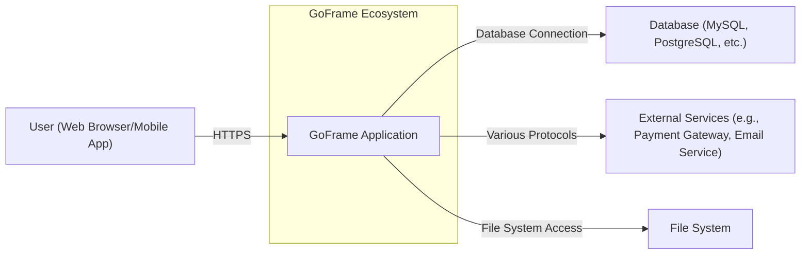
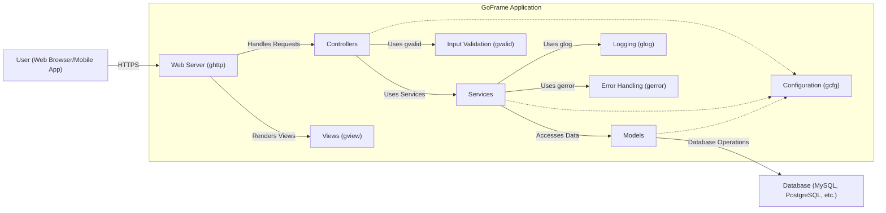

Okay, let's create a design document for the GoFrame (gf) project, keeping in mind its purpose and potential security considerations.

# BUSINESS POSTURE

GoFrame (gf) is a modular, powerful, and production-ready application development framework for Go.  It aims to provide a comprehensive suite of tools and components to simplify and accelerate the development of web applications, APIs, and microservices.

Business Priorities:

- Rapid Development: Enable developers to build applications quickly and efficiently.
- Maintainability:  Provide a structure that promotes clean, organized, and maintainable code.
- Performance: Offer high performance and low resource consumption.
- Scalability:  Facilitate the creation of applications that can scale to handle increasing load.
- Community & Ecosystem: Foster a strong community and a rich ecosystem of extensions and integrations.
- Production Readiness: Be suitable for use in production environments, emphasizing stability and reliability.

Business Goals:

- Become a leading Go framework choice for developers.
- Attract a large and active community of contributors and users.
- Provide a viable alternative to other popular Go frameworks.
- Enable the creation of robust and scalable applications across various domains.

Most Important Business Risks:

- Security Vulnerabilities:  Vulnerabilities in the framework could be exploited to compromise applications built upon it, leading to data breaches, service disruptions, and reputational damage. This is the most critical risk.
- Dependency Issues:  Reliance on external dependencies could introduce vulnerabilities or instability if those dependencies are not properly managed.  Supply chain attacks are a significant concern.
- Lack of Adoption:  If the framework fails to gain sufficient adoption, it may become unsustainable in the long term.
- Performance Bottlenecks:  Poor performance could limit the scalability and usability of applications built with the framework.
- Inadequate Documentation/Support:  Poor documentation or lack of community support could hinder developer adoption and lead to frustration.

# SECURITY POSTURE

Existing Security Controls (based on reviewing the repository and documentation):

- security control: Input Validation: The framework appears to provide mechanisms for input validation, particularly in the `gvalid` package. (https://goframe.org/pages/viewpage.action?pageId=1114379)
- security control: ORM Security: The `gdb` package (ORM) seems to implement measures to prevent SQL injection, likely through parameterized queries or prepared statements. (https://goframe.org/pages/viewpage.action?pageId=1114148)
- security control: Template Security: The `gview` package (templating engine) likely includes features for output encoding to mitigate Cross-Site Scripting (XSS) vulnerabilities. (https://goframe.org/pages/viewpage.action?pageId=1114125)
- security control: Configuration Management: GoFrame uses a configuration management component (`gcfg`) that separates configuration from code, which is a good security practice. (https://goframe.org/pages/viewpage.action?pageId=1114117)
- security control: Logging: GoFrame provides logging capabilities (`glog`), which are essential for auditing and security monitoring. (https://goframe.org/pages/viewpage.action?pageId=1114141)
- security control: Error Handling: The framework has a dedicated error handling mechanism (`gerror`), which can help prevent information leakage. (https://goframe.org/pages/viewpage.action?pageId=1114121)
- security control: HTTP Security: The `ghttp` package provides features for handling HTTP requests and responses, and likely includes some basic security measures (e.g., handling common HTTP headers). (https://goframe.org/pages/viewpage.action?pageId=1114131)

Accepted Risks:

- accepted risk: The framework's security heavily relies on the developer's proper usage of its features.  Incorrect implementation of input validation, authentication, or authorization could still lead to vulnerabilities.
- accepted risk: While the framework provides building blocks, it doesn't enforce a specific security architecture (e.g., OAuth2, JWT). Developers are responsible for choosing and implementing appropriate security mechanisms.
- accepted risk: The framework's extensive feature set increases the potential attack surface.  More features mean more potential areas for vulnerabilities.
- accepted risk: The framework's reliance on community contributions and third-party modules introduces a risk of supply chain vulnerabilities.

Recommended Security Controls:

- security control: Dependency Management: Implement robust dependency management practices, including regular vulnerability scanning of dependencies and the use of tools like `go mod tidy` and `go mod vendor`. Consider using a Software Bill of Materials (SBOM) to track dependencies.
- security control: Security Audits: Conduct regular security audits and penetration testing of the framework itself to identify and address potential vulnerabilities.
- security control: Secure Coding Guidelines: Provide comprehensive secure coding guidelines and best practices for developers using the framework.
- security control: Automated Security Testing: Integrate automated security testing tools (SAST, DAST, IAST) into the CI/CD pipeline.
- security control: Content Security Policy (CSP): Encourage and provide easy mechanisms for developers to implement CSP to mitigate XSS attacks.
- security control: HTTP Strict Transport Security (HSTS): Encourage and provide easy mechanisms for developers to implement HSTS to enforce HTTPS connections.
- security control: Cross-Site Request Forgery (CSRF) Protection: Provide built-in mechanisms or clear guidance for implementing CSRF protection.
- security control: Rate Limiting: Implement or provide guidance on implementing rate limiting to mitigate brute-force attacks and denial-of-service attacks.
- security control: Secrets Management: Provide clear guidance and integration with secure secrets management solutions (e.g., HashiCorp Vault, cloud-specific key management services).

Security Requirements:

- Authentication:
    - The framework should provide flexible mechanisms for implementing various authentication methods (e.g., username/password, OAuth2, JWT, API keys).
    - It should support secure storage of user credentials (e.g., using strong hashing algorithms like bcrypt or Argon2).
    - It should provide mechanisms for session management, including secure session identifiers and timeouts.

- Authorization:
    - The framework should support role-based access control (RBAC) or attribute-based access control (ABAC).
    - It should provide mechanisms for defining and enforcing access control policies.
    - It should allow for granular control over access to resources and functionalities.

- Input Validation:
    - All user-provided input should be validated against strict rules.
    - The framework should provide a comprehensive input validation library or component.
    - Validation should be performed on both the client-side (for user experience) and the server-side (for security).
    - Validation rules should be configurable and extensible.

- Cryptography:
    - The framework should provide easy-to-use cryptographic functions for common tasks (e.g., hashing, encryption, decryption).
    - It should use strong, industry-standard cryptographic algorithms.
    - It should provide guidance on secure key management.

# DESIGN

## C4 CONTEXT

C4 Context Element List:

- Element: User (Web Browser/Mobile App)
    - Name: User
    - Type: Person
    - Description: A user interacting with the GoFrame application through a web browser or mobile application.
    - Responsibilities: Initiates requests, views responses, provides input.
    - Security Controls: Browser security features, HTTPS.

- Element: GoFrame Application
    - Name: GoFrame Application
    - Type: Software System
    - Description: The application built using the GoFrame framework.
    - Responsibilities: Handles user requests, processes data, interacts with databases and external services, renders responses.
    - Security Controls: Input validation, output encoding, authentication, authorization, secure configuration, logging, error handling.

- Element: Database (MySQL, PostgreSQL, etc.)
    - Name: Database
    - Type: Software System
    - Description: A database system used to store application data.
    - Responsibilities: Stores and retrieves data, ensures data integrity.
    - Security Controls: Database access controls, encryption at rest, encryption in transit, auditing.

- Element: External Services (e.g., Payment Gateway, Email Service)
    - Name: External Services
    - Type: Software System
    - Description: Third-party services used by the GoFrame application.
    - Responsibilities: Varies depending on the service (e.g., processing payments, sending emails).
    - Security Controls: API keys, authentication tokens, secure communication protocols (e.g., HTTPS).

- Element: File System
    - Name: File System
    - Type: Software System
    - Description: Local file system.
    - Responsibilities: Store and retrieve files.
    - Security Controls: File system permissions.

## C4 CONTAINER

C4 Container Element List:

- Element: Web Server (ghttp)
    - Name: Web Server
    - Type: Container (Go process)
    - Description: The built-in web server provided by GoFrame.
    - Responsibilities: Handles incoming HTTP requests, routes requests to controllers, serves static files.
    - Security Controls: HTTPS configuration, request filtering, potentially rate limiting.

- Element: Controllers
    - Name: Controllers
    - Type: Container (Go code)
    - Description:  Components that handle specific user requests and interact with services.
    - Responsibilities:  Process user input, interact with services, prepare data for views.
    - Security Controls: Input validation, authentication checks, authorization checks.

- Element: Services
    - Name: Services
    - Type: Container (Go code)
    - Description:  Components that encapsulate business logic.
    - Responsibilities:  Perform business operations, interact with models.
    - Security Controls:  Business rule enforcement, data validation.

- Element: Models
    - Name: Models
    - Type: Container (Go code)
    - Description:  Components that represent data structures and interact with the database.
    - Responsibilities:  Define data structures, perform database operations (CRUD).
    - Security Controls:  Data validation, secure database interactions (preventing SQL injection).

- Element: Views (gview)
    - Name: Views
    - Type: Container (Template files)
    - Description:  Templates used to render dynamic content.
    - Responsibilities:  Generate HTML responses based on data provided by controllers.
    - Security Controls:  Output encoding (to prevent XSS).

- Element: Input Validation (gvalid)
    - Name: Input Validation
    - Type: Component
    - Description: GoFrame's input validation component.
    - Responsibilities: Validates user input against predefined rules.
    - Security Controls: Input validation rules, data sanitization.

- Element: Logging (glog)
    - Name: Logging
    - Type: Component
    - Description: GoFrame's logging component.
    - Responsibilities: Logs application events, errors, and debug information.
    - Security Controls: Secure logging configuration (preventing sensitive data leakage).

- Element: Error Handling (gerror)
    - Name: Error Handling
    - Type: Component
    - Description: GoFrame's error handling component.
    - Responsibilities: Provides a consistent way to handle errors.
    - Security Controls: Prevents sensitive information leakage in error messages.

- Element: Configuration (gcfg)
    - Name: Configuration
    - Type: Component
    - Description: GoFrame's configuration component.
    - Responsibilities: Manages application configuration.
    - Security Controls: Secure storage of sensitive configuration data (e.g., database credentials).

- Element: Database (MySQL, PostgreSQL, etc.)
    - Name: Database
    - Type: Container (Database Server)
    - Description: An external database system.
    - Responsibilities: Stores and manages application data.
    - Security Controls: Database access controls, encryption, auditing.

## DEPLOYMENT

Possible Deployment Solutions:

1.  Traditional Server Deployment: Deploying the GoFrame application as a binary executable on a virtual machine or physical server.
2.  Containerized Deployment (Docker): Packaging the application and its dependencies into a Docker container and deploying it to a container orchestration platform (e.g., Kubernetes, Docker Swarm).
3.  Serverless Deployment (AWS Lambda, Google Cloud Functions, Azure Functions): Deploying individual functions or parts of the application as serverless functions.
4.  PaaS Deployment (Heroku, Google App Engine): Deploying the application to a Platform-as-a-Service provider.

Chosen Solution: Containerized Deployment (Docker & Kubernetes)

```mermaid
graph LR
    Developer["Developer"] -- "Commits Code" --> GitRepository["Git Repository (GitHub)"]
    GitRepository -- "Triggers Build" --> CI_CD["CI/CD Pipeline (GitHub Actions)"]
    CI_CD -- "Builds Docker Image" --> DockerImage["Docker Image"]
    DockerImage -- "Pushes to Registry" --> ContainerRegistry["Container Registry (Docker Hub, ECR, GCR)"]
    ContainerRegistry -- "Pulled by Kubernetes" --> KubernetesCluster["Kubernetes Cluster"]
    KubernetesCluster -- "Deploys" --> Pod["Pod (GoFrame Application)"]
    Pod -- "Exposes Service" --> Service["Service (Load Balancer)"]
    Service -- "Routes Traffic" --> Ingress["Ingress (Ingress Controller)"]
    Ingress -- "External Access" --> User["User"]
    Pod -- "Connects to" --> DatabasePod["Database Pod"]
	DatabasePod -- "Uses" --> PersistentVolume["Persistent Volume"]

    subgraph "Deployment Environment"
        KubernetesCluster
    end
```

Deployment Element List:

- Element: Developer
    - Name: Developer
    - Type: Person
    - Description: The developer writing and committing code.
    - Responsibilities: Develops and tests the application.
    - Security Controls: Code review, secure coding practices.

- Element: Git Repository (GitHub)
    - Name: Git Repository
    - Type: System
    - Description: The source code repository.
    - Responsibilities: Stores the application's source code.
    - Security Controls: Access controls, branch protection rules.

- Element: CI/CD Pipeline (GitHub Actions)
    - Name: CI/CD Pipeline
    - Type: System
    - Description: The continuous integration and continuous deployment pipeline.
    - Responsibilities: Automates the build, test, and deployment process.
    - Security Controls: Secure configuration, access controls, vulnerability scanning.

- Element: Docker Image
    - Name: Docker Image
    - Type: Artifact
    - Description: The packaged application and its dependencies.
    - Responsibilities: Provides a consistent runtime environment.
    - Security Controls: Image signing, vulnerability scanning.

- Element: Container Registry (Docker Hub, ECR, GCR)
    - Name: Container Registry
    - Type: System
    - Description: A registry for storing Docker images.
    - Responsibilities: Stores and distributes Docker images.
    - Security Controls: Access controls, vulnerability scanning.

- Element: Kubernetes Cluster
    - Name: Kubernetes Cluster
    - Type: System
    - Description: A container orchestration platform.
    - Responsibilities: Manages the deployment and scaling of containers.
    - Security Controls: Network policies, RBAC, pod security policies.

- Element: Pod (GoFrame Application)
    - Name: Pod
    - Type: Container Instance
    - Description: A running instance of the GoFrame application container.
    - Responsibilities: Executes the application code.
    - Security Controls: Resource limits, security context.

- Element: Service (Load Balancer)
    - Name: Service
    - Type: Kubernetes Resource
    - Description: Exposes the application to external traffic.
    - Responsibilities: Load balances traffic across multiple pods.
    - Security Controls: Network policies.

- Element: Ingress (Ingress Controller)
    - Name: Ingress
    - Type: Kubernetes Resource
    - Description: Manages external access to the service.
    - Responsibilities: Provides routing rules and TLS termination.
    - Security Controls: TLS configuration, access controls.

- Element: User
    - Name: User
    - Type: Person
    - Description: The end-user accessing the application.
    - Responsibilities: Interacts with the application.
    - Security Controls: Browser security, HTTPS.

- Element: Database Pod
    - Name: Database Pod
    - Type: Container Instance
    - Description: A running instance of the database container.
    - Responsibilities: Executes the database server.
    - Security Controls: Resource limits, security context, network policies.

- Element: Persistent Volume
    - Name: Persistent Volume
    - Type: Kubernetes Resource
    - Description: Storage for database.
    - Responsibilities: Provides persistent storage for the database.
    - Security Controls: Access controls, encryption.

## BUILD

```mermaid
graph LR
    Developer["Developer"] -- "Commits Code" --> GitRepository["Git Repository (GitHub)"]
    GitRepository -- "Triggers Build" --> CI_CD["CI/CD Pipeline (GitHub Actions)"]
    CI_CD -- "Checks out Code" --> Checkout["Checkout Code"]
    Checkout -- "Runs Tests" --> Tests["Run Tests (go test)"]
    Tests -- "Success" --> Build["Build Application (go build)"]
    Tests -- "Failure" --> Notify["Notify Developer"]
    Build -- "Creates Binary" --> Binary["Application Binary"]
    Build -- "Runs SAST" --> SAST["SAST (e.g., GoSec)"]
    SAST -- "Findings" --> SecurityReport["Security Report"]
    Binary -- "Packages into Docker Image" --> DockerImage["Docker Image"]
    DockerImage -- "Pushes to Registry" --> ContainerRegistry["Container Registry"]
```

Build Process Description:

1.  Developer commits code to the Git repository (e.g., GitHub).
2.  The commit triggers the CI/CD pipeline (e.g., GitHub Actions).
3.  The pipeline checks out the code.
4.  The pipeline runs unit tests and integration tests (`go test`).
5.  If tests pass, the pipeline builds the application binary (`go build`).
6.  Static Application Security Testing (SAST) tools (e.g., GoSec) are run against the code to identify potential vulnerabilities.
7.  A security report is generated.
8.  The application binary is packaged into a Docker image.
9.  The Docker image is pushed to a container registry (e.g., Docker Hub, ECR, GCR).

Security Controls in Build Process:

- security control: Code Review:  Code reviews are performed before merging code into the main branch.
- security control: Automated Testing:  Unit tests and integration tests are run automatically to catch bugs and regressions.
- security control: SAST:  Static Application Security Testing (SAST) tools are used to identify potential vulnerabilities in the code.
- security control: Dependency Scanning:  Dependencies are scanned for known vulnerabilities.
- security control: Image Signing:  Docker images can be signed to ensure their integrity.
- security control: Least Privilege:  The CI/CD pipeline should run with the least privileges necessary.

# RISK ASSESSMENT

Critical Business Processes to Protect:

- User Authentication and Authorization: Ensuring only authorized users can access sensitive data and functionality.
- Data Integrity: Maintaining the accuracy and consistency of data stored in the database.
- Service Availability: Ensuring the application remains available and responsive to users.
- Data Confidentiality: Protecting sensitive user data from unauthorized access.
- Compliance: Meeting relevant regulatory requirements (e.g., GDPR, CCPA).

Data to Protect and Sensitivity:

- User Credentials (Passwords, API Keys): Highly Sensitive - Must be stored securely using strong hashing algorithms.
- Personally Identifiable Information (PII) (Names, Email Addresses, Phone Numbers, Addresses): Sensitive - Must be protected according to privacy regulations.
- Financial Data (Payment Information, Transaction History): Highly Sensitive - Must be protected according to PCI DSS standards.
- Application Data (Data specific to the application's functionality): Varies in sensitivity - Requires appropriate access controls and protection based on the nature of the data.
- Session Data: Sensitive - Must be protected from hijacking and tampering.

# QUESTIONS & ASSUMPTIONS

Questions:

- What specific regulatory requirements (if any) apply to applications built with GoFrame? (e.g., GDPR, CCPA, HIPAA, PCI DSS)
- What are the specific performance targets for applications built with GoFrame?
- What level of support is provided for different database systems?
- Are there any plans to integrate with specific security tools or services (e.g., vulnerability scanners, secrets management solutions)?
- What is the process for reporting and addressing security vulnerabilities in the framework?
- What is the long-term roadmap for security enhancements in GoFrame?

Assumptions:

- BUSINESS POSTURE: The primary goal is to create a robust and popular Go framework, balancing rapid development with security.
- BUSINESS POSTURE: The project has a moderate risk appetite, willing to accept some risks to achieve rapid development and feature richness, but prioritizing security as a key concern.
- SECURITY POSTURE: Developers using GoFrame are expected to have a basic understanding of security principles and best practices.
- SECURITY POSTURE: The framework will be used in a variety of environments, including public cloud, private cloud, and on-premise deployments.
- DESIGN: The application will primarily interact with a relational database.
- DESIGN: The application will likely use external services for some functionalities.
- DESIGN: The deployment environment will be containerized using Docker and Kubernetes.
- DESIGN: The build process will be automated using a CI/CD pipeline.