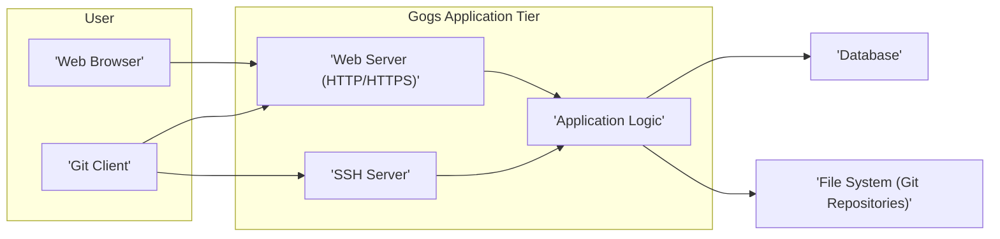

## Project Design Document: Gogs - Go Git Service

**Version:** 1.1
**Date:** October 26, 2023
**Author:** AI Software Architect

### 1. Introduction

This document provides an enhanced architectural design of the Gogs project, a self-hosted Git service written in Go. Building upon the previous version, this document offers more granular details regarding the system's components, their interactions, and the flow of data. This refined design will serve as a robust foundation for subsequent threat modeling activities, enabling a more thorough security analysis.

### 2. Goals and Objectives

The primary goals of Gogs are to provide:

*   A lightweight, efficient, and easily deployable self-hosted Git repository management platform.
*   An intuitive and user-friendly web interface for managing repositories, users, and organizations, enhancing developer productivity.
*   Comprehensive support for standard Git operations via both secure shell (SSH) and Hypertext Transfer Protocol Secure (HTTPS).
*   Robust authentication and fine-grained authorization mechanisms to meticulously control access to repositories and project resources.
*   Integrated collaborative development features, including issue tracking, pull requests, and wiki functionalities, fostering team collaboration.
*   A modular and extensible architecture that supports plugins and integrations, allowing for customization and feature enhancement.

### 3. High-Level Architecture

Gogs adheres to a well-defined three-tier architectural pattern, promoting separation of concerns and maintainability:

*   **Presentation Tier:**  Responsible for the user interface, primarily delivered as a dynamic web application accessed through standard web browsers.
*   **Application Tier:**  The core of the Gogs application, encompassing the business logic, handling user requests, processing data, and orchestrating interactions between other tiers.
*   **Data Tier:**  Provides persistent storage for all application data, including user accounts, repository metadata, and issue tracking information.



### 4. Detailed Component Architecture

The Gogs application tier is composed of several interconnected components, each responsible for specific functionalities:

*   **Web Server:**
    *   Accepts and processes incoming HTTP/HTTPS requests originating from web browsers and Git clients.
    *   Manages TLS/SSL termination, ensuring secure communication over HTTPS.
    *   Routes incoming requests to the appropriate handlers within the application logic based on defined routes.
    *   Typically implemented using Go's built-in `net/http` package or a lightweight, performant web framework.
    *   May handle static asset serving (CSS, JavaScript, images).
*   **Application Logic:**
    *   **Authentication and Authorization Subsystem:**
        *   Manages user account creation, login processes, and session management.
        *   Implements various authentication methods, including local accounts, OAuth 2.0 providers, and potentially others.
        *   Enforces access control policies based on user roles, team memberships, and repository permissions.
        *   Handles API token generation and management for programmatic access.
    *   **Repository Management Subsystem:**
        *   Provides functionalities for creating, deleting, forking, and managing Git repositories.
        *   Manages repository settings, including visibility (public/private), default branches, and webhooks.
        *   Handles repository migrations from other platforms.
    *   **Git Operations Handler Subsystem:**
        *   Processes Git commands received over HTTP(S), such as `git push`, `git pull`, and `git clone`.
        *   Interacts with the underlying Git binaries to execute Git commands securely.
        *   Manages Git LFS (Large File Storage) requests if enabled.
    *   **SSH Handler Subsystem:**
        *   Listens for and manages incoming SSH connections for Git operations.
        *   Authenticates users based on public SSH keys stored in the database.
        *   Authorizes Git commands based on user and repository permissions.
    *   **Issue Tracking Subsystem:**
        *   Enables users to create, assign, label, and track issues within repositories.
        *   Supports comments, mentions, and notifications related to issue updates.
        *   Allows for the creation of milestones and project boards for issue organization.
    *   **Pull Request Management Subsystem:**
        *   Facilitates collaborative code review and merging through pull requests (merge requests).
        *   Manages pull request creation, reviews, approvals, and merging.
        *   Integrates with the issue tracking system.
        *   Supports branch comparisons and conflict resolution.
    *   **Wiki Subsystem:**
        *   Provides a platform for creating and managing project documentation collaboratively.
        *   Stores wiki content in a version-controlled manner, often as Git repositories.
        *   Supports Markdown or other markup languages for content creation.
    *   **API Subsystem:**
        *   Exposes a RESTful API for programmatic access to Gogs functionalities.
        *   Allows integration with external systems, scripts, and tools.
        *   Supports authentication via API tokens.
    *   **Background Job Processor:**
        *   Handles asynchronous tasks that do not need to block user requests.
        *   Examples include sending email notifications, performing repository indexing, and processing webhooks.
*   **Database:**
    *   Provides persistent storage for all application data.
    *   Supports various relational database management systems (RDBMS) such as SQLite, MySQL, PostgreSQL, and potentially others.
    *   Key database tables include:
        *   `users`: Stores user account information (username, email, password hash, etc.).
        *   `organizations`: Stores organization details.
        *   `repositories`: Stores repository metadata (name, description, owner, etc.).
        *   `issues`: Stores issue details, including title, description, status, and assignments.
        *   `pull_requests`: Stores pull request information, including source and target branches, status, and reviewers.
        *   `wiki_pages`: Stores wiki page content and metadata.
        *   `access_tokens`: Stores API access tokens.
        *   `sessions`: Stores user session information.
        *   `public_keys`: Stores user's public SSH keys.
*   **File System (Git Repositories):**
    *   Stores the actual Git repository data, including objects, references (branches, tags), and configuration files.
    *   Typically organized in a hierarchical directory structure, with each repository residing in its own directory.
    *   Directly accessed by the Git binaries invoked by the application logic for Git operations.

### 5. Data Flow

Here are detailed data flow scenarios for common operations:

*   **User Authentication (Web Browser):**
    ```mermaid
    graph LR
        A["'Web Browser'"] --> B["'Web Server'"]
        B --> C["'Authentication Logic'"]
        C --> D["'Database (User Credentials)'"]
        D --> C
        C --> E["'Session Management'"]
        E --> F["'Database (Sessions)'"]
        F --> E
        E --> B
        B --> A
    ```
    *   The user submits login credentials (username/email and password) via the login form in the web browser.
    *   The web server receives the request and forwards it to the authentication logic component.
    *   The authentication logic queries the database to retrieve the stored credentials for the provided username/email.
    *   The database returns the user's stored password hash (or indicates the user doesn't exist).
    *   The authentication logic verifies the provided password against the stored hash.
    *   Upon successful authentication, the session management component creates a new session.
    *   Session data is stored in the database.
    *   A session identifier (e.g., a cookie) is sent back to the web browser.
    *   Subsequent requests from the browser include this session identifier for authentication.

*   **Pushing Code via SSH:**
    ```mermaid
    graph LR
        A["'Git Client'"] --> B["'SSH Server'"]
        B --> C["'Authentication Logic (SSH)'"]
        C --> D["'Database (Public Keys)'"]
        D --> C
        C --> E["'Authorization Logic'"]
        E --> F["'Repository Management'"]
        F --> G["'Git Binaries'"]
        G --> H["'File System (Git Repositories)'"]
    ```
    *   The user initiates a `git push` command from their local Git client.
    *   The Git client establishes an SSH connection to the Gogs SSH server.
    *   The SSH server initiates the authentication process, typically using public key authentication.
    *   The authentication logic retrieves the user's stored public SSH keys from the database.
    *   The SSH server verifies the client's provided key against the stored keys.
    *   Upon successful authentication, the authorization logic checks if the authenticated user has permission to push to the target repository and branch.
    *   The repository management component invokes the Git binaries to handle the `git push` operation.
    *   The Git binaries write the new objects and references to the repository on the file system.

*   **Viewing a Repository's Commit History (Web):**
    ```mermaid
    graph LR
        A["'Web Browser'"] --> B["'Web Server'"]
        B --> C["'Repository View Logic'"]
        C --> D["'Authorization Logic'"]
        D --> E["'Database (Repository Permissions)'"]
        E --> D
        D --> F["'Git Binaries'"]
        F --> G["'File System (Git Repositories)'"]
        G --> F
        F --> C
        C --> B
        B --> A
    ```
    *   The user navigates to the commit history page of a repository in their web browser.
    *   The web server receives the request and routes it to the repository view logic component.
    *   The authorization logic verifies if the currently authenticated user has permission to view the repository.
    *   Repository permissions are typically checked against the database.
    *   If authorized, the repository view logic invokes the Git binaries to retrieve the commit history from the repository on the file system.
    *   The Git binaries read the necessary Git objects and return the commit information.
    *   The repository view logic formats the commit data and sends it back to the web server.
    *   The web server renders the HTML and sends it to the user's browser.

### 6. Deployment Architecture

Gogs offers flexible deployment options to suit various needs and scales:

*   **Single Instance Deployment:** All components (web server, application logic, database, and Git repositories) are deployed on a single physical or virtual server. This is suitable for small teams, personal use, or development environments.
*   **Containerized Deployment (Docker/Kubernetes):** Gogs and its dependencies are packaged into Docker containers, facilitating consistent and reproducible deployments. Orchestration platforms like Kubernetes can manage scaling, failover, and updates. This is a popular choice for production environments.
*   **Clustered Deployment:** For high availability and scalability, multiple instances of the Gogs application can be deployed behind a load balancer, sharing a common database and potentially a distributed file system for Git repositories. This architecture requires more complex configuration and management but provides resilience and handles higher traffic loads.
*   **Platform as a Service (PaaS) Deployment:** Gogs can be deployed on various PaaS providers (e.g., Heroku, AWS Elastic Beanstalk) that abstract away infrastructure management.

### 7. Technologies Used

*   **Core Language:** Go
*   **Web Framework/Router:**  Typically utilizes Go's standard `net/http` library or lightweight routing libraries.
*   **Database Support:** SQLite, MySQL, PostgreSQL, TiDB.
*   **Version Control System:** Git
*   **Templating Engine:** Go's `html/template` package is commonly used for rendering web pages.
*   **SSH Library:** Go's `crypto/ssh` package for handling SSH connections.
*   **Operating System Compatibility:** Cross-platform, supporting Linux, macOS, and Windows.
*   **Potential External Dependencies:**  May include Git binaries, database drivers, and potentially other libraries for specific features.

### 8. Security Considerations (Pre-Threat Modeling)

This section outlines key security areas that will be the focus of subsequent threat modeling activities. Understanding these areas is crucial for identifying potential vulnerabilities and designing appropriate security controls:

*   **Authentication and Authorization Mechanisms:** Ensuring robust and secure methods for verifying user identities and controlling access to resources based on privileges. This includes scrutinizing password storage, session management, and API token handling.
*   **Input Validation and Sanitization:**  Implementing rigorous input validation and sanitization techniques across all data entry points to prevent injection attacks (e.g., SQL injection, command injection, cross-site scripting).
*   **Cross-Site Scripting (XSS) Prevention:** Employing appropriate encoding and escaping mechanisms to prevent the injection of malicious scripts into web pages, protecting user sessions and data.
*   **Cross-Site Request Forgery (CSRF) Protection:** Implementing anti-CSRF tokens to prevent unauthorized actions performed on behalf of authenticated users.
*   **Session Management Security:** Securely managing user sessions, including using secure cookies, setting appropriate timeouts, and implementing mechanisms for session invalidation.
*   **Secure Communication (HTTPS/TLS):** Enforcing the use of HTTPS to encrypt all communication between clients and the server, protecting sensitive data in transit. Proper certificate management is also critical.
*   **SSH Key Management Security:** Securely storing and managing user public SSH keys, preventing unauthorized access to repositories via SSH.
*   **Repository Access Control Granularity:** Ensuring fine-grained control over repository access, allowing administrators to define specific permissions for users and teams.
*   **Rate Limiting and Abuse Prevention:** Implementing rate limiting mechanisms to protect against brute-force attacks, denial-of-service attempts, and other forms of abuse.
*   **Dependency Security:** Regularly auditing and updating third-party libraries and dependencies to address known vulnerabilities.
*   **File System Security:** Properly configuring file system permissions to protect repository data and prevent unauthorized access or modification.
*   **Secret Management:** Securely managing sensitive information such as database credentials, API keys, and other secrets.

This improved design document provides a more detailed and comprehensive understanding of the Gogs project architecture. This enhanced level of detail will be invaluable for conducting a thorough and effective threat modeling exercise, leading to a more secure and resilient platform.
