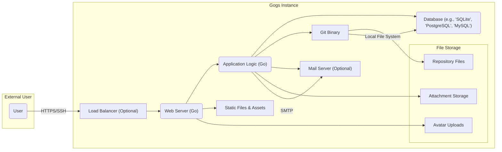
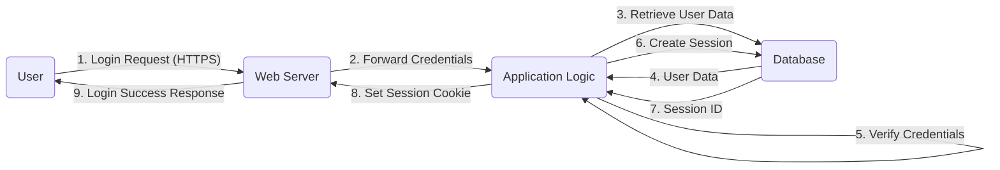
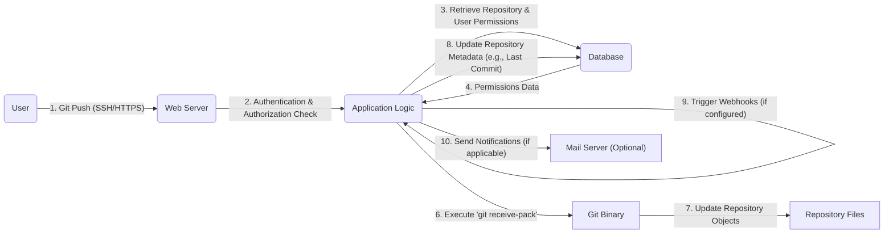

# Project Design Document: Gogs - A Self-Hosted Git Service

**Version:** 1.1
**Date:** October 26, 2023
**Prepared By:** [Your Name/Organization]

## 1. Introduction

This document provides an enhanced architectural design of Gogs, a self-hosted Git service written in Go. This detailed design serves as a crucial foundation for subsequent threat modeling activities, clearly outlining the key components, data flows, and technologies involved in the Gogs system.

## 2. System Overview

Gogs offers a web-based platform for managing Git repositories, designed for simplicity, speed, and ease of self-hosting. It provides essential functionalities for collaborative software development. Key features include:

*   Creation and management of private and public Git repositories.
*   Comprehensive user and organization management with role-based access control.
*   Granular access control and permission settings for repositories and teams.
*   Integrated issue tracking system for bug reporting and task management.
*   Pull request functionality for code review and collaborative merging.
*   Built-in wiki for project documentation.
*   Extensible webhook system for integrating with external services and automating workflows.

## 3. Architectural Diagram

## 4. Component Breakdown

*   **External User:** Represents any individual or automated system interacting with the Gogs instance through the web interface or Git protocols.
*   **Load Balancer (Optional):** Distributes incoming traffic across multiple Gogs web server instances for improved performance and availability.
    *   Functionality:
        *   Distributes user requests to available web servers.
        *   Provides redundancy and fault tolerance.
*   **Web Server (Go):** The primary interface for user interaction, responsible for handling HTTP/HTTPS requests, serving static content, and routing requests to the application logic.
    *   Functionality:
        *   Receives and processes incoming user requests (web and API).
        *   Manages user authentication and session handling.
        *   Serves the web user interface (HTML, CSS, JavaScript).
        *   Provides RESTful API endpoints for programmatic access.
        *   Handles Git protocol requests (HTTP/HTTPS for Git).
*   **Application Logic (Go):** Contains the core business logic of Gogs, orchestrating interactions between other components and implementing the application's features.
    *   Functionality:
        *   Manages Git repository operations (clone, push, pull, etc.), interacting with the Git binary.
        *   Implements user and organization management, including authentication and authorization.
        *   Handles issue tracking, pull request workflows, and wiki functionality.
        *   Manages webhook events and triggers.
        *   Interacts with the database for persistent data storage.
        *   Generates and sends email notifications through the mail server.
*   **Database (e.g., 'SQLite', 'PostgreSQL', 'MySQL'):** Stores persistent data critical to the Gogs instance, including user accounts, repository metadata, issues, pull requests, and session information.
    *   Functionality:
        *   Stores user credentials (hashed passwords) and permissions.
        *   Stores repository metadata (name, description, ownership, access control).
        *   Stores issue and pull request details, comments, and status.
        *   Stores wiki content and revisions.
        *   Stores user session data for maintaining login state.
*   **Git Binary:** The underlying Git command-line executable used by Gogs to perform Git operations on the server's file system.
    *   Functionality:
        *   Executes core Git commands for repository management.
        *   Manages Git objects, commits, branches, and tags.
        *   Handles repository initialization and cloning.
*   **Mail Server (Optional):** Used for sending outbound email notifications triggered by events within Gogs, such as password resets, issue updates, and pull request notifications.
    *   Functionality:
        *   Sends email messages via SMTP.
*   **Static Files & Assets:** Contains the static files required for the Gogs web interface, such as HTML templates, CSS stylesheets, JavaScript files, and images.
    *   Functionality:
        *   Provides the visual presentation and interactive elements of the Gogs application.
*   **File Storage:**  Manages the storage of various files associated with Gogs.
    *   **Repository Files:** Stores the actual Git repository data, including objects and history.
        *   Functionality:
            *   Persistently stores Git repository data.
            *   Organizes repository files and directories.
    *   **Avatar Uploads:** Stores user-uploaded profile pictures.
        *   Functionality:
            *   Stores user avatar images.
            *   Provides access to avatar images for display.
    *   **Attachment Storage:** Stores files attached to issues, pull requests, and other entities.
        *   Functionality:
            *   Stores uploaded file attachments.
            *   Provides access to attached files.

## 5. Data Flow Diagrams

### 5.1. User Authentication (Improved)

### 5.2. Repository Push (Detailed)

## 6. Technology Stack

*   **Core Programming Language:** Go
*   **Web Framework/Router:**  Leverages Go's standard library (`net/http`) or a lightweight routing library like `chi` or `gorilla/mux`.
*   **Database Support (with specific examples):**
    *   SQLite (for simpler setups)
    *   PostgreSQL (recommended for production)
    *   MySQL/MariaDB
    *   TiDB
*   **Version Control System:** Git
*   **Supported Operating Systems:** Cross-platform compatibility (Linux, macOS, Windows)
*   **Frontend Technologies:** HTML, CSS, JavaScript (often utilizing libraries like jQuery or modern JavaScript frameworks).
*   **Communication Protocols:** HTTPS (TLS), SSH
*   **Email Handling:** Standard SMTP protocol.

## 7. Deployment Model

Gogs is designed for straightforward self-hosting. Common deployment strategies include:

*   **Direct Binary Execution:** Downloading the pre-compiled binary and running it directly on the server.
*   **Containerization (Docker):** Deploying Gogs within a Docker container for isolated and reproducible environments. This often involves using a pre-built Gogs Docker image.
*   **Package Management:** Installation via system package managers (e.g., `apt` on Debian/Ubuntu, `yum` on CentOS/RHEL).
*   **Platform as a Service (PaaS):** Deployment on platforms like Heroku or similar services that support Go applications.

Typical deployment environment components:

*   A physical server or virtual machine.
*   The Gogs executable or container image.
*   A configured and accessible database instance.
*   Optionally, a configured SMTP server for email notifications.
*   Reverse proxy (e.g., Nginx, Apache) for handling SSL termination and routing (recommended for production).

## 8. Security Considerations (Detailed)

This section outlines key security considerations relevant for threat modeling.

*   **Authentication and Authorization:**
    *   Secure password hashing algorithms (e.g., bcrypt).
    *   Protection against brute-force attacks (rate limiting on login attempts).
    *   Robust session management with secure cookies (HTTPOnly, Secure flags).
    *   Role-based access control (RBAC) for managing user permissions.
    *   Consideration for multi-factor authentication (MFA) implementation.
*   **Input Validation and Output Encoding:**
    *   Strict validation of all user-supplied input to prevent injection attacks (SQL injection, command injection, etc.).
    *   Proper encoding of output data to prevent Cross-Site Scripting (XSS) vulnerabilities.
*   **Session Management:**
    *   Secure generation and storage of session identifiers.
    *   Session timeout mechanisms to limit the lifespan of active sessions.
    *   Protection against session fixation attacks.
*   **Data Storage Security:**
    *   Encryption of sensitive data at rest (e.g., user credentials in the database).
    *   Secure file permissions for repository data and other stored files.
*   **Communication Security:**
    *   Mandatory use of HTTPS (TLS) for all web traffic.
    *   Enforcement of secure SSH configurations for Git operations.
*   **Git Protocol Security:**
    *   Proper handling of Git protocol requests to prevent unauthorized access or manipulation.
    *   Mitigation of potential vulnerabilities in the Git binary itself (keeping it updated).
*   **Dependency Management:**
    *   Regularly updating dependencies to patch known security vulnerabilities.
    *   Utilizing dependency scanning tools to identify potential risks.
*   **Web Application Security:**
    *   Protection against Cross-Site Request Forgery (CSRF) attacks (e.g., using anti-CSRF tokens).
    *   Implementation of security headers (e.g., Content Security Policy, Strict-Transport-Security).
*   **Rate Limiting:**
    *   Implementing rate limits for API endpoints and critical actions to prevent abuse and denial-of-service attacks.
*   **File Handling Security:**
    *   Secure handling of file uploads to prevent malicious file uploads and path traversal vulnerabilities.
    *   Virus scanning of uploaded files (optional but recommended).
*   **Logging and Auditing:**
    *   Comprehensive logging of security-related events for monitoring and incident response.

## 9. Assumptions and Constraints

*   It is assumed that the Gogs instance will be deployed in an environment where basic network security measures are in place (firewalls, etc.).
*   The security of the underlying operating system and infrastructure is considered the responsibility of the deployment environment.
*   This design focuses primarily on the core Gogs application and does not delve deeply into the security implications of specific external integrations.
*   The choice of database system can impact specific security configurations, but the fundamental security principles remain consistent.

## 10. Future Considerations

*   Integration with external authentication providers (e.g., OAuth 2.0, SAML, LDAP).
*   Enhanced security features like security scanning of repositories for vulnerabilities.
*   Advanced access control lists (ACLs) for finer-grained permissions.
*   Improved logging and auditing capabilities with integration with security information and event management (SIEM) systems.
*   Consideration for implementing Content Security Policy (CSP) and other security headers more strictly.

This improved design document provides a more detailed and comprehensive understanding of the Gogs architecture, specifically tailored for effective threat modeling. The enhanced component descriptions, data flow diagrams, and security considerations offer a solid foundation for identifying and mitigating potential security risks.
