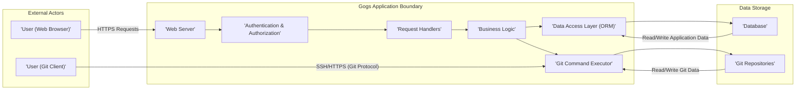

# Project Design Document: Gogs - A Self-Hosted Git Service

**Version:** 1.1
**Date:** October 26, 2023
**Author:** AI Software Architect

## 1. Introduction

This document provides a detailed design overview of Gogs, a lightweight, open-source, self-hosted Git service application developed in Go. The primary purpose of this document is to clearly articulate the system's architecture, components, and data flows to facilitate effective threat modeling.

## 2. Goals and Objectives

Gogs aims to deliver a self-managed Git hosting solution with the following key objectives:

*   Provide core Git repository management functionalities (create, clone, push, pull).
*   Offer a user-friendly web interface for repository browsing and interaction.
*   Enable user and organization management with access control mechanisms.
*   Support issue tracking and pull request workflows for collaborative development.
*   Facilitate integration with external authentication providers.

## 3. High-Level Architecture

Gogs operates as a single, self-contained application. The following diagram illustrates the high-level interactions between key entities:

## 4. Detailed Component Design

This section provides a more granular view of the internal components within the Gogs application.

### 4.1. Web Server

*   **Description:**  An embedded HTTP server, typically leveraging Go's standard `net/http` library.
*   **Responsibilities:**
    *   Accepts and processes incoming HTTP and HTTPS requests.
    *   Routes requests to the appropriate request handlers based on defined routes.
    *   Serves static assets (e.g., CSS, JavaScript, images).
    *   Handles TLS termination for secure connections.

### 4.2. Authentication & Authorization

*   **Description:**  Manages user identity verification and access control.
*   **Responsibilities:**
    *   **Authentication:** Verifies user identities through various methods:
        *   Local user database (username/password).
        *   LDAP (Lightweight Directory Access Protocol).
        *   Active Directory.
        *   OAuth 2.0 (e.g., GitHub, Google).
        *   SAML (Security Assertion Markup Language).
    *   **Authorization:** Enforces access control policies to determine if an authenticated user can perform specific actions on resources (e.g., read a repository, push code).
    *   Manages user sessions and session cookies.

### 4.3. Request Handlers

*   **Description:**  Go functions that process specific HTTP requests based on the URL path and HTTP method.
*   **Responsibilities:**
    *   Receive requests from the web server.
    *   Extract and validate request parameters and headers.
    *   Invoke the necessary business logic components to fulfill the request.
    *   Generate HTTP responses, including rendering HTML templates or returning API data (e.g., JSON).
    *   Handle and report errors.

### 4.4. Business Logic

*   **Description:**  Contains the core application logic and workflows of Gogs.
*   **Responsibilities:**
    *   User account management (creation, modification, deletion, password resets).
    *   Repository management (creation, deletion, forking, mirroring, transfer).
    *   Issue tracking (creation, assignment, status updates, commenting).
    *   Pull request management (creation, review, merging, conflict resolution).
    *   Organization and team management.
    *   Webhook management (configuration and event triggering).
    *   API implementation for programmatic access to Gogs functionalities.

### 4.5. Data Access Layer (ORM)

*   **Description:**  An abstraction layer that facilitates interaction with the underlying database system, typically using an Object-Relational Mapper (ORM) like Xorm.
*   **Responsibilities:**
    *   Provides an interface for querying and manipulating data in the database.
    *   Maps Go objects to database tables.
    *   Handles database connection management and transactions.
    *   Supports multiple database backends (e.g., SQLite, MySQL, PostgreSQL).

### 4.6. Git Command Executor

*   **Description:**  Responsible for executing Git commands on the server's file system.
*   **Responsibilities:**
    *   Interacts with the Git command-line interface.
    *   Manages Git repository creation, cloning, pushing, pulling, and other Git operations.
    *   Handles Git hooks (server-side scripts triggered by Git events).
    *   Ensures proper permissions and security when executing Git commands.

### 4.7. Git Repositories

*   **Description:**  The file system location where Git repository data is stored.
*   **Responsibilities:**
    *   Stores the `.git` directory for each managed repository.
    *   Organizes repositories based on user or organization ownership.
    *   Requires appropriate file system permissions for the Gogs process to read and write repository data.

## 5. Data Flow Examples

This section illustrates the flow of data for common user interactions.

### 5.1. User Authentication via Local Login

1. The user submits their username and password through the login form in the web browser.
2. The web server receives the HTTPS request containing the login credentials.
3. The request is routed to the authentication handler.
4. The authentication handler retrieves the user's stored credentials from the database via the Data Access Layer.
5. The handler compares the submitted password with the stored (hashed) password.
6. Upon successful verification, the authentication handler creates a new session and sets a session cookie in the user's browser.
7. The user is redirected to their dashboard or the originally requested page.

### 5.2. Pushing Code via SSH

1. The user executes a `git push` command from their local machine targeting the Gogs server via SSH.
2. The SSH daemon on the Gogs server authenticates the user (e.g., using SSH keys).
3. Upon successful SSH authentication, the Git command executor receives the push request.
4. The Git command executor verifies the user's permissions to push to the specific repository.
5. The Git command executor executes the necessary Git commands to update the repository on the server's file system.
6. Any configured server-side Git hooks are executed.
7. The Git command executor sends a confirmation response back to the user's Git client.

### 5.3. Viewing a Repository's Pull Requests

1. The user navigates to the pull requests page of a specific repository in their web browser.
2. The web server receives the HTTPS request.
3. The request is routed to the pull request listing handler.
4. The handler retrieves pull request data (including associated commits, comments, and status) from the database via the Data Access Layer.
5. The handler renders the HTML page displaying the list of pull requests.
6. The web server sends the HTML response to the user's browser.

## 6. Security Considerations (Pre-Threat Modeling Analysis)

The following areas are critical from a security perspective and will be the focus of future threat modeling activities:

*   **Authentication and Session Management:**
    *   Strength of password hashing algorithms.
    *   Protection against brute-force and dictionary attacks on login forms.
    *   Security of session identifiers and protection against session hijacking/fixation.
    *   Implementation of multi-factor authentication (MFA).
*   **Authorization and Access Control:**
    *   Granularity and correctness of permission checks for repository access and actions.
    *   Prevention of privilege escalation vulnerabilities.
    *   Secure handling of repository visibility (public vs. private).
*   **Input Validation and Output Encoding:**
    *   Sanitization and validation of user-provided data to prevent injection attacks (e.g., SQL injection, command injection, cross-site scripting (XSS)).
    *   Proper encoding of data displayed in the web interface to mitigate XSS.
*   **Data Storage Security:**
    *   Secure storage of database credentials and access controls.
    *   Protection of Git repository data on the file system through appropriate permissions.
    *   Consideration for encrypting sensitive data at rest (e.g., user passwords, repository content).
*   **Network Security:**
    *   Enforcement of HTTPS for all web traffic to protect data in transit.
    *   Security of SSH access and key management.
    *   Protection against common web application attacks (e.g., CSRF, clickjacking).
*   **Third-Party Integrations:**
    *   Security of OAuth 2.0 flows and access token management.
    *   Verification and security of webhook delivery mechanisms.
*   **Git Protocol Security:**
    *   Mitigation of potential vulnerabilities in the Git protocol itself.
    *   Secure handling of Git LFS (Large File Storage) if used.

## 7. Deployment Considerations

Gogs offers flexible deployment options:

*   **Standalone Binary:** Deploying the pre-compiled binary directly on a server (Linux, macOS, Windows). This is the simplest deployment method.
*   **Docker Container:** Running Gogs within a Docker container for easier management and isolation. Official and community-maintained Docker images are available.
*   **Container Orchestration (Kubernetes, etc.):** Deploying and scaling Gogs within container orchestration platforms for high availability and resilience.
*   **Platform as a Service (PaaS):** Deploying on platforms like Heroku or similar services that support Go applications.

Key deployment configurations include:

*   Database connection settings (type, host, credentials).
*   Application URL and listening port.
*   Authentication method configuration.
*   Path to store Git repositories.
*   TLS certificate configuration for HTTPS.

## 8. Technologies Used

*   **Programming Language:** Go
*   **Web Framework:** Standard Go `net/http` library, often utilizing routing libraries like `chi` or `gorilla/mux`.
*   **Database ORM:**  Primarily Xorm (a simple and powerful ORM for Go).
*   **Database Support:** SQLite, MySQL, PostgreSQL, TiDB.
*   **Version Control System:** Git
*   **Templating Engine:** Go's built-in `html/template` package.
*   **SSH Server:** Utilizes the system's SSH daemon or can potentially embed an SSH server library.
*   **Operating Systems:** Cross-platform, primarily targeting Linux, macOS, and Windows.

This revised design document provides a more detailed and structured overview of the Gogs project, specifically tailored for use in subsequent threat modeling activities. The enhanced descriptions and data flow examples aim to provide a clearer understanding of the system's inner workings and potential attack surfaces.