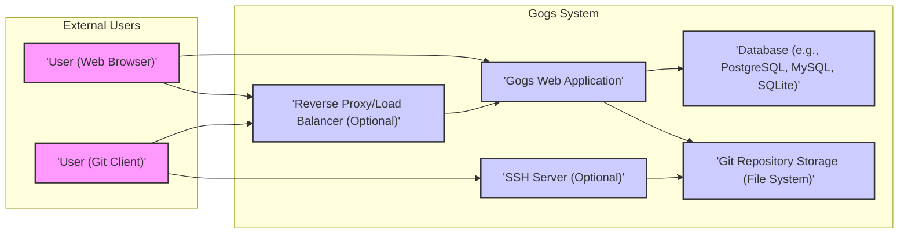
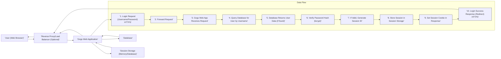
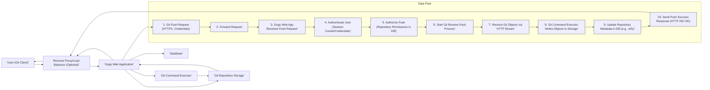
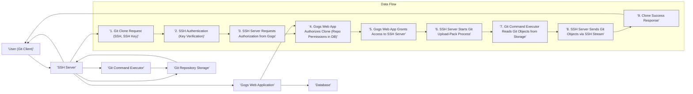

# Project Design Document: Gogs - Self-Hosted Git Service

## 1. Introduction

This document provides a detailed design overview of Gogs (Go Git Service), a self-hosted Git service written in Go. It serves as a foundation for threat modeling, offering a clear understanding of the system's architecture, components, data flow, and user interactions. The aim is to facilitate the identification of potential vulnerabilities and security risks by outlining the key elements of Gogs.

Gogs is designed to be a lightweight, stable, and extensible self-hosted Git service, emphasizing ease of deployment and management. It provides features comparable to hosted Git platforms like GitHub and GitLab, while granting users control and privacy through self-hosting.

This document covers the following aspects:

*   System Overview and Architecture
*   Component Descriptions (Detailed)
*   Data Flow (Granular Flows for Key Operations)
*   User Roles and Permissions (Fine-grained Permissions)
*   Technology Stack (Specific Libraries and Versions)
*   Security Considerations (Detailed Threat Landscape)

## 2. System Overview and Architecture

Gogs is architected as a monolithic web application with a layered design. It centers around a web application that manages user requests, interacts with a database for persistent data, and handles Git repositories on the file system. Optionally, it integrates with an SSH server for Git operations via SSH.

The following diagram illustrates the high-level architecture of Gogs:

**Description of Components:**

*   **'User (Web Browser)':** Represents users accessing Gogs via a web browser. They interact with the web interface for repository management, issue tracking, pull requests, wikis, and administrative tasks.
*   **'User (Git Client)':** Represents users utilizing Git command-line tools or Git-enabled applications to interact with Gogs. This includes operations like cloning, pushing, pulling, and other Git commands.
*   **'Reverse Proxy/Load Balancer (Optional)':** An optional component, typically used in production environments. It enhances performance, scalability, and security by handling SSL termination, load balancing across multiple Gogs instances, and potentially providing WAF and rate limiting capabilities. Examples include Nginx, Apache, and HAProxy.
*   **'Gogs Web Application':** The core of the Gogs system. It's responsible for:
    *   User authentication and authorization.
    *   Serving the web UI and API.
    *   Managing Git repositories (creation, deletion, access control, forking, mirroring).
    *   Implementing core features: issue tracking, pull requests, wikis, projects, milestones, labels, webhooks.
    *   Interacting with the database for persistent storage of application data.
    *   Interacting with the file system for Git repository storage and management.
    *   Handling Git operations over HTTP/HTTPS using the Git Smart HTTP protocol.
    *   Managing background tasks (e.g., repository indexing, email notifications, garbage collection).
*   **'Database (e.g., PostgreSQL, MySQL, SQLite)':**  A relational database used for persistent storage of Gogs application data. Supported databases include PostgreSQL (recommended for production), MySQL/MariaDB, and SQLite (suitable for smaller setups or testing). It stores:
    *   User accounts, credentials (hashed passwords), and profiles.
    *   Organizations, teams, and membership information.
    *   Repository metadata (names, descriptions, permissions, settings).
    *   Issue tracking data (issues, comments, labels, milestones, assignees, statuses, attachments).
    *   Pull request data (pull requests, reviews, comments, merge status, diffs).
    *   Wiki content (pages, revisions).
    *   Project data (projects, tasks, boards).
    *   Configuration settings for the Gogs instance.
    *   Session data for user sessions.
*   **'Git Repository Storage (File System)':**  The file system location where Git repositories are physically stored. Gogs manages the structure and access to these repositories. It directly interacts with the file system to perform Git operations and manage repository data. Security of this storage is critical.
*   **'SSH Server (Optional)':**  An SSH server (typically the system's SSH daemon like OpenSSH) that Gogs can integrate with to enable Git operations over SSH. This provides an alternative to HTTPS for Git access, often preferred for security and automation. Gogs manages SSH keys for user authentication and authorization for Git operations over SSH, delegating authentication to the SSH server.

## 3. Component Description (Detailed)

This section provides a more in-depth look at each key component of the Gogs system.

### 3.1. 'Gogs Web Application'

*   **Functionality:** The central application server handling all user interactions, business logic, and data management within Gogs.
*   **Technology:** Primarily written in Go, leveraging Go's standard library and various third-party libraries for web serving, database interaction, Git operations, and other functionalities.
*   **Key Responsibilities:**
    *   **Web UI & API Serving:** Serves the web interface (HTML, CSS, JavaScript) and RESTful API endpoints for programmatic access.
    *   **Authentication & Authorization:** Manages user authentication (local, LDAP, OAuth, SAML, etc.) and authorization using role-based access control (RBAC). Handles session management and API token generation.
    *   **Repository Management:** Manages the lifecycle of Git repositories: creation, deletion, forking, mirroring, archiving, and configuration (hooks, deploy keys, protected branches).
    *   **Feature Implementation:** Implements core Gogs features:
        *   **Issue Tracking:** Creation, assignment, labels, milestones, comments, notifications, search.
        *   **Pull Requests:** Creation, code review, merging, conflict resolution, status checks, notifications.
        *   **Wiki:** Creation, editing, versioning of wiki pages.
        *   **Projects & Milestones:** Project management features for organizing work.
        *   **Webhooks:** Event-driven HTTP callbacks for integrations with external systems.
        *   **Code Search:** Indexing and searching repository code content.
        *   **User & Organization Management:** User registration, profile management, organization and team management.
    *   **Git Operations (HTTP/HTTPS):** Implements the Git Smart HTTP protocol, handling `git clone`, `git push`, `git pull`, and other Git operations over HTTP/HTTPS. This involves Git command execution and data streaming.
    *   **Background Task Management:** Manages asynchronous tasks such as:
        *   Repository indexing for search.
        *   Sending email notifications (e.g., for issue updates, pull requests).
        *   Garbage collection and repository maintenance.
        *   Mirror synchronization.
    *   **Configuration Management:** Reads and manages Gogs configuration settings from files and the database.
*   **Interfaces:**
    *   **'Web Browser (HTTP/HTTPS)':** User interface for web-based interaction.
    *   **'Git Client (HTTP/HTTPS)':** Git Smart HTTP protocol for Git operations.
    *   **'Database':** Interacts with the database for data persistence using database drivers.
    *   **'File System':** Accesses the file system for Git repository storage and management, using OS system calls.
    *   **'SSH Server (Optional)':**  Communicates with the SSH server for Git operations over SSH (key management, authorization delegation).
    *   **'Email Server (SMTP)':** Sends email notifications.
    *   **'LDAP/OAuth/SAML Providers (Optional)':** Integrates with external authentication providers.

### 3.2. 'Database'

*   **Functionality:** Provides reliable and persistent storage for all Gogs application data. Ensures data integrity and availability.
*   **Technology:** Supports multiple relational database systems, offering flexibility in deployment.
    *   **PostgreSQL:** Recommended for production due to its robustness, advanced features, and performance.
    *   **MySQL/MariaDB:** Widely used and mature database systems, suitable for many Gogs deployments.
    *   **SQLite:** File-based database, ideal for small installations, testing, or single-user setups. Not recommended for large-scale or production environments due to concurrency limitations.
    *   **TiDB:** A distributed SQL database, suitable for very large scale deployments.
*   **Data Stored (Detailed):**
    *   **'User Data':** User accounts (usernames, email addresses), hashed passwords (using bcrypt or similar), user profiles (names, avatars, localization settings), SSH keys, GPG keys, API tokens, session data.
    *   **'Organization Data':** Organization details (names, descriptions, settings), organization members, teams, team permissions, organization-level settings.
    *   **'Repository Metadata':** Repository names, descriptions, visibility (public/private), access permissions (users, teams), repository settings (issues, pull requests, wiki enabled), hooks, deploy keys, protected branches, mirroring configurations.
    *   **'Issue Tracking Data':** Issues (titles, descriptions, statuses, priorities, assignees, milestones, labels), issue comments, issue attachments, issue events (history).
    *   **'Pull Request Data':** Pull requests (titles, descriptions, source/target branches, statuses), pull request reviews, pull request comments, pull request diffs (stored or generated on demand), merge status, merge commits.
    *   **'Wiki Data':** Wiki pages (titles, content, formats), wiki page revisions, wiki history.
    *   **'Project Data':** Projects (names, descriptions), project tasks, project boards, project milestones.
    *   **'Configuration Data':** Gogs application settings (system-wide and instance-specific configurations), authentication settings, email settings, Git settings, UI settings, security settings.
    *   **'Session Data':** User session information (session IDs, user IDs, expiry timestamps) for maintaining logged-in states.
    *   **'Webhooks Data':** Webhook configurations, webhook delivery logs.
*   **Interfaces:**
    *   **'Gogs Web Application':**  The primary interface for all database operations (queries, inserts, updates, deletes). Uses database connection pooling for performance.

### 3.3. 'Git Repository Storage (File System)'

*   **Functionality:** Provides persistent storage for Git repository data on the server's file system. Ensures data integrity and efficient access for Git operations.
*   **Technology:** Standard file system (e.g., ext4, XFS) on the server's operating system. Gogs relies on the OS file system for storage management. Performance and security of the file system are crucial.
*   **Data Stored (Git Repository Structure):**
    *   **'.git' directories:** Each repository is typically stored as a directory containing the `.git` subdirectory. This `.git` directory holds all Git objects (commits, trees, blobs), references (branches, tags), configuration files (`config`, `HEAD`), and other Git internal data.
    *   **Repository Working Trees (Optional, less common in Gogs core):** While Gogs primarily interacts with the `.git` directory, in some scenarios (e.g., for certain hooks or operations), it might temporarily interact with a working tree. However, direct management of working trees is generally minimized for security and performance reasons.
    *   **Repository Bare Repositories (Typically):** Gogs usually manages bare repositories (repositories without a working directory) for efficiency and security in a server environment.
*   **Access Control & Security:**
    *   **File System Permissions:** File system permissions are critical for securing repository access. Gogs relies on the OS file system permissions to restrict direct access to repository files. Proper configuration of user and group ownership and permissions is essential.
    *   **Gogs Access Control Layer:** Gogs enforces access control at the application level, verifying user permissions before allowing Git operations. This complements file system security.
    *   **Repository Isolation:** Gogs should ensure proper isolation between repositories on the file system to prevent unauthorized access or interference between different repositories.
*   **Interfaces:**
    *   **'Gogs Web Application':**  Directly accesses the file system to perform Git operations (read/write Git objects, manage repository files), using OS system calls.
    *   **'SSH Server (Optional)':**  When using SSH for Git access, the SSH server (or Gogs's SSH command handler) interacts with the file system to access repository data on behalf of authenticated users, again using OS system calls.

### 3.4. 'SSH Server (Optional)'

*   **Functionality:** Enables Git access over SSH, providing a secure and often preferred alternative to HTTPS for Git operations. Handles SSH authentication and delegates authorization to Gogs.
*   **Technology:** Typically the system's SSH daemon (e.g., OpenSSH, Dropbear). Gogs integrates with the existing SSH server configuration.
*   **Key Responsibilities (in Gogs context):**
    *   **SSH Key Management (Gogs Side):** Gogs manages user SSH public keys, storing them in the database and associating them with user accounts. Users upload their public keys through the Gogs web interface.
    *   **Authentication Delegation:** Gogs configures the SSH server (e.g., via `authorized_keys` mechanism or PAM) to delegate authentication to Gogs. When a user attempts to connect via SSH, the SSH server verifies the provided SSH key against the keys managed by Gogs.
    *   **Authorization Enforcement (Gogs Side):** After successful SSH authentication, Gogs is responsible for authorizing Git operations. When a Git command is received over SSH, Gogs checks user permissions and repository access control rules in the database to determine if the operation is allowed.
    *   **Git Command Execution (Gogs Side):** Gogs provides a Git command handler that is invoked by the SSH server upon successful authentication and authorization. This handler processes Git commands like `git clone`, `git push`, `git pull`, and interacts with the Git Repository Storage to perform the requested operations.
*   **Interfaces:**
    *   **'Git Client (SSH)':**  Users interact with the SSH server using Git clients for Git operations over SSH.
    *   **'Gogs Web Application':**  Gogs interacts with the SSH server configuration (e.g., by updating `authorized_keys` files or using PAM) to manage authorized keys and delegate authentication. Gogs also receives authorization requests from the SSH server for Git operations.
    *   **'File System':** The SSH server (or Gogs's SSH command handler) accesses the Git repository storage on the file system to perform Git operations, using OS system calls.

### 3.5. 'Reverse Proxy/Load Balancer (Optional)'

*   **Functionality:** Enhances performance, scalability, security, and manageability of Gogs deployments, especially in production environments.
*   **Technology:** Common reverse proxies and load balancers like Nginx, Apache HTTP Server (with `mod_proxy`), HAProxy, Traefik, or cloud-based load balancers (e.g., AWS ELB, Google Cloud Load Balancing, Azure Load Balancer).
*   **Key Responsibilities (in Gogs context):**
    *   **SSL/TLS Termination:** Handles SSL/TLS encryption and decryption, offloading this CPU-intensive task from the Gogs web application instances. Improves performance and simplifies certificate management.
    *   **Load Balancing:** Distributes incoming traffic across multiple Gogs web application instances. Improves performance, scalability, and high availability. Load balancing algorithms can be round-robin, least connections, etc.
    *   **Reverse Proxying:** Acts as an intermediary, forwarding requests to Gogs web application instances. Hides the internal architecture, provides URL rewriting capabilities, and can simplify routing.
    *   **Web Application Firewall (WAF):** Can integrate with or provide WAF functionality to protect against common web attacks (e.g., SQL injection, XSS, CSRF, OWASP Top 10). WAFs analyze HTTP requests and responses and block malicious traffic.
    *   **Rate Limiting & DDoS Protection:** Limits the number of requests from a single IP address or user within a given time frame. Protects against abuse, brute-force attacks, and denial-of-service attacks.
    *   **Caching (Optional):** Can cache static content (CSS, JavaScript, images) to reduce load on Gogs web application instances and improve response times.
    *   **Compression (Optional):** Can compress HTTP responses (e.g., using gzip or Brotli) to reduce bandwidth usage and improve page load times.
*   **Interfaces:**
    *   **'User (Web Browser/Git Client)':**  Receives all incoming requests from users (web browsers and Git clients).
    *   **'Gogs Web Application':** Forwards requests to one or more Gogs web application instances based on load balancing configuration.

## 4. Data Flow (Granular Flows)

This section provides more granular data flow diagrams for key operations within Gogs.

### 4.1. User Authentication (Web Login - Detailed)

**Data Flow Description (Detailed):**

1.  **'1. Login Request (Username/Password) HTTPS':** User submits login credentials (username and password) via HTTPS in the web browser.
2.  **'2. Forward Request':** The request is forwarded by the optional Reverse Proxy/Load Balancer to a Gogs Web Application instance.
3.  **'3. Gogs Web App Receives Request':** A Gogs Web Application instance receives the login request.
4.  **'4. Query Database for User by Username':** Gogs queries the database to find the user record based on the provided username.
5.  **'5. Database Returns User Data (if found)':** The database returns the user data (including the hashed password) if a user with the given username is found. If not found, authentication fails.
6.  **'6. Verify Password Hash (bcrypt)':** Gogs uses a secure password hashing algorithm (e.g., bcrypt) to compare the hashed password from the database with the hash of the provided password.
7.  **'7. If Valid, Generate Session ID':** If the password verification is successful, Gogs generates a unique session ID.
8.  **'8. Store Session in Session Storage':** Gogs stores the session data (session ID, user ID, expiry time) in session storage. Session storage can be in-memory (for single-instance setups) or in a persistent store like the database or Redis (for multi-instance setups).
9.  **'9. Set Session Cookie in Response':** Gogs sets a session cookie in the HTTP response to the user's browser. This cookie contains the session ID and is used to identify the user in subsequent requests.
10. **'10. Login Success Response (Redirect) HTTPS':** Gogs sends a login success response, typically a redirect to the user's dashboard or the originally requested page, over HTTPS.

### 4.2. Git Push (HTTPS - Detailed)

**Data Flow Description (Detailed):**

1.  **'1. Git Push Request (HTTPS, Credentials)':** User initiates `git push` from their Git client over HTTPS, including authentication credentials (e.g., username/password or personal access token in HTTP headers).
2.  **'2. Forward Request':** The request is forwarded by the optional Reverse Proxy/Load Balancer to a Gogs Web Application instance.
3.  **'3. Gogs Web App Receives Push Request':** A Gogs Web Application instance receives the Git push request.
4.  **'4. Authenticate User (Session Cookie/Credentials)':** Gogs authenticates the user using session cookies (if a web session exists) or the provided credentials in the HTTP request headers (e.g., Basic Auth with username/password or token).
5.  **'5. Authorize Push (Repository Permissions in DB)':** Gogs checks the database to verify if the authenticated user has push permissions to the target repository and branch. This involves checking repository access control lists (ACLs) and branch protection rules.
6.  **'6. Start Git Receive-Pack Process':** If authorized, Gogs starts a `git receive-pack` process on the server. This process is responsible for receiving Git objects from the client.
7.  **'7. Receive Git Objects via HTTP Stream':** The Git client streams Git objects (commits, trees, blobs) to the `git receive-pack` process via the HTTP connection.
8.  **'8. Git Command Executor Writes Objects to Storage':** The `git receive-pack` process, acting as a Git command executor, writes the received Git objects to the Git Repository Storage (file system) for the target repository.
9.  **'9. Update Repository Metadata in DB (e.g., refs)':** Gogs updates repository metadata in the database, such as updating branch pointers (refs) to point to the newly pushed commits. This ensures consistency between the Git repository and Gogs's metadata.
10. **'10. Send Push Success Response (HTTP 200 OK)':** Gogs sends an HTTP 200 OK success response back to the Git client, indicating that the push operation was successful.

### 4.3. Git Clone (SSH - Detailed)

**Data Flow Description (Detailed):**

1.  **'1. Git Clone Request (SSH, SSH Key)':** User initiates `git clone` from their Git client over SSH, using an SSH key for authentication.
2.  **'2. SSH Authentication (Key Verification)':** The SSH Server authenticates the user by verifying the provided SSH key against the authorized keys configured for Gogs users (typically managed via `authorized_keys` or PAM integration with Gogs).
3.  **'3. SSH Server Requests Authorization from Gogs':** After successful SSH key authentication, the SSH server (or a Gogs-specific SSH command handler) requests authorization from the Gogs Web Application to proceed with the Git operation. This is often done by invoking a Gogs binary or API endpoint.
4.  **'4. Gogs Web App Authorizes Clone (Repo Permissions in DB)':** The Gogs Web Application receives the authorization request and checks the database to verify if the authenticated user has clone/read permissions for the requested repository. This involves checking repository ACLs.
5.  **'5. Gogs Web App Grants Access to SSH Server':** If authorized, Gogs signals to the SSH server (or the Gogs SSH command handler) that the clone operation is permitted.
6.  **'6. SSH Server Starts Git Upload-Pack Process':** The SSH server starts a `git upload-pack` process on the server. This process is responsible for serving Git objects to the client.
7.  **'7. Git Command Executor Reads Git Objects from Storage':** The `git upload-pack` process, acting as a Git command executor, reads the necessary Git objects from the Git Repository Storage (file system) for the target repository.
8.  **'8. SSH Server Sends Git Objects via SSH Stream':** The SSH server streams the Git objects back to the Git client over the SSH connection.
9.  **'9. Clone Success Response':** The Git client receives the Git objects and completes the clone operation, displaying a success message.

## 5. User Roles and Permissions (Fine-grained)

Gogs implements a flexible and fine-grained role-based access control (RBAC) system.  Permissions are managed at system, organization, and repository levels.

| Role                      | Scope        | Description