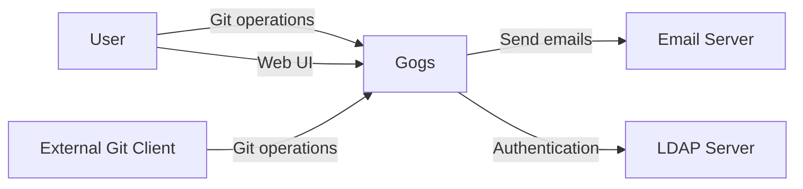
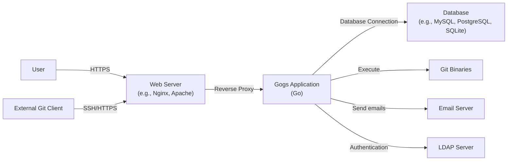
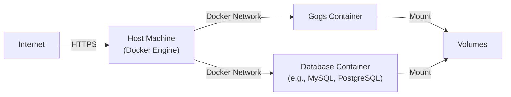
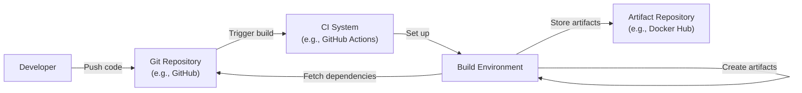

# BUSINESS POSTURE

Gogs is a self-hosted Git service, similar to GitHub, GitLab, or Bitbucket. It aims to provide an easy, stable, and extensible way for individuals or organizations to host their own Git repositories.

Business Priorities:

*   Provide a reliable and stable self-hosted Git service.
*   Ensure ease of installation and maintenance.
*   Offer an extensible platform for customization.
*   Enable users to manage their repositories, users, and organizations.
*   Provide a lightweight alternative to heavier Git hosting solutions.

Business Goals:

*   Attract users looking for a simple, self-hosted Git solution.
*   Maintain a vibrant open-source community.
*   Provide a viable alternative to commercial Git hosting platforms.

Most Important Business Risks:

*   Data breaches leading to unauthorized access to source code.
*   Service unavailability disrupting development workflows.
*   Data loss due to hardware failure, software bugs, or malicious attacks.
*   Vulnerabilities in the software allowing attackers to compromise the server.
*   Inability to scale to meet the demands of growing organizations.
*   Lack of features compared to commercial alternatives, hindering adoption.

# SECURITY POSTURE

Existing Security Controls:

*   security control: User authentication via built-in forms, LDAP, or other providers. (Implemented in Gogs application logic).
*   security control: Basic access control features to manage repository permissions. (Implemented in Gogs application logic).
*   security control: SSH key management for secure Git operations. (Implemented in Gogs application logic and SSH server configuration).
*   security control: Webhooks for integration with external systems. (Implemented in Gogs application logic).
*   security control: Two-factor authentication (2FA) support. (Implemented in Gogs application logic).
*   security control: Reverse proxy support for SSL/TLS termination. (Described in Gogs documentation, implemented externally).

Accepted Risks:

*   accepted risk: Limited auditing capabilities compared to enterprise-grade solutions.
*   accepted risk: Reliance on community support for security updates and vulnerability patching.
*   accepted risk: Potential for misconfiguration by users leading to security vulnerabilities.
*   accepted risk: Limited built-in protection against DDoS attacks.

Recommended Security Controls:

*   Implement comprehensive audit logging to track user actions and system events.
*   Integrate with intrusion detection/prevention systems (IDS/IPS).
*   Provide regular security training and documentation for users.
*   Implement rate limiting to mitigate brute-force attacks and DDoS attempts.
*   Conduct regular security assessments and penetration testing.
*   Implement Content Security Policy (CSP) to mitigate XSS attacks.
*   Implement Subresource Integrity (SRI) to ensure that fetched resources haven't been tampered with.

Security Requirements:

*   Authentication:
    *   Support strong password policies.
    *   Enforce two-factor authentication (2FA) for all users, or at least for administrative accounts.
    *   Provide options for integrating with external identity providers (e.g., SAML, OAuth).
    *   Implement account lockout mechanisms to prevent brute-force attacks.
*   Authorization:
    *   Implement granular access control at the repository, branch, and potentially file level.
    *   Support role-based access control (RBAC) with predefined roles (e.g., admin, contributor, reader).
    *   Allow administrators to define custom roles and permissions.
*   Input Validation:
    *   Sanitize all user inputs to prevent cross-site scripting (XSS) vulnerabilities.
    *   Validate all data received from external sources (e.g., webhooks).
    *   Implement appropriate escaping and encoding to prevent injection attacks.
*   Cryptography:
    *   Use strong, industry-standard cryptographic algorithms for storing passwords (e.g., bcrypt, scrypt).
    *   Enforce HTTPS for all communication between clients and the server.
    *   Use secure protocols for Git operations (e.g., SSH with strong key exchange algorithms).
    *   Provide options for encrypting data at rest (e.g., repository encryption).

# DESIGN

## C4 CONTEXT

Element Descriptions:

*   Element:
    *   Name: User
    *   Type: Person
    *   Description: A developer or user interacting with the Gogs instance.
    *   Responsibilities: Accessing the web UI, performing Git operations (push, pull, clone), managing repositories, users, and organizations.
    *   Security controls: Authentication (username/password, 2FA, LDAP), authorization (repository permissions).

*   Element:
    *   Name: Gogs
    *   Type: Software System
    *   Description: The Gogs self-hosted Git service.
    *   Responsibilities: Hosting Git repositories, managing users and organizations, providing a web interface, handling Git operations.
    *   Security controls: User authentication, access control, SSH key management, webhooks, 2FA support, reverse proxy support.

*   Element:
    *   Name: Email Server
    *   Type: Software System
    *   Description: An external email server used for sending notifications.
    *   Responsibilities: Sending emails triggered by Gogs events (e.g., new user registration, password reset).
    *   Security controls: Secure connection to the email server (e.g., TLS), authentication with the email server.

*   Element:
    *   Name: External Git Client
    *   Type: Software System
    *   Description: Any Git client used to interact with Gogs.
    *   Responsibilities: Performing Git operations (push, pull, clone).
    *   Security controls: SSH key authentication or HTTPS with username/password.

*   Element:
    *   Name: LDAP Server
    *   Type: Software System
    *   Description: An external LDAP server for user authentication.
    *   Responsibilities: Authenticating users against the LDAP directory.
    *   Security controls: Secure connection to the LDAP server (e.g., LDAPS), proper configuration of LDAP integration in Gogs.

## C4 CONTAINER

Element Descriptions:

*   Element:
    *   Name: User
    *   Type: Person
    *   Description: A developer or user interacting with the Gogs instance.
    *   Responsibilities: Accessing the web UI, performing Git operations.
    *   Security controls: Authentication (username/password, 2FA, LDAP), authorization (repository permissions).

*   Element:
    *   Name: External Git Client
    *   Type: Software System
    *   Description: Any Git client used to interact with Gogs.
    *   Responsibilities: Performing Git operations (push, pull, clone).
    *   Security controls: SSH key authentication or HTTPS with username/password.

*   Element:
    *   Name: Web Server
    *   Type: Software System
    *   Description: A web server (e.g., Nginx, Apache) acting as a reverse proxy.
    *   Responsibilities: Handling incoming HTTP/HTTPS requests, terminating SSL/TLS, forwarding requests to the Gogs application.
    *   Security controls: SSL/TLS configuration, request filtering, rate limiting, DDoS protection.

*   Element:
    *   Name: Gogs Application
    *   Type: Software System
    *   Description: The core Gogs application written in Go.
    *   Responsibilities: Handling user authentication, authorization, repository management, web UI rendering, Git operation processing.
    *   Security controls: User authentication, access control, SSH key management, webhooks, 2FA support, input validation, output encoding.

*   Element:
    *   Name: Database
    *   Type: Software System
    *   Description: A database (e.g., MySQL, PostgreSQL, SQLite) storing Gogs data.
    *   Responsibilities: Storing user information, repository metadata, organization details, settings.
    *   Security controls: Database user authentication, access control, encryption at rest (optional), regular backups.

*   Element:
    *   Name: Git Binaries
    *   Type: Software System
    *   Description: The Git command-line tools.
    *   Responsibilities: Executing Git commands for repository management.
    *   Security controls: Secure execution of Git commands, proper handling of file permissions.

*   Element:
    *   Name: Email Server
    *   Type: Software System
    *   Description: An external email server.
    *   Responsibilities: Sending emails.
    *   Security controls: Secure connection, authentication.

*   Element:
    *   Name: LDAP Server
    *   Type: Software System
    *   Description: An external LDAP server.
    *   Responsibilities: Authenticating users.
    *   Security controls: Secure connection, proper configuration.

## DEPLOYMENT

Possible Deployment Solutions:

1.  Bare Metal/Virtual Machine: Gogs can be deployed directly on a physical or virtual server.
2.  Docker Container: Gogs provides official Docker images for easy deployment.
3.  Kubernetes: Gogs can be deployed to a Kubernetes cluster using Helm charts or custom manifests.
4.  Cloud Provider-Specific Services (e.g., AWS EC2, Azure VMs, Google Compute Engine): Gogs can be deployed on virtual machines provided by cloud providers.

Chosen Solution (Docker Container):

Element Descriptions:

*   Element:
    *   Name: Internet
    *   Type: Network
    *   Description: The public internet.
    *   Responsibilities: Providing access to the Gogs instance.
    *   Security controls: Firewall, intrusion detection/prevention systems.

*   Element:
    *   Name: Host Machine
    *   Type: Server
    *   Description: The physical or virtual server running Docker Engine.
    *   Responsibilities: Hosting the Docker containers.
    *   Security controls: Operating system hardening, firewall, regular security updates.

*   Element:
    *   Name: Gogs Container
    *   Type: Container
    *   Description: The Docker container running the Gogs application.
    *   Responsibilities: Running the Gogs application.
    *   Security controls: Container isolation, minimal base image, regular image updates.

*   Element:
    *   Name: Database Container
    *   Type: Container
    *   Description: The Docker container running the database (e.g., MySQL, PostgreSQL).
    *   Responsibilities: Running the database server.
    *   Security controls: Container isolation, minimal base image, regular image updates, database user authentication, access control.

*   Element:
    *   Name: Volumes
    *   Type: Storage
    *   Description: Docker volumes used for persistent data storage.
    *   Responsibilities: Storing Gogs data (repositories, database files) persistently.
    *   Security controls: Proper file permissions, encryption at rest (optional).

## BUILD

The Gogs build process typically involves the following steps:

1.  Developer: A developer writes code and pushes changes to a Git repository (e.g., the official Gogs repository on GitHub).
2.  Continuous Integration (CI) System: A CI system (e.g., GitHub Actions, Travis CI, Jenkins) detects the changes and triggers a build.
3.  Build Environment: The CI system sets up a build environment (e.g., a Docker container) with the necessary tools (Go compiler, Git).
4.  Dependency Management: The build process fetches project dependencies (Go modules).
5.  Compilation: The Go compiler compiles the source code into an executable binary.
6.  Testing: Automated tests (unit tests, integration tests) are executed.
7.  Static Analysis: Static analysis tools (e.g., linters, security scanners) are run to identify potential code quality and security issues. Example: `gosec`.
8.  Artifact Creation: The build process creates build artifacts (e.g., the Gogs executable, Docker images).
9.  Artifact Storage: The build artifacts are stored in a repository (e.g., Docker Hub, a private registry).

Security Controls in Build Process:

*   Supply Chain Security: Use dependency management tools to track and verify dependencies. Scan dependencies for known vulnerabilities.
*   Build Automation: Use a CI system to automate the build process, ensuring consistency and repeatability.
*   Security Checks: Integrate static analysis tools (SAST) and linters into the build process to identify potential security vulnerabilities and code quality issues.
*   Least Privilege: Run the build process with minimal privileges.
*   Reproducible Builds: Ensure that the build process is reproducible, producing the same artifacts from the same source code.

# RISK ASSESSMENT

Critical Business Processes:

*   Source code management and version control.
*   Collaboration among developers.
*   Continuous integration and continuous delivery (CI/CD) pipelines (if integrated with Gogs).

Data to Protect:

*   Source code (High sensitivity): This is the core intellectual property of many organizations.
*   User credentials (High sensitivity): Usernames, passwords, SSH keys, API tokens.
*   Repository metadata (Medium sensitivity): Information about repositories, branches, commits.
*   Organization and team data (Medium sensitivity): Information about organizations, teams, and user memberships.
*   Configuration data (Medium sensitivity): Gogs configuration settings.
*   Audit logs (Medium sensitivity): Records of user actions and system events.

# QUESTIONS & ASSUMPTIONS

Questions:

*   What is the expected number of users and repositories? This will impact scalability requirements.
*   What are the specific compliance requirements (if any)? (e.g., GDPR, HIPAA).
*   What are the existing infrastructure and security policies of the organization?
*   What is the level of expertise of the team managing the Gogs instance?
*   Are there any specific integration requirements with other systems?
*   What is the backup and disaster recovery plan?

Assumptions:

*   BUSINESS POSTURE: The organization has a need for a self-hosted Git solution and is willing to accept the responsibilities of managing their own infrastructure.
*   SECURITY POSTURE: The organization has a basic understanding of security best practices and is willing to implement necessary security controls.
*   DESIGN: The Gogs instance will be deployed using Docker containers, with a separate container for the database. A reverse proxy will be used for SSL/TLS termination. The build process will be automated using a CI system.