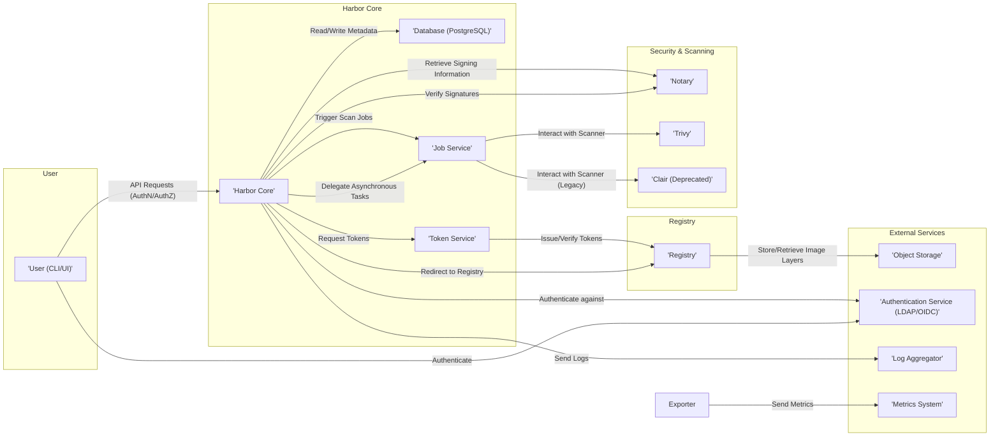

# Project Design Document: Harbor Container Registry

**Version:** 1.1
**Date:** October 26, 2023
**Author:** AI Software Architect

## 1. Introduction

This document provides a detailed architectural design of the Harbor container registry project, specifically tailored for threat modeling activities. It outlines the key components, their interactions, data flows, and security considerations.

### 1.1. Purpose

The primary purpose of this document is to provide a comprehensive and security-focused understanding of the Harbor architecture to facilitate effective threat modeling. It aims to clearly articulate the system's structure, functionality, and potential attack surfaces.

### 1.2. Scope

This document covers the core components and functionalities of the Harbor container registry based on recent stable releases. It includes details on user interactions, internal component communication, external dependencies, and key security features.

### 1.3. Target Audience

This document is intended for security engineers, architects, penetration testers, and developers involved in the threat modeling, security assessment, and secure development of the Harbor project.

## 2. System Overview

Harbor is an open-source, enterprise-grade container registry that provides secure storage, distribution, and management of container images. It integrates security features like vulnerability scanning and content trust to ensure the integrity and security of container images.

### 2.1. Key Features

*   **Secure Image Storage and Management:** Centralized and secure repository for storing, managing, and organizing container images.
*   **Role-Based Access Control (RBAC):** Fine-grained control over user and group permissions for accessing and managing projects and repositories.
*   **Automated Vulnerability Scanning:** Integration with industry-standard vulnerability scanners to automatically identify security vulnerabilities in container images.
*   **Image Signing and Content Trust:** Implementation of Docker Content Trust using Notary for signing and verifying the integrity and provenance of container images.
*   **Cross-Registry Replication:** Ability to replicate images and metadata across multiple Harbor instances or other compliant registries.
*   **Image Promotion Policies:** Workflow for promoting images through different stages (e.g., development, staging, production) with associated security checks.
*   **Automated Garbage Collection:** Scheduled removal of unused images and layers to optimize storage utilization and reduce potential attack surface.
*   **Comprehensive Auditing:** Detailed logging of user actions, API calls, and system events for security monitoring, compliance, and incident response.
*   **Multi-tenancy and Project Isolation:** Support for multiple isolated projects, each with its own set of users, repositories, and access control policies.
*   **Integration with Authentication Providers:** Support for various authentication methods, including LDAP, OIDC, and Active Directory, for seamless integration with existing identity management systems.

## 3. Architectural Design

Harbor's architecture is modular and composed of several distinct components that interact to provide its comprehensive functionality.

### 3.1. Components

*   **'Harbor Core':** The central application responsible for:
    *   User authentication and authorization.
    *   Project and repository management.
    *   Handling API requests and routing.
    *   Orchestrating workflows like replication and vulnerability scanning.
    *   Managing system configurations.
*   **'Registry':**  The core Docker Registry v2 implementation. Its primary responsibilities include:
    *   Storing and serving container image layers (blobs).
    *   Managing image manifests and tags.
    *   Enforcing access control based on tokens provided by Harbor Core.
*   **'Database (PostgreSQL)':**  A relational database storing persistent data, including:
    *   User accounts and roles.
    *   Project and repository metadata.
    *   Image metadata and relationships.
    *   Vulnerability scan results.
    *   System configuration settings.
*   **'Job Service':**  An asynchronous task queue and worker system responsible for executing background jobs, such as:
    *   Triggering and managing vulnerability scans.
    *   Performing image replication tasks.
    *   Executing garbage collection routines.
    *   Handling image promotion workflows.
*   **'Notary':**  Implements the Docker Content Trust specification. Its key functions are:
    *   Storing and managing cryptographic signing keys for image publishers.
    *   Providing APIs for signing and verifying image signatures.
    *   Ensuring the integrity and provenance of container images.
*   **'Trivy' (or other vulnerability scanner):**  A security scanning engine that:
    *   Analyzes container image layers and manifests for known vulnerabilities.
    *   Reports identified vulnerabilities with severity levels and details.
    *   Integrates with the Job Service to perform automated scans.
*   **'Clair' (Deprecated, but potentially present in older deployments):** An older container vulnerability scanning service. If present, it performs similar functions to Trivy but may have different vulnerability databases and capabilities.
*   **'UI (User Interface)':**  A web-based interface providing users with a graphical way to interact with Harbor, including:
    *   Browsing repositories and images.
    *   Managing projects and users.
    *   Viewing vulnerability scan results.
    *   Configuring system settings.
*   **'Token Service':**  Issues and manages authentication tokens used by Docker clients to access the Registry. It ensures that only authorized users can pull or push images.
*   **'Log Collector':**  Aggregates logs from various Harbor components (Core, Registry, Job Service, etc.) for centralized logging and monitoring.
*   **'Exporter':**  Provides metrics about Harbor's performance and health, which can be used for monitoring and alerting.

### 3.2. Component Interactions

### 3.3. Data Flow

#### 3.3.1. Image Push Workflow

*   User authenticates against Harbor Core (via UI or Docker CLI).
*   Harbor Core authenticates the user against the configured authentication service (e.g., LDAP/OIDC or internal database).
*   Harbor Core authorizes the user to push to the specified repository based on RBAC policies.
*   Harbor Core requests an authentication token from the Token Service, specifying the target repository and actions.
*   The Token Service issues a short-lived, scoped token.
*   The user's Docker client pushes image layers (blobs) to the Registry using the obtained token.
*   The Registry stores the image layers in the configured object storage backend.
*   Harbor Core receives a notification of the image push and updates the database with image metadata (manifest, tags, etc.).
*   If vulnerability scanning is configured, Harbor Core creates a scan job in the Job Service.
*   The Job Service picks up the scan job and instructs the configured vulnerability scanner (e.g., Trivy) to scan the newly pushed image.
*   The vulnerability scanner pulls the image manifest and layers from the Registry.
*   The scanner analyzes the image for known vulnerabilities.
*   The vulnerability scanner reports the scan results back to the Job Service.
*   The Job Service updates the database with the vulnerability scan findings.
*   If Content Trust is enabled, the user (or an automated process) signs the image using their Notary signing key. The signature is stored in Notary.

#### 3.3.2. Image Pull Workflow

*   User authenticates against Harbor Core (via UI or Docker CLI).
*   Harbor Core authenticates the user.
*   Harbor Core authorizes the user to pull from the specified repository based on RBAC policies.
*   Harbor Core requests an authentication token from the Token Service.
*   The Token Service issues a short-lived, scoped token.
*   The user's Docker client requests the image manifest from the Registry using the obtained token.
*   The Registry retrieves the manifest from its storage.
*   The Docker client pulls the image layers (blobs) from the Registry using the token.
*   The Registry retrieves the image layers from the object storage.
*   If Content Trust is enabled, the Docker client can be configured to verify the image signature against the trusted signatures stored in Notary before pulling layers.

#### 3.3.3. User Authentication Workflow

*   User attempts to log in via the Harbor UI or Docker CLI.
*   The authentication request is sent to Harbor Core.
*   Harbor Core attempts to authenticate the user against the configured authentication backend (internal database, LDAP, OIDC, etc.).
*   Upon successful authentication, Harbor Core creates a session (for UI login) or issues an API token (for CLI/API access).

#### 3.3.4. Vulnerability Scan Workflow

*   A new image is pushed, or a manual scan is triggered via the UI or API.
*   Harbor Core creates a vulnerability scan job in the Job Service.
*   The Job Service picks up the job and determines the image to be scanned and the configured scanner.
*   The Job Service communicates with the vulnerability scanner (e.g., Trivy), providing the image details.
*   The vulnerability scanner pulls the image manifest and layers from the Registry.
*   The scanner analyzes the image for known vulnerabilities based on its vulnerability database.
*   The scanner reports the vulnerability findings (including severity, description, and affected components) back to the Job Service.
*   The Job Service updates the database with the vulnerability scan results, associating them with the image.
*   Users can view the scan results in the Harbor UI or via the API.

## 4. Security Considerations

This section details potential security considerations and vulnerabilities based on the architectural design.

### 4.1. Authentication and Authorization Vulnerabilities

*   **Weak or Default Credentials:**  Using default or easily guessable passwords for administrative accounts or the internal database.
*   **Insecure Authentication Protocols:**  Reliance on insecure protocols like unencrypted LDAP for communication with external authentication services, potentially exposing credentials in transit.
*   **Authorization Bypass Flaws:**  Vulnerabilities in the RBAC implementation allowing unauthorized access to projects, repositories, or administrative functions.
*   **Insecure API Token Management:**  Storing API tokens insecurely (e.g., in plaintext) or using overly permissive token scopes, leading to potential compromise.
*   **Session Hijacking:**  Vulnerabilities allowing attackers to steal user session cookies, gaining unauthorized access to the Harbor UI.
*   **Lack of Multi-Factor Authentication (MFA):**  Absence of MFA for user logins, making accounts more susceptible to password-based attacks.

### 4.2. Data Security Vulnerabilities

*   **Sensitive Data Exposure:**  Lack of encryption for sensitive data at rest in the database (e.g., user credentials, API tokens) or object storage (image layers).
*   **Man-in-the-Middle (MITM) Attacks:**  Unencrypted communication between components (e.g., Harbor Core and Registry) or with external services, allowing attackers to intercept and potentially modify data.
*   **Vulnerability Data Leakage:**  Unauthorized access to vulnerability scan results, potentially revealing sensitive information about application security flaws to malicious actors.
*   **Insufficient Data Sanitization:**  Lack of proper input validation and output encoding, potentially leading to Cross-Site Scripting (XSS) or SQL Injection vulnerabilities.

### 4.3. Vulnerability Scanning Vulnerabilities

*   **Outdated Vulnerability Databases:**  Using outdated vulnerability databases in the scanner, resulting in missed vulnerabilities and a false sense of security.
*   **Vulnerabilities in the Scanning Engine:**  Security flaws in the vulnerability scanner itself that could be exploited by attackers.
*   **Evasion of Vulnerability Scanning:**  Techniques used by attackers to craft malicious images that bypass vulnerability scanning detection mechanisms.
*   **False Positives/Negatives:**  Inaccuracies in vulnerability scanning results, leading to either unnecessary alerts or missed critical vulnerabilities.

### 4.4. Content Trust Vulnerabilities

*   **Compromised Notary Signing Keys:**  If Notary signing keys are compromised, attackers could sign malicious images, bypassing content trust mechanisms.
*   **Lack of Key Rotation:**  Failure to regularly rotate signing keys increases the potential impact of a key compromise.
*   **Trust on First Use (TOFU) Issues:**  Initial trust in a publisher's key without proper verification can lead to accepting malicious images if the key is later compromised.

### 4.5. Network Security Vulnerabilities

*   **Unprotected Network Communication:**  Lack of network segmentation and firewall rules, allowing unauthorized access to internal Harbor components.
*   **Exposure of Management Interfaces:**  Exposing sensitive management interfaces (e.g., database ports, Job Service API) to the public internet.
*   **Denial of Service (DoS) Attacks:**  Potential for attackers to overwhelm Harbor components with requests, causing service disruption.

### 4.6. Supply Chain Security Vulnerabilities

*   **Vulnerabilities in Base Images:**  Using base images with known vulnerabilities, which are then inherited by the built container images.
*   **Compromised Upstream Dependencies:**  Introduction of malicious code or vulnerabilities through compromised upstream dependencies used in building container images.

### 4.7. Operational Security Vulnerabilities

*   **Insufficient Logging and Auditing:**  Lack of comprehensive logging makes it difficult to detect, investigate, and respond to security incidents.
*   **Insecure Configuration:**  Misconfigured components (e.g., overly permissive access controls, insecure TLS settings) can introduce significant security vulnerabilities.
*   **Lack of Security Updates and Patching:**  Failure to apply security patches to Harbor components, the underlying operating system, and dependencies, leaving known vulnerabilities exposed.
*   **Inadequate Backup and Recovery Procedures:**  Lack of proper backups and disaster recovery plans can lead to data loss and prolonged service outages in case of security incidents or failures.

## 5. Deployment Considerations

The security of a Harbor deployment is significantly influenced by its deployment environment and configuration.

*   **Deployment Environment (Cloud vs. On-Premises):** Cloud deployments may leverage cloud provider security services, while on-premises deployments require more direct management of infrastructure security.
*   **Network Segmentation and Isolation:**  Implementing network segmentation to isolate Harbor components and restrict access based on the principle of least privilege.
*   **Secure Infrastructure:**  Hardening the underlying operating system and infrastructure where Harbor is deployed.
*   **TLS Configuration:**  Enforcing HTTPS for all communication and using strong TLS configurations to protect data in transit.
*   **Secrets Management:**  Securely managing sensitive credentials (e.g., database passwords, API keys) using dedicated secrets management solutions.
*   **Regular Security Audits and Penetration Testing:**  Conducting periodic security assessments to identify and address potential vulnerabilities.
*   **Monitoring and Alerting:**  Implementing robust monitoring and alerting systems to detect suspicious activity and security incidents.
*   **High Availability and Disaster Recovery Planning:**  Designing the deployment for high availability and implementing disaster recovery procedures to ensure business continuity.

## 6. Future Considerations

*   **Enhanced Integration with SBOM (Software Bill of Materials) Management:**  Providing better visibility into the components and dependencies within container images.
*   **Advanced Threat Detection and Response Capabilities:**  Integrating with threat intelligence feeds and security analytics platforms.
*   **Improved Secrets Management within Harbor:**  Providing built-in mechanisms for securely managing secrets used by container images.
*   **More Granular and Dynamic Access Control Policies:**  Implementing more flexible and context-aware access control mechanisms.
*   **Enhanced Image Provenance and Attestation Features:**  Providing stronger guarantees about the origin and integrity of container images.

This document provides a detailed architectural overview of Harbor for threat modeling purposes. It is crucial to continuously review and update this document as the project evolves and new security threats emerge.