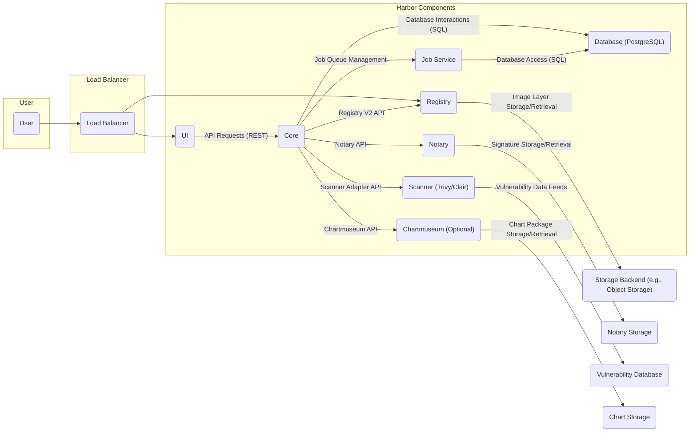
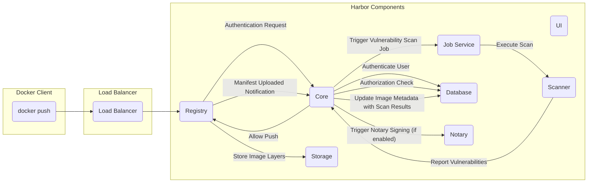

# Project Design Document: Harbor Container Registry

**Version:** 1.1
**Date:** October 26, 2023
**Author:** AI Software Architect

## 1. Introduction

This document provides a detailed architectural design of the Harbor container registry project. It outlines the key components, their interactions, and the overall system architecture. This document serves as a foundation for subsequent threat modeling activities, ensuring a comprehensive understanding of the system's structure and potential vulnerabilities.

Harbor is an open-source, cloud-native registry that stores, signs, and scans container images. It extends the capabilities of the open-source Docker Registry by incorporating enterprise-grade features such as enhanced security, robust identity management, and comprehensive management functionalities.

## 2. Goals and Objectives

* To provide a secure and reliable, centralized platform for storing and managing container images and related artifacts (like Helm charts).
* To offer granular role-based access control (RBAC) for repositories and images, ensuring only authorized users can access specific content.
* To seamlessly integrate vulnerability scanning tools to proactively identify potential security risks within stored container images.
* To enable image signing and content trust mechanisms, guaranteeing the integrity and provenance of images.
* To provide an intuitive and user-friendly interface for managing images, repositories, and overall system configurations.
* To support efficient replication of images across multiple Harbor instances, facilitating disaster recovery and geo-distribution.
* To offer comprehensive auditing and logging capabilities, providing a detailed record of all actions performed within the system.

## 3. Scope

This design document focuses on the core architectural components of a typical Harbor deployment. It encompasses:

* The web-based User Interface (UI).
* The central Core services responsible for orchestration and management.
* The underlying Registry service for image storage and retrieval.
* The persistent Database for storing metadata and configuration.
* The asynchronous Job Service for handling background tasks.
* The Notary service for enabling content trust and image signing.
* The integrated vulnerability Scanner (primarily Trivy, with potential for Clair).
* The optional Chartmuseum component for storing and managing Helm charts.
* The communication pathways and protocols used between these components.

This document explicitly excludes:

* Specific details of deployment configurations (e.g., Kubernetes manifests, Docker Compose files, cloud provider specific setups).
* In-depth network configurations and security group rules.
* Integrations with external systems beyond the core dependencies (e.g., specific identity providers like Keycloak, external logging systems).
* Detailed performance tuning and optimization strategies for different deployment scales.

## 4. High-Level Architecture

The following diagram illustrates the high-level architecture of Harbor and the relationships between its core components:



**Key Interactions:**

* Users interact with Harbor through either the web-based UI for management tasks or directly with the Registry API (following the Docker Registry V2 specification) using tools like `docker` or `podman`.
* The UI communicates with the Core service via a RESTful API to perform actions such as user management, project creation, and repository configuration.
* The Core service acts as the central control plane, managing user authentication, authorization, and orchestrating operations across other components.
* The Registry service is responsible for the actual storage and retrieval of container image layers, adhering to the Docker Registry V2 API.
* The Job Service handles asynchronous and background tasks, freeing up the Core service for handling immediate requests.
* Notary provides the functionality for content trust, allowing for the signing and verification of container images.
* The Scanner component analyzes container images for vulnerabilities, reporting findings back to the Core service.
* Chartmuseum (if deployed) provides a dedicated repository for storing and managing Helm charts.

## 5. Component Details

### 5.1. User Interface (UI)

* Provides a graphical web interface for users to interact with Harbor.
* Enables management of projects, repositories, users, roles, and system settings.
* Displays information retrieved from the Core service and the Registry, such as image lists, vulnerability scan results, and audit logs.
* Communicates with the Core service using RESTful API calls, typically over HTTPS.

### 5.2. Core Service

* The central brain of Harbor, responsible for orchestrating and managing the entire system.
* Handles user authentication (verifying user credentials) and authorization (determining access rights).
* Manages projects, repositories, namespaces, and their associated metadata.
* Provides a comprehensive set of APIs for the UI and other internal components to interact with.
* Delegates asynchronous tasks, such as replication and garbage collection, to the Job Service.
* Interacts with the Registry to manage repository metadata and trigger actions.
* Communicates with Notary for image signing and verification workflows.
* Integrates with the Scanner via an adapter interface to initiate vulnerability scans and retrieve results.
* Manages Chartmuseum instances and their configurations.

### 5.3. Registry Service

* Based on the open-source Docker Registry v2 specification and implementation.
* Responsible for the actual storage and serving of container image layers and manifests.
* Receives `push` and `pull` requests from container clients (e.g., Docker CLI).
* Authenticates incoming requests against the Core service to ensure proper authorization.
* Interacts with the underlying storage backend (e.g., object storage like AWS S3, Azure Blob Storage, Google Cloud Storage, or a local filesystem) to store and retrieve image data.
* Handles image manifest management and layer chunking.

### 5.4. Database (PostgreSQL)

* Serves as the persistent data store for Harbor.
* Stores critical metadata and configuration information, including:
    * User accounts, roles, and permissions.
    * Project and repository definitions, including access control policies.
    * Audit logs of user and system actions.
    * Job queue status and history.
    * Vulnerability scan results and associated metadata.
    * Notary signing information (or pointers to it).
    * Chartmuseum configuration (if applicable).

### 5.5. Job Service

* Executes asynchronous and background tasks initiated by the Core service.
* Employs a worker-based architecture to process jobs concurrently.
* Examples of tasks handled by the Job Service include:
    * Replicating images between different Harbor instances or registries.
    * Performing garbage collection of unused image layers to reclaim storage space.
    * Initiating and managing vulnerability scans on newly pushed images.
    * Sending webhook notifications to external systems based on events within Harbor.
    * Synchronizing user and group information from external authentication providers.

### 5.6. Notary

* Implements The Update Framework (TUF) specification to provide content trust for container images.
* Allows image publishers to cryptographically sign their images, ensuring their integrity and authenticity.
* Enables clients to verify the signatures of pulled images, preventing the use of tampered or malicious content.
* Stores image signatures and metadata in a dedicated storage backend, separate from the Registry's image layer storage.

### 5.7. Scanner (Trivy/Clair)

* Analyzes container image layers for known security vulnerabilities based on publicly available vulnerability databases.
* Integrates with Harbor through a standardized adapter interface, allowing for the use of different scanning engines.
* Trivy is the default and recommended scanner due to its ease of use and comprehensive vulnerability detection.
* Clair is an alternative scanner that can be integrated if desired.
* Provides scan reports detailing identified vulnerabilities, their severity, and potential remediation steps.

### 5.8. Chartmuseum (Optional)

* An open-source, self-hosted Helm Chart Repository.
* Allows users to store, manage, and version Helm charts alongside container images within Harbor.
* Integrates with Harbor's authentication and authorization mechanisms, ensuring consistent access control.
* Provides an API for uploading, downloading, and managing Helm charts.
* Stores chart packages in a dedicated storage backend.

## 6. Data Flow

### 6.1. Image Push Workflow



**Detailed Steps:**

* A user initiates an `docker push` command from their local machine.
* The request is routed to the Harbor Registry service via the Load Balancer.
* The Registry service receives the request and sends an authentication challenge to the Docker client.
* The Docker client presents credentials, which are forwarded to the Core service for authentication.
* The Core service authenticates the user against the database.
* The Core service checks if the authenticated user has the necessary permissions to push to the specified repository.
* If authorized, the Core service signals the Registry to proceed with the push operation.
* The Registry service receives and stores the individual image layers in the designated storage backend.
* Once all layers are uploaded, the Registry receives the image manifest and persists it.
* The Registry sends a notification to the Core service indicating that a new image manifest has been uploaded.
* The Core service, upon receiving the notification, triggers a vulnerability scan job by adding it to the Job Service queue.
* The Job Service picks up the scan job and instructs the configured Scanner to analyze the newly pushed image.
* The Scanner retrieves the image layers and performs the vulnerability scan, comparing against its vulnerability database.
* The Scanner reports the identified vulnerabilities and their severity back to the Core service.
* The Core service updates the image metadata in the database with the vulnerability scan results.
* If content trust is enabled for the repository, the Core service initiates the image signing process with the Notary service.

### 6.2. Image Pull Workflow

```mermaid
graph LR
    subgraph "Docker Client"
        DC_Pull("docker pull")
    end
    subgraph "Load Balancer"
        LB_Pull("Load Balancer")
    end
    subgraph "Harbor Components"
        UI_Pull("UI")
        Core_Pull("Core")
        Registry_Pull("Registry")
        DB_Pull("Database")
        Storage_Pull("Storage")
        Notary_Pull("Notary")
    end

    DC_Pull --> LB_Pull
    LB_Pull --> Registry_Pull
    Registry_Pull -- "Authentication Request" --> Core_Pull
    Core_Pull -- "Authenticate User" --> DB_Pull
    Core_Pull -- "Authorization Check" --> DB_Pull
    Core_Pull -- "Allow Pull" --> Registry_Pull
    Registry_Pull -- "Retrieve Image Manifest" --> DC_Pull
    Registry_Pull -- "Retrieve Image Layers" --> DC_Pull
    subgraph "Optional: Content Trust Verification"
        DC_Pull -- "Request Image Manifest Signature" --> Notary_Pull
        Notary_Pull -- "Return Signature" --> DC_Pull
        DC_Pull -- "Verify Signature" --> "Success/Failure"
    end
```

**Detailed Steps:**

* A user initiates a `docker pull` command from their local machine.
* The request is routed to the Harbor Registry service via the Load Balancer.
* The Registry service sends an authentication challenge to the Docker client.
* The Docker client presents credentials, which are forwarded to the Core service for authentication.
* The Core service authenticates the user against the database.
* The Core service checks if the authenticated user has the necessary permissions to pull from the specified repository.
* If authorized, the Core service signals the Registry to proceed with the pull operation.
* The Registry service retrieves the requested image manifest from its storage.
* The Registry provides the image manifest to the Docker client.
* The Docker client then requests the individual image layers from the Registry.
* The Registry retrieves the requested layers from the storage backend and streams them to the Docker client.
* **Optional (Content Trust):** If content trust is enabled, the Docker client can optionally request the image manifest signature from the Notary service.
* The Notary service retrieves and returns the signature for the requested image manifest.
* The Docker client verifies the signature against the trusted keys to ensure the image's integrity and origin.

## 7. Security Considerations

This section outlines key security considerations within the Harbor architecture:

* **Authentication and Authorization:**
    * Harbor enforces Role-Based Access Control (RBAC), allowing administrators to define granular permissions for users and groups at the project and repository levels.
    * Supports various authentication backends, including local user accounts, LDAP/Active Directory integration, and OAuth 2.0 providers, offering flexibility in managing user identities.
    * The Core service acts as the central authority for authentication and authorization, ensuring consistent enforcement of access policies across all components.
* **Content Trust (using Notary):**
    * Provides a mechanism to ensure the integrity and provenance of container images through cryptographic signing.
    * Prevents the accidental or malicious deployment of tampered images by allowing verification of signatures before pulling.
    * Relies on a trusted root of trust and delegation mechanisms to manage signing keys securely.
* **Vulnerability Scanning (using Trivy or Clair):**
    * Proactively identifies known security vulnerabilities within container images, allowing for informed decisions about image usage and remediation.
    * Enables the definition of policies to prevent the deployment of images with critical vulnerabilities.
    * Requires regular updates to the vulnerability databases to ensure accurate and up-to-date scanning results.
* **Data Security:**
    * Sensitive data, such as user credentials and API keys, should be encrypted at rest within the database.
    * Communication between Harbor components should be secured using TLS/SSL encryption to protect data in transit.
    * Storage backends should be configured with appropriate access controls and encryption mechanisms to protect stored image layers and metadata.
* **Network Security:**
    * Network segmentation and firewalls should be implemented to restrict network access to Harbor components, limiting the attack surface.
    * Access to the database and storage backends should be strictly controlled and limited to authorized Harbor components.
* **Auditing and Logging:**
    * Harbor provides comprehensive audit logs that record user actions, API calls, and system events, providing valuable insights for security monitoring and incident response.
    * Logs should be securely stored and regularly reviewed for suspicious activity. Consider integrating with external logging systems for centralized management.
* **Security Hardening:**
    * Regularly update Harbor components and the underlying operating systems to patch known security vulnerabilities.
    * Follow security best practices for container deployments, such as running containers as non-root users and limiting container privileges.
* **API Security:**
    * All API endpoints should be protected with robust authentication and authorization mechanisms.
    * Implement input validation and sanitization to prevent injection attacks (e.g., SQL injection, cross-site scripting).
    * Consider implementing rate limiting to mitigate denial-of-service attacks.

## 8. Deployment Considerations

* Harbor offers flexible deployment options to suit different environments and needs:
    * **Docker Compose:** Suitable for development, testing, and small-scale deployments. Provides a simple way to deploy all components as Docker containers.
    * **Kubernetes:** Recommended for production environments due to its scalability, resilience, and orchestration capabilities. Harbor can be deployed using Helm charts for simplified management.
    * **Manual Installation:** Allows for fine-grained control over the deployment process but requires more manual configuration.
* **High Availability (HA):** For production deployments, consider deploying Harbor in a highly available configuration by running multiple instances of key components (e.g., Core, Registry) behind a load balancer.
* **Persistent Storage:**  Persistent storage is crucial for the database, registry storage backend, and Notary storage to ensure data durability and prevent data loss. Choose appropriate storage solutions based on performance and scalability requirements.
* **Externalized Services:** Consider using externalized database and storage services (e.g., managed PostgreSQL, object storage services from cloud providers) for improved scalability, reliability, and manageability.
* **Backup and Recovery:** Implement a robust backup and recovery strategy for the database, registry storage, and Notary storage to protect against data loss in case of failures.

## 9. Future Considerations

* Explore integration with additional vulnerability scanners to provide broader coverage and choice.
* Enhance image signing and verification capabilities, potentially exploring more advanced signing workflows and integration with hardware security modules (HSMs).
* Improve support for multi-tenancy to allow for better resource isolation and management in shared environments.
* Develop more advanced image replication strategies, including content-addressable storage and peer-to-peer replication.
* Deepen integration with CI/CD pipelines to automate security scanning and policy enforcement as part of the software delivery process.
* Enhance monitoring and alerting capabilities to provide real-time insights into system health and potential security issues.

This revised design document provides a more detailed and comprehensive overview of the Harbor container registry architecture, offering a solid foundation for threat modeling and security analysis. The enhanced component descriptions and data flow diagrams provide greater clarity into the system's operations and potential vulnerabilities.
