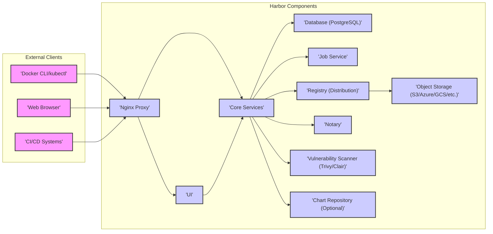

# Project Design Document: Harbor Container Registry for Threat Modeling

**Project Name:** Harbor Container Registry

**Project Repository:** [https://github.com/goharbor/harbor](https://github.com/goharbor/harbor)

**Document Version:** 1.1
**Date:** 2023-10-27
**Author:** AI Expert

## 1. Introduction

This document provides an enhanced and detailed design overview of the Harbor container registry project, specifically tailored for comprehensive threat modeling activities. Building upon the previous version, this document further elaborates on the system architecture, component functionalities, data flow, and key security features. It aims to provide an even stronger foundation for identifying potential threats, vulnerabilities, and attack vectors within the Harbor ecosystem. This document is intended to be a living document and will be updated as the project evolves.

## 2. Project Overview

Harbor is an enterprise-grade, open-source container registry that extends the Docker Registry to provide a secure and efficient platform for managing container images and artifacts. It is designed for cloud-native environments and offers a rich set of features beyond basic storage, including:

*   **Robust Access Control (RBAC):** Fine-grained role-based access control at the project and repository level, enabling secure multi-tenancy.
*   **Integrated Vulnerability Scanning:** Seamless integration with leading vulnerability scanners (Trivy, Clair, etc.) to automatically scan images for security vulnerabilities upon push and on a scheduled basis.
*   **Content Trust and Image Signing (Notary):** Integration with Notary for digital signing and verification of container images, ensuring image provenance and integrity.
*   **Efficient Image Replication:** Policy-based replication of images across multiple Harbor instances, supporting geo-replication, high availability, and disaster recovery scenarios.
*   **Automated Garbage Collection:** Scheduled garbage collection to reclaim storage space by removing unused image layers and manifests, optimizing resource utilization.
*   **Customizable Image Retention Policies:** Flexible retention policies to automatically delete images based on defined rules (e.g., age, tag count, image status), managing image lifecycle and storage costs.
*   **Enterprise Authentication & Authorization:** Integration with enterprise directory services (LDAP/AD) and OpenID Connect (OIDC) for seamless user authentication and single sign-on (SSO).
*   **Comprehensive Audit Logging:** Detailed audit logs capturing user actions, system events, and API calls, providing visibility for security monitoring and compliance.
*   **Helm Chart Repository (Optional):** Integrated repository for storing and managing Helm charts alongside container images, providing a unified artifact management platform.
*   **Support for Multiple Storage Backends:** Flexibility to utilize various object storage solutions (S3, Azure Blob Storage, GCS, OpenStack Swift, Ceph, etc.) and filesystem storage.

Harbor is designed to meet the stringent security, scalability, and management requirements of enterprise container environments.

## 3. System Architecture

Harbor's architecture is modular and component-based, allowing for scalability and maintainability. The following diagram illustrates the high-level architecture, highlighting key components and their interactions:

### 3.1. Component Description (Detailed)

*   **Nginx Proxy:**
    *   **Functionality:**  The primary entry point for all external and internal requests to Harbor. It performs critical functions:
        *   **TLS Termination:** Handles TLS/SSL encryption and decryption, securing communication with clients.
        *   **Reverse Proxy:** Routes requests to the appropriate backend components (UI, Core Services, Registry) based on URL paths and headers.
        *   **Load Balancing:** Distributes traffic across multiple instances of backend components for scalability and high availability (if configured).
        *   **Basic Authentication (Optional):** Can be configured to enforce basic authentication as an additional layer of security before requests reach backend services.
    *   **Technology:** Nginx web server.
    *   **Communication Protocols:** HTTPS (external clients), HTTP (internal components).
    *   **Data Handled:** HTTP requests and responses, TLS certificates, authentication credentials (optional).
    *   **Security Relevance:**  Critical security component. Misconfiguration can lead to exposure of internal services, TLS vulnerabilities, and unauthorized access. Proper TLS configuration, reverse proxy rules, and security hardening are essential.

*   **UI (User Interface):**
    *   **Functionality:** Provides a web-based graphical interface for users to interact with Harbor. Key functionalities include:
        *   **Project and Repository Management:** Creating, browsing, and managing projects and repositories.
        *   **User and Role Management:** Managing users, groups, and assigning roles within projects.
        *   **Configuration Management:** Configuring Harbor settings, such as authentication backends, vulnerability scanners, and replication policies.
        *   **Image Exploration:** Viewing image details, tags, manifests, vulnerability scan reports, and content trust information.
        *   **Helm Chart Management (Optional):** Browsing and managing Helm charts.
    *   **Technology:** Angular (frontend), Go (backend API for UI).
    *   **Communication Protocols:** HTTPS (browser to Nginx), HTTP (Nginx to UI backend API).
    *   **Data Handled:** User credentials (during login), session cookies, project and repository metadata, image information, configuration data.
    *   **Security Relevance:**  Handles user authentication and authorization through the UI. Susceptible to common web application vulnerabilities such as Cross-Site Scripting (XSS), Cross-Site Request Forgery (CSRF), and insecure session management. Secure coding practices and regular security testing are crucial.

*   **Core Services:**
    *   **Functionality:** The central API server and business logic engine of Harbor. It orchestrates and enforces security policies and manages core functionalities:
        *   **Authentication and Authorization:** Handles user authentication (local, LDAP/AD, OIDC) and enforces RBAC policies for all API requests.
        *   **Project and Repository Management API:** Provides APIs for creating, deleting, and managing projects and repositories.
        *   **Image Management API:** Manages image metadata, tags, manifests, and triggers garbage collection.
        *   **Replication Management API:** Manages replication policies and initiates replication jobs.
        *   **Vulnerability Scanning Orchestration:** Integrates with vulnerability scanners, triggers scans, and retrieves scan reports.
        *   **Content Trust Orchestration:** Integrates with Notary for image signing and verification workflows.
        *   **Audit Logging:** Generates audit logs for security-relevant events.
        *   **Chart Repository Management API (Optional):** Provides APIs for managing Helm chart repositories.
    *   **Technology:** Go programming language.
    *   **Communication Protocols:** HTTP (Nginx to Core Services), gRPC (internal communication with Job Service and Registry in some deployments).
    *   **Data Handled:** User credentials, session tokens, RBAC policies, project and repository metadata, image metadata, vulnerability scan results, audit logs, configuration data.
    *   **Security Relevance:**  The core component responsible for enforcing security policies, authentication, authorization, and data integrity. Vulnerabilities in Core Services can have widespread and critical impact on the entire Harbor system. Secure API design, input validation, and robust error handling are paramount.

*   **Database (PostgreSQL):**
    *   **Functionality:**  Persistent storage for Harbor's metadata and configuration. Stores:
        *   User accounts, roles, and group memberships.
        *   Project and repository metadata (names, descriptions, permissions).
        *   Image metadata (manifest digests, tags, vulnerability scan results summaries).
        *   Configuration settings (authentication settings, scanner configurations, replication policies).
        *   Audit logs (user actions, system events).
        *   Session data.
    *   **Technology:** PostgreSQL relational database.
    *   **Communication Protocols:** PostgreSQL protocol (Core Services, Job Service, UI backend API to Database).
    *   **Data Handled:** Sensitive data including user credentials (hashed passwords), RBAC policies, project and repository metadata, audit logs, configuration settings.
    *   **Security Relevance:**  Stores highly sensitive data. Requires strong access control, encryption at rest (if required by compliance), regular backups, and database hardening. SQL injection vulnerabilities in components interacting with the database are a potential threat.

*   **Job Service:**
    *   **Functionality:**  Handles asynchronous and background tasks, offloading processing from Core Services. Tasks include:
        *   Image replication jobs.
        *   Garbage collection jobs.
        *   Vulnerability scanning jobs (triggering and report processing).
        *   Image deletion jobs.
        *   Retention policy enforcement.
    *   **Technology:** Go programming language, Redis (for job queue and task management).
    *   **Communication Protocols:** gRPC (Core Services to Job Service), Redis protocol (Job Service to Redis).
    *   **Data Handled:** Job definitions, task status, temporary data related to job execution.
    *   **Security Relevance:**  Executes potentially privileged operations. Misconfiguration or vulnerabilities could lead to unauthorized actions, resource exhaustion, or denial of service. Secure job queue management and proper task authorization are important.

*   **Registry (Distribution):**
    *   **Functionality:**  Implements the Docker Registry V2 API and is responsible for storing and serving container image layers (blobs) and manifests.
    *   **Technology:** Go programming language, based on the open-source Distribution/Registry project.
    *   **Communication Protocols:** HTTP(S) (Nginx Proxy to Registry), Object Storage API (Registry to Object Storage).
    *   **Data Handled:** Container image manifests (JSON), image layers (blobs - binary data).
    *   **Security Relevance:**  Directly handles container image data. Access control enforced by Core Services is crucial. Secure storage in Object Storage is paramount. Vulnerabilities in the Registry component could lead to image tampering, unauthorized access to image layers, or denial of service.

*   **Object Storage (S3/Azure/GCS/etc.):**
    *   **Functionality:**  Stores the bulk of container image data - the image layers (blobs). Supports various backends:
        *   Amazon S3, Azure Blob Storage, Google Cloud Storage, OpenStack Swift, Ceph RADOS, Filesystem (for non-production).
    *   **Technology:** Varies depending on the backend (e.g., AWS S3 API, Azure Blob Storage API).
    *   **Communication Protocols:**  Backend-specific API protocols (e.g., S3 API over HTTPS).
    *   **Data Handled:** Container image layers (blobs - binary data).
    *   **Security Relevance:**  Stores the largest volume of data, including potentially sensitive application code and data within container images. Secure configuration of the object storage backend is critical, including:
        *   **Access Control Policies:** Restricting access to only authorized Harbor components (Registry).
        *   **Encryption at Rest:** Enabling encryption at rest to protect data confidentiality.
        *   **Data Integrity:** Ensuring data integrity and preventing unauthorized modification.

*   **Notary (Optional, Content Trust):**
    *   **Functionality:**  Provides content trust functionality, enabling image signing and verification.
        *   **Image Signing:** Allows image publishers to digitally sign images using private keys.
        *   **Image Verification:** Allows clients to verify image signatures using public keys, ensuring image integrity and provenance.
    *   **Technology:** Notary project (Go programming language).
    *   **Communication Protocols:** HTTP(S) (Core Services to Notary), gRPC (internal Notary components).
    *   **Data Handled:** Image signatures, trust metadata, public and private keys (key management is critical).
    *   **Security Relevance:**  Enhances image integrity and provenance. Secure key management for Notary signing keys is paramount. Compromised keys can lead to unauthorized image signing and trust bypass.

*   **Vulnerability Scanner (Trivy/Clair):**
    *   **Functionality:**  Scans container images for known vulnerabilities based on vulnerability databases.
        *   **Vulnerability Detection:** Identifies vulnerabilities in OS packages and application dependencies within container images.
        *   **Vulnerability Reporting:** Generates reports detailing identified vulnerabilities, severity levels, and remediation guidance.
        *   **Policy Enforcement (Optional):** Can be configured to enforce policies based on vulnerability scan results (e.g., prevent pushing images with critical vulnerabilities).
    *   **Technology:** Trivy (Go), Clair (Go), or other supported scanners.
    *   **Communication Protocols:** HTTP(S) (Core Services to Scanner API), Scanner-specific protocols for database updates.
    *   **Data Handled:** Container images (for scanning), vulnerability databases, vulnerability scan reports.
    *   **Security Relevance:**  Crucial for identifying and mitigating vulnerabilities in container images. Requires regular updates to vulnerability databases. Misconfiguration or vulnerabilities in the scanner itself could lead to inaccurate scan results or bypass of vulnerability detection.

*   **Chart Repository (Optional):**
    *   **Functionality:**  Provides a repository for storing and managing Helm charts.
        *   **Chart Storage and Retrieval:** Stores Helm charts and allows users to browse and download them.
        *   **Access Control:** Enforces RBAC policies for chart access.
    *   **Technology:** Go programming language.
    *   **Communication Protocols:** HTTP(S) (Nginx Proxy to Chart Repository), Object Storage API (Chart Repository to Object Storage for chart storage).
    *   **Data Handled:** Helm charts (YAML files, potentially containing sensitive configuration).
    *   **Security Relevance:**  If enabled, requires access control and security considerations similar to container image repositories. Helm charts can contain sensitive information, so secure storage and access control are important.

## 4. Data Flow (Detailed)

This section provides more detailed data flow descriptions for key operations, including protocols and data formats.

### 4.1. Image Push Operation (Detailed)

1.  **Client (Docker CLI) initiates `docker push <registry>/<project>/<repository>:<tag>` command over HTTPS.**
2.  **Request reaches Nginx Proxy (HTTPS).**
3.  **Nginx Proxy forwards the request to Core Services (HTTP) for authentication and authorization.**
4.  **Core Services authenticates the user (e.g., using basic authentication, token-based authentication (Bearer tokens), or session cookies).** Authentication data is exchanged in HTTP headers (e.g., `Authorization` header).
5.  **Core Services authorizes the push operation based on the user's role and project/repository permissions (RBAC check).**
6.  **Core Services interacts with the Registry (HTTP/gRPC depending on deployment) to initiate the image layer (blob) upload and manifest upload.**  Registry API calls are made, typically using the Docker Registry V2 API (HTTP).
7.  **Registry receives image layers (blobs) via chunked HTTP uploads and stores them in Object Storage (using Object Storage API, e.g., S3 API over HTTPS).** Image layers are binary data.
8.  **Registry receives the image manifest (JSON format) via HTTP upload and stores it in Object Storage (manifests can also be stored in Object Storage or Registry's internal storage).** Manifests are JSON documents describing the image structure.
9.  **Registry updates image metadata in its internal storage (partially in database via Core Services).** Registry may notify Core Services about the successful push.
10. **Core Services updates metadata in the Database (PostgreSQL protocol).**
11. **Job Service may be notified by Core Services (e.g., via message queue or direct API call) to trigger vulnerability scanning and Notary signing (if configured) as background tasks.**
12. **Client receives confirmation of successful image push from Nginx Proxy (HTTP response code 201 Created).**

### 4.2. Image Pull Operation (Detailed)

1.  **Client (Docker CLI) initiates `docker pull <registry>/<project>/<repository>:<tag>` command over HTTPS.**
2.  **Request reaches Nginx Proxy (HTTPS).**
3.  **Nginx Proxy forwards the request to Core Services (HTTP) for authentication and authorization.**
4.  **Core Services authenticates the user (similar to push operation).**
5.  **Core Services authorizes the pull operation based on the user's role and project/repository permissions (RBAC check).**
6.  **Core Services interacts with the Registry (HTTP/gRPC) to retrieve the image manifest.** Registry API calls are made to fetch the manifest (Docker Registry V2 API).
7.  **Registry retrieves the manifest (JSON) from its internal storage and/or Object Storage (using Object Storage API if needed).**
8.  **Registry serves the manifest (JSON) to the client via Nginx Proxy (HTTP response).**
9.  **Client parses the manifest and requests image layers (blobs) from the Registry via Nginx Proxy (HTTPS).**
10. **Registry retrieves image layers (blobs - binary data) from Object Storage (using Object Storage API).**
11. **Registry streams image layers (blobs) to the client via Nginx Proxy (chunked HTTP responses).**
12. **Client receives the complete image.**

### 4.3. User Authentication (Web UI Login) (Detailed)

1.  **User accesses the Harbor UI URL in a web browser (HTTPS).**
2.  **Request reaches Nginx Proxy (HTTPS).**
3.  **Nginx Proxy forwards the request to the UI component (HTTP).**
4.  **UI presents a login page (HTML/JavaScript) to the user's browser.**
5.  **User submits credentials (username/password) via the login form (HTTPS POST request).**
6.  **UI (frontend JavaScript) sends an authentication request to the UI backend API (Go) via HTTPS.**
7.  **UI backend API sends an authentication request to Core Services (HTTP).**
8.  **Core Services authenticates the user against the configured authentication backend (local database, LDAP/AD, OIDC).** Authentication protocols vary depending on the backend (e.g., LDAP protocol for LDAP/AD, OIDC flows for OIDC).
9.  **Upon successful authentication, Core Services creates a session and returns a session ID to the UI backend API.**
10. **UI backend API sets a session cookie (containing the session ID) in the user's browser via HTTP response headers (e.g., `Set-Cookie`).**
11. **Subsequent requests from the user's browser to the UI include the session cookie in HTTP headers (e.g., `Cookie` header) for authentication.** Nginx Proxy and UI backend API validate the session cookie against Core Services.

## 5. Key Security Features (Detailed)

*   **Role-Based Access Control (RBAC):**
    *   **Mechanism:**  Defines roles (e.g., project admin, developer, guest) with specific permissions (e.g., push, pull, delete, manage). Users and groups are assigned roles within projects.
    *   **Benefits:**  Enforces least privilege, controls access to projects and repositories, enables secure multi-tenancy, and prevents unauthorized modifications or access to images.
    *   **Implementation:**  RBAC policies are defined and enforced by Core Services, stored in the Database, and checked for every API request.

*   **Vulnerability Scanning:**
    *   **Mechanism:**  Integrates with external vulnerability scanners (Trivy, Clair). Upon image push or scheduled scans, Job Service triggers scanner to analyze image layers and report vulnerabilities based on CVE databases.
    *   **Benefits:**  Proactively identifies known vulnerabilities in container images, allowing for remediation before deployment. Reduces the attack surface of deployed applications.
    *   **Implementation:**  Core Services and Job Service orchestrate scanning. Scanner reports are stored and accessible via the UI and API.

*   **Content Trust (Notary):**
    *   **Mechanism:**  Uses Notary to digitally sign image manifests. Image publishers sign images with private keys, and clients verify signatures using public keys stored in Notary.
    *   **Benefits:**  Ensures image integrity and provenance. Prevents image tampering and man-in-the-middle attacks. Provides assurance that pulled images are from trusted publishers.
    *   **Implementation:**  Core Services integrates with Notary. Image signing and verification workflows are managed through Harbor.

*   **Image Replication:**
    *   **Mechanism:**  Policy-based replication of images between Harbor instances. Replication policies can be configured based on projects, repositories, and tags. Job Service executes replication tasks.
    *   **Benefits:**  Improves high availability and disaster recovery. Enables geo-replication for faster image pulls in distributed environments. Indirectly enhances security by ensuring business continuity.
    *   **Implementation:**  Replication policies are configured in Core Services and executed by Job Service.

*   **Audit Logging:**
    *   **Mechanism:**  Comprehensive logging of user actions, API calls, system events, and security-related events. Logs are stored in the Database and can be exported to external logging systems.
    *   **Benefits:**  Provides visibility for security monitoring, incident response, and compliance auditing. Helps track user activity and identify potential security breaches.
    *   **Implementation:**  Audit logging is implemented in Core Services and other components. Logs are stored in the Database and accessible via API and UI.

*   **TLS Encryption:**
    *   **Mechanism:**  Enforces TLS encryption for all external communication channels (client to Nginx Proxy) and can be configured for internal communication as well.
    *   **Benefits:**  Protects data in transit from eavesdropping and man-in-the-middle attacks. Ensures confidentiality and integrity of communication.
    *   **Implementation:**  Nginx Proxy is configured for TLS termination. Internal components can be configured for mutual TLS (mTLS) for enhanced security.

*   **Security Hardening:**
    *   **Mechanism:**  Provides guidelines and best practices for hardening the Harbor deployment environment, including:
        *   Network segmentation (firewalls, network policies).
        *   Principle of least privilege for user and service accounts.
        *   Regular security updates and patching.
        *   Security scanning of Harbor infrastructure.
        *   Secure configuration of underlying infrastructure (OS, Kubernetes, etc.).
    *   **Benefits:**  Reduces the attack surface and strengthens the overall security posture of the Harbor deployment.

*   **Integration with External Authentication Providers:**
    *   **Mechanism:**  Supports integration with LDAP/AD and OIDC for centralized user management and authentication.
    *   **Benefits:**  Leverages existing enterprise identity infrastructure. Simplifies user management and enhances security by enforcing organizational authentication policies. Enables single sign-on (SSO) for users.
    *   **Implementation:**  Core Services is configured to authenticate against LDAP/AD or OIDC providers.

*   **Image Retention Policies:**
    *   **Mechanism:**  Allows defining policies to automatically delete images based on rules (e.g., age, tag count, image status). Job Service enforces retention policies.
    *   **Benefits:**  Manages storage costs, reduces storage footprint, and potentially reduces the attack surface by removing outdated or unused images.
    *   **Implementation:**  Retention policies are configured in Core Services and enforced by Job Service.

## 6. Deployment Architecture Considerations for Security (Best Practices)

Securing a Harbor deployment requires careful consideration of the deployment architecture. Here are some best practices:

*   **Network Segmentation:**
    *   **Recommendation:** Deploy Harbor components across different network zones based on their security sensitivity.
    *   **Example:**
        *   **DMZ:** Nginx Proxy (publicly accessible).
        *   **Application Zone:** UI, Core Services, Registry, Job Service, Chart Repository.
        *   **Data Zone:** Database (PostgreSQL), Object Storage, Redis (Job Service queue), Notary (if used), Vulnerability Scanner (if deployed separately).
    *   **Benefit:** Limits the blast radius of a potential security breach. If the DMZ is compromised, the attacker's access to internal components is restricted.

*   **Secure Object Storage Configuration:**
    *   **Recommendation:**  Choose a secure object storage backend and configure it with strong access control policies and encryption at rest.
    *   **Example:**
        *   Use IAM roles or access keys with least privilege for Harbor Registry to access Object Storage.
        *   Enable server-side encryption (SSE) or client-side encryption (CSE) for data at rest in Object Storage.
        *   Regularly review and audit Object Storage access policies.
    *   **Benefit:** Protects container image data from unauthorized access and ensures data confidentiality and integrity.

*   **TLS Configuration (Comprehensive):**
    *   **Recommendation:** Enforce TLS for all communication channels, both external and internal where feasible.
    *   **Example:**
        *   **External:** Strong TLS configuration for Nginx Proxy (HTTPS), including strong ciphers, HSTS, and valid certificates from a trusted CA.
        *   **Internal:** Consider mutual TLS (mTLS) for communication between Nginx Proxy and backend components, and between Core Services and Registry/Job Service (if supported by deployment method).
    *   **Benefit:** Protects data in transit from eavesdropping and tampering across all communication paths.

*   **Database Security Hardening:**
    *   **Recommendation:** Harden the PostgreSQL database instance.
    *   **Example:**
        *   Use strong passwords for database users.
        *   Restrict database access to only authorized Harbor components (Core Services, Job Service, UI backend API).
        *   Enable database authentication and authorization.
        *   Regularly apply database security patches.
        *   Consider encryption at rest for the database if required by compliance.
    *   **Benefit:** Protects sensitive data stored in the database from unauthorized access and ensures database integrity.

*   **Regular Security Updates and Patching:**
    *   **Recommendation:** Establish a process for regularly updating Harbor components and the underlying operating systems and infrastructure with security patches.
    *   **Example:**
        *   Subscribe to Harbor security mailing lists and monitor security advisories.
        *   Implement automated patch management for OS and infrastructure.
        *   Regularly upgrade Harbor to the latest stable versions.
    *   **Benefit:** Mitigates known vulnerabilities and reduces the risk of exploitation.

*   **Monitoring and Logging (Security Focused):**
    *   **Recommendation:** Implement robust monitoring and logging, focusing on security-relevant events.
    *   **Example:**
        *   Monitor audit logs for suspicious activities (failed login attempts, unauthorized access attempts, RBAC policy violations).
        *   Set up alerts for security-related events.
        *   Integrate Harbor logs with a SIEM (Security Information and Event Management) system for centralized security monitoring and analysis.
    *   **Benefit:** Enables early detection of security incidents, facilitates incident response, and provides security visibility.

*   **Principle of Least Privilege (Everywhere):**
    *   **Recommendation:** Apply the principle of least privilege to all user accounts, service accounts, and component permissions.
    *   **Example:**
        *   Grant users only the necessary RBAC roles within Harbor projects.
        *   Use dedicated service accounts with minimal permissions for Harbor components to access databases and object storage.
        *   Avoid running Harbor components as root or privileged users.
    *   **Benefit:** Limits the potential impact of compromised credentials or components.

## 7. Threat Modeling Focus Areas (Categorized and Specific)

Based on the detailed design, threat modeling efforts should focus on the following categorized areas and specific threats:

**A. Authentication and Authorization Threats:**

*   **T1: Authentication Bypass:** Vulnerabilities in authentication mechanisms (local, LDAP/AD, OIDC) allowing unauthorized access without valid credentials.
*   **T2: RBAC Policy Bypass:** Circumventing RBAC controls to gain unauthorized access to projects, repositories, or images despite lacking permissions.
*   **T3: Session Hijacking/Fixation:** Exploiting session management vulnerabilities to hijack or fix user sessions, gaining unauthorized access.
*   **T4: Privilege Escalation:**  Exploiting vulnerabilities to elevate privileges within Harbor, gaining administrative or higher-level access.
*   **T5: Credential Stuffing/Brute Force Attacks:**  Attacks targeting user accounts through credential stuffing or brute force attempts against login endpoints.

**B. Web Application Security Threats (UI and Core Services APIs):**

*   **T6: Cross-Site Scripting (XSS) in UI:** Injecting malicious scripts into the UI to execute in user browsers, potentially stealing credentials or performing actions on behalf of users.
*   **T7: Cross-Site Request Forgery (CSRF) in API:**  Tricking authenticated users into making unintended API requests, leading to unauthorized actions.
*   **T8: Injection Flaws (SQL Injection, Command Injection, etc.) in Core Services:** Exploiting injection vulnerabilities in Core Services to execute arbitrary SQL queries or system commands, potentially compromising the database or system.
*   **T9: API Security Vulnerabilities (Broken Authentication, Broken Authorization, Excessive Data Exposure, Lack of Resources & Rate Limiting, etc. - OWASP API Top 10):**  Common API security vulnerabilities in Core Services APIs, leading to unauthorized access, data breaches, or denial of service.
*   **T10: Denial of Service (DoS) attacks against Web Interfaces (UI and APIs):**  Overwhelming web interfaces with requests to cause service disruption and unavailability.

**C. Registry and Image Storage Security Threats:**

*   **T11: Unauthorized Access to Image Layers in Object Storage:** Direct access to Object Storage bypassing Harbor access controls, leading to unauthorized image downloads or modifications.
*   **T12: Image Tampering/Corruption:**  Malicious modification or corruption of container images in Object Storage, potentially injecting malware or vulnerabilities.
*   **T13: Registry Component Vulnerabilities:**  Exploiting vulnerabilities in the Registry component itself to gain unauthorized access, manipulate images, or cause denial of service.
*   **T14: Registry API DoS Attacks:**  Overwhelming the Registry API with requests to cause service disruption and prevent image push/pull operations.

**D. Vulnerability Scanning and Content Trust Bypass Threats:**

*   **T15: Vulnerability Scanning Bypass:**  Circumventing vulnerability scanning mechanisms to push vulnerable images without detection.
*   **T16: Notary Key Compromise:**  Compromising Notary signing keys, allowing attackers to sign malicious images as trusted.
*   **T17: Content Trust Verification Bypass:**  Bypassing content trust verification mechanisms to pull unsigned or untrusted images.
*   **T18: Reliance on Outdated Vulnerability Databases:**  Using outdated vulnerability databases in scanners, leading to missed vulnerabilities.

**E. Dependency and Infrastructure Security Threats:**

*   **T19: Dependency Vulnerabilities:** Exploiting vulnerabilities in third-party libraries and components used by Harbor (Nginx, Go libraries, PostgreSQL, Redis, Trivy/Clair, Notary dependencies).
*   **T20: Infrastructure Vulnerabilities:** Exploiting vulnerabilities in the underlying infrastructure (operating system, network, virtualization platform, Kubernetes).
*   **T21: Misconfiguration of Infrastructure Components:**  Exploiting misconfigurations in infrastructure components (firewalls, network policies, OS settings) to gain unauthorized access or compromise Harbor.
*   **T22: Insecure Internal Communication Channels:**  Eavesdropping or tampering with internal communication between Harbor components if TLS is not properly configured internally.

**F. Data Security Threats:**

*   **T23: Exposure of Sensitive Data in Logs or Error Messages:**  Accidentally exposing sensitive data (credentials, API keys, internal paths) in logs or error messages.
*   **T24: Data Breach from Database or Object Storage:**  Unauthorized access and exfiltration of sensitive data from the Database or Object Storage.
*   **T25: Lack of Encryption at Rest for Sensitive Data:**  Sensitive data (database, object storage) stored without encryption at rest, increasing the risk of data breaches if storage is compromised.

This enhanced design document, with its detailed component descriptions, data flow analysis, security feature explanations, deployment best practices, and categorized threat modeling focus areas, provides a more robust and comprehensive foundation for conducting thorough threat modeling of the Harbor container registry. It will enable security teams to identify and mitigate a wider range of potential threats and vulnerabilities, ultimately strengthening the security posture of Harbor deployments.