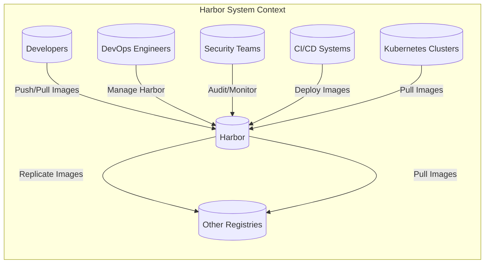
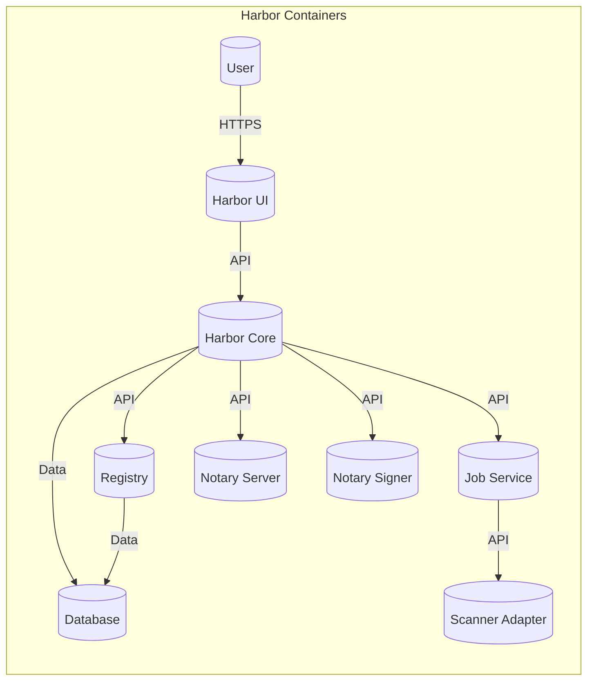
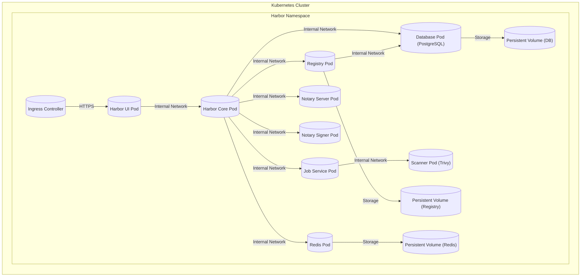
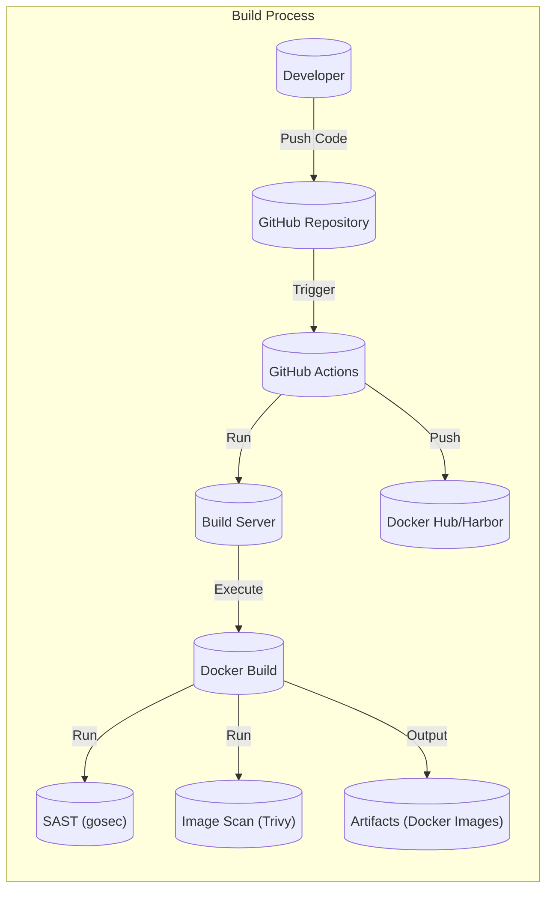

Okay, let's create a design document for the Harbor project, focusing on aspects relevant to threat modeling.

# BUSINESS POSTURE

Harbor is an open-source, cloud-native registry that stores, signs, and scans container images and Helm charts for vulnerabilities. It extends the open-source Docker Distribution by adding functionalities such as security, identity, and management.  It's often used in environments where containerized applications are prevalent, and it plays a crucial role in the software supply chain.

Business Priorities and Goals:

*   Provide a secure and reliable registry for container images and Helm charts.
*   Enable organizations to manage and control access to their artifacts.
*   Facilitate compliance with security standards and regulations.
*   Integrate seamlessly with existing CI/CD pipelines and DevOps workflows.
*   Offer a robust and scalable solution for managing artifacts at scale.
*   Reduce the risk of deploying vulnerable or compromised software.

Most Important Business Risks:

*   Unauthorized access to the registry, leading to the theft or modification of artifacts.
*   Deployment of vulnerable or malicious images, compromising the integrity and security of applications.
*   Disruption of service, preventing developers from accessing the artifacts they need.
*   Non-compliance with relevant security standards and regulations.
*   Data breaches involving sensitive information stored within the registry (e.g., credentials, configuration files).
*   Supply chain attacks, where the registry itself is compromised and used to distribute malicious artifacts.

# SECURITY POSTURE

Existing Security Controls (based on the GitHub repository and project documentation):

*   security control: Role-Based Access Control (RBAC): Harbor implements RBAC to control user access to projects and artifacts. (Implemented in Harbor's core logic and database).
*   security control: Authentication: Supports multiple authentication methods, including local database, LDAP/AD, and OIDC. (Implemented in Harbor's authentication modules).
*   security control: Vulnerability Scanning: Integrates with vulnerability scanners (e.g., Trivy, Clair) to identify vulnerabilities in container images. (Implemented as a separate service that interacts with Harbor's API).
*   security control: Content Trust (Notary): Supports Docker Content Trust for image signing and verification. (Implemented through integration with Notary).
*   security control: Replication: Allows replication of images between Harbor instances and other registries for high availability and disaster recovery. (Implemented as a core feature of Harbor).
*   security control: Audit Logging: Records user actions and system events for auditing and security monitoring. (Implemented in Harbor's core logic).
*   security control: HTTPS: Enforces HTTPS for secure communication. (Configured at the deployment level, typically using a reverse proxy).
*   security control: Quotas: Allows administrators to set quotas on storage usage. (Implemented in Harbor's core logic and database).
*   security control: Garbage Collection: Provides garbage collection to remove unused image layers and reclaim storage space. (Implemented as a scheduled task within Harbor).
*   security control: Immutable tags and repositories: Provides configuration to prevent tags from being overwritten. (Implemented in Harbor's core logic).

Accepted Risks:

*   accepted risk: The security of the underlying infrastructure (e.g., host OS, network) is outside the direct control of Harbor.
*   accepted risk: The effectiveness of vulnerability scanning depends on the quality and timeliness of the vulnerability databases used by the scanners.
*   accepted risk: Users are responsible for managing their own credentials securely.
*   accepted risk: Harbor's security relies on the correct configuration and maintenance by administrators.

Recommended Security Controls:

*   Implement regular security audits and penetration testing.
*   Enable two-factor authentication (2FA) for all users, especially administrators.
*   Integrate with a Security Information and Event Management (SIEM) system for centralized security monitoring.
*   Implement network segmentation to isolate Harbor from other critical systems.
*   Configure robust logging and alerting for security-related events.

Security Requirements:

*   Authentication:
    *   Support for strong password policies.
    *   Integration with existing enterprise identity providers (e.g., SAML, OAuth 2.0).
    *   Session management with appropriate timeouts and invalidation.

*   Authorization:
    *   Fine-grained access control based on roles and permissions.
    *   Ability to define custom roles and permissions.
    *   Least privilege principle enforced throughout the system.

*   Input Validation:
    *   All user inputs (e.g., API requests, web forms) must be validated to prevent injection attacks.
    *   Strict validation of image names, tags, and other metadata.

*   Cryptography:
    *   Use of strong cryptographic algorithms and protocols (e.g., TLS 1.3).
    *   Secure storage of sensitive data (e.g., passwords, API keys) using encryption.
    *   Proper key management practices.
    *   Support for Hardware Security Modules (HSMs) for enhanced key protection.

# DESIGN

## C4 CONTEXT

Element Descriptions:

*   1.  Name: Developers
    *   Type: User
    *   Description: Software developers who build and package applications into container images.
    *   Responsibilities: Push images to Harbor, pull images from Harbor for local development.
    *   Security controls: Authentication, RBAC.

*   2.  Name: DevOps Engineers
    *   Type: User
    *   Description: Engineers responsible for managing and maintaining the Harbor registry.
    *   Responsibilities: Configure Harbor, manage users and projects, monitor performance.
    *   Security controls: Authentication, RBAC, Audit Logging.

*   3.  Name: Security Teams
    *   Type: User
    *   Description: Security professionals responsible for auditing and monitoring the security of Harbor.
    *   Responsibilities: Review audit logs, monitor vulnerability scans, ensure compliance.
    *   Security controls: Authentication, RBAC, Audit Logging.

*   4.  Name: CI/CD Systems
    *   Type: System
    *   Description: Continuous Integration and Continuous Delivery systems that automate the build, test, and deployment of applications.
    *   Responsibilities: Push images to Harbor after building, pull images from Harbor for deployment.
    *   Security controls: Authentication, API Keys, RBAC.

*   5.  Name: Kubernetes Clusters
    *   Type: System
    *   Description: Container orchestration platforms that run containerized applications.
    *   Responsibilities: Pull images from Harbor to run containers.
    *   Security controls: Authentication (Image Pull Secrets), RBAC (within Kubernetes).

*   6.  Name: Other Registries
    *   Type: System
    *   Description: Other container registries (e.g., Docker Hub, Quay.io) that Harbor may replicate images to or from.
    *   Responsibilities: Store and serve container images.
    *   Security controls: Authentication, Replication Policies (within Harbor).

*   7.  Name: Harbor
    *   Type: System
    *   Description: The Harbor container registry itself.
    *   Responsibilities: Store, sign, and scan container images and Helm charts.
    *   Security controls: RBAC, Authentication, Vulnerability Scanning, Content Trust, Replication, Audit Logging, HTTPS, Quotas, Garbage Collection.

## C4 CONTAINER

Element Descriptions:

*   1.  Name: User
    *   Type: User
    *   Description: Represents any user interacting with Harbor (Developers, DevOps, Security).
    *   Responsibilities: Interact with the Harbor UI or API.
    *   Security controls: Authentication, RBAC.

*   2.  Name: Harbor UI
    *   Type: Web Application
    *   Description: The web-based user interface for interacting with Harbor.
    *   Responsibilities: Provide a user-friendly way to manage projects, users, and artifacts.
    *   Security controls: HTTPS, Input Validation, Session Management.

*   3.  Name: Harbor Core
    *   Type: Application
    *   Description: The core service that handles API requests, authentication, authorization, and overall management of Harbor.
    *   Responsibilities: Process API requests, enforce RBAC, manage users and projects.
    *   Security controls: Authentication, RBAC, Audit Logging.

*   4.  Name: Registry
    *   Type: Application
    *   Description: The container registry component (based on Docker Distribution) that stores and serves container images.
    *   Responsibilities: Store and retrieve container image layers.
    *   Security controls: Authentication, Authorization (delegated to Harbor Core).

*   5.  Name: Database
    *   Type: Database
    *   Description: The database that stores Harbor's metadata (users, projects, permissions, vulnerability scan results, etc.).
    *   Responsibilities: Persist Harbor's data.
    *   Security controls: Database Authentication, Encryption (at rest and in transit).

*   6.  Name: Job Service
    *   Type: Application
    *   Description: A service that handles asynchronous tasks, such as vulnerability scanning and garbage collection.
    *   Responsibilities: Execute background jobs.
    *   Security controls: Authentication, Authorization (delegated to Harbor Core).

*   7.  Name: Scanner Adapter
    *   Type: Adapter
    *   Description: An adapter that integrates with vulnerability scanners (e.g., Trivy, Clair).
    *   Responsibilities: Trigger vulnerability scans and retrieve results.
    *   Security controls: Authentication (to the scanner).

*   8.  Name: Notary Server
    *   Type: Application
    *   Description: The Notary server component for Docker Content Trust.
    *   Responsibilities: Manage signing keys and metadata.
    *   Security controls: Authentication, Key Management.

*   9.  Name: Notary Signer
    *   Type: Application
    *   Description: The Notary signer component for Docker Content Trust.
    *   Responsibilities: Sign container images.
    *   Security controls: Authentication, Key Management.

## DEPLOYMENT

Possible Deployment Solutions:

1.  Kubernetes (using Helm charts).
2.  Docker Compose (for development and testing).
3.  VM-based deployment (using packages or manual installation).

Chosen Solution: Kubernetes (using Helm charts)

Element Descriptions:

*   1.  Name: Kubernetes Cluster
    *   Type: Infrastructure
    *   Description: The Kubernetes cluster where Harbor is deployed.
    *   Responsibilities: Orchestrate and manage the Harbor containers.
    *   Security controls: Kubernetes RBAC, Network Policies, Pod Security Policies.

*   2.  Name: Harbor Namespace
    *   Type: Logical Isolation
    *   Description: A Kubernetes namespace dedicated to Harbor components.
    *   Responsibilities: Provide isolation and resource management for Harbor.
    *   Security controls: Kubernetes Namespace-level RBAC.

*   3.  Name: Harbor UI Pod, Harbor Core Pod, Registry Pod, Database Pod, Job Service Pod, Scanner Pod, Notary Server Pod, Notary Signer Pod, Redis Pod
    *   Type: Pod
    *   Description: Kubernetes Pods running the respective Harbor containers.
    *   Responsibilities: Execute the functionality of each Harbor component.
    *   Security controls: Pod Security Policies, Resource Limits.

*   4.  Name: Ingress Controller
    *   Type: Load Balancer
    *   Description: A Kubernetes Ingress controller that exposes the Harbor UI to external traffic.
    *   Responsibilities: Route external traffic to the Harbor UI Pod.
    *   Security controls: TLS Termination, HTTPS Enforcement.

*   5.  Name: Persistent Volume (DB), Persistent Volume (Registry), Persistent Volume (Redis)
    *   Type: Storage
    *   Description: Persistent Volumes that provide persistent storage for the database, registry, and Redis.
    *   Responsibilities: Store data persistently.
    *   Security controls: Storage Encryption (if supported by the storage provider).

## BUILD

Harbor uses a multi-stage Docker build process, orchestrated by Makefiles and shell scripts. The build process is automated using GitHub Actions.

Build Process Description:

1.  Developers push code changes to the GitHub repository.
2.  GitHub Actions are triggered by push events or pull requests.
3.  GitHub Actions workflows define the build steps, including:
    *   Checking out the code.
    *   Setting up the build environment (Go, Docker).
    *   Running unit tests.
    *   Building the Docker images using multi-stage builds (defined in Dockerfiles).
    *   Performing static analysis (SAST) using tools like `gosec`.
    *   Scanning the built images for vulnerabilities using `Trivy`.
    *   Pushing the built images to a container registry (e.g., Docker Hub or a private Harbor instance).

Security Controls in Build Process:

*   security control: GitHub Actions: Provides a secure and automated build environment.
*   security control: Multi-stage Docker builds: Minimize the size of the final images and reduce the attack surface.
*   security control: SAST (gosec): Identifies potential security vulnerabilities in the Go code.
*   security control: Image Scan (Trivy): Scans the built images for known vulnerabilities.
*   security control: Signed Commits: Enforces that all commits are signed, ensuring code integrity.
*   security control: Branch Protection Rules: Protects main and release branches from unauthorized changes.

# RISK ASSESSMENT

Critical Business Processes:

*   Software Development Lifecycle: Harbor is critical for storing and distributing the artifacts used in the SDLC.
*   Application Deployment: Harbor provides the images needed to deploy applications.
*   Disaster Recovery: Harbor replication ensures business continuity in case of outages.

Data Sensitivity:

*   Container Images: May contain proprietary code, configuration files, and potentially sensitive data. Sensitivity: High.
*   Helm Charts: May contain deployment configurations and secrets. Sensitivity: High.
*   User Credentials: Usernames, passwords, and API keys. Sensitivity: High.
*   Vulnerability Scan Reports: Information about vulnerabilities in images. Sensitivity: Medium.
*   Audit Logs: Records of user actions and system events. Sensitivity: Medium.

# QUESTIONS & ASSUMPTIONS

Questions:

*   What specific compliance requirements (e.g., PCI DSS, HIPAA) apply to the organization using Harbor?
*   What is the organization's risk tolerance for downtime and data loss?
*   What are the existing security monitoring and incident response capabilities?
*   Are there any specific integrations required with other security tools (e.g., SIEM, vulnerability management systems)?
*   What is the expected scale of the Harbor deployment (number of users, images, and repositories)?

Assumptions:

*   BUSINESS POSTURE: The organization prioritizes the security and availability of its container registry.
*   SECURITY POSTURE: The organization has a basic understanding of container security best practices.
*   DESIGN: The Kubernetes deployment model is suitable for the organization's infrastructure. The default security configurations of Harbor are a good starting point, but further customization may be needed. The build process described is accurate and complete.