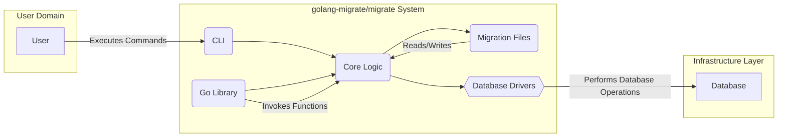
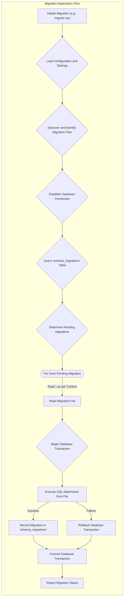

# Project Design Document: golang-migrate/migrate

**Version:** 1.1
**Date:** 2023-10-27
**Author:** AI Software Architect

## 1. Introduction

This document provides an enhanced design overview of the `golang-migrate/migrate` project, a database migration utility written in Go. This tool empowers developers to manage database schema evolutions in a version-controlled and consistent manner across various environments. This document aims to deliver a more detailed and refined understanding of the system's architecture, components, and data flow, serving as a robust foundation for subsequent threat modeling exercises.

## 2. Goals and Objectives

The core objectives of `golang-migrate/migrate` are:

- To offer a dependable and uniform method for applying database schema modifications across diverse environments.
- To support a wide range of database systems through a well-defined driver interface.
- To facilitate both forward (applying new changes) and backward (reverting changes) migrations.
- To provide an intuitive command-line interface (CLI) for straightforward user interaction.
- To offer a programmatic interface (Go library) enabling seamless integration within Go applications.
- To guarantee data integrity throughout the migration processes.

## 3. High-Level Architecture

The system is conceptually organized into the following key components:

- **CLI (Command-Line Interface):** The primary interaction point for users to manage database migrations. It is responsible for parsing commands, loading configuration settings, and invoking the core migration logic.
- **Go Library:** Provides a programmatic API to the migration functionalities, allowing for integration within Go-based applications and systems.
- **Migration Files:**  Human-readable text files, typically written in SQL, that define the specific schema alterations to be applied or rolled back. These files are versioned to ensure ordered execution.
- **Database Drivers:**  Implementations that encapsulate the database-specific logic required to connect to and execute commands on various database systems (e.g., PostgreSQL, MySQL, SQLite, etc.).
- **Database:** The target database system where the migration operations are performed.

## 4. Detailed Design

### 4.1. CLI Component

- **Purpose:** To provide a command-line interface for users to interact with and control database migrations.
- **Functionality:**
    - Interprets user-provided commands (e.g., `migrate create`, `migrate up`, `migrate down`, `migrate force`).
    - Loads configuration parameters from various sources, including environment variables, command-line flags, and configuration files.
    - Discovers and loads migration files from specified directories.
    - Orchestrates the core migration logic to apply new migrations or rollback existing ones.
    - Presents informative output and error messages to the user.
- **Key Modules:**
    - `cmd` package: Contains the application's entry point and definitions for each available command.
    - `cli` package: Handles the parsing of command-line arguments and the execution of corresponding actions.
    - `config` package: Responsible for loading, validating, and managing the application's configuration.

### 4.2. Go Library Component

- **Purpose:** To offer a programmatic interface for integrating migration capabilities directly into Go applications.
- **Functionality:**
    - Exposes functions to programmatically create, apply, rollback, and manage database migrations.
    - Supports the use of custom migration sources and database drivers, enhancing flexibility.
    - Grants fine-grained control over the migration process within the application's codebase.
- **Key Modules:**
    - `migrate` package: The central library package containing the core migration execution logic.
    - `source` package: Defines interfaces and provides implementations for reading migration files from different sources (e.g., local filesystem, embedded resources).
    - `database` package: Defines interfaces and offers implementations for interacting with various database systems through their respective drivers.

### 4.3. Migration Files

- **Purpose:** To define the specific database schema changes in a structured and versioned manner.
- **Characteristics:**
    - Typically written in standard SQL, but can accommodate other scripting languages depending on the database driver's capabilities.
    - Adhere to a naming convention that includes a version number and a descriptive name (e.g., `0001_create_users_table.up.sql`, `0001_create_users_table.down.sql`).
    - Consist of separate files for "up" migrations (applying changes) and "down" migrations (rolling back changes).
    - Reside in a designated directory or can be sourced from other locations.
- **Structure:**
    - **Version Number:** A sequential number ensuring the correct order of migration execution.
    - **Description:** A human-readable description providing context for the migration.
    - `*.up.sql`: Contains the SQL statements to be executed when applying the migration.
    - `*.down.sql`: Contains the SQL statements to be executed when rolling back the migration.

### 4.4. Database Drivers

- **Purpose:** To provide an abstraction layer, enabling the migration tool to interact with different database systems without requiring specific knowledge of their individual APIs.
- **Functionality:**
    - Establishes connections to the target database using provided credentials.
    - Executes SQL statements or other database-specific commands.
    - Manages database transactions to ensure atomicity of migration operations.
    - Optionally retrieves database schema information for comparison or validation purposes.
    - Maintains a record of applied migrations in a dedicated table (conventionally named `schema_migrations`) to track the current database state.
- **Examples:**
    - PostgreSQL driver (using `github.com/lib/pq`)
    - MySQL driver (using `github.com/go-sql-driver/mysql`)
    - SQLite driver (using `github.com/mattn/go-sqlite3`)
    - Many other drivers are available within the project's ecosystem.
- **Interface:** The `database` package defines a contract (interface) that all database drivers must implement, ensuring consistency and pluggability.

### 4.5. Database

- **Purpose:** The target database system where the schema modifications are applied or rolled back.
- **Examples:** PostgreSQL, MySQL, SQLite, MariaDB, SQL Server, etc.
- **Interaction:** The migration tool interacts with the database exclusively through the selected and configured database driver. The driver handles the specifics of the database communication protocol.

## 5. Data Flow

The typical sequence of operations when applying database migrations is as follows:

1. **The user initiates a migration command, such as `migrate up`, via the CLI.**
2. **The CLI component parses the command and loads relevant configuration details.**
3. **The CLI or the Go library identifies the available migration files within the configured source directory.**
4. **A connection to the target database is established using the specified database driver and credentials.**
5. **The tool queries the `schema_migrations` table in the target database to determine which migrations have already been applied.** This table acts as a ledger of the database's migration history.
6. **The tool identifies the new migrations that need to be applied based on the version numbers and the contents of the `schema_migrations` table.**
7. **For each pending migration, in sequential order:**
    - The tool reads the SQL statements from the corresponding `.up.sql` file.
    - A database transaction is initiated to ensure that the migration is applied atomically (all changes succeed or none are applied).
    - The SQL statements from the `.up.sql` file are executed against the database.
    - If the execution is successful, the migration's version number is recorded in the `schema_migrations` table.
    - The database transaction is committed, making the changes permanent.
    - If an error occurs during execution, the transaction is rolled back, reverting any partial changes, and the migration process is halted to prevent inconsistencies.
8. **The tool reports the overall success or failure of the migration process to the user.**

The data flow for rolling back migrations (`migrate down`) follows a similar pattern, but it executes the SQL statements found in the `.down.sql` files and removes the corresponding version entry from the `schema_migrations` table.

## 6. Deployment Model

`golang-migrate/migrate` offers flexibility in how it can be deployed and utilized:

- **Local Development Environments:** Developers commonly use the CLI to manage database schema changes during the development lifecycle.
- **Continuous Integration/Continuous Deployment (CI/CD) Pipelines:** The CLI can be seamlessly integrated into CI/CD pipelines to automate the application of database migrations as part of the deployment process. This ensures that the database schema is always up-to-date with the application code.
- **Application Startup Routines:** The Go library can be employed to programmatically apply migrations when an application starts up. This approach is suitable for ensuring that the database schema is current before the application begins serving requests.

The tool's deployment requires access to the database connection details (credentials, host, port, database name) and the location of the migration files. In CI/CD environments, sensitive information like database credentials should be securely managed, often using secret management tools.

## 7. Security Considerations (Enhanced)

This section outlines key security considerations relevant to the design and operation of `golang-migrate/migrate`. This serves as a starting point for a more in-depth threat modeling exercise.

- **Secure Storage of Database Credentials:** The tool requires access to sensitive database credentials. These credentials must be stored and managed securely to prevent unauthorized access. Consider using environment variables, dedicated secret management systems (e.g., HashiCorp Vault, AWS Secrets Manager), or secure configuration files with restricted permissions.
- **Integrity of Migration Files:** The integrity of migration files is critical. Malicious modification of these files could lead to data corruption, unauthorized data access, or denial of service. Implement measures to ensure the authenticity and integrity of migration files, such as version control with code reviews and potentially digital signatures.
- **SQL Injection Prevention:** If migration files are generated dynamically or if user-provided input is incorporated into migration logic, there is a significant risk of SQL injection vulnerabilities. Employ parameterized queries or prepared statements within migration files whenever possible to mitigate this risk. Thoroughly sanitize any external input used in migration logic.
- **Access Control for Migration Execution:** Restrict access to the execution of migration commands to authorized personnel or automated systems. This prevents unauthorized or accidental schema modifications. Implement appropriate authentication and authorization mechanisms within your deployment environment.
- **Secure Database Connections:** Enforce secure connections to the database server using encryption protocols such as TLS/SSL. This protects sensitive data transmitted between the migration tool and the database from eavesdropping.
- **Error Handling and Information Disclosure:** Implement robust error handling to prevent the leakage of sensitive information (e.g., database connection strings, internal paths) in error messages or logs.
- **Dependency Management:** Regularly audit and update the project's dependencies, including database drivers, to patch known security vulnerabilities. Use dependency management tools to track and manage dependencies effectively.
- **Principle of Least Privilege:** Ensure that the database user used by the migration tool has only the necessary privileges to perform migration operations (e.g., CREATE TABLE, ALTER TABLE, INSERT, DELETE). Avoid using overly permissive database accounts.

## 8. Assumptions and Constraints

- It is assumed that users have the necessary database privileges to perform schema modifications.
- The tool relies on the atomicity and consistency guarantees provided by the underlying database system's transaction management.
- Migration files are expected to contain valid SQL or other supported scripting languages compatible with the target database.
- The database drivers used are assumed to be reliable and adhere to security best practices.

## 9. Future Considerations

- Exploring support for more advanced migration patterns, such as reversible migrations without requiring separate "down" files (potentially using techniques like recording the inverse operations).
- Enhancing logging and monitoring capabilities to provide better insights into the migration process and potential issues.
- Investigating integration with schema diffing tools to automatically generate migration files based on schema changes.
- Adding support for more complex migration workflows, such as data migrations or transformations.

This revised design document provides a more detailed and comprehensive understanding of the `golang-migrate/migrate` project. It serves as a valuable resource for understanding the system's inner workings and will be instrumental in conducting thorough threat modeling activities.
