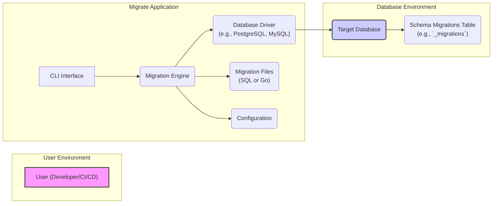

# Project Design Document: golang-migrate/migrate

**Version:** 1.1
**Date:** October 26, 2023
**Author:** AI Software Architect

## 1. Introduction

This document provides a detailed design overview of the `golang-migrate/migrate` project. This document serves as a foundation for understanding the system's architecture, components, and data flow, which is crucial for subsequent threat modeling activities. This revision aims to provide more granular detail and explicitly highlight security-relevant aspects.

## 2. Goals

*   Clearly define the architecture and components of the `golang-migrate/migrate` tool.
*   Describe the interactions between different parts of the system with a focus on data exchange.
*   Identify key data flows and storage mechanisms, emphasizing potential security vulnerabilities.
*   Provide sufficient detail for effective threat modeling, including potential attack vectors and assets at risk.

## 3. Overview

The `golang-migrate/migrate` project is a command-line tool written in Go that helps manage database schema migrations. It allows developers to write migrations in SQL or Go and apply them to various database systems. The tool keeps track of applied migrations, allowing for easy upgrades and downgrades of the database schema. Understanding its internal workings is crucial for identifying potential security weaknesses.

**Target Audience:**

*   Security engineers performing threat modeling and security assessments.
*   Developers contributing to the `golang-migrate/migrate` project, especially those working on security-sensitive areas.
*   Users of the `golang-migrate/migrate` tool seeking a deeper understanding of its architecture and security implications.

## 4. System Architecture

**Components:**

*   **User (Developer/CI/CD):** The entity interacting with the `migrate` tool, typically through the command-line interface. This interaction involves providing commands and potentially sensitive information like database credentials.
*   **CLI Interface:** The command-line interface that accepts user commands and arguments. It's responsible for parsing input and invoking the core logic. Security considerations include input validation and preventing command injection.
*   **Migration Engine:** The central component responsible for orchestrating the migration process. It handles reading configuration, loading and interpreting migration files, interacting with the database driver, and managing the migration history. This component is critical for security as it handles sensitive data and executes database operations.
*   **Database Driver (e.g., PostgreSQL, MySQL):** A library that facilitates communication with the specific target database. The security of this component depends on the driver implementation and its vulnerability history.
*   **Migration Files (SQL or Go):** Files containing the definitions of database schema changes. These files are a potential attack vector if they can be tampered with or if they contain malicious code.
*   **Configuration:** Stores settings required for the `migrate` tool to function, including database connection details. This is a high-value target for attackers due to the potential exposure of credentials.
*   **Target Database:** The database system where the migrations are applied. Its security is paramount, and the `migrate` tool's actions directly impact its state.
*   **Schema Migrations Table (e.g., `_migrations`):** A table within the target database used to track applied migrations. Its integrity is crucial for the correct functioning of the migration process.

## 5. Key Components and Data Flow

### 5.1. CLI Interface

*   **Functionality:**
    *   Accepts commands (e.g., `up`, `down`, `create`, `force`, `version`) and arguments (e.g., database URL, migration path).
    *   Performs basic input validation to ensure command syntax is correct.
    *   Parses command-line arguments, extracting configuration details and the desired migration operation.
    *   Passes the parsed information to the Migration Engine as function calls or data structures.
    *   Receives status and error messages from the Migration Engine and displays them to the user.
*   **Data Input:** User-provided strings representing commands and arguments. This input can be a source of vulnerabilities if not properly handled.
*   **Data Output:** Formatted strings displayed to the user, indicating the progress and outcome of the migration process.

### 5.2. Migration Engine

*   **Functionality:**
    *   **Configuration Loading:** Reads configuration from various sources (environment variables, configuration files, command-line arguments), prioritizing them based on a defined order.
    *   **Migration File Discovery:** Locates migration files based on the configured migration path and naming conventions.
    *   **Migration File Parsing:** Reads and interprets the content of migration files, distinguishing between SQL and Go-based migrations.
    *   **Database Connection Management:** Establishes and manages connections to the target database using the provided connection details and the appropriate Database Driver.
    *   **Schema History Management:** Queries the Schema Migrations Table to determine the current migration state and identify pending migrations.
    *   **Migration Execution:** Executes the "up" or "down" scripts from the migration files against the target database using the Database Driver. This involves sending SQL queries or invoking Go code that interacts with the database.
    *   **Transaction Management:**  Typically wraps individual migrations in transactions to ensure atomicity.
    *   **Schema Migrations Table Updates:** Updates the Schema Migrations Table to record the application or reversion of migrations.
    *   **Error Handling:** Catches and handles errors during various stages of the migration process, providing informative error messages.
*   **Data Input:**
    *   Configuration data (potentially containing sensitive credentials).
    *   Content of migration files (SQL statements or Go code).
    *   Current migration state retrieved from the Schema Migrations Table.
*   **Data Output:**
    *   SQL queries sent to the Database Driver.
    *   Updates to the Schema Migrations Table.
    *   Status and error information passed back to the CLI Interface.

### 5.3. Database Drivers

*   **Functionality:**
    *   **Connection Establishment:** Creates a connection to the target database based on the provided connection string.
    *   **Query Execution:** Sends SQL queries received from the Migration Engine to the database server.
    *   **Result Retrieval:** Receives and formats the results of executed queries.
    *   **Error Handling:** Translates database-specific error codes into a more generic format.
    *   **Transaction Management (Delegated):**  Facilitates transaction management as instructed by the Migration Engine.
*   **Data Input:** SQL query strings.
*   **Data Output:** Query results, database-specific error messages.

### 5.4. Migration Files

*   **Functionality:**
    *   Define the changes to be applied to the database schema.
    *   Typically consist of paired "up" and "down" files for each migration.
    *   Can contain arbitrary SQL statements or Go code that interacts with the database.
    *   Follow a specific naming convention to ensure correct ordering.
*   **Data Input:** Read and parsed by the Migration Engine.
*   **Data Output:** SQL statements or Go code to be executed against the database. Malicious content here can directly compromise the database.

### 5.5. Configuration

*   **Functionality:**
    *   Provides essential settings for the `migrate` tool.
    *   Includes the database connection string (often containing username, password, host, port, database name).
    *   Specifies the path to the directory containing migration files.
    *   Defines the name of the Schema Migrations Table.
    *   May include other options like the database driver to use or SSL settings.
*   **Data Input:** Read by the Migration Engine during initialization.
*   **Data Output:** Used to configure database connections, locate migration files, and customize the tool's behavior. Exposure of this data can lead to unauthorized database access.

### 5.6. Schema Migrations Table

*   **Functionality:**
    *   Maintains a history of applied migrations.
    *   Typically includes columns like `version` (migration timestamp), `dirty` (flag indicating a failed migration), and potentially `execution_time`.
    *   Used by the Migration Engine to determine which migrations need to be applied or reverted.
*   **Data Input:** Updated by the Migration Engine after successful application or reversion of migrations.
*   **Data Output:** Read by the Migration Engine to determine the current migration state. Tampering with this table can lead to inconsistent database states.

## 6. Security Considerations (Detailed)

This section expands on the initial security considerations, providing more specific examples of potential threats and vulnerabilities.

*   **Credential Exposure in Configuration:**
    *   **Threat:** Database connection strings often contain sensitive credentials. If configuration files are not properly secured (e.g., stored in version control, world-readable permissions), attackers can gain unauthorized access to the database.
    *   **Mitigation:** Employ secure storage mechanisms for configuration, such as environment variables (when appropriate), dedicated secrets management tools (e.g., HashiCorp Vault), or encrypted configuration files. Avoid hardcoding credentials.
*   **SQL Injection Vulnerabilities:**
    *   **Threat:** If migration files are dynamically generated based on user input or external data without proper sanitization, they can be susceptible to SQL injection attacks. Malicious SQL code could be injected, leading to data breaches, data manipulation, or denial of service.
    *   **Mitigation:**  Treat migration files as code and apply secure coding practices. Avoid dynamic SQL generation where possible. If necessary, use parameterized queries or prepared statements. Implement thorough input validation and sanitization.
*   **Unauthorized Access and Execution:**
    *   **Threat:** If access to the machine running the `migrate` tool is not properly controlled, unauthorized users could execute migration commands, potentially causing unintended or malicious changes to the database schema.
    *   **Mitigation:** Implement strong authentication and authorization mechanisms for accessing the environment where the `migrate` tool is executed. Restrict access based on the principle of least privilege.
*   **Migration File Tampering:**
    *   **Threat:** If migration files are stored in an insecure location, attackers could modify them to inject malicious SQL or Go code, leading to database compromise when the migrations are applied.
    *   **Mitigation:** Store migration files in a secure location with appropriate access controls. Consider using version control systems with integrity checks to detect unauthorized modifications. Implement code signing or other mechanisms to verify the authenticity of migration files.
*   **Database Driver Vulnerabilities:**
    *   **Threat:** Vulnerabilities in the underlying database drivers could be exploited by attackers if the `migrate` tool uses an outdated or compromised driver.
    *   **Mitigation:** Keep database drivers up-to-date with the latest security patches. Regularly review the security advisories for the used database drivers.
*   **Information Disclosure through Logging and Errors:**
    *   **Threat:** Verbose logging or overly detailed error messages might inadvertently reveal sensitive information, such as database connection details, schema structure, or internal application logic.
    *   **Mitigation:** Implement secure logging practices. Avoid logging sensitive information. Ensure error messages are informative but do not expose unnecessary details.
*   **Supply Chain Attacks:**
    *   **Threat:** Dependencies of the `migrate` tool could contain vulnerabilities that could be exploited.
    *   **Mitigation:** Regularly audit and update dependencies. Use dependency management tools with vulnerability scanning capabilities. Consider using checksums or other mechanisms to verify the integrity of downloaded dependencies.
*   **State Manipulation (Schema Migrations Table):**
    *   **Threat:** If an attacker gains write access to the Schema Migrations Table, they could manipulate the migration history, potentially causing migrations to be skipped, re-applied, or executed out of order, leading to database inconsistencies or data loss.
    *   **Mitigation:** Restrict write access to the Schema Migrations Table to the `migrate` tool's user only. Ensure the database user used by `migrate` has the minimum necessary privileges.

## 7. Deployment Considerations

The security posture of the `migrate` tool is heavily influenced by how it is deployed and used.

*   **Local Development:** Developers often run `migrate` locally. Security risks here include exposure of database credentials on developer machines and the potential for accidentally applying migrations to production databases.
*   **CI/CD Pipelines:** Integrating `migrate` into CI/CD pipelines automates database updates. Security considerations include securely storing database credentials within the CI/CD environment and ensuring the integrity of the pipeline itself. Compromised CI/CD systems can lead to malicious database changes.
*   **Server Environments:** Running `migrate` directly on production or staging servers requires careful access control and secure configuration management. Exposing the `migrate` tool's functionality through a web interface or API introduces additional attack vectors.
*   **Containerized Environments (e.g., Docker, Kubernetes):** When running `migrate` in containers, security considerations include securing the container image, managing secrets within the container orchestration platform, and ensuring proper network segmentation.

## 8. Future Considerations

These are potential future enhancements that could impact the architecture and security of the `migrate` tool.

*   **Built-in Secret Management Integration:**  Direct integration with secret management tools could simplify secure credential handling.
*   **Role-Based Access Control:** Implementing RBAC within the `migrate` tool could provide more granular control over who can execute specific migration commands.
*   **Enhanced Audit Logging:** More detailed logging of migration activities could improve security monitoring and incident response.
*   **Static Analysis of Migration Files:** Integrating static analysis tools could help identify potential security vulnerabilities in SQL or Go migration code before execution.

This improved design document provides a more detailed and security-focused overview of the `golang-migrate/migrate` project, making it more suitable for thorough threat modeling activities.