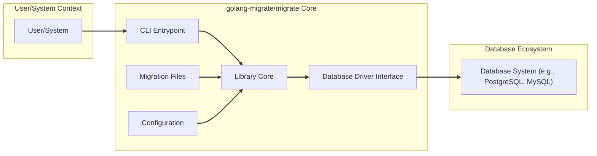
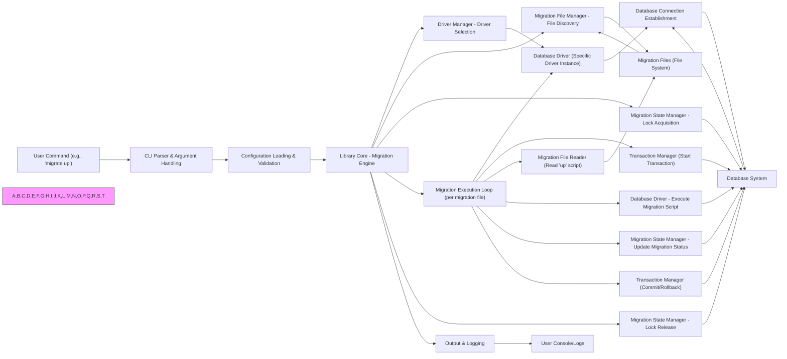

# Project Design Document: golang-migrate/migrate

**Project Name:** Database Migrations Tool (golang-migrate/migrate)

**Version:** 1.1

**Date:** 2023-10-27

**Author:** AI Expert

## 1. Introduction

This document provides a detailed design overview of the `golang-migrate/migrate` project, a versatile command-line tool and Go library for database migrations. This document is intended to serve as a foundation for threat modeling and security analysis of the project. It outlines the system's architecture, components, data flow, and key security considerations, providing a comprehensive understanding for security engineers, developers, and operations teams.

### 1.1. Project Overview

`golang-migrate/migrate` is an open-source project written in Go that simplifies database schema management. It enables developers to manage database schema evolution in a structured, version-controlled, and automated manner. This ensures database consistency across various environments (development, staging, production) and simplifies deployment processes. The tool is designed to be database agnostic, supporting a wide array of database systems and migration file formats.

### 1.2. Goals

The core objectives of `golang-migrate/migrate` are:

* **Robust Database Schema Management:** Offer a reliable and automated mechanism for applying, rolling back, and managing database schema changes.
* **Database Change Version Control:** Treat database schema modifications as versioned migrations, mirroring code version control practices for database evolution.
* **Broad Database Compatibility:** Support a wide spectrum of database systems, including but not limited to PostgreSQL, MySQL, SQLite, MongoDB, and cloud-based database services.
* **Environment Uniformity:** Guarantee consistent database schemas across all environments, from local development to production deployments.
* **User-Friendly Interface:** Provide an intuitive and easy-to-use command-line interface (CLI) for direct interaction and a Go library for programmatic integration.
* **Extensibility and Customization:** Allow for extending functionality through custom database drivers, migration file formats, and hooks for specific migration lifecycle events.
* **Idempotency and Reliability:** Ensure migrations are idempotent and reliable, capable of handling failures and retries gracefully.

### 1.3. Target Audience

This document is designed for the following audiences:

* **Security Engineers & Architects:** To gain a deep understanding of the system's architecture for effective threat modeling, vulnerability assessments, and security audits.
* **Software Developers:** To comprehend the project's design, component interactions, and integration points for utilizing the library and CLI tool effectively.
* **DevOps & Operations Teams:** To understand deployment methodologies, operational considerations, and security aspects related to running migrations in different environments.
* **Project Maintainers & Contributors:** To serve as a documented design reference for ongoing development, maintenance, feature enhancements, and architectural evolution.

## 2. System Architecture

`golang-migrate/migrate` is architecturally structured into these primary components:

* **CLI (Command-Line Interface):** The user-facing interface for executing migration commands and interacting with the migration tool.
* **Library Core (Go Library):** The central engine containing the core migration logic, designed for embedding within Go applications or invoked by the CLI.
* **Database Drivers:** Database-specific adapters that translate generic migration operations into database-native commands and handle database interactions.
* **Migration Files:** Files containing structured instructions (typically SQL or code) defining schema changes to be applied or reverted.
* **Configuration Management:** Mechanisms for loading and managing configuration parameters, including database connection details and migration settings.

### 2.1. High-Level Architecture Diagram



**Diagram Description:**

1. **"User/System Context":** Represents any user, system administrator, CI/CD pipeline, or application that interacts with `golang-migrate/migrate`.
2. **"CLI Entrypoint":** The command-line interface, acting as the primary interaction point for users to trigger migration operations.
3. **"Library Core":** The heart of `migrate`, encapsulating the core migration logic, state management, and coordination of other components.
4. **"Database Driver Interface":** Defines a consistent interface that all database drivers must implement, enabling database abstraction and extensibility.
5. **"Database Driver (e.g., PostgreSQL, MySQL)":** Concrete implementations of the "Database Driver Interface" for specific database systems, handling database-specific commands and interactions.
6. **"Migration Files":** Persistent storage of migration scripts, defining schema changes and rollback procedures.
7. **"Configuration":** Settings and parameters that govern the behavior of `migrate`, including database connection details, migration paths, and operational options.
8. **"Database System (e.g., PostgreSQL, MySQL)":** The target database system whose schema is being managed by `migrate`.

### 2.2. Component Descriptions

#### 2.2.1. CLI (Command-Line Interface)

* **Purpose:** To provide a direct command-line interface for users to execute migration commands, such as creating migrations, applying migrations (`up`), reverting migrations (`down`), and checking migration status (`version`).
* **Functionality:**
    * **Command Parsing:** Interprets user commands and command-line arguments.
    * **Configuration Loading:** Loads configuration settings from various sources (environment variables, configuration files, command-line flags).
    * **Library Invocation:** Calls the appropriate functions within the Library Core based on the parsed user command.
    * **Output and Reporting:** Presents migration execution status, logs, and error messages to the user via the console.
* **Technology:** Built using Go standard library packages like `flag` for argument parsing, `os` for system interactions, and `fmt` for formatted output.

#### 2.2.2. Library Core (Go Library)

* **Purpose:** To encapsulate the core migration logic and provide a programmatic interface for embedding migration capabilities within Go applications.
* **Functionality:**
    * **Migration File Management:** Discovers, reads, and parses migration files from specified directories, supporting various file formats (e.g., SQL, Go).
    * **Migration State Tracking:** Persistently tracks applied migrations within the database, typically using a dedicated `schema_migrations` table or equivalent mechanism.
    * **Migration Execution Engine:** Executes migration scripts in a defined order, supporting transactional execution where database systems allow.
    * **Database Driver Management:** Dynamically loads and manages database drivers based on the configured database type, facilitating database abstraction.
    * **Version Control & Rollback:** Manages migration versions, enabling migration to specific versions and rollback to previous schema states.
    * **Error Handling & Logging:** Robustly handles errors during migration execution, providing informative error messages and logging capabilities.
    * **Hooks and Lifecycle Events:** Provides extension points (hooks) to execute custom logic at different stages of the migration lifecycle (e.g., pre-migration, post-migration).
* **Technology:** Implemented in Go, leveraging standard Go libraries and potentially external libraries for specific functionalities like file system operations, string manipulation, and logging.

#### 2.2.3. Database Drivers

* **Purpose:** To provide database-specific implementations for interacting with diverse database systems, abstracting database-specific syntax and behaviors.
* **Functionality:**
    * **Database Connection Management:** Establishes and manages connections to target databases using provided connection strings and credentials.
    * **SQL/Command Execution:** Executes SQL statements or database-specific commands extracted from migration files.
    * **Transaction Handling:** Manages database transactions to ensure atomicity of migration operations (all or nothing).
    * **Schema Migration Table Management:** Creates, updates, and queries the `schema_migrations` table (or equivalent) to track migration status within the database.
    * **Concurrency Control & Locking:** Implements database-level locking mechanisms to prevent concurrent migrations from conflicting and ensure data integrity.
    * **Database-Specific Syntax Adaptation:** Adapts generic migration operations to the specific SQL dialect and syntax of the target database.
* **Technology:** Developed in Go, utilizing database-specific Go drivers (e.g., `lib/pq` for PostgreSQL, `go-sql-driver/mysql` for MySQL, `mattn/go-sqlite3` for SQLite). Each driver is responsible for interacting with its respective database system.

#### 2.2.4. Migration Files

* **Purpose:** To store versioned database schema changes in a structured and repeatable format, enabling version control for database evolution.
* **Format:** Typically SQL files (`.sql`) for direct SQL execution or Go files (`.go`) for programmatic migrations. Supports `up` migrations (applying changes) and `down` migrations (reverting changes).
* **Structure & Naming Convention:** Files are usually named with a version number prefix and a descriptive name (e.g., `0001_create_users_table.up.sql`, `0001_create_users_table.down.sql`). The version number dictates the order of migration execution.
* **Content:** Contains SQL Data Definition Language (DDL) statements (e.g., `CREATE TABLE`, `ALTER TABLE`, `DROP TABLE`) or Go code to define schema changes. `up` files contain instructions to apply changes, and `down` files contain instructions to revert them.
* **Storage:** Stored on the file system in a designated directory path, configurable via settings.

#### 2.2.5. Configuration Management

* **Purpose:** To provide flexible and secure mechanisms for configuring `migrate` with database connection details, migration paths, and operational parameters.
* **Sources:** Configuration can be loaded from multiple sources, prioritized in a cascading manner:
    * **Environment Variables:** (e.g., `DATABASE_URL`, `MIGRATIONS_PATH`) - Suitable for sensitive information and environment-specific settings.
    * **Configuration Files:** (e.g., `.env`, `migrate.yaml`, `migrate.json`, `migrate.toml`) - For structured configuration and project-specific settings.
    * **Command-Line Flags:** (e.g., `--database`, `--path`) - For overriding configuration on a per-execution basis.
* **Key Configuration Parameters:**
    * **Database URL/Connection String:** Specifies database connection parameters (e.g., protocol, host, port, username, password, database name, connection options).
    * **Migrations Path:** Path to the directory containing migration files.
    * **Database Driver Name:** Identifies the database driver to be used (e.g., `postgres`, `mysql`, `sqlite3`).
    * **Migration Table Name:** Customizes the name of the table used to track migration status (defaults to `schema_migrations`).
    * **Lock Timeout:** Sets a timeout for database locks during migration execution to prevent indefinite blocking.
    * **Verbosity Level:** Controls the level of logging output during migration operations.

## 3. Technologies Used

* **Primary Programming Language:** Go (Golang)
* **Supported Database Systems (via Drivers):**
    * **SQL Databases:** PostgreSQL, MySQL, SQLite, MariaDB, MSSQL, Oracle, CockroachDB, TiDB, YugabyteDB, Redshift, Vertica, Firebird, ClickHouse, QL, Spanner.
    * **NoSQL Databases:** MongoDB, Cassandra.
    * **Other Databases:**  (Community-contributed drivers extend support to more systems).
* **External Go Libraries (Driver Examples):**
    * `github.com/lib/pq` (PostgreSQL driver)
    * `github.com/go-sql-driver/mysql` (MySQL driver)
    * `github.com/mattn/go-sqlite3` (SQLite driver)
    * `go.mongodb.org/mongo-driver/mongo` (MongoDB driver)
    * `github.com/gocql/gocql` (Cassandra driver)
* **Standard Go Libraries:**  Extensive use of Go's standard library, including `os`, `fmt`, `flag`, `io`, `path/filepath`, `strings`, `database/sql`, `net/url`, `time`, `log`, and more.

## 4. Deployment Model

`golang-migrate/migrate` is designed for flexible deployment across various environments and workflows:

* **Local Development Environments:** Developers use the CLI tool directly on their workstations to manage database schema changes during development, facilitating iterative schema design and testing.
* **Continuous Integration/Continuous Delivery (CI/CD) Pipelines:** `migrate` is seamlessly integrated into CI/CD pipelines to automate database migrations as part of the software release process. This ensures that database schema changes are consistently deployed alongside application code deployments.
* **Production Server Deployments:** `migrate` is executed on production servers during application deployments or scheduled maintenance windows to apply necessary database schema updates. Careful planning and execution are crucial in production environments.
* **Containerized Environments (Docker, Kubernetes):** `migrate` can be containerized and run within Docker containers or Kubernetes pods, aligning with modern microservices and container orchestration practices. This enables scalable and reproducible migration deployments.
* **Serverless Environments:** While less common, `migrate` could potentially be adapted for serverless environments by packaging the library and drivers within serverless functions, triggered during deployment processes.

**Deployment Best Practices and Considerations:**

* **Secure Credential Management:** Employ secure methods for managing database credentials. Avoid hardcoding credentials in scripts or configuration files. Utilize environment variables, dedicated secrets management systems (e.g., HashiCorp Vault, AWS Secrets Manager, Azure Key Vault, Kubernetes Secrets), or cloud provider secret services.
* **Migration File Security:** Protect migration files from unauthorized access and modification. Implement appropriate file system permissions and access controls. Store migration files in version control systems to track changes and ensure integrity.
* **Rollback Strategy & Testing:** Develop and rigorously test rollback procedures (`down` migrations) to handle migration failures or the need to revert changes. Implement automated testing of migrations in non-production environments before deploying to production.
* **Concurrency Control in Clustered Environments:** In clustered or distributed application environments, ensure proper concurrency control mechanisms are in place to prevent race conditions and data corruption during concurrent migration executions. Database locking provided by drivers is crucial, but application-level coordination might be needed in complex scenarios.
* **Observability, Monitoring, and Logging:** Implement comprehensive logging and monitoring of migration execution. Track migration status, execution time, and any errors encountered. Integrate with monitoring systems to proactively detect and address migration issues.
* **Database Backup Strategy:** Always ensure a robust database backup strategy is in place *before* running migrations, especially in production. This allows for quick recovery in case of unexpected migration failures or data corruption.
* **Idempotency and Error Handling:** Design migrations to be idempotent, meaning they can be safely re-run without adverse effects. Implement robust error handling within migration scripts and the deployment process to gracefully handle failures and provide informative error messages.
* **Principle of Least Privilege:** Execute migrations using database user accounts with the minimum necessary privileges required to perform schema changes. Avoid using overly permissive administrative accounts for routine migrations.

## 5. Security Considerations (Detailed)

This section expands on security considerations for `golang-migrate/migrate`, providing a more detailed analysis for threat modeling and risk assessment.

* **Database Credentials Exposure (Critical):**
    * **Threat:** Mishandling of database connection strings and credentials poses the highest risk. Exposure can lead to unauthorized database access, data breaches, and data manipulation.
    * **Vulnerabilities:** Hardcoding credentials in migration files, scripts, or configuration files; storing credentials in insecure configuration sources (e.g., version control without proper secrets management); insecure transmission of credentials.
    * **Mitigations:** Utilize environment variables or dedicated secrets management systems for storing and retrieving credentials; enforce secure configuration practices; use encrypted communication channels (TLS/SSL) for database connections.

* **SQL Injection Vulnerabilities (Medium):**
    * **Threat:** Although `migrate` primarily executes static SQL from files, vulnerabilities can arise if migration scripts dynamically construct SQL queries based on external input or insecurely handle user-provided data.
    * **Vulnerabilities:** Dynamic SQL generation within migration files without proper input sanitization; injection points if migration logic incorporates external data without validation.
    * **Mitigations:** Adhere to secure coding practices in migration scripts; avoid dynamic SQL construction where possible; if dynamic SQL is necessary, use parameterized queries or prepared statements to prevent SQL injection; rigorously validate any external input used in migrations.

* **Migration File Tampering (High):**
    * **Threat:** If migration files are compromised or maliciously altered, attackers could inject malicious schema changes, leading to data corruption, unauthorized access, or denial of service.
    * **Vulnerabilities:** Insufficient access controls on migration file storage; lack of integrity checks for migration files; insecure file transfer mechanisms.
    * **Mitigations:** Implement strict access controls on migration file directories; use file integrity monitoring to detect unauthorized modifications; store migration files in version control systems to track changes and enable rollback; use secure file transfer protocols.

* **Denial of Service (DoS) (Low to Medium):**
    * **Threat:** While less likely, vulnerabilities in database driver implementations or the core library could potentially be exploited to cause DoS conditions against the database or the migration tool itself.
    * **Vulnerabilities:** Resource exhaustion vulnerabilities in drivers; inefficient SQL queries in migration files leading to database overload; vulnerabilities in the core library's handling of large migration sets or complex operations.
    * **Mitigations:** Regularly update `migrate` and database drivers to patch known vulnerabilities; review migration scripts for performance and efficiency; implement rate limiting or resource quotas if necessary; monitor database performance during migrations.

* **Privilege Escalation (Medium):**
    * **Threat:** If `migrate` is executed with database user credentials that have excessive privileges, it could be misused for privilege escalation within the database system, granting unauthorized access or control.
    * **Vulnerabilities:** Using overly permissive database user accounts for migrations; misconfiguration of database user roles and permissions.
    * **Mitigations:** Adhere to the principle of least privilege; create dedicated database user accounts for migrations with only the necessary permissions to perform schema changes; regularly review and audit database user permissions.

* **Insecure Communication (Medium):**
    * **Threat:** For database systems accessed over a network, insecure communication channels can expose database credentials and data in transit to eavesdropping or interception.
    * **Vulnerabilities:** Using unencrypted connections (e.g., plain TCP) to the database; misconfiguration of database client or server TLS/SSL settings.
    * **Mitigations:** Enforce encrypted communication channels (TLS/SSL) for all database connections; properly configure database client and server TLS/SSL settings; ensure certificate validation is enabled.

* **Dependency Vulnerabilities (Medium):**
    * **Threat:** Vulnerabilities in external Go libraries used by `migrate` or its drivers could introduce security risks, potentially allowing attackers to exploit known weaknesses.
    * **Vulnerabilities:** Outdated dependencies with known vulnerabilities; insecure dependencies; supply chain attacks targeting dependencies.
    * **Mitigations:** Regularly update `migrate` and its dependencies to the latest versions; use dependency scanning tools to identify and remediate vulnerabilities; implement dependency management best practices; consider using checksum verification for dependencies.

* **Configuration Management (Medium):**
    * **Threat:** Insecure configuration practices can lead to various security vulnerabilities, including credential exposure and unauthorized access.
    * **Vulnerabilities:** Storing sensitive configuration in version control without encryption; publicly accessible configuration files; default or weak configuration settings.
    * **Mitigations:** Store sensitive configuration securely using environment variables or secrets management systems; restrict access to configuration files; follow security best practices for configuration management; regularly review and audit configuration settings.

## 6. Data Flow Diagram

This diagram illustrates the detailed data flow during a typical `migrate up` command execution using the `migrate` CLI.



**Data Flow Description:**

1. **"User Command (e.g., 'migrate up')":** User initiates a migration command via the CLI.
2. **"CLI Parser & Argument Handling":** CLI parses the command and arguments, validating user input.
3. **"Configuration Loading & Validation":** Configuration settings are loaded from various sources and validated for correctness.
4. **"Library Core - Migration Engine":** The core migration engine receives the command and configuration, orchestrating the migration process.
5. **"Driver Manager - Driver Selection":** The Driver Manager selects the appropriate database driver based on the configured database type.
6. **"Database Driver (Specific Driver Instance)":** An instance of the selected database driver is created.
7. **"Database Connection Establishment":** The driver establishes a connection to the target database using the provided connection details.
8. **"Database System":** The target database system.
9. **"Migration File Manager - File Discovery":** The Migration File Manager discovers migration files in the configured migration path.
10. **"Migration Files (File System)":** Migration files stored on the file system.
11. **"Migration State Manager - Lock Acquisition":** The Migration State Manager attempts to acquire a database lock to prevent concurrent migrations.
12. **"Migration Execution Loop (per migration file)":** The core engine iterates through discovered migration files in version order.
13. **"Transaction Manager (Start Transaction)":** For each migration, a database transaction is started (if supported by the database).
14. **"Migration File Reader (Read 'up' script)":** The 'up' migration script from the current migration file is read.
15. **"Database Driver - Execute Migration Script":** The database driver executes the migration script against the database within the transaction.
16. **"Migration State Manager - Update Migration Status":** Upon successful execution, the Migration State Manager updates the migration status in the database, marking the migration as applied.
17. **"Transaction Manager (Commit/Rollback)":** The transaction is committed if the migration is successful, or rolled back if an error occurs.
18. **"Migration State Manager - Lock Release":** The database lock is released after all migrations are processed.
19. **"Output & Logging":** Migration execution status, logs, and any errors are generated.
20. **"User Console/Logs":** Output is displayed to the user console and/or written to log files.

## 7. Component Diagram (Detailed)

*(Component diagram remains the same as in the previous version as it is already detailed and well-structured. No changes are needed for this diagram in this improved version.)*

```mermaid
graph LR
    subgraph "CLI Component"
        CLI_Parser["CLI Parser"]
        CLI_ArgsHandler["CLI Arguments Handler"]
        CLI_Output["CLI Output Handler"]
    end
    subgraph "Library Core"
        Core_MigrationEngine["Migration Engine"]
        Core_DriverMgr["Driver Manager"]
        Core_ConfigMgr["Configuration Manager"]
        Core_FileMgr["Migration File Manager"]
        Core_StateMgr["Migration State Manager"]
        Core_TxnMgr["Transaction Manager"]
        Core_Logger["Logger"]
    end
    subgraph "Database Driver Interface"
        Driver_Interface["Driver Interface"]
    end
    subgraph "Database Drivers (e.g., PostgreSQL)"
        Driver_PostgreSQL["PostgreSQL Driver"]
        Driver_MySQL["MySQL Driver"]
        Driver_SQLite["SQLite Driver"]
        "... Other Drivers ..."
    end
    subgraph "External Resources"
        Ext_MigrationFiles["Migration Files (File System)"]
        Ext_Configuration["Configuration Sources (Env, Files)"]
        Ext_Database["Database System"]
    end

    CLI_Parser --> CLI_ArgsHandler
    CLI_ArgsHandler --> Core_MigrationEngine
    CLI_Output --> Core_Logger

    Core_MigrationEngine --> Core_DriverMgr
    Core_MigrationEngine --> Core_ConfigMgr
    Core_MigrationEngine --> Core_FileMgr
    Core_MigrationEngine --> Core_StateMgr
    Core_MigrationEngine --> Core_TxnMgr
    Core_MigrationEngine --> Core_Logger

    Core_DriverMgr --> Driver_Interface
    Driver_Interface --> Driver_PostgreSQL
    Driver_Interface --> Driver_MySQL
    Driver_Interface --> Driver_SQLite
    Driver_Interface --> "... Other Drivers ..."

    Driver_PostgreSQL --> Ext_Database
    Driver_MySQL --> Ext_Database
    Driver_SQLite --> Ext_Database

    Core_FileMgr --> Ext_MigrationFiles
    Core_ConfigMgr --> Ext_Configuration
    Core_StateMgr --> Ext_Database
    Core_TxnMgr --> Ext_Database
    Core_Logger --> CLI_Output


    linkStyle 0,1,2,3,4,5,6,7,8,9,10,11,12,13,14,15,16,17,18,19,20,21,22,23,24,25,26,27,28,29,30 stroke-width:1px;
```

## 8. Conclusion

This revised design document provides an enhanced and more detailed overview of the `golang-migrate/migrate` project. It offers a comprehensive understanding of its architecture, components, data flow, deployment considerations, and security aspects. The expanded security considerations section and detailed data flow diagram provide valuable insights for threat modeling and security analysis. This document serves as a robust foundation for security assessments, development planning, and operational deployments of `golang-migrate/migrate`. The detailed component breakdown and data flow diagrams are specifically designed to facilitate the identification of potential threat vectors and vulnerabilities, making this document highly actionable for security-focused reviews.