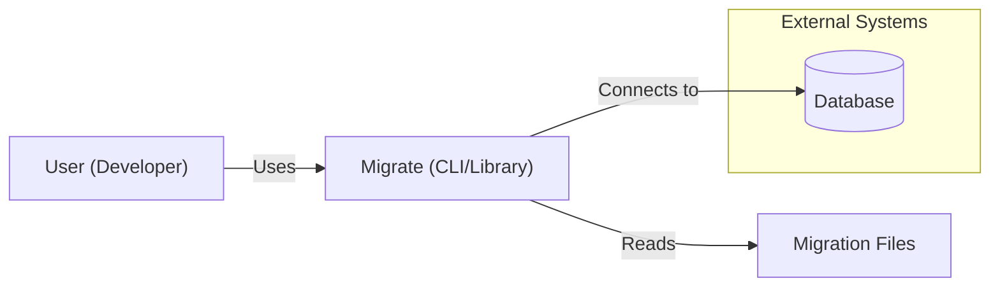
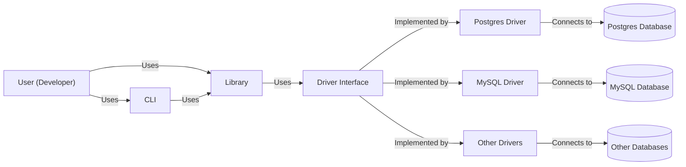
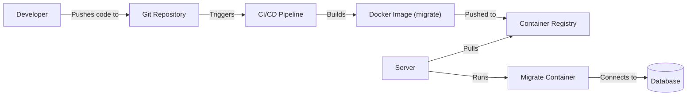
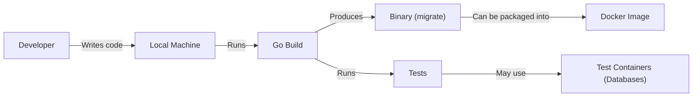

# Project Design Document: golang-migrate/migrate

## BUSINESS POSTURE

_Priorities and Goals:_

The `golang-migrate/migrate` project aims to provide a simple, database-agnostic, and reliable way to manage database migrations in Go applications. Its primary goals are:

*   Ease of Use: Provide a straightforward CLI and library interface for developers to create, apply, and manage database migrations.
*   Database Agnostic: Support a wide range of database systems without requiring database-specific tooling.
*   Reliability: Ensure migrations are applied in the correct order and prevent data corruption.
*   Extensibility: Allow users to extend the functionality with custom drivers and features.
*   Lightweight: Minimize dependencies and keep the codebase small and maintainable.

_Business Risks:_

*   Data Loss/Corruption: Incorrectly applied migrations or failures during migration execution could lead to data loss or corruption, potentially causing significant business disruption.
*   Downtime: Migration processes that take a long time or encounter errors can lead to application downtime, impacting user experience and potentially causing revenue loss.
*   Security Vulnerabilities: Vulnerabilities in the migration tool or its dependencies could be exploited to gain unauthorized access to the database or compromise the application.
*   Compatibility Issues: Lack of support for specific database versions or features could limit the project's adoption and usefulness.
*   Maintenance Overhead: A complex or poorly designed codebase could make it difficult to maintain and update the project, leading to increased development costs and potential security risks.

## SECURITY POSTURE

_Existing Security Controls:_

*   security control: Version Control: The project uses Git for version control, allowing for tracking changes, collaboration, and rollback capabilities. (Described in the GitHub repository)
*   security control: Code Reviews: Contributions to the project are subject to code reviews, helping to identify potential security vulnerabilities and ensure code quality. (Described in the GitHub repository's contribution guidelines)
*   security control: Testing: The project includes a suite of tests to verify the functionality and correctness of the code, reducing the risk of unexpected behavior. (Described in the GitHub repository's testing documentation)
*   security control: Dependency Management: Go modules are used to manage dependencies, allowing for reproducible builds and reducing the risk of supply chain attacks. (Described in go.mod and go.sum files)
*   security control: Static Analysis: The project may use static analysis tools to identify potential security vulnerabilities and code quality issues. (Not explicitly mentioned, but common practice)

_Accepted Risks:_

*   accepted risk: Limited Input Validation: The library relies on the user to provide correct migration files and database connection strings. Insufficient input validation could potentially lead to errors or vulnerabilities.
*   accepted risk: No Built-in Encryption: The library does not provide built-in encryption for database credentials or migration files. Users are responsible for securing sensitive information.
*   accepted risk: Potential for Driver-Specific Vulnerabilities: The security of the migration process depends on the security of the individual database drivers. Vulnerabilities in a specific driver could compromise the entire process.

_Recommended Security Controls:_

*   security control: Enhanced Input Validation: Implement more robust input validation to prevent potential injection attacks or other vulnerabilities related to user-provided data.
*   security control: Secure Credential Handling: Provide guidance and best practices for securely storing and managing database credentials, potentially integrating with secrets management solutions.
*   security control: Regular Security Audits: Conduct regular security audits of the codebase and dependencies to identify and address potential vulnerabilities.
*   security control: Vulnerability Disclosure Program: Establish a clear process for reporting and addressing security vulnerabilities discovered by external researchers.

_Security Requirements:_

*   Authentication: Not directly applicable to the migration tool itself, but the tool should support various database authentication mechanisms provided by the underlying drivers.
*   Authorization: Not directly applicable to the migration tool itself, but the tool should operate with the necessary database privileges to execute migrations.
*   Input Validation:
    *   Validate database connection strings to prevent injection attacks.
    *   Validate migration file names and paths to prevent path traversal vulnerabilities.
    *   Validate migration file contents to ensure they are well-formed and do not contain malicious code.
*   Cryptography:
    *   Support TLS/SSL connections to databases to protect data in transit.
    *   Consider providing options for encrypting migration files at rest.

## DESIGN

### C4 CONTEXT

_Elements Description:_

*   Element:
    *   Name: User (Developer)
    *   Type: Person
    *   Description: A developer who uses the `migrate` tool to manage database migrations.
    *   Responsibilities:
        *   Creates migration files.
        *   Runs migration commands (up, down, etc.).
        *   Configures database connection settings.
    *   Security controls:
        *   Uses strong passwords and secure authentication methods to access the database.
        *   Follows secure coding practices when creating migration files.

*   Element:
    *   Name: Migrate (CLI/Library)
    *   Type: Software System
    *   Description: The `migrate` tool, which can be used as a CLI or a Go library.
    *   Responsibilities:
        *   Parses migration files.
        *   Connects to the database.
        *   Executes migration commands.
        *   Tracks migration versions.
    *   Security controls:
        *   Input validation for database connection strings and migration file paths.
        *   Uses secure database drivers.

*   Element:
    *   Name: Migration Files
    *   Type: Files
    *   Description: Files containing SQL or database-specific commands for migrations.
    *   Responsibilities:
        *   Define the schema changes for each migration.
    *   Security controls:
        *   Stored in a secure location with appropriate access controls.
        *   Content should be reviewed for potential security issues.

*   Element:
    *   Name: Database
    *   Type: Database System
    *   Description: The target database system where migrations are applied.
    *   Responsibilities:
        *   Stores application data.
        *   Executes SQL commands from migration files.
    *   Security controls:
        *   Database access control and authentication.
        *   Regular security updates and patching.
        *   Data encryption at rest and in transit.

### C4 CONTAINER

_Elements Description:_

*   Element:
    *   Name: User (Developer)
    *   Type: Person
    *   Description: A developer who uses the `migrate` tool.
    *   Responsibilities: Same as in C4 Context.
    *   Security controls: Same as in C4 Context.

*   Element:
    *   Name: CLI
    *   Type: Application
    *   Description: The command-line interface for interacting with the `migrate` library.
    *   Responsibilities:
        *   Parses command-line arguments.
        *   Calls the appropriate functions in the `migrate` library.
        *   Provides user-friendly output.
    *   Security controls:
        *   Input validation for command-line arguments.

*   Element:
    *   Name: Library
    *   Type: Library
    *   Description: The core Go library for managing migrations.
    *   Responsibilities:
        *   Provides functions for creating, applying, and managing migrations.
        *   Interfaces with database drivers.
        *   Tracks migration versions.
    *   Security controls:
        *   Input validation for database connection strings and migration file paths.

*   Element:
    *   Name: Driver Interface
    *   Type: Interface
    *   Description: An interface that defines the methods that database drivers must implement.
    *   Responsibilities:
        *   Provides a consistent way for the `migrate` library to interact with different database systems.
    *   Security controls:
        *   Defines a clear contract for secure database interactions.

*   Element:
    *   Name: Postgres Driver, MySQL Driver, Other Drivers
    *   Type: Library
    *   Description: Concrete implementations of the Driver Interface for specific database systems.
    *   Responsibilities:
        *   Connect to the database.
        *   Execute SQL commands.
        *   Handle database-specific logic.
    *   Security controls:
        *   Use secure database libraries and protocols.
        *   Implement appropriate error handling and security checks.

*   Element:
    *   Name: Postgres Database, MySQL Database, Other Databases
    *   Type: Database System
    *   Description: The target database systems.
    *   Responsibilities: Same as in C4 Context.
    *   Security controls: Same as in C4 Context.

### DEPLOYMENT

_Possible Deployment Solutions:_

1.  Standalone Binary: The `migrate` CLI can be compiled into a standalone binary and deployed to any server with network access to the target database.
2.  Docker Container: The `migrate` CLI can be packaged into a Docker container, making it easy to deploy and run in various environments.
3.  Integration with CI/CD Pipelines: The `migrate` CLI can be integrated into CI/CD pipelines to automatically apply migrations as part of the deployment process.

_Chosen Deployment Solution (Example: Docker Container):_

_Elements Description:_

*   Element:
    *   Name: Developer
    *   Type: Person
    *   Description: A developer working on the application.
    *   Responsibilities: Same as in C4 Context.
    *   Security controls: Same as in C4 Context.

*   Element:
    *   Name: Git Repository
    *   Type: Software System
    *   Description: The repository storing the application code and migration files.
    *   Responsibilities:
        *   Version control of code and migration files.
    *   Security controls:
        *   Access control and authentication.

*   Element:
    *   Name: CI/CD Pipeline
    *   Type: Software System
    *   Description: The pipeline that automates the build, test, and deployment process.
    *   Responsibilities:
        *   Builds the Docker image.
        *   Runs tests.
        *   Pushes the image to the container registry.
        *   Deploys the image to the server.
    *   Security controls:
        *   Secure access to the Git repository and container registry.
        *   Automated security checks (e.g., vulnerability scanning).

*   Element:
    *   Name: Docker Image (migrate)
    *   Type: Artifact
    *   Description: The Docker image containing the `migrate` CLI and its dependencies.
    *   Responsibilities:
        *   Provides a consistent and isolated environment for running migrations.
    *   Security controls:
        *   Built from a trusted base image.
        *   Regularly scanned for vulnerabilities.

*   Element:
    *   Name: Container Registry
    *   Type: Software System
    *   Description: A registry for storing and managing Docker images.
    *   Responsibilities:
        *   Stores the `migrate` Docker image.
        *   Provides access control for image retrieval.
    *   Security controls:
        *   Access control and authentication.
        *   Image signing and verification.

*   Element:
    *   Name: Server
    *   Type: Infrastructure
    *   Description: The server where the `migrate` container will be deployed.
    *   Responsibilities:
        *   Runs the Docker engine.
        *   Provides network access to the database.
    *   Security controls:
        *   Operating system security hardening.
        *   Firewall rules to restrict network access.

*   Element:
    *   Name: Migrate Container
    *   Type: Container
    *   Description: The running instance of the `migrate` Docker image.
    *   Responsibilities:
        *   Executes migration commands.
    *   Security controls:
        *   Runs with limited privileges.
        *   Isolated from other containers on the server.

*   Element:
    *   Name: Database
    *   Type: Database System
    *   Description: The target database system.
    *   Responsibilities: Same as in C4 Context.
    *   Security controls: Same as in C4 Context.

### BUILD

The `migrate` project is built using Go and can be built using the standard Go toolchain. A Makefile is provided for convenience.

_Build Process Description:_

1.  Developer writes code and migration files on their local machine.
2.  The `go build` command is used to compile the code into a standalone binary.
3.  Tests are run using `go test`. These tests may use test containers (e.g., Docker containers running database instances) to simulate real-world scenarios.
4.  The resulting binary can be packaged into a Docker image for deployment.

_Security Controls:_

*   security control: Dependency Management: Go modules are used to manage dependencies, ensuring reproducible builds and reducing the risk of supply chain attacks.
*   security control: Static Analysis: Static analysis tools (e.g., linters, security scanners) can be integrated into the build process to identify potential vulnerabilities and code quality issues.
*   security control: Test-Driven Development: Writing tests alongside the code helps to ensure that the software behaves as expected and reduces the risk of introducing bugs.
*   security control: Code Review: All code changes should be reviewed by another developer before being merged into the main branch.

## RISK ASSESSMENT

_Critical Business Processes:_

*   Application Availability: The application must be available to users to provide its intended functionality. Database migrations are a critical part of maintaining application availability.
*   Data Integrity: The application's data must be accurate and consistent. Incorrectly applied migrations can compromise data integrity.

_Data Sensitivity:_

*   The sensitivity of the data managed by `migrate` depends on the specific application and database it is used with. It could range from non-sensitive test data to highly sensitive customer data, financial records, or personal information.
*   Migration files themselves may contain sensitive information, such as database schema details or even initial data inserts.

## QUESTIONS & ASSUMPTIONS

_Questions:_

*   Are there any specific compliance requirements (e.g., GDPR, HIPAA, PCI DSS) that need to be considered?
*   What is the expected frequency and size of migrations?
*   What is the acceptable downtime window for applying migrations?
*   What are the specific database systems and versions that need to be supported?
*   Are there any existing secrets management solutions in place?
*   What level of logging and auditing is required?

_Assumptions:_

*   _BUSINESS POSTURE:_ The organization has a moderate risk appetite, balancing the need for rapid development with the importance of data security and integrity.
*   _SECURITY POSTURE:_ The development team is familiar with basic secure coding practices.
*   _DESIGN:_ The target database systems are properly secured and configured. The network connection between the `migrate` tool and the database is secure.